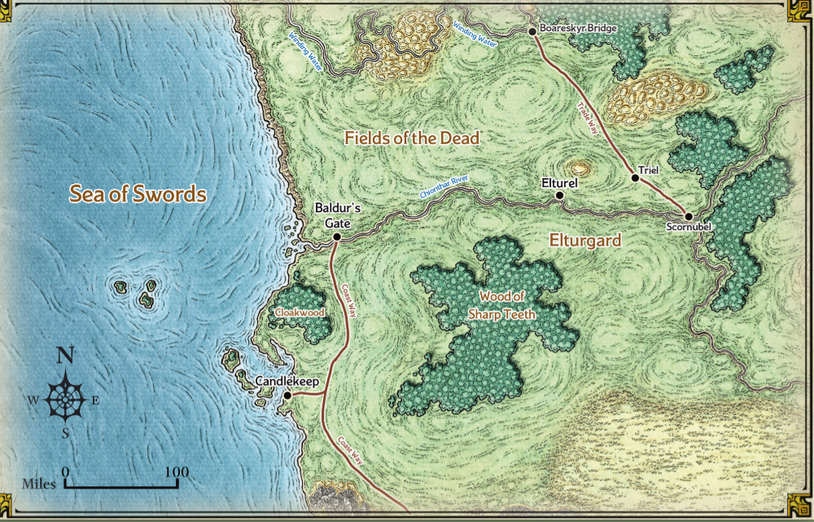
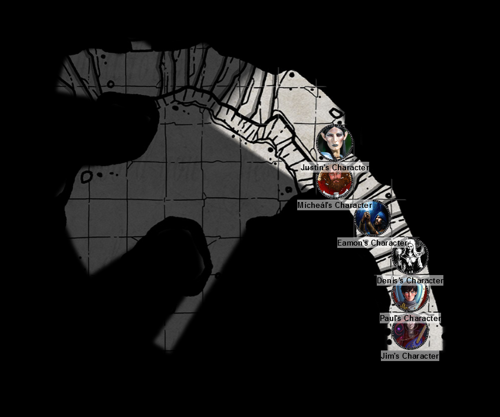

# 18 Oct 2023: Session Zero

We've been recruited as junior members into the Hellriders. All able-bodied members of Elturgard do a tour of duty. Some of our party know each other a long ways back: for example, Lunghiss and Gralok Rua, a comical pair to observe, have pulled a few stunts together in the past.

<figure markdown>
  { width="800" }
  <figcaption>Map of Area</figcaption>
</figure>

A delegation from Baldur's Gate, led by **Ulder Ravengard** (a Duke of Baldur's Gate), leader of the **Flaming Fist** is meeting **Gideon Lightward**, head of the Hellriders, of whom we are the honour guard. There's a tension between BG and Elturel; hopefully the meeting will resolve the trade wars between the two cities. There are also rumours of activities by cultists called **The Dead Three**.

We head back to our barracks. Our sergeant, **Malis**, says she wants us to investigate rumours of a nearby location of interest to that cult, **The Traveller's Well**, where they allegedly perform dark rituals.

---

We head a day's ride north-west of Elturel to where the map our sergeant has given us guides us. Near the centre of a low hill is a rectangular flattened area with mossy stonework, like a giant pedestal. There's a gap in the stone leading down into an underground.

Gralok, our human barbarian, notices that the moss has been disturbed.

We descend the stairs into what seems to be a natural cavern:

<figure markdown>
  { width="800" }
  <figcaption>Traveller's Well underground</figcaption>
</figure>

We continue down the stairs which spiral down and hug the wall of a large cavern. At the bottom we find a door, which we listen to. There's no sound.

We open the door to find a small natural room lit by torches. A set of three bedrolls are laid out. A metal pot of water is next to an unlit fire.

We exit the room via a door to the west, with stairs going down. At the bottom is a large chamber containing a pool, with a flat area on the other side. We retreat and return to the small natural room with torches.

We exit that room, then follow the circular stairs westwards, then south. We make it to the floor of the large cavern. It contains large pillars reaching to the ceiling.

On the south of the cavern is a limpid pool that appears to be fed from a spring. Several buckets sit beside what appears to be the eponymous "well".

Karthis (our elven wizard) sees something to the east; they look like severed hands. We roll initiative.

---

Karthis casts Fire Bolt at the nearest hand-like creature and hits for 2 HP of fire damage, killing it.

Norgreath (our half-elven warlock) casts Eldritch Blast but misses.

Lunghiss (our kenku rogue) fires his short bow and does a sneak attack, doing 8 HP of damage.

Gralok (our human barbarian) throws one of his four javelins, but misses.

Barrisso our noble paladin moves towards the enemy. He sees three humans in a wide variety of studded leather armour. All wear a metal helmet with a skull emblem (one of the Dead Three, Myrkul) and carry short swords and short bows. He thinks they have just been chanting.

Two of the hand creatures jump towards Barrisso but miss him.

All three humans fire arrows at Barrisso, but all miss.

---

Karthis moves into the tunnel to join Barrisso and does a Fire Bolt at a human, but misses.

Norgreath casts Witch Bolt at one of the hands and hits, doing 3 HP of damage (lightning/cold). The creature dies.

Lunghiss moves beside the remaining hand and does a sneak attack: it hits for 10 HP of piercing damage and the last hand is dead.

Gralok throws a javelin doing a devastating 14 HP of damage on a human, killing it instantly.

Barrisso (our noble paladin), attacks with his halberd but misses. Badly.

The two remaining female humans whip out scimitars; the first tries to hit Barrisso and misses. The second misses too.

---

Karthis casts Witch Bolt but misses.

Norgreath casts Witch Bolt, killing a human female. One human female remains.

Lunghiss does a sneak bow attack: his 15 HP of piercing damage kill the last human.

---

Each dead human holds several rolls of parchment, with names of what appear to be targets, along with dates from 40 years ago (possibly dates of births), along with 4GP each. We don't recognise any names or any connection between the names. The cavern contains nothing else of interest.

We take all the bodies back with us on our horses and head back to Elturel. As we approach the city, we see something strange happening to the Companion (the magical second sun that hovers over Elturel). Black lightning is attacking the guardian of the city, lancing down to hit buildings, as people flee. A huge black cloud covers the whole city and a tremendous implosion occurs. Our horses raise up in terror and some of the party are thrown to the ground and injured.

When we look again, we realise [the city is gone....](2023-11-01.md)

