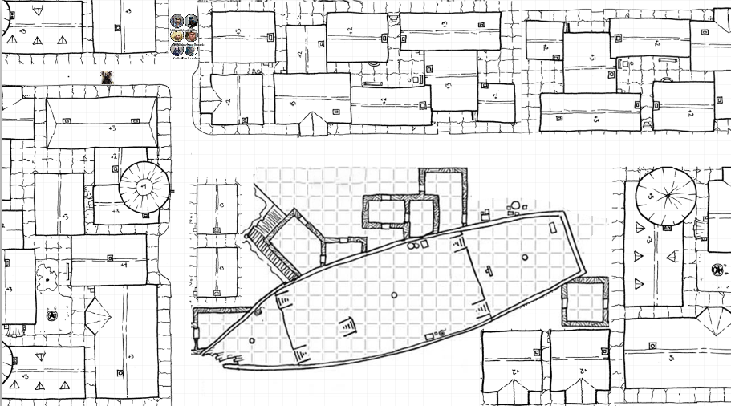

# 15 Nov 2023

[**Previously**](2023-11-08.md): Zodge of the Flaming Fist has sent us to find his informant, Terina, at the famous Elfsong Tavern of Baldur's Gate. There, we get involved in a possibly illegal eviction in return for board and bedding. We meet Terina, who tells us of a tannery called the Poisoned Poseidon, which is actually a beached ship and possible hideout for the Dead Three Cult.

---

Suddenly the ghost of this haunted inn bursts into song. And the lyrics seem to be about us and about Elturel. 

	O sing a song of Elturel
	Of water, woods, and hill
	The sun dawns on her ruddy cliffs
	And fields green and still.
	This land of long-abiding joy
	Home of the strong and brave
	
	Renowned by all, across the realms,
	And never once a slave.
	O sing a song of Elturel
	When foes are at her door
	Her fields torn by cloven feet
	From some infernal shore.
	
	Arise the mighty Hellriders
	Take up your swift, keen swords
	Then charge into the hellish fray
	And scatter devil hordes.
	O sing a song of Elturel
	And when the night does fall

	Sleep safe beneath Companion’s light
	Until the dawn does call.
	We’re bound by mortal covenant
	That only ends with death
	And so we’ll sing of Elturel
	Until our final breath.

Everyone else in the bar is nonplussed, as they have never heard these lyrics before - normally, it's always the same song. Lunghiss tries to communicate this to Terina, but fails. She seems as confused as everyone else. 

We decide to check out Insight Park, where the dumped bodies that have started this investigation were found. Dead Three related ritual symbols were found carved into the bodies. 

----

Insight Park seems to be a cultivated park, full of symbiotic plants. Lunghiss remembers a tale of a druid upset about a dumping ground in the city, who took it over to turn it into a public space and bring the natural world into the city. We start to explore. 

Barrisso spots broken mechanical refuse covered with new foliage, which seems to back up Lunghiss' history lesson. Lunghiss in turn spots a tiny one-room hut near the steepest slope, which may be where something like a park-keeper lives. 

As we approach the rudimentary hut, an elderly dwarf exits it. When he sees us and our badges, says "You're done NOTHING. NOTHING to put a stop to it. Are you finally here to sort this out?"

We ask him to show us where the bodies were dumped. He brings us up the hill to its steepest point. 

"I found them all here. I was with a halfling, Marvius Fleetfoot who found one. Five days ago, I found two more bodies. Three days ago, a fisherman at the pier spotted a body inside the park boundary. Then a day ago, I found another body in front of the Drawing Tree."

We ask what they died from. 

"It wasn't natural. All were branded with symbols of the Dead Tree." 

He takes out a small scroll. A tendril comes from the tree, wrapping around the scroll and tree trunk, to hold it up like a poster. 

"The first victim - no. The second - no.... five were human. I don't know their occupations. 

As we examine the area, Galen spots a strange alchemical substance on the ground. It looks like a mix of woodash and lime. Karthis recognises this as a substance used in tanneries. 

We also find papers belonging to a **Annika Silverleaf**, allowing her as a refugee to be allowed into the city. The papers normally have the gate through which the refugee passed, plus the officer that passed them. 

**Tarmesh** - the dwarf - asks us what we'll do now. We tell him we think the people were killed at the tannery and dumped here.

"So you didn't come here for the Drawing Tree?"

Barrisso asks us about it.

Tarmesh puts his hand on the tree. The bark cracks like parchment. He pulls it back, to show an image in the sap on the tree. The image depicts a large sword held by an angel with feathered wings. Its arms are chained. Below the angel is a large tablet, cracking into two pieces while being consumed by flames. 

We ask Tarmesh what is the tree showing us. "It shows us whatever you need to see."

Lunghiss has heard of this tree. The druid who created the park brought this unusual tree - which no one can identify - which grew from nothing in two days. Only with the keeper's blessing will it give prophecies. Lunghiss takes an exact copy of the image.

Barrisso hopes clerics of Ilmater can help us with information on the image. Tarmesh directs us to their shrine.

---

We arrive in a square where refugees come for free meals and the occasional small handout. A halfling priest, with some younger versions of him - perhaps his children? -  ministers to them. 

A stretcher is brought in, bearing a body with its face covered. A coin is offered to the priest, and the stretcher is brought into what we assume is the shrine.

We catch the priest's attention, who notices our badges. Barrisso asks his assistance, and shows him the copied image that Lunghiss has made from the tree.

**Brother Hodges** (his name) examines the image. He says that it looks like the fallen angel image; the one that springs to mind is **Zariel**. We ask about Zariel.  

Zariel was the angel that led the riders of Elturel into Hell, and she did not return. 

On the tablet imagery, the priest expects it represents an oath, and being split perhaps indicates the oath has been broken. 

When we explain the image is from the Drawing Tree, Brother Hodges expresses surprise. He knows of the Keeper of the Grove, who is doing his best for the downtrodden citizens of the Lower Ward. He considers that we must approve of us. We explain we had gone there to investigate the murders that have happened. The priest does not know much about the murders, except that one of the families came to him for solace and help with burial.

We tell him if he knows of anything else, we will be at the Elfsong Tavern. We decide to go to the Poisoned Poseidon tannery.

---

We arrive in the area of the Poisoned Poseidon:

<figure markdown>
  { width="800" }
  <figcaption>Poisoned Poseidon area</figcaption>
</figure>

We decided to reconnoitre the area, and then afterwards, some smooth-talking members of the party should pose as leather salesmen. 

Gralok notices a tavern called the **Triton's Teeth**, with a bar on the fourth floor overlooking the tannery. He decides to observe the tannery from there.

---

Meanwhile, Norgreath, a very charismatic guy, decides to be the one to check out the tannery. He finds someone - **Thando Ora?** - and asks them about making a deal. They seem agreeable, and say they will set up a meeting for tomorrow. 

---

Barrisso surreptitiously explores around the edges of the ships, checking buildings, but realises he has been spotted by someone from the ship. He returns to the tavern. We catch up and decide on what we want to do [next time....](2023-11-22.md)
