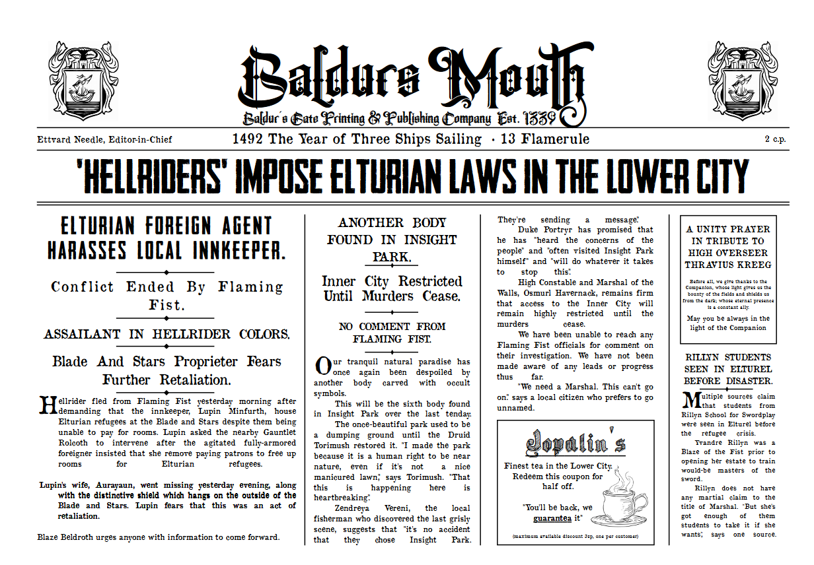
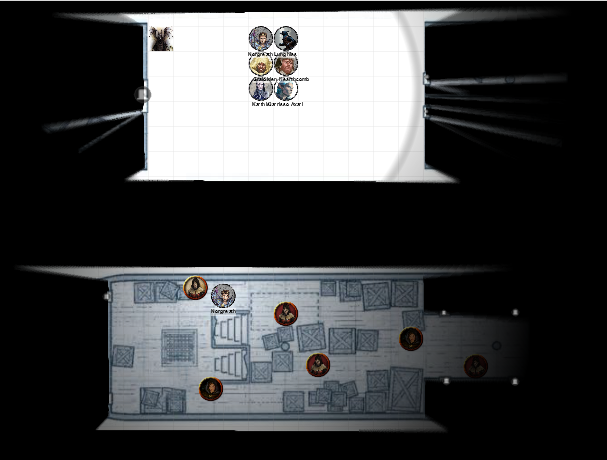
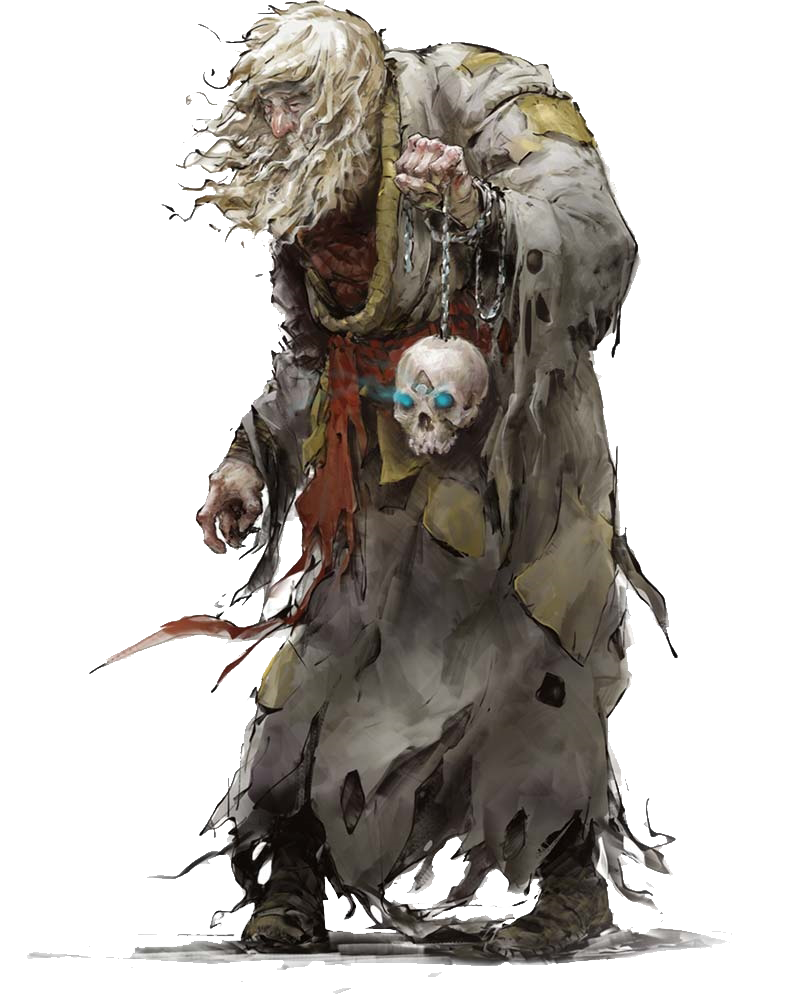

# 22 Nov 2023

[**Previously**](2023-11-15.md): From the latest edition of the *Baldur's Mouth*:

<figure markdown>
  { width="600" }
  <figcaption>Baldur's Monthly</figcaption>
</figure>

---

Back at the Triton's Teeth tavern, we talk about how to tackle the Dead Three Cult. Should we be subtle, or go in all weapons blazing? Should Norgreath go along with the meeting he has arranged, or is that too dangerous?

We decide to quietly check out the buildings surrounding the Poisoned Poseidon tannery. Kenku our rogue is the obvious volunteer.

Kenku sneaks to an outhouse next to the ship and listens at the door. He hears nothing, and checks the door to find it locked. He unpicks it and enters to find it completely dark inside. Leaving the door ajar, he spots that the stone square room actually has a wooden dividing wall right across it. Searching it, it is revealed to be just a leather tool room, containing racks with long sharp metal scrapers for leather and sharpening stones.

He leaves and go by an east-west alley to the south of the building. He passes the back of two houses; fortunately they only have (unlit) windows in their upper stories, so he is unobserved. He checks out the door at other side of the building. He unlocks the door and enters to find it contains travel gear such as backpacks, bedrolls, ropes, rations: again, nothing suspicious.

He tries a door in a building to the north. This time he finds the door unlocked and the room filled with people: it's a canteen, lit by oil lamps. He pretends to be hungry and they shoo him off, thinking he's nothing more than a begging refugee.

---

Lunghiss returns to the inn and explains what he saw to the others.
The group decides on a more frontal approach. This is after Barrisso starts clanking loudly up the gangplank to the main deck of the ship:

<figure markdown>
  { width="400" }
  <figcaption>Poisoned Poseidon - Main Deck</figcaption>
</figure>

"C'MERE! You! Who's in charge?" shouts Barrisso.

A man in chainmail with a nasty iron-bound club on a thong approaches. He doesn't look like a leather-worker. All the other on the deck stop what they're doing.

"I am Fahul - what do you want?"

Galen asks if he knows about a dead body in the park.

Barrisso asks if he will cooperate with our search.

He tells us we are welcome to search.

Barrisso asks him to line up the workers on the port side of the ship, while the rest of us search the ship.

A crane has been installed on the main deck, which can be used to raise and lower items to the ground. A number of crates nearby look like they are next to be moved. Also, there are tanned hides on the deck, being crated by the workers who are here. From the deck, there are entrances to the fo'scle and the other side, plus stairs to the other decks.

We go up stairs to the top deck. Finding a room that looks important, we do a search, finding a battered roll of parchment, written in Common, with the following message:

???+ scroll "Shohreh Netitia"

    Hazel skin. Green eyes. Dark brown 
    hair braided in two tresses. 
    Residence: Cuiric’s Boarding House 
    Relation: Great-Grandmother 
    She lives near the Frolicking Nymph. 
    An abduction squad or observers could be 
    sent from the bathhouse if it would be easier. 

Lunghiss picks the lock of the top door leading west. Norgreath finds four bags of coins.

Norgreath opens the bottom door leading west. The room contains ledgers, accounting books and other signs of trade.

Suddenly from the deck, Fahul calls out "NOW!". A bunch of workers attack.

Barrisso attacks dual-wielding with a rapier and scimitar, doing 13 HP of damage.

Galen casts Guiding Bolt, felling Fahul with 15 HP of radiant damage.

Norgreath casts Witch Bolt against an attacker, but misses.

Another attacker wearing chainmail steps forward and attacks Norgreath with a spear and misses. He then slams the butt of his spear to the ground and calls out "Fists! To me!".

Karthis casts Witch Bolt on that guy, doing 7 HP of damage.

Lunghiss does a sneak attack, with a critical, doing 23 HP of damage.

A hairy guy wielding a skull uses it to do necrotic damage to Barrisso:

<figure markdown>
  { width="300" }
  <figcaption>Myrkul Cultist</figcaption>
</figure>

Barrisso recognises the guy as a cultist of Myrkul.

Gralok attacks the armoured guy with his great axe, doing 4 HP of damage.

Another previously unseen attacker with chainmail, a club and longbow bursts out of a cabin and fires an arrow at Barrisso but misses.

Another attacker also bursts out and fires an arrow at Norgreath but misses.

Barrisso dual-attacks the archer, doing 9 HP of damage.

Galen casts Channel Divinity to charm 7 opponents. (As an action, you present your holy symbol and invoke the name of your deity. Each beast or plant creature that can see you within 30 feet of you must make a Wisdom saving throw. If the creature fails its saving throw, it is charmed by you for 1 minute or until it takes damage. While it is charmed by you, it is friendly to you and other creatures you designate.)

One guy drops his mace. One guy with skulls drops it. Another harmless guy is also charmed.

Norgreath attacks with an Eldritch Blast but misses.

An enemy calls "Attack with the Hand of Tyranny!" and our opponents get a free attack at us. Luckily none of them hit us.

Karthis' Witch Bolt does another 11 points of damage to its victim.

Lunghiss downs an opponent with a sneak attack, doing 9 HP of damage.

Gralok attacks with his greataxe but misses.

Karthis is attacked by a bow wielder but they miss.

Norgreath is attacked by a mace wielder, taking 8 HP of damage. He's down.

Barrisso dual-attacks and does 16 HP of damage. He also performs Divine Smite, doing an extra 6 HP of damage, which is enough to down his opponent.

Galen rolls a death save and succeeds.

Norgreath fails his death save.

Karthis casts Fire Bolt but misses.

Lunghiss misses with his first attack - but uses inspiration. But his better attack still misses.

The enemies strike back: a skull dude casts at Karthis and hits, for 7 necrotic damage.

Gralok hits an opponent for 12 HP of damage, but not enough to fell them.

A longbow opponent fires at Karthis, but misses.

The attacker next to Lunghiss just hits, doing 4 HP of damage.

Another attacker hits Gralok - his rage reduces the damage to 4 HP.

Barrisso performs Lay On Hands and heals Galen for 5 HP; but he's still exhausted.

Galen casts Cure Wounds on himself - his 8 HP brings him back up to full.

Norgreath fails a second death save...

Karthis attacks the attacker next to Norgreath with a poison spray - he's poisoned with 4 HP of damage.

Kenku attacks but misses.

Gralok is attacked for 6 HP of necrotic damage.

Karthis is attacked behind cover - it misses.

Barrisso is attacked but it misses.

Gralok is attacked but it misses.

[The fight continues...](2023-11-29.md)
