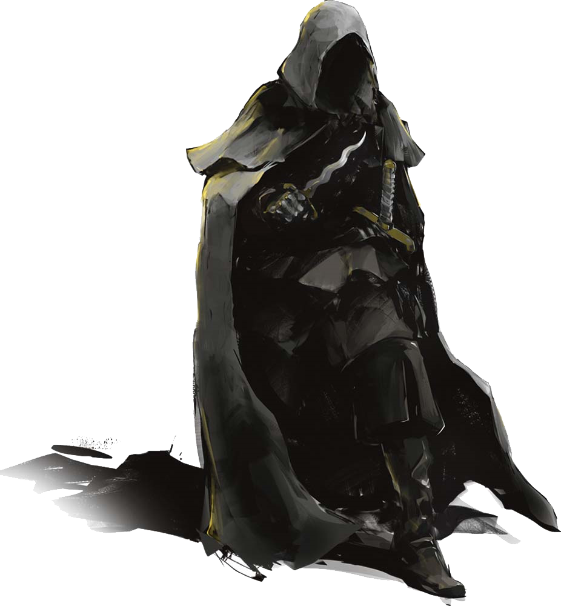

# 29 Nov 2023

[**Previously**](2023-11-22.md): The deck of the Poisoned Poseidon tannery has turned into a battleground. Sinister skulls are swinging, curses are screeching, bruises are flowering and blood is flowing. What are these Dead Three followers doing under cover of their tannery?

---

Barrisso casts Searing Smite, then attacks with his rapier - and hits for 9 HP plus 4 HP of fire damage. His opponent falls.

Galen performs Spare the Dying on Norgreath and stabilises him.

Karthis casts Witch Bolt at a distant enemy and does 11 HP of lightning damage (which continues into future rounds).

Lunghiss does a sneak attack for 7 HP of damage; his opponent still looks hale and hearty.

A Myrkul cultist attacks Gralok and does 6 HP of necrotic damage.

The cultist beside him uses his skull as a mace at Karthis, but misses.

Gralok attacks with his great-axe (using his inspiration), doing 11 HP of damage.

A cultist thug attacks Gralok and misses; his companion also tries, and misses as well.

---

Barrisso attacks a Myrkul cultist with his rapier and misses - but his offhand with a scimitar connects and fells the skull-wielding reprobate.

Galen attacks the thug (the one Lunghiss had attacked), doing 2 HP of damage (even after inspiration).

Norgreath lies there, stable in the corner.

Karthis, who has moved to the upper level, casts Fire Bolt downwards  - but even using inspiration, he misses.

Lunghiss does a sneak attack and, using his inspiration, does a whopping 18 HP of damage. The guy is toast.

A cultist throws his skull at Barrisso and misses.

Gralok attacks a thug with his great-axe but misses. The thug retaliates, doing 3 HP of damage.

---

Barrisso misses with his rapier, but his scimitar does 6 HP of damage.

Galen lashes out with his mace, but misses.

Karthis casts Fire Bolt at the thug but misses.

Lunghiss however, does a sneak attack on him for 13 HP of damage.

Gralok finally finishes him off with his great-axe (12 HP of slashing damage). As a bonus, Gralok is then after to attack another opponent, doing 5 HP of damage.

Barrisso follows up with a offhand scimitar attack which kills him.

---

Two enemies - a man and a woman - remain, who look horrified at all the bloodletting. Barrisso shows his Flaming Fist badge and proceeds to question them. He gets frustrated at the lack of cooperation, due to his surprisingly low intelligence. The couple protest innocence. They say that below decks are tanning racks - the second level down is underground. Finally, they tell us the cultists are getting instructions from the **Frolicking Nymph bathhouse**. Barrisso warns them not to speak to anyone. 

We search the corpses and keep one of the previously-glowing skulls as evidence. We recover 8 GP, plus a note that says:

???+ scroll "From Flennis about Frolicking Nymph"

	Frolicking Nymph within the tenday.  
	And probably a couple of Night Blades.  
	Now that the Agent has his operation  
	fully established, he should be able  
	to start feeding us targets at a  
	faster clip.
	
	Flennis

Barrisso sends a runner to Zodge of the Flaming Fist, telling him of all that has happened.

---

Everyone takes a short rest.

We search various cabins in this tannery-cum-ship. We find shrines to gods of the Dead Three. Seemingly, the guys in chainmail are followers of Bane, while the guys with the glowing skulls are followers of Myrkul. So where are the followers of Baal?

We go down to the next level.

Two workers are on this level. Gralok opens a door to the fo'castle. Inside, they find a shrine. When they cast a light, they see two other different shrines in the room - presumably three shrines of the Dead Three. Plus, a humanoid, clad in black:

<figure markdown>
  { width="300" }
  <figcaption>Dark Figure</figcaption>
</figure>

A humanish voice speaks to us. "Do you care to make an offering?"

Barrisso uses his Divine Sense. To his surprise, neither the creature or the shrines register any sign of the undead. 

"What sort of sacrifice?" shouts Gralok.

"A blood sacrifice."

As he says those words, he disappears.

Gralok senses that he has turned invisible.

Gralok lashes out with his great-axe but misses.

Norgreath attempts an Eldritch Blast, but misses.

Our opponent materialises for a moment to attack Gralok with a dagger twice: he does 22 HP of damage - Gralok is down to 2 HP. 

Galen attacks with his mace, but misses our invisible opponent.

Lunghiss, in an attempt to slow down the dark stranger, rolls ball bearings over a large area of the floor.

Karthis bundles Gralok out of the room.

Barrisso attacks but misses. As he moves, Barrisso is attacked from behind, taking 16 HP of damage.

Norgreath notices where the attack came from and casts Eldritch Blast, doing 7 HP of damage.

Gralok follows up with a successful javelin throw, doing 4 HP of damage.

The dark creature attacks Galen, but misses. His second attack does 16 points of damage, reducing him to zero. He then disappears.

Galen succeeds on his death save.

While Karthis lines up a Fire Bolt, Lunghiss pours a flask of oil in part of the room, then disengages. The area is now burning.

Barrisso tries to rescue Galen, but fails to drag him outside. 

[The fight continues....](2023-12-06.md)

 

