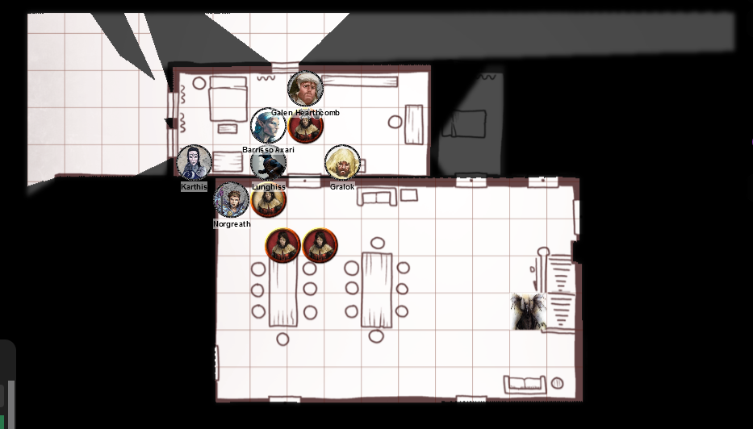

# 6 Dec 2023

[**Previously**](2023-11-29.md): So, after managing to get out of a tight scrape with the cultists of the Dead Three on the main deck of the Poisoned Poseidon ship-cum-tannery (and sneaking in a quick rest), the hold looked a lot quieter and more peaceful. When you met the cultist who was looking for a blood sacrifice and who could turn invisible things took a downward turn. Are you going to avoid burning yourselves on the oil or tripping over the ball bearings, or will the wickedly curved blades of your assailant reach your innards first?

---

Norgreath attempts to hit the unseen attacker with an Eldritch Blast, but misses.

Gralok hefts one of his javelins and readies himself for when the invisible opponent reappears.

We hear a loud noise - the ball bearings that Lunghiss threw have felled our enemy! We then hear the sound of someone getting back up from a prone position. And suddenly, he reappears, holding two daggers.

Gralok throws his javelin, doing 8 HP of damage.

The dark figure attacks, hitting Barrisso for 7 HP of damage, felling him. 

He then disappears again.

Galen succeeds on another death save.

Karthis casts Witch Bolt at the area where our opponent disappeared, but misses.

Lunghiss shivs him for 11 HP of damage: the dark figure reappears, on the ground, and bleeding heavily. 
Barrisso makes a death save throw and succeeds. 

Norgreath performs a Medicine check on Barrisso and succeeds.

Gralok tries to stabilise Galen but fails.

Galen succeeds on his death save.

Karthis fails to stabilise Galen, but Lunghiss succeeds.

Barrisso and Norgreath will suffer one level of exhaustion, while Galen will suffer two levels, until they have a long rest.

---

Our opponent seems to be human. He wears leather armour, and has two curly daggers and a sword. He does not seem to have any special items that might have been used to cast Invisibility. In his belt pouch, there are 15 GP plus two potion vials. Gralok recognises them as potions of healing. Lunghiss creates a drawing of his face, in case someone may recognise him.

Among the three shrines in the room we killed the attacker, next to the one to Baal, is a small scroll, similar to one we found before:

???+ scroll "Shohreh Netitia"

	Hazel skin. Green eyes. Dark brown hair braided in two tresses.
	Residence: Cuiric’s Boarding House
	Relation: Great-Grandmother
	She lives near the Frolicking Nymph. An abduction squad or observers could be
	sent from the bathhouse if it would be easier.

We assume, like the previous scroll, this is part of some hit list.

Gralok interrogates the two who had been on deck. They say there is a remaining guy downstairs called the Master of Souls, possibly with a few armoured companions.

Gralok gives Galen a healing potion to revive him. Barrisso gets the other potion.

---

We go to the other side of the ship and open the door there. Inside are two tanning vats and the smell is terrible. Two workers entirely covered in protective clothing are oblivious to us. Gralok has a plan: we all dress up in disguise as tannery workers. However, as some of us are weak, we decide to leave the tannery and recuperate at our tavern.

We first wait an hour to see if the Flaming Fist heed our runner's request and come to the tannery, but they don't arrive. We decide to go and find Zodge of the Flaming Fist at the Basilisk Gate, to tell him about the den of Dead Three cultists that we have found. 

The gate is closed and we hear a tumult outside. We ask to speak to Zodge: we're told curtly that he's busy. We get to speak Ember Wrath instead. Barrisso summarises what has happened: investigating the murders, talking to an informant, finding cultists in the Poisoned Poseidon ship-cum-tannery. We ask Wrath for our help but he is dismissive, implying we were hired because they are short of resources.

We return to the Elfsong Tavern and rest, taking turns on watch, spiking our room door.

After an hour, Gralok hears someone trying to pick the lock of our door. A click suggests it has been unlocked, but the spike holds the door shut. A muffled conversation ensues between at least two voices. They attempt to shoulder the door and one bursts in, with three right behind him.

<figure markdown>
  { width="800" }
  <figcaption>Bedroom Fight</figcaption>
</figure>

Galen uses Channel Divinity - Order's Demand and charms one of the attackers. He drops his weapon and beams at Galen.

Norgreath closes the door, keeping three attackers outside.

Lunghiss attacks the sole attacker in the room, doing 10 HP of damage.

Gralok perform a Reckless Attack on the same guy, doing 9 HP of damage: he falls.

Justin and Karthis ready attacks for when any attackers enter through the door.

An attacker opens the door and enters, triggering the attacks. Barrisso misses, but Karthis' Poison Spray does 11 HP of damage.

The attacker in the room attacks Barrisso with a mace, but misses.

Galen attacks with his mace, doing 3 HP of bludgeoning damage.

Norgreath casts Eldritch Blast but misses.

Lunghiss does a sneak attack for 15 HP of damage, killing the attacker nearest to the door.

Gralok, then Barrisso attack the remaining attacker in the room, felling him.

Barrisso moves outside the room to attack the opponent there with his off-hand attack, but misses.

Karthis attacks the same enemy using Poison Spray; the opponent escapes all damage. He retaliates, doing 9 HP of damage with his spear. Karthis uses Arcane Deflection to save from the damage.

Galen casts Sacred Flame, doing 4 HP of radiant damage.

Norgreath casts Eldritch Blast, doing 14 HP of damage.

Lunghiss attacks, but misses. But Gralok and Barrisso finish off the last opponent.

We find a note on one of the bodies:

???+ scroll "Note about Fahul and Vaaz"

	I’m not really surprised to hear that 
	Fahul is complaining about living in a
	tannery, the fastidious little weasel. 
	I’m pretty sure Vaaz just wanted him 
	out of his hair when he assigned him 
	to you. If he keeps giving you a headache, 
	remind him what the alternative is. I 
	doubt he’ll find the noxious fumes of 
	this sewer we’ve been gifted under 
	the bathhouse any better.
	
We all take a long rest.

---

We wake up the next day and decide to check on Shohreh, the victim, mentioned in the most recent note we found. We ask around about Cuiric’s Boarding House: it's now run by his great-granddaughter, Leila. Leila tells us that Shohreh's room door had been broken down the other night.

We ask to see her room and search it. Although the door has been broken down, it has not been ransacked but there are indications of a struggle.

Gralok discovers hanging on the wall some embroidery, which contains a family tree, showing Shohreh's name and her sister, Elisa. It shows her grandmother, also Shohreh. Beside her great-grandmother's name, it shows the symbol for Elturel - the Companion. 

We decide to [return to the ship....](2023-12-13.md)

