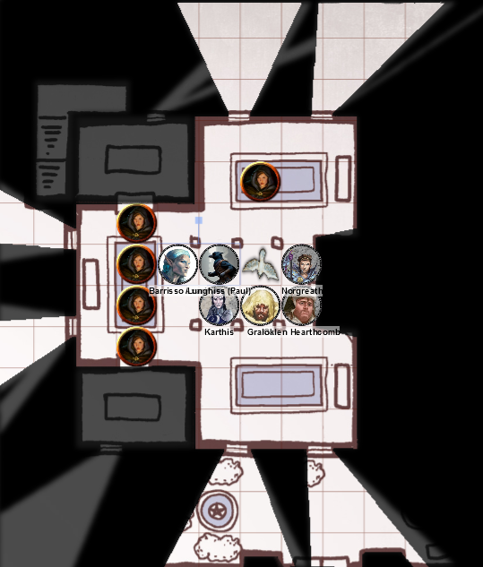
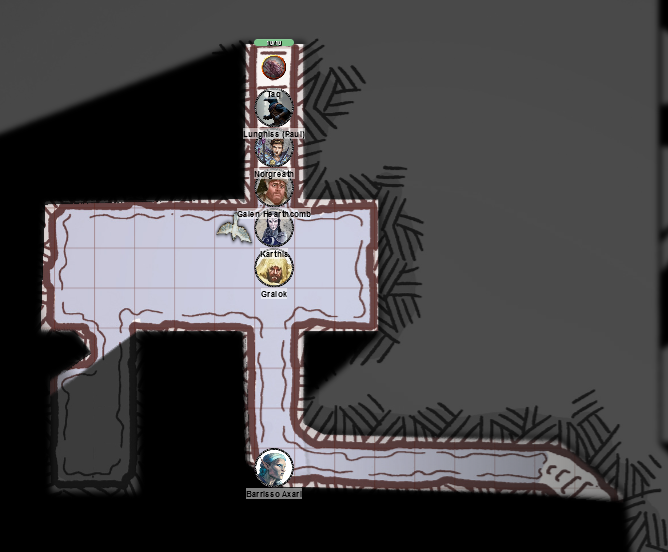
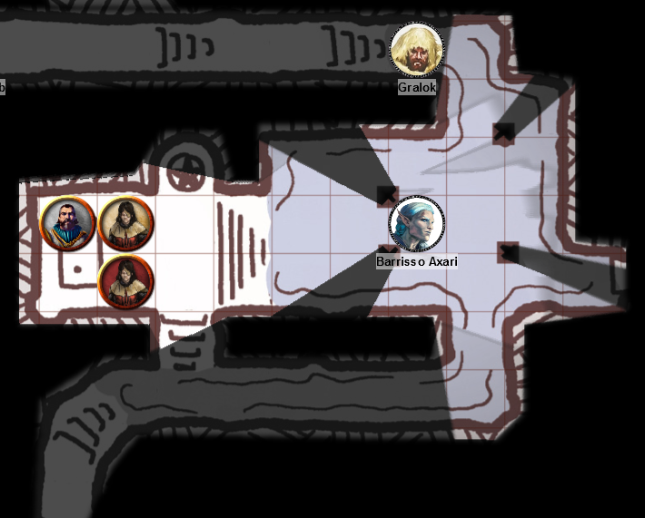

# 3 Jan 2024

[**Previously**](../2023/2023-12-13.md): After a disastrous fight on the Poisoned Poseidon which left us (temporarily) weaponless and penniless, we are rescued by the Flaming Fist. We find the corpse of Shohreh Netitia, the target on an assassination list that we previously found. Zodge tells us that we, as Hellriders, are also on a target list that he found. It seems that the Master of Souls also escaped. He also gives us a note to the Master of Souls, from someone called Vaaz. We decide our next move is, after a long rest, to explore the Frolicking Nymph bathhouse, mentioned on a previous note that we found.	

---

We wake up after our rest to the sober realisation we have little money apart from 5HP each that Zodge has given us. At least we still have our basic kit.

We decide to go to the Frolicking Nymph bathhouse based on a previous note which said *"Frolicking Nymph within the tenday."*

From previous notes, we also have some question: who is Flennis? And what is a Night Blade?

We also wonder whether we should go to a temple in order to get a Restoration spell, but decide against it.

---

Before we go to the bathhouse, the party chips together to give Lunghiss and Norgreath enough cash to generate the familiars that the new abilities gives them: an owl named Archie and an imp named Taq respectively.

---

We arrive at the Frolicking Nymph bathhouse. It's a one story building, with stained glass windows and clay roof tiles, surrounded by an enclosing wall which incorporates an L-courtyard. The doors to the courtyard are engraved with smiling nymphs.  

Norgreath's imp familiar (named Taq) flies up and over the courtyard. It's grassy, decorated with marble benches, with statues of nymphs holding jugs. 

Taq is able to peer into the windows of the bathhouse. Inside he can see a 20 foot high pillared chamber with frescoed walls and sunken pools. He sees two patrons in one of the pools, and a single patron in another.

We decide to enter the building as normal as pretend to be interested patrons.

The warm humid room contains copper pipes with taps that presumably carry hot water around the building and fill the pools. The stained glass windows fill the room with beautiful colours. 

The three patrons we spied on earlier are relaxing in the pool. Someone emerges from a backroom, holding a bunch of clean towels and a tray of brown stoppered jars. We discuss the various services available.

Meanwhile, Taq spies in a room to the north, finding it occupied only by a masseuse. Taq shape-shifts into being a spider and scuttles around a bit. Taq senses a breeze to the north, realising there is perhaps a secret door. 

---

Barrisso orders one of the staff to tell the patrons to leave. She's at first skeptical but then submits to his authority, and tells the patrons (all ladies) to retreat to a room to the south to dress again and then leave the building.

Barrisso asks the staff to gather round. He explains we think there may be cultists in an underground room here, and tells them they can stay or leave. His insight makes him think that two of the staff are genuinely shocked, while the woman from the southern room (called **Jabaz**) has a look of realisation. Barrisso asks Jabaz to stay while the other two should step out into the courtyard.

Barrisso asks her about her look of realisation. She says she is not allowed to be in the bathhouse late, by orders of **Mortlock Vanthampur**, son of a Duke of Baldur's Gate. His mother is the matriarch of the family and is the Master of Drains and Underways: sewers gave her her wealth.  

Gralok checks the southern room for secret doors, but does not find anything. 

Lunghiss checks the northern room, and finds the secret door that Norgreath's familiar had sensed, with stairs leading downwards:

<figure markdown>
  { width="400" }
  <figcaption>Bathhouse with Secret Stairs</figcaption>
</figure>

Barrisso quizzes Jabaz about the Cult of the Dead Three, but she seems ignorant and truthful. We tell her to go to Flame Zodge for safety.

We latch the outer door to make sure no one can enter behind us. 

Norgreath sends his familiar down the secret stairs. It finds a watery underground chamber - we're unsure how deep the water is.

<figure markdown>
  { width="400" }
  <figcaption>Bathhouse Underground</figcaption>
</figure>

Using his halberd, Barrisso thinks it's about 2 feet deep.

We wade through passages in an eastern direction, where we find stairs leading back up. Norgreath searches the water as we go. In the western room to its south, he senses a breeze - another secret door.

Lunghiss opens it with Mage Hand. Inside the chamber we find, floating face down, a dead human with knife wounds in his back.

Taq searches the room and finds an altar to the east, covered in entrails. Above the wall is a steel mask in the form of a frowning human skull. 

We enter the chamber and first check the corpse. It's bloated, just wearing breeches. His entrails seem intact. We proceed east to the altar. Gralok attempts to turn over the altar but fails. Barrisso searches the altar and finds nothing.

Lunghiss checks the entrails: he things they're human, and they look very fresh - as in, 5 minutes ago fresh.

To the passage to the south-west is a tapestry showing a gruesome image: four faceless figures ripping apart a fifth figure. Lunghiss performs a Religion check, but doesn't recognise the tapestry from any religious imagery that he knows of.

As the party searches the tapestry, a cloud of yellow spores erupt from it. *(DC 15 CON saving throw)*  Those who fail (Gralok, Karthis, Galen and Barrisso) take 11 poison damage and become poisoned. Those who save (Norgreath and Lunghiss) take no damage.

Barrisso uses Lay On Hands to remove the poisoned condition from Galen.

Galen casts Bless on those who are poisoned.

Lunghiss douses the tapestry with oil from a flask, then retreats.

Karthis casts Fire Bolt at the tapestry and sets it ablaze, but fails his saving throw.

Gralok moves away from the tapestry and takes 5HP of poison damage, and then fails his saving throw.

Norgreath moves away from the tapestry.

Barrisso uses Lay On Hands to remove the poisoned condition from Karthis, and loses 5HP of poison damage himself.

Galen casts Prayer Of Healing and which will give 2D8 + 3 of healing after 10 minutes.

Lunghiss does nothing; Karthis moves away from the tapestry.

Gralok does Rage so he can advantage on his check, and then saves. None of the party are now poisoned. In doing so, he turns into a bestial form which startles some of the party.

We wait until Galen's Prayer Of Healing is over - everyone who needs it regains 15HP.

---

Now recovered, we decided to resume. Taq goes up the stairs to the east and under a door to an octagonal chamber, with three other doors from it at the cardinal points. There is a carving in each of the doors apart from the north:

The eastern door has an image of Bane. The southern door has an image of Myrkul. The western door that Taq has just come through has an image of Baal. Taq goes under the northern door and confirms it's a corridor leading back up to the bathhouse.

We decide to go east through the Bane door. The corridor beyond goes down via a series of stairs into a pool of brackish water. The chamber is held up by beams, with an altar to the west:

<figure markdown>
  { width="400" }
  <figcaption>Bathhouse - Bane Room</figcaption>
</figure>

Shackled to the wall behind the altar is a sickly hooded man. Two figures in chainmail (one a woman) are before the altar; the man is wearing a bucket helm and is jabbing the shackled man.

Bucket Helm hears us enter the chamber, and then [turns to see Barrisso in the water](2024-01-10.md)....

