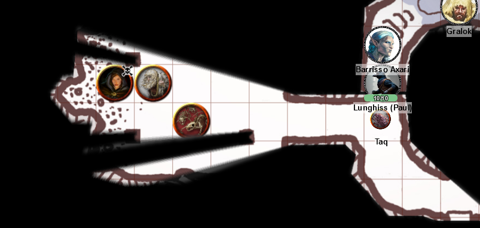

# 10 Jan 2024

[**Previously**](2024-01-03.md):  We were investigating the Frolicking Nymph bathhouse based on a clue from a note. From its staff, we found out that they are not allowed to be in the bathhouse late, by orders of Mortlock Vanthampur, son of a Duke of Baldur's Gate. His mother is the matriarch of the family and is the Master of Drains and Underways. Via a secret door we find an underground. After we all manage to avoid dying from poisoning via spores from a tapestry, we find a series of rooms devoted to the Dead Three. In a room that we presume is devoted to Bane, we find, shackled to a wall behind an altar, a sickly hooded man. Two figures in chainmail torturing the man turn towards us...

---

Galen as a cleric uses Channel Divinity to cast Order's Demand on both armoured figures - and succeeds with both. As well as having the effect of Charm Person on them, Galen gets them to drop the weapons they are holding.

Barrisso - knowing they are only charmed until damaged - takes their weapons away and throws them into the water.

The armoured woman asks us cheerfully "Have you come here to help us with this noble?", indicating the guy shackled to the wall.

Galen asks her: "Who is this noble?".

"It's one of the Jhassos."

Barrisso recalls this name: the Jhassos are a family from the upper city of Baldur's Gate. They own a trading coster; trade routes are maintained by groups, and he recalls the Jhassos own the Seven Suns trading coster, a trading organisation.

Barrisso asks her to hand over the noble. We say we will sort him out, tongues firmly in cheeks.

Galen asks how they captured him. 

"One of our gang picked him up in the Lower City, unguarded."

Norgreath knows that soon, the Order's Demand effect will dissipate. He notices the woman has an auxiliary bow, while the man has five spears in an alcove near him. 

Norgreath then fires an Eldritch Blast at the woman, doing 10HP of damage. The charm effect on her disappears and she shouts "May Bane's fist descend on you!".

Lunghiss' familiar Archie flies in to distract the armoured woman while he does a sneak attack - but he misses. He then disengages.

Gralok attacks her with his great axe, doing 11HP of damage: she falls.

The armoured guy calls out in a confused voice: "Galen...? What's... happening?".

Karthis casts Fire Bolt at him - and misses.

Galen attacks with his mace, but misses.

Barrisso's attacks also miss.

Norgreath casts Eldritch Blast alongside Genie's Wrath - but misses.

Lunghiss does a sneak attack with 12HP of piercing damage - then disengages.

Gralok attacks with his great axe, doing 6HP of slashing damage.

Our armoured opponent, who is currently unarmed, moves towards his cache of spears - attacks of opportunity on him miss. He manages to pick up a spear. He attacks Barrisso, doing 11HP of damage.

Karthis casts Fire Bolt, doing 10HP of damage.

Barrisso attacks with his rapier, then follows up with his scimitar - the 13 HP of damage still don't finish our opponent off.

Norgreath does 12HP of damage with a combination of  Eldritch Blast and Genie's Wrath - and the armoured guy expires.

---

We strip the dead of their cash (15GP and 11SP) and weapons. Barrisso unshackles the noble from the wall, and helps him down, unlocking him with one of the keys from our male opponent's keyring. 

As soon as the shackle is loosened, the gauntlets from a free-standing suit of plate armour (in the north alcove) attack Barrisso.

Galen casts Sacred Flame at them, but misses.

The gauntlets continue on their attack to Barrisso, doing 9HP of bludgeoning damage.

Barrisso attacks with his rapier, doing 10HP of damage. A bonus attack with his scimitar (6HP) almost finishes the gauntlet off. But not quite.

Karthis attacks the damaged gauntlet with a Fire Bolt but misses.

Norgreath uses Eldritch Blast but misses.

Gralok hits the gauntlet in the alcove for 9HP of damage.

Lunghiss, using his inspiration, does 10HP of damage to the gauntlet in the alcove, felling it.

One limping gauntlet remains.

Galen attacks with his mace, finishing it off.

---

Barrisso finishes helping the noble down from the wall. He tells us he has been tortured for days. We praise him as some man altogether. His name is **Klim Jhasso**, and he says his family will give us a great reward for helping. He doesn't think he was targeted for any reason other than sheer opportunity (he was unguarded). 

Norgreath and Karthis accompany Klim back up to the bathhouse. Norgreath asks the staff to help clean him up, offering a gold piece which they seem happy with.

---

Once back underground, the party move south. Lunghiss checks a door. He hears scraping and scrabbling. 

Norgreath sends his familiar Taq under the door as a spider. 

<figure markdown>
  { width="400" }
  <figcaption>Bathhouse Collapsed Room</figcaption>
</figure>

In the room, it sees a scorched table bearing a cadaver. Over the cadaver is a very thin woman in a black robe and cowl, concealing her face. She is carrying a silvery-gold flail. Surrounding her is a swarm of skeletal rats - the source of the noise that Lunghiss heard.

Taq continues south, then east, following the curve of the passage. In a room, he sees to the east another altar. Humanoid skulls surround it. On top of the altar are unlit black wax candles. 

---

The group get ready to storm the collapsed room and attack the thin lady. Barrisso and Galen both cast Bless to cover the entire group. Lunghiss readies an attack with his shortbow.

His familiar Archie flies into the room and hovers near the thin woman.

Lunghiss fires his shortbow, doing 10 HP of damage.

Lunghiss dashes around the corner, but the woman seems to Fey Step, landing right next to him. She hits him with her flail, doing 10 points of damage. Also, Lunghiss now has disadvantage on saving throws until his next turn.

Karthis casts Scorching Ray, doing 2HP of fire damage.

Norgreath sends his imp through the door. He follows up with an Eldritch Blast combined with Genie's Wrath, doing 13 HP of damage.

Gralok attacks her with his spear, doing 4 HP of damage.

The swarm of skeletal rats attack Gralok, doing 11 HP of piercing damage.

Galen casts Sacred Flame, but misses.

Barrisso performs Channel Divinity invoking Vow Of Enmity. He then attacks with his rapier, adding Divine Smite damage of 9 HP. His bonus attack with his scimitar and Divine Smite finishes off the thin lady.

However, we have still to face [the skeletal rats....](2024-01-17.md)

