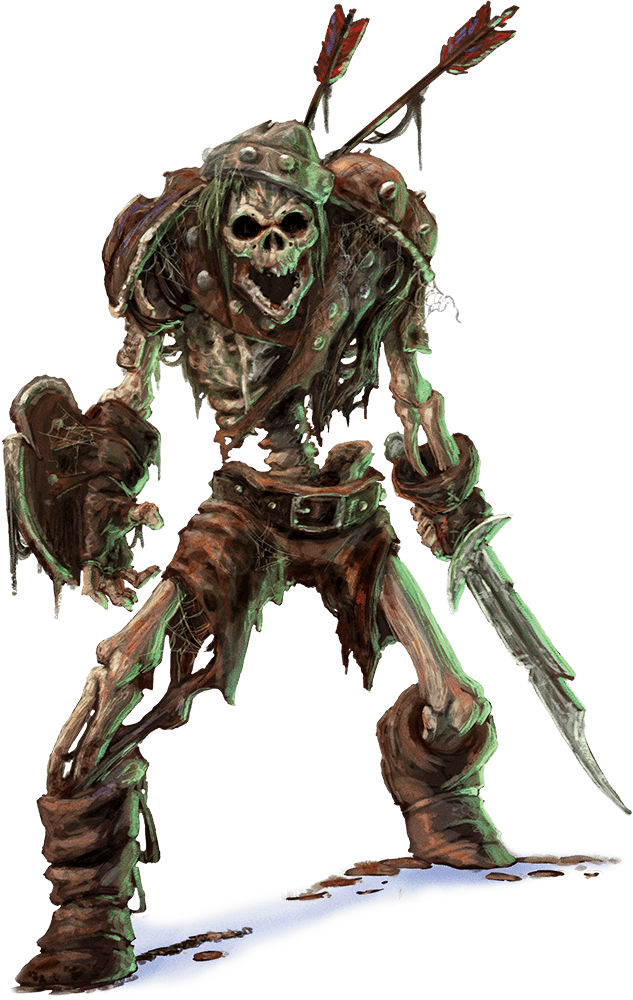
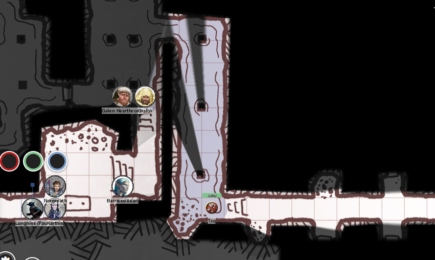

# 17 Jan 2024

[**Previously**](2024-01-10.md): We rescued a noble, Klim Jhasso, from cultists of Bane who had a lair underneath the Frolicking Nymph bathhouse. Moving further on into the lair, we encounter a silvery-gold flail-wielding Myrkul female cultist surrounded by a swarm of skeletal rats. We later from her name is Flennis. She has fallen to the divinely empowered blows of Barrisso, but her skeletal swarm remains to assault us.

---

Lunghiss attacks the swarm of skeletal rats - he hits them but feels he doesn't do the whole amount of damage (12HP) as they are resistant to physical damage.

Karthis fires a Fire Bolt at the swarm, doing 3HP of damage.

Norgreath casts Eldritch Blast but misses.

Gralok hits with his spear, doing 8HP of damage.

The rat pack now attack Gralok. In doing so they open themselves up to attacks of opportunity from Lunghiss and Barrisso, who do 9HP and 8HP of damage. The swarm in return do 5HP of damage to Gralok.

Galen casts Sacred Flame but misses.

Barrisso casts Toll the Dead. But since the skeletal rats are already dead, they are impervious to necrotic damage.

Lunghiss attacks doing 16HP of damage along with Booming Blade; the swarm falls asunder.

---

Norgreath examines the table bearing the human cadaver. A poor Nature check reveals it's a dead body. On the table, he also spots a wax tablet in a wooden frame accompanied by a stylus. The writing in Common details what the cultist read in the entrails:

???+ scroll "Wax tablet"

    When the box is opened in the house of Alaundo,
    the path forward shall be revealed.

    • One of four shall be damned to Hell. One of
      four shall be struck by a thunderbolt. One
      of four shall rise.

    • The great Sun shall be blackened and the
      devil legions of Avernus shall conquer Elturel.

    • Conflict shall come to the Great Cities of
      Waterdeep, Athkatla, and Suzail.

    • Volcanic fire shall tremble the peaks of
      Orsraun.

    • The Dread Ones shall invoke the Tears of
      Selûne, and they shall weep upon the Inner Sea.

We search the cultist and find a black leather-covered spellbook with a skull-like lock, and 15GP in a belt pouch. Attached to the back of her belt is a leather scroll case.

Galen opens the scroll case and find a parchment letter written in Common:

???+ scroll "To Flennis from TK"

    Flennis -

    Know ye that these missives pass through
    holy hands directly from the Shield of the
    Hidden Lord, which speaks with the True
    Voice of Gargauth, Once Lord of Avernus and
    Treasurer of Hell, the Tenth Lord of the
    Nine, the Hidden Lord, the Lord Who Watches,
    and Legatus of the Dark Gods.

    When the devils of Avernus brought down
    Elturel, the Grand Duke of Baldur’s Gate was
    claimed as a prize for Hell. So too shall you
    claim for Zariel the souls of those who once
    served Elturel. You can know this to be truth,
    for I hold here, at Vanthampur Manor, secure
    within its infernal puzzlebox, the pact with
    Zariel; the declaration of the powerful purpose
    to which we set our hands. Lay to rest your
    doubts.

    T.K.

Galen notices a pin stuck in her hair. As Galen removes the pin, he notices it could work on the spellbook's lock as a key. Karthis unlocks the spellbook - a wisp of black smoke forms a skull before dissipating. Karthis says he needs to study the spells within.

Galen heals Lunghiss and Gralok.

We move south then west, finding ourselves in another flooded chamber. Wooden pillars brace the ceiling, and a tunnel leads north. Gralok gets a putrid stench of rotten eggs. Barrisso thinks the smell comes from a gas called "corpse damp", which he has heard is extracted by necromancers from corpses and has a number of properties used for their work.

Barrisso heads through the tunnel leading north to a room with no other exits. It contains a foul-smelling lidless stone sarcophagus.

As he searches the sarcophagus, a battle axe magically appears. Barrisso recognises it as being summoned by the spell Spiritual Weapon.  The rest of the party are still in the room to the south.

Karthis casts Fire Bolt at the great axe. Unfortunately this lights up the corpse gas in the southern room, and many take fire damage.

Galen moves into the northern room and hits the great axe with his mace.

Barrisso attempts to disbelieve in what he thinks is an apparition, but fails.

The battleaxe swooshes towards Barrisso, who doesn't attempt to dodge since he believes it's an apparition. Fortunately it still misses.

The party retreats from the battleaxe.

--

We head to a room to the far east. We find another room with an altar with black wax candles; Lunghiss notices writing on them. Galen realises these candles are used by Myrkul devotees to offer her blessing to people to seek out souls of people named on the candles.

The names are:

* Edmao Eduarda
* Wemba Oshrat
* Madhuri Akhila
* Leiv Diomids
* Aneta Diomidis
* Annika Silverleaf
* Shohreh Letitia
* Iolanthe Oshrat

We recognises Annika's name from refugee papers in [Insight Park](../2023/2023-11-15.md).

We light the first four candles. A glow illuminates the wall behind the altar. Written there in text now revealed is "Rise and be counted". As we read these words, some skeletons rise from rubble in the room.

<figure markdown>
  { width="300" }
  <figcaption>Skeleton</figcaption>
</figure>

Lunghiss is the first to attack, doing 11HP of damage and then using Cunning Action to Disengage.

Galen attacks with his mace and smashes the skeleton into smithereens - his mace seems particularly effective.

Gralok attacks with his spear and does 7HP of damage.

The skeletons retaliate, but their attacks miss.

Barrisso attacks with his rapier, doing 5HP piercing damage, but misses with his offhand scimitar.

Karthis moves and casts Fire Bolt but misses.

Norgreath does 8HP of damage with his Eldritch Blast.

Lunghiss attacks but misses.

Gralok does 9HP of damage, finishing off a skeleton. One remains.

Galen attacks with his mace, smashing the skeleton to pieces.

---

We search the remains but it's all trash.

Norgreath sends his familiar Taq exploring to our east, and we follow:

<figure markdown>
  { width="400" }
  <figcaption>Taq Exploring</figcaption>
</figure>

Under the first door south in the east-west corridor he finds, Taq turns into a spider and goes under the door. He finds a crypt that has collapsed at some point with an empty, broken sarcophagus.

Under the second door north is a wholly collapsed area.

Under the door to its south is a dusty but intact crypt containing an open sarcophagus with faded frescos. The back wall is badly cracked which looks like it was repaired with crude plaster.

Under the southern door to the east of the last room, is a similar room. However, this room contains four zombies.

Taq retreats, then explores under the door at the eastern end of the corridor. The walls of this room are covered in blood, and two bodies dangle from shackles. One a young female tiefling, the other an elderly male human: he is dead, she is still breathing. In the middle of the room is a chair bearing a bloody whip. The party realises that the ring of keys they found earlier on a Banite fit the shackles and they release them and bring them to the floor.

Galen enters the room and performs Spare the Dying on the tiefling: she is now stable but unconscious. Barrisso prays for the soul of the dead.

Taq goes under the door to the north, into a corridor that turns east. Taq sees a person in what looks like a concealed entrance. When Taq goes closer to examine him, the man reacts and looks around. He's armoured in chainmail, and carrying a spear and longbow.

Taq changes back to imp form and then attempts to sting the enemy, but misses, and is now visible to him.

Lunghiss attacks but misses, then disengages.

Barrisso hits with his rapier, doing 9HP of piercing damage. His offhand misses.

Karthis moves but can't attack.

Gralok moves and attacks but misses.

Galen attacks with his mace and hits for 3HP of damage.

The enemy attempts to attack Galen but misses.

The enemy cries out ["INTRUDERS!"](2024-01-31.md).
