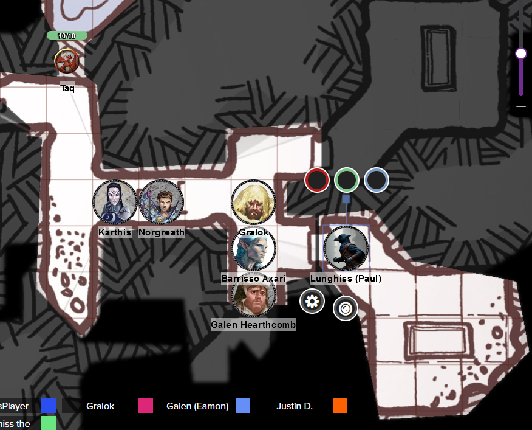

# 31 Jan 2024

[**Previously**](2024-01-17.md): Still in the lair underneath the Frolicking Nymph bathhouse, we have encountered skeletons, sinister candles, a black leather-covered spellbook  and chained up prisoners. These cultists like playing up their nastiness! Anyhoo, we've alerted an armoured guard, wielding a spear and longbow, and engaged with him but not managed to silence him before he called "Intruders!" - shall we see who will respond?

---

Lunghiss does a sneak attack of 18HP of damage, felling the opponent.

---

We search his body and find a belt pouch with 5GP and a potion of healing, plus chainmail armour.

He had been standing in a gap between two chambers - the northern one is full of water, about two feet deep. We hide the body in case it can be casually seen by someone.

A passage also leads east towards a branch with two doors to the east.

Barrisso listens at the northern-most door leading east: he hears water lapping against walls. He opens the door and finds a chamber with seemingly no other exits. The room is lit by four flickering torches which have almost run out. In the middle of the room is a stone sarcophagus. Its lid is propped against the wall. A pool of what could be blood is in the sarcophagus. Around the room are six bedrolls. Additionally, there are three footlockers; two of them are battered and worn, the third is of better construction and padlocked.

Barrisso exits and listens at the southern-most door leading east: he hears what sounds like snoring. Lunghiss moves up and quietly opens it.

<figure markdown>
  { width="400" }
  <figcaption>Sarcophagus Rooms</figcaption>
</figure>

Inside are sleeping guys, with their armour hanging up. This room also contains a sarcophagus, but closed. The walls of the room in its south-east have collapsed.

The men's weapons are maces and spears, which are propped up against the walls. Lunghiss stealthily uses Mage Hand to take each weapon and remove them from the room, putting them as far away as possible. Showing off, he removes their shields too.

Lunghiss moves stealthily into the room and performs a sneak attack on a sleeping opponent, killing him outright (34HP of damage).

He sneak attacks a second opponent and does a lot of damage (18HP) but unfortunately not enough - the opponent awakes up screaming. In the meantime, Lunghiss has performed a Disengage and is now back out in the corridor.

Now into full combat, Gralok moves into the room and attacks the injured and still prone opponent with his spear; a second opponent is now dead. With his bonus action from Great Weapon Master, Gralok attacks the third opponent, doing 9HP of damage.

The fourth enemy wakes up, then panics when he realised he has no weapons or shield. He stands up, appraises the situation, and moves next to his injured comrade. His injured comrade also stands up and calls out to Gralok "Who are you??".

Gralok shouts at him: he kneels down, then motions to his friend to kneel down, both putting their hands on their heads.

---

We tie up the two remaining opponents and interrogate them. We are told the southern room is for the Lord of Bones (Myrkul), but no one is in it right now. To the north is a chamber with living skeletons. Elsewhere is a temple, and, Mortlock Vanthampur.

Barrisso orders the men to tell us all about the Cult of the Dead Three. Barrisso through Insight feels they are both Baneites, who are not easily frightened by adversity and are quite stoic. Instead, Barrisso tries Persuasion, hinting that they could lead the Baneite community if they aid us. We separate the two guys to play them off against each other.

Barrisso questions one about the other. "He's an idiot with no ambition. Me, I'll be stepping up in this organisation." Barrisso asks him about the aims of the Cult. "Since the Fall, we've been asked to perform killings of people associated with Elturel - those of certain names and lineages. Information is sent the Poisoned Poseidon. In our cult, we have the Ygnath, the Iron Consul(1), Flennis, the Master of Souls(2), and Vaaz, the Death's Head of Baal. We have killed both Ygnath and Flennis; only Vaaz is left, to the north.
{ .annotate }

1. [Was torturing Klim Jhasso.](2024-01-03.md#ygnath)

2. [The very thin woman in a black robe and cowl, concealing her face, carrying a silvery-gold flail and with a swarm of skeletal rats.](2024-01-10.md#flennis)

"They get their orders from one of the Council of Four." (This is possibly Mortlock Vanthampur's mother.)

Gralok dispatches the guy and Barrisso interrogates the second. Mortlock Vanthampur is a hulking brute, according to him. He tells us there is a treasure room up north, taken from the **Dragon Queen**. We ask him about the Dragon Queen; this seems to be Tiamat, from Avernus, the first level of Hell. He does not know if the treasure was stolen from there.

Asked why people from Elturel are being killed, he says "The Hellriders made a bargain with the Companion."

We ask who "T.K." who signed one of the letters - he has no idea. "The House of Alaundo" - Karthis has heard of a wise sage named Alaundo who could foretell the future, and who founded the library in Candlekeep.

Gralok tries to dispatch this guy too - but he breaks his bonds and stands up.

Karthis casts Fire Bolt and misses.

Lunghiss attacks and misses.

Norgreath casts Eldritch Blast and finishes him.

---

We search the footlockers we found, starting with the locked one. Lunghiss checks it for traps, then picks it with his Thieves Tools. Inside, he finds:

* A scroll case
* Four potions of healing

Inside the scroll cases are two scrolls:

???+ scroll "To Vaaz from TK"

    Vaaz,

    Know ye that these missives are
    inscribed by my hand at Vanthampur
    Manor, passing through holy hands
    directly from the Shield of the
    Hidden Lord, which speaks with the
    True Voice of Gargauth, Once Lord
    of Avernus and Treasurer of Hell,
    the Outcast, and Legatus of the
    Dark Gods.

    Seek ye the blood of the holy
    orders of Elturgard. That is the
    commandment of this hour. Let the
    great work which was begun in the
    light of the Companion be completed
    here under the aegis of the Dark
    Gods. Vanthampur shall remain within
    her manor for this time, for she
    has mighty work to do and must
    consult constantly with us in its
    pursuit. But just as she has given
    unto you the temple of your fore-
    fathers, so you shall obey the fruit
    of her loins.

    Her three sons speak with my
    voice and work to our common cause.

    T.K

The second scroll reads:

???+ scroll "To Vaaz from Duke Thalamra Vanthampur"

    Vaaz,

    Duke Portyr will be delivering a
    speech at the Beloved Ranger in the
    Wide during an event held by the
    Confraternity of Refugee Relief. Give
    the iron barb I have enclosed in this
    packet to your best assassin.

    I know that you will serve me well in
    this.

    Duke Thalamra Vanthampur

Barrisso stayed in the Upper City last time he was in Baldur's Gate, and remembers a statue to the Beloved Ranger, Minsc.

There's nothing of value in the other footlockers, apart from 20GP and the various weaponry.

We check a room to our south-west - there is nothing but a sarcophagus containing a skeleton.

---

We double back, and [head to that northern water-filled chamber we found earlier...](2024-02-07.md)

