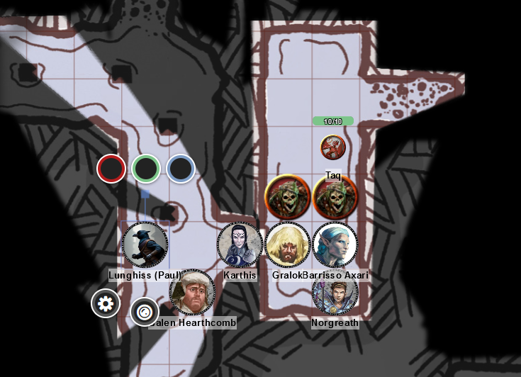
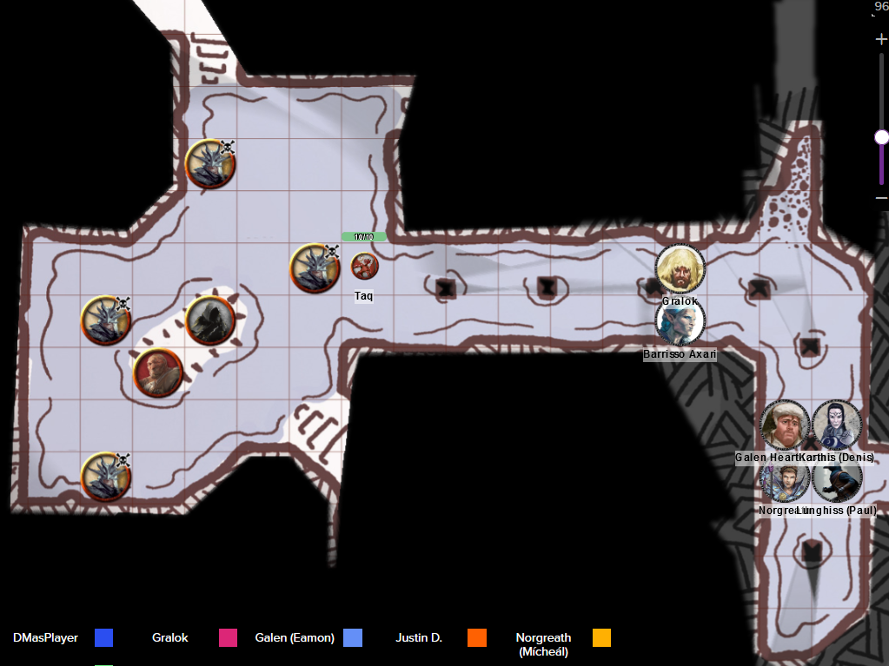
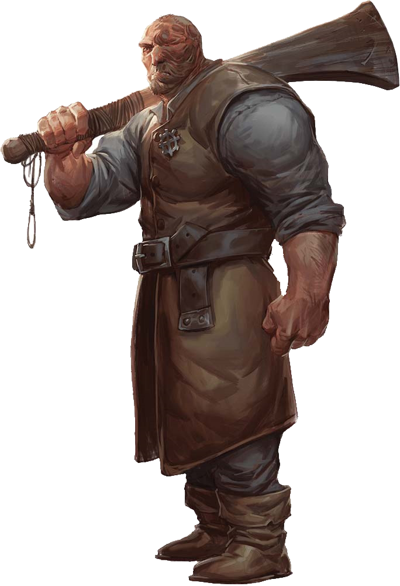

# 7 Feb 2024

[**Previously**](2024-01-31.md): Still under the Frolicking Nymph bathhouse, we have discovered via some Dead Three cultists we interrogated that we have already killed both Ygnath, the Iron Consul, and Flennis, the Master of Souls. Vaaz, the Death's Head of Baal, is still alive and somewhere to our north, along with the treasure of Tiamat the Dragon Queen. They also revealed that the cultists are getting their orders from one of the Council of Four, possibly Mortlock Vanthampur's mother. Via letters we have uncovered, to Vaaz from Duke Thalamra Vanthampur and the mysterious TK, it seems that they are to "seek ye the blood of the holy orders of Elturgard" and that Duke Portyr is to be killed by an assassin using an iron barb previously included with a letter.

---

We head back to the flooded room, and open the door on its east side. We find four skeletons inside, wielding short swords and wearing scraps of armour.

Karthis fires a Fire Bolt at one, doing 9HP of fire damage.

Gralok moves in and attacks with his great axe, doing 5HP of damage, finishing it off. Great Weapon Master then gives him the ability to attack a second skeleton, but he misses.

A skeleton swings his sword at Gralok, but misses.

Another skeleton also attacks Gralok, inflicting 9HP of piercing damage.

A third skeleton attacks Gralok, but misses.

<figure markdown>
  { width="400" }
  <figcaption>Skeleton Attack</figcaption>
</figure>

Lunghiss moves in and attacks, doing 14HP of damage. Even without Booming Blade, he kills his opponent. He then uses Cunning Action to Disengage.

Barrisso moves in and attacks with his mace, but misses.

Norgreath moves in and performs an Eldritch Blast, but misses.

Galen casts Sacred Flame, doing 5HP of fire damage to an opponent.

---

Karthis casts Fire Bolt, but misses.

Gralok smashes a skeleton with his mace, doing 9 HP of damage, wiping it out. Great Weapon Master then gives him the ability to attack a second skeleton, but he misses.

A skeleton attacks Barrisso, doing a crit and getting 12HP of damage.

Lunghiss moves in to attack but misses, then disengages again.

Barrisso attacks a skeleton, finishing it off.

---

We now have time to explore the chamber we are in. It's also flooded, with a short passage leading east to a collapsed staircase. 

One skeleton holds what seems to be a magical scroll case, unaffected by time and the local conditions. Inside the bone-dry compartment are two scrolls. Karthis discovers it's a Case of Preservation. The scrolls are Blood Hound and Foretell Distraction. Lunghiss takes the Foretell Distraction scroll.

We search the rest of the room, but do not find anything. 

We head west and soon hear the sounds of battle. We send the familiar Taq ahead. He sees a flooded chamber with a small island. There are four dead bodies and dowsed torches floating in the water around it. On top of the island are two humans circling each other.

<figure markdown>
  { width="400" }
  <figcaption>Island Chamber</figcaption>
</figure>

One guy is a hulking brute, unarmoured, and wielding a great club. (We find out later this is Mortlock Vanthampur.)

<figure markdown>
  { width="200" }
  <figcaption>Mortlock Vanthampur</figcaption>
</figure>

He towers over a shorter man, who is muscular and wielding a torch and dagger. Bizarrely, he has no flesh covering his skull. Is this Vaaz, the Death's Head of Baal?

Gralok attacks the skull guy with his javelin, doing 5HP of damage.

The skull guy attacks; the way he moves reminds us of the Reaper of Baal back in the tannery ship. He turns and stares at Barrisso. Barrisso saves from being stunned. Skull guy then throws a dagger at Gralok, but misses him and thunks into a wooden support. He follows up by stabbing the hulking brute.

Lunghiss fires his short bow from medium range, doing 6HP of damage via a sneak attack.

The hulking brute attacks skull guy with his club twice, calling out "Help me with these assassins! My mother will reward you!". Is this Mortlock Vanthampur, son of Duke Thalamra Vanthampur?

Galen attacks using Sacred Flame, doing 3HP of damage.

Karthis casts Scorching Ray - only one ray hits, for 10HP of fire damage.

Barrisso fires his longbow, doing 6HP of piercing damage.

Norgreath casts Eldritch Blast with Genie's Wrath, doing 10 HP of force damage and cold damage.

---

Gralok rages, then attacks with his great axe, doing 8HP of slashing damage.

The skull guy turns and looks at Gralok. Gralok saves from being stunned. Skull guy then attacks with his attack, but Gralok's Form of the Beast means his tail lashes out, reducing skull guy's chance to hit. However, the attack still gets through, doing 16HP of piercing damage.

Lunghiss sneaks in and does 20HP of damage, finishing skull guy off. He then disengages and moves back.

--

The hulking brute turns to us and says "Well done! Shall we see if there are any more assassins around here? My name is **Mortlock Vanthampur**. Who are you?"

We tell him we are from the Flaming Fist. 

"Why are they attacking you?"

"I was betrayed. These assassins conspired with my brothers. Without you, I would be dead."

We ask about the conspiracy.

"My mother is a Duke and one of the Council of Four. She convinced Ravengard to go to Elturel to meet with the overseer. With Ravengard gone, the Flaming Fist is leaderless and vulnerable."

"Was the person you killed Vaaz?"

"How do you know?"

"We were investigating. We know that Vaaz follows the instructions of one of the Dukes. Do you know anything of this?"

"Up until now, Vaaz and the rest of the cultists were in the pay of my family."

"You realise that puts you in a delicate position?"

"The role of my family in giving them this place of refuge was to create division and uproar in the city and give us an opportunity to take power."

"Why were you betrayed?"

"My brothers help run this organization from afar. One, **Thurstwell**, uses imps as spies in the city. He has this bathhouse under surveillance and probably know you are here already. My other brother, **Amrik**, runs a money-lend business out of a tavern called **The Low Lantern**, and also making papers for refugees. He also figures out who come from Elturel, and who comes from the Hellriders.

"Duke Portyr is a rival of my mother's. I fear he is still my adversary. My plan is to leave the city and take a ship to Chult. I can tell you what you need to bring them down."

"My mother is a Zarelite. She is the worshipper of a ruler of a layer of hell known as Avernus. My mother is using the cultists to murder specific targets. Amric identifies the targets, I would pass them to the Dead Three in the Poseidon, who would then ritually murder them. He also had a sideline of fleecing the refugees. My mother is working with a powerful cult leader who escapes from Elturel before the Fall - I don't know his name. He brought two artefacts - one unknown, one a shield with a demonic face."

"For treasure, you can find treasure that the Dead Three stole from the Thune noble family. It's yours."

"Why do they want to eliminate you?"

"They don't like me."

Barrisso via Insight that Mortlock is cold-hearted and evil but genuinely thinks this.

---

Meanwhile, Gralok has been searching Vaaz. On his body is a scroll:

???+ scroll "To Vaaz from Amrik Vanthampur"

	My brother Thurstwell and I are agreed. Mortlock is not only a liability to us, but
	a liability to you, taking credit for all of the good work that you and your Fists are
	doing for us.
	
	Rid us of our troublesome brother and send his right ring finger to me at the Low
	Lantern as proof and I will see to it that you are raised above Flennis and Ygnath
    in this affair. You will be the liaison between the Shield of the Hidden Lord and
	your fellow cultists. It will be your face that Gargauth sees. He will know that
	**you** are the one responsible for carrying out his will! Bane himself will know
	your name when Gargauth sings your praises unto him!
	
	Act swift, with the strength of the fist and the finality of the knife, my friend!
	
	Amrik of the House Vanthampur

"What do you know of the demise of Elturel, and how the fate of the Hellriders is linked?"

"Elturel has been dragged through Hell. **Zariel** rules the layer of hell called Avernus."

"What is the fate of Hellriders?"

"It's part of the deal."

"Elturel's fate was sealed I understand - some sort of contract."

"Between the lords of hell by bringing Elturel to hell?"

"And all their souls."

Mortlock says he can find us in the Green Gannet at the docks. He gives us the chunky ring from his right ring finger, then leaves.

---

The four dead guys in the room are Baneite cultists, wearing studded leather armour; their weapons are underwater. Three of the four yield a total of 36GP. 

Nearby in a treasure room are four padlocked chests. Lunghiss checks and opens them (3 and 4 after realising we have keys):

* Number 1: A pile of copper coins - 4,500 of them. Also, 2 red crystal vials with gold stoppers.
* Number 2: 10 agate gems amongst 1,250 silver piece.
* Number 3: The remains of a delicate porcelain dragon mask on a bed of 2,400 copper pieces and 500 silver pieces. (Since Lunghiss fails to pick the lock, Barrisso tried - and then broke Lunghiss' thieves' tools.)
* Number 4: A bronze crown with 5 spires, each shaped and painted to look like a chromatic dragon. Wrapped in shaped packing, another hollow would seem to contain a mask (not the porcelain mask). An inscription says *"From Avernus, we summon her. To Tiamat, we pledge fealty."* 

We manage to carry everything except the copper pieces.

---

We search a nearby room containing multiple statues. Out of 9 crates, 3 contains 10 days of ration, 20 caltrips, 3 flasks of alchemist's fire, 6 sets of manacles, 4 tinderboxes, 9 daggers, and 4 potions of healing. 

Gralok decides to smash the statues in the room. One statue's harlequin mask separates, revealing a ghastly skull.

As soon as he gets within 5 feet of another statue, he feels compelled to kneel. Barrisso approaches the statue and attacks but his rapier does no damage to a wooden statue. Galen uses his strength to knock the statue over, and frees Gralok of his compulsion. The statue wields a blood-red spear.

Barrisso and Gralok knock a skeletal statue off its pedestal. As it hits the ground, a dark mist arises and surrounds Gralok. Gralok is cursed.

---

We return to the unconscious tiefling. We give her one of our healing potions. She awakens, and scrambles back when she sees the dead guy who had been manacled beside her. We tell her we are here to help and have healed her. 

She is Ven Kress. She was abducted in the lower city. She works for a family who sells spirits and wines. The dead man was a caravan coordinator. They tortured him for information on the Jhasso family. We tell her we killed all the cultists, and will lead her out.

---

On our way out, we check a room we hadn't previously: we find three bodies in a triangular formation, with a torchlit chamber below. They look like cultists of Myrkul. Barrisso ties them up in case they decided to move while dead. The staircase west leads to a collapsed chamber containing a looted stone sarcophagus. 

---

We return upstairs back to the bathhouse. It seems a [long time](2024-01-03.md) since we entered!

We ponder on the many things [to do next....](2024-02-21.md).

