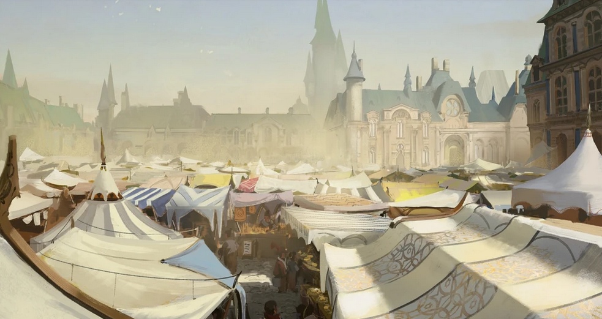
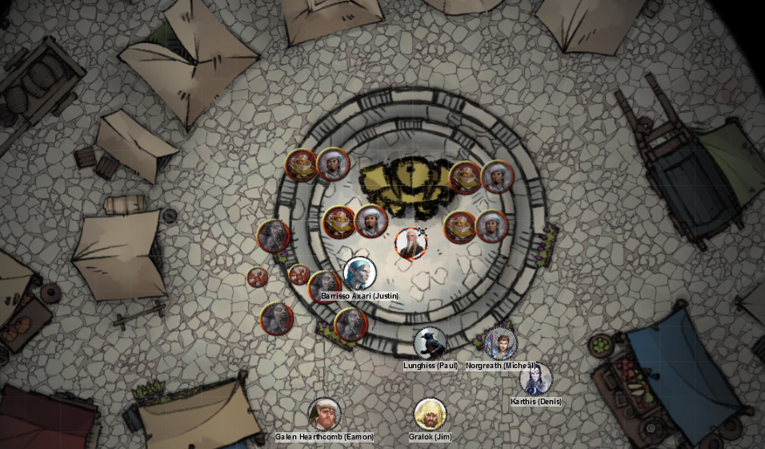
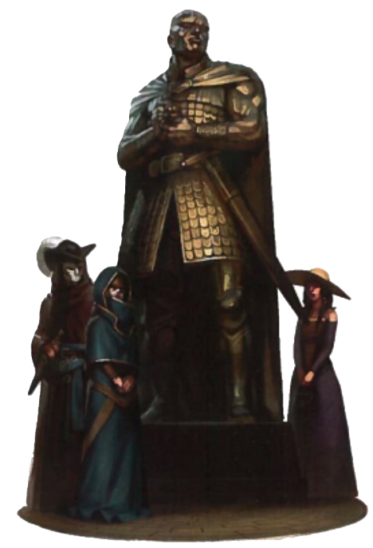
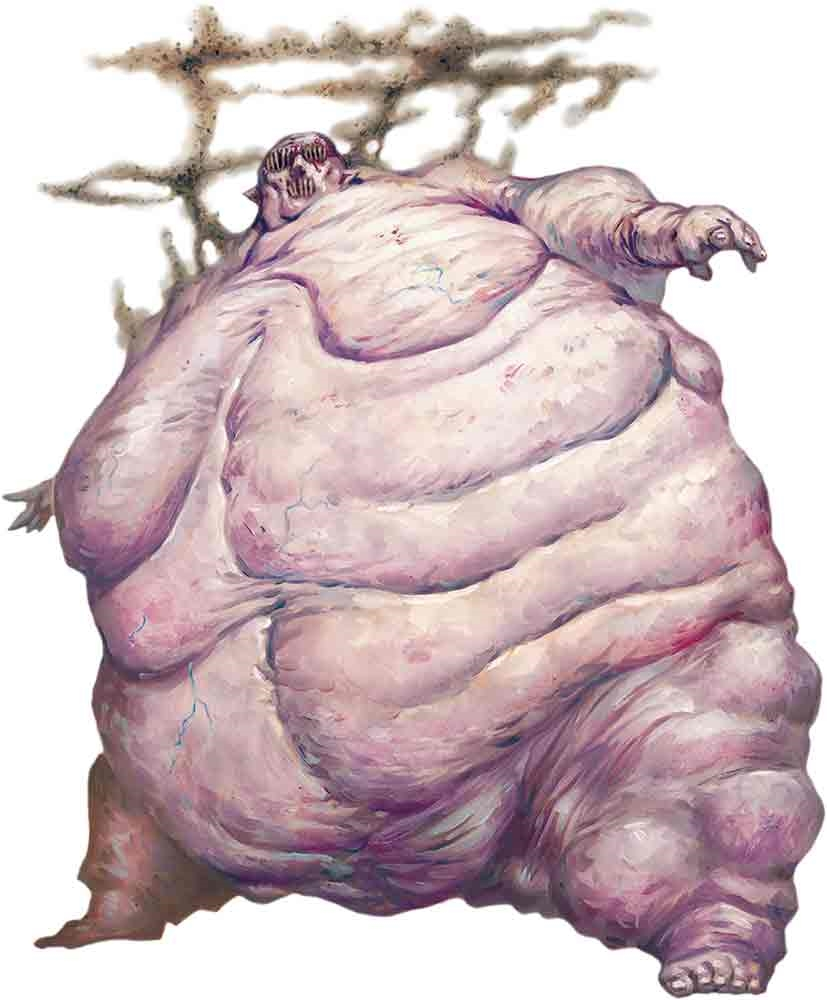
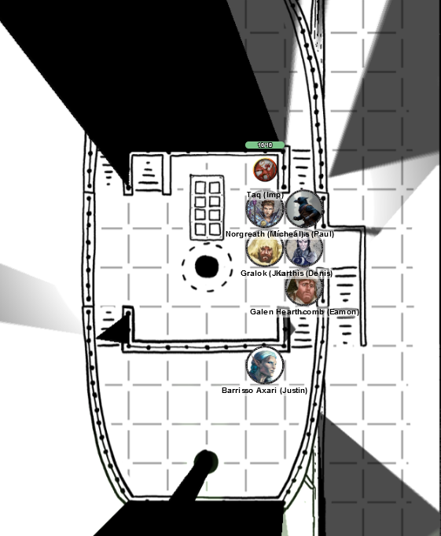
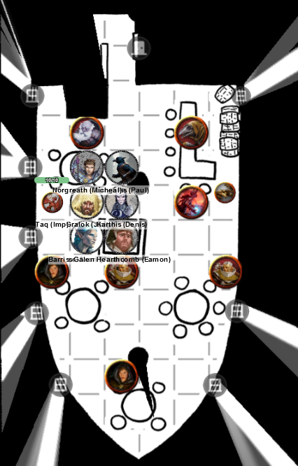
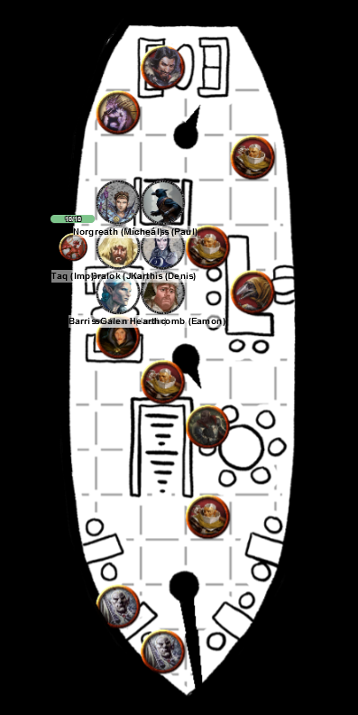
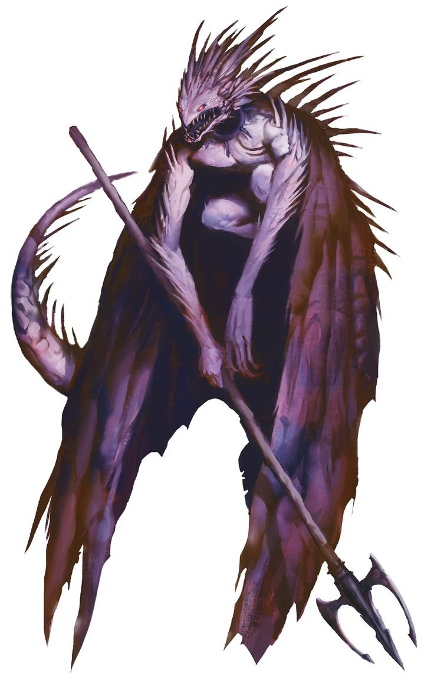

# 21 Feb 2024

[**Previously**](2024-02-07.md): We encountered Mortlock Vanthampur under the Frolicking Nymph bathhouse, where we saved him from being assassinated by Vaaz the Death's Head, on behalf of his disgruntled brothers Thurstwell and Amrik, and his mother, Thalamra. Mortlock tells us that the cultists of the Dead Three have been in the pay of his family, to create division so that they can take power. Amrik runs a money-lending business out The Low Lantern tavern, and also making papers for refugees. Amrik figures out who comes from Elturel and who comes from the Hellriders. He tells us his mother is a Zarelite, and worships the ruler of a layer of hell known as Avernus, and she is working with a powerful cult leader who escaped from Elturel before the Fall whose identity he does not know. Duke Portyr - about who we found a note targetting his assassination - is a rival of Thalamra. We also rescued Ven Kress (a tiefling who worked for the Oathoon patriar family) and Klim Jhasso (who is from a patriar family), though Effinax Zalbor who worked for the Jhassos was found dead next to Ven.

- [X] Investigate the Frolicking Nymph bathhouse.
- [X] Kill Vaaz the Death's Head
- [X] Investigate Mortlock Vanthampur
- [ ] Get Gralok's curse healed.
- [ ] Save Duke Portyr from being assassinated
- [ ] Investigate the Low Lantern tavern
- [ ] At the Low Lantern tavern, show Mortlock's ring to Amrik Vanthampur - while pretending to be Vaaz??
- [ ] Investigate Thalamra Vanthampur and her family

---

We arrive back up into the bathhouse where we find Ven Kress and Klim Jhasso. Ven Kress says she was tortured for information about her patriarch family, where their treasure is, and so on. Klim Jhasso is of the merchant family, and was also tortured for similar reasons. We give the bathhouse attendant who aided Klim a gold piece as a reward.

---

We first head to a temple, as Gralok needs to heal his curse. We return to Heapside in the city of Baldur's Gate, and present ourselves to the Watch. Barrisso introduces himself to their leaders and shows our badges and we are allowed to pass into the Upper City. He asks about a local temple and also the location of the Portyr estate.

We are directed to the Temple of the Unrolling Scroll, a shrine of Oghma. The building is of white marble with a striking red roof with gold leaf trim. Beneath the roof was a reflecting pool set into a rather deep basin. We find an acolyte and ask him about removing a curse.

He introduces us to a shield dwarven cleric named Welian, who seems very old has a neatly braided beard.

"How can I be of assistance?"

"I would like a curse removed", says Gralok, mentioning the Dead Three.

We asks us to sit down and join him, and asks the circumstances. Gralok explains he was cursed when he toppled a Myrkul statue.

Welian says he can help, and what we can offer as recompense. He suggests 300 GP. We rail at this, but agree.

As he begins to cast the spell, we hear a hubbub outside the temple. The party apart from Lunghiss, Gralok and Norgreath go out to see what is going on. A crowd is running in the temple's direction, away from The Wide.

<figure markdown>
  { width="400" }
  <figcaption>The Wide</figcaption>
</figure>

"The Duke is dead! The Duke is dead!"

We were too late to save Duke Portyr.

"The Duke was up by the statue and he was calling out to everyone to welcome the refugees and help them. The next thing we saw was an arrow shooting towards him, striking him in the chest. He exploded, and devils climbed out of his corpse! They are eating people!"

Back in the temple, Gralok has been healed of his curse. The members of the party there rush outside into The Wide to help.

<figure markdown>
  { width="400" }
  <figcaption>The Wide - Battle Shot</figcaption>
</figure>

A status of the hero Minsc looms over the market:

<figure markdown>
  { width="300" }
  <figcaption>Statue of Minsc</figcaption>
</figure>

We see four monstrous blob-like devils:

<figure markdown>
  { width="300" }
  <figcaption>Blob-like Devils</figcaption>
</figure>

And also 2 imps.

Galen calls Sacred Flame on one of the imps.

A devil attacks Galen but misses, but he is now surrounded in its miasma.

Another devil attacks a bystander but misses.

A third devil attacks Barrisso, but luckily again fails.

The final devil attacks Lunghiss, but again fails.

Gralok attacks a devil with a spear, but misses.

Barrisso is in a miasma of vermin, and has to make a Con saving throw. He fails, and feels like he has inhaled some of the creatures, which are burning him on the inside for 5HP of damage.

Barrisso attacks the nearest devil, but misses with both his rapier and scimitar.

The first undamaged imp flies down to Galen and attempts to sting him, but misses.

The second imp tries the same attack, but also misses.

Norgreath attacks a devil with Eldritch Blast and Genie's Wrath, doing 8HP of damage. As he is in one of the clouds of creatures and fails his CON save, he experiences 5HP of damage.

Karthis is safe from the miasma. He casts Witch Bolt at a devil, doing 12HP of damage and killing him. Karthis then moves away from the miasma.

Lunghiss moves in and attacks a devil; his sneak attack fells it with damage of 16HP.

---

Galen takes 5HP of damage from a devil's miasma. He attacks with his mace but misses.

The devil beside Galen attacks him, but misses.

Another devil attacks a bystander and succeeds.

Gralok takes 8HP of damage from a vermin cloud. With his spear, he attacks a devil; his 8HP of damage kill it.

Barrisso moves towards a devil and attacks him. His rapier misses, but his scimitar connects for 8HP of slashing damage.

The imps attempt to sting Galen, but miss.

Norgreath performs an Eldritch Blast with Genie's Wrath on the remaining devil, doing 8 HP of damage. It falls; only the imp remain.

Lunghiss gets a critical on an imp, killing it.

Gralok hits the remaining one for 6HP of damage.

Barrisso casts Toll the Dead, taking 3 HP of necrotic damage.

The imp disappears.

Galen attempts to attack it (with disadvantage) but misses.

---

Around us, most of the populace have disappeared. One of the Duke's household, tells us that the Duke's niece has been summoned back from Chult. Her name is Lianna, and she is a senior member of the Flaming Fist. She is back in Baldur's Gate.

He tells us his name is Fanir, secretary to the Duke. "I imagine that Lianna is with the Flaming Fist in the Lower City. In the meantime, we are going to take the Duke's body back to his estate."

---

At this point we need a long rest; we return to the Elfsong Tavern. We don't owe money since we helped them out previously. We all take a long rest.

---

We wake up, and decide to go to the Low Lantern tavern, a converted ship anchored to the wharf by thick chains. A lantern at the bow casts an eerie green light.

We enter:

<figure markdown>
  { width="200" }
  <figcaption>The Low Lantern Tavern</figcaption>
</figure>

There are dead seagulls everywhere. Otherwise, there is nowhere here.

Barrisso checks a gull to see why it died. It seems to have been stung to death.

Taq goes invisible and flies up to the crow's nest of the ship, but sees nothing.

We go down to the lower deck of the ship:

<figure markdown>
  { width="200" }
  <figcaption>The Low Lantern Tavern - Lower Deck</figcaption>
</figure>

It's a busy and noisy bar that smells of sweat, stale ale and vomit. A woman sees us and approaches us. Unusually, she has a crab on her shoulder.

"How do you do. My name is Laraelra, but I'm called the Captain around here. Be careful."

Barrisso says we are looking for Amrik. She tells us he's down in the Lounge. We take the stairs down to that level:

<figure markdown>
  { width="200" }
  <figcaption>The Low Lantern Tavern - Lounge</figcaption>
</figure>

The bartender here is a kenku. It's a windowless area with couches and low tables, where people are gambling. Presiding over a gambling table is a human:

<figure markdown>
  { width="200" }
  <figcaption>Amrik</figcaption>
</figure>

There is a strange creature perched on the nearby couch:

<figure markdown>
  { width="200" }
  <figcaption>Spined Devil</figcaption>
</figure>

Barrisso is convinced this is a fiend.

Others in the room seems to be elvish - of grey skin - or tiefling.

We check who are carrying weapons. Everyone is carrying weapons. There are four people who seem to be bouncers, wearing studded leather armour and wielding cutlasses.

We check with the kenku barman who Amrik is, and approach him.

Barrisso introduces himself. "Do you need money or papers?" he says. Barrisso says he knew someone who knew Vaaz, and he shows Amrik the ring that Mortlock gave us.

"Are you expecting a reward? I was also expecting a finger in the ring."

Barrisso presses the point, especially the reward.

Amrik calls over Bhaltus, a bouncer with a red ponytail and a small sack, which he hands to Amrik. He says "Well done!" and hands it to Barrisso.

Amrik asks how we knew Vaaz. Barrisso makes up a semi-plausible story. He seems content, so we leave his company.

---

We decide to explore the ship more using Taq, while we stay safely up on top deck. It finds an area that smell awful, full of hammocks. One occupant is the room is asleep. There's a door at the back of the room.

Under it is a cabin at the back, currently unoccupied, maybe the captain's. Taq retreats and [we will decide what do to next time....](2024-02-28.md)
