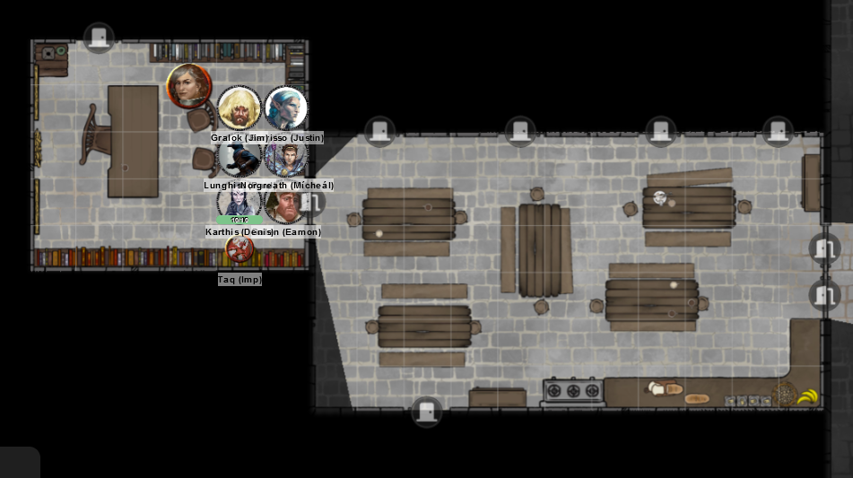
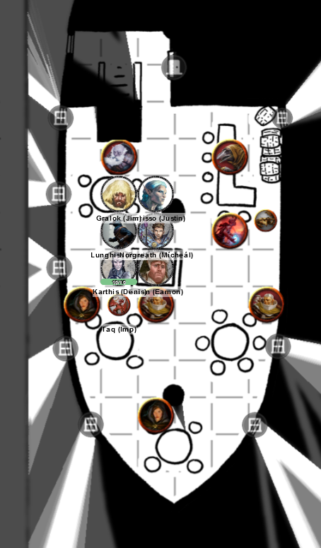
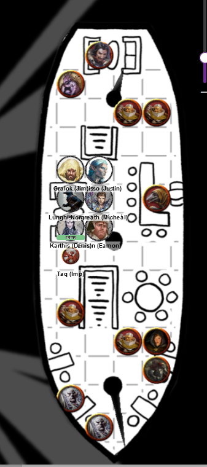
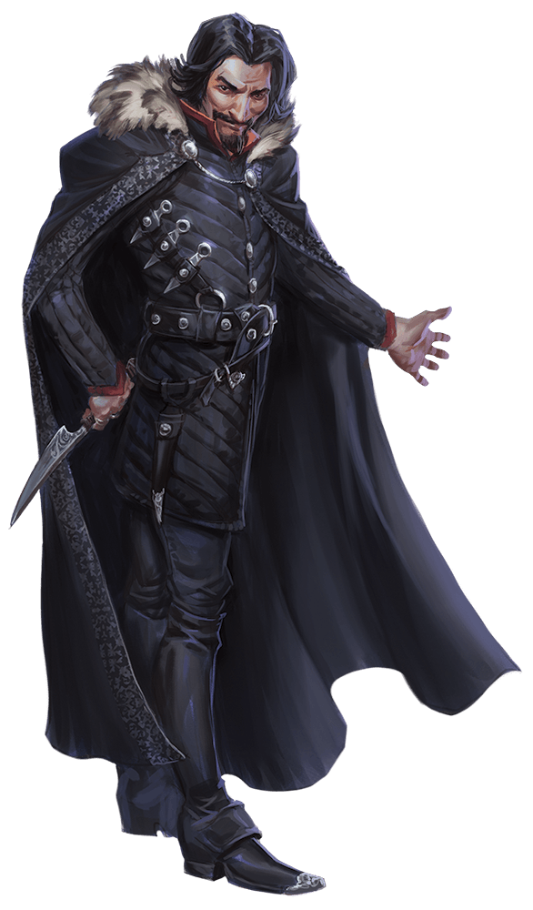
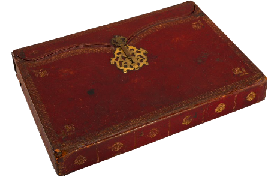
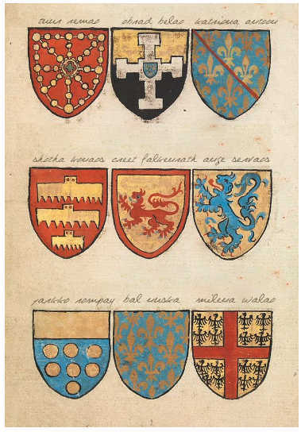

# 28 Feb 2024

[**Previously**](2024-02-21.md): So, you managed to let a Duke die just to cure a curse, get paid a bunch of coins for not killing a brother, find a devish tinge to the city while bringing one around with you. Which family member will you follow up with next, a Vanthampur or a Portyr?

- [X] Get Gralok's curse healed.
- [X] Save Duke Portyr from being assassinated
{: .task-failed }
- [X] Investigate the Low Lantern tavern
- [X] At the Low Lantern tavern, show Mortlock's ring to Amrik Vanthampur - while pretending to be Vaaz??
- [ ] Investigate Thalamra Vanthampur and her family
 
---

We decide to return to Flaming Fist HQ to talk to Zodge:

<figure markdown>
  { width="400" }
  <figcaption>Flaming Fist HQ</figcaption>
</figure>

Zodge is sitting behind a desk, in discussion with an armoured woman. Zodge has been promoted and is now Blaze Zodge. 

"Yes?"

Barrisso tells him we want to discuss our recent adventures.

"Don't mind me", says the woman. She is Liara Portyr, the niece of Duke Portyr and now head of the Flaming Fist, and we give our condolences. 

We explain all that has happened, up to the assassination of her uncle. We show her [the assassination order we found that came from Duke Thalamra Vanthampur](2024-01-31.md). They tell us how that family is trying to get into power and killing people from Elturel. She is alright with Mortlock still alive, if he is no longer part of the conspiracy. But the rest of the family must perish. However, she can't help us if we are caught.

Liara thinks we should take down the Duke as quickly as possible; Thurstwell should be in the manor with her. However, Amrik, in the Low Lantern tavern, would be a potential heir. 

We ask for advice about Thalamra's link to Avernus. Liara says the letters we have should have a clue.

---

Some of us take time to upgrade our armour. We are also given four elixirs of fortification. This thin orange brew has a bitter, vinegary taste. When you drink it, you immediately gain 1d10 temporary hit points. Barrisso tries one of two stoppered red crystal vials we found earlier. He breathes fire. He thinks they are Potions of Fire Breath. 

---

Once geared up, we return to the Low Lantern tavern:

<figure markdown>
  { width="200" }
  <figcaption>Back at the Low Lantern</figcaption>
</figure>

We go back down to the level where Amric originally was:

<figure markdown>
  { width="200" }
  <figcaption>Back at the Low Lantern Lounge</figcaption>
</figure>

We see a mix of humans, half-elves and dwarves. Barrisso asks Bhaltus the bouncer for an introduction, and saunters up to Amrik. 

<figure markdown>
  { width="200" }
  <figcaption>Amrik</figcaption>
</figure>

He accuses Amrik and his family of being in league with cultists, and then swallows one of the Potions of Fire Breath he has. 

Amrik stands and pulls out a black potion and throws it beside where Taq is, creating a 20 foot crowd of smoke. Inside the cloud, Lunghiss, Norgreath, Karthis and Galenis's vision is heavily obscured.  

Barrisso breaths fire at Amrik, doing 22HP of fire damage. 

A hireling of Amrik hits and damages Barrisso, while another moves to protect Amrik.

Another hireling does 8HP of bludgeoning damage to Barrisso.

Karthis moves out of the cloud and casts Scorching Ray at a guy near the bar, doing 14 HP of damage.

Gralok rages and attacks the Spiny Devil, doing 14 HP of damage - but he thinks the enemy does not take all that damage.

Galen casts Order's Demand at all opponents around Amrik. Some are affected, including Amrik, and drop their weapons. Galen orders the affected ones to desist.

Norgreath moves out of the black smoke cloud towards the foes at the top of the room. He fires an Eldritch Blast at Amrik, but misses.

Lunghiss moves in and sneak attacks the Spiny Devil, doing 14 HP of damage, plus and an extra 7 HP of damage from Booming Blade, and then disengages.

The Spiny Devil attacks Gralok, but Gralok uses his tail to reduce the attack damage.

---

As a bonus action, Barrisso uses a second Potion of Fire Breath on Amrik, doing 15 HP of fire damage. He then follows up with a rapier attack but misses.

An enemy does 10 HP of bludgeoning damage to Barrisso.

Karthis casts Witch Bolt at Amrik, doing 14 HP of lightning damage. 

Gralok attacks the Spiny Devil, doing 8 HP of slashing damage. There is a horrible screech and smell of sulphur, and the creature disappears in a pillar of smoke. Great Weapon Master gives him the ability to attack Amrik, but he misses.

Galen attacks with his mace for 6 HP of damage.

Norgreath casts Eldritch Blast but misses.

Lunghiss does 13 HP of damage to an opponent, plus 2 HP from Booming Blade if he moves and then disengages.

---

Amrik attacks Barrisso with a flurry of blows, reducing him to 1 HP! 

Barrisso with a bonus action does 10 HP with a Potion of Fire Breath. Then as an action, he performs Lay on Hands on himself, curing himself for 15 HP.

An enemy hits Barrisso, bringing him back down to 4 HP. A second enemy downs Barrisso.

A previously charmed opponent picks up his weapon and attacks Galen for 7HP of bludgeoning damage.

A second opponent does similar, doing 6HP of damage.

Karthis' Witch Bolt does another 12 HP of damage to Amrik. Amrik falls.

Gralok does a Reckless Attack on the enemy to his right, doing 12 HP of damage.

Galen heals Barrisso so he is no longer dying.

Norgreath attacks the guy to his left with his long sword, doing 6 HP of damage.

Lunghiss attacks an opponent for 15 HP of damage, killing him.

---

Barrisso attacks the enemy to his south: he misses with his rapier and scimitar.

An opponent attacks with his mace, doing 8HP of damage: Barrisso is down again, with two levels of exhaustion.

Two opponents attack Galen: one misses, the other hits, doing 7HP of bludgeoning damage. Galen is now also down.

Karthis casts Fire Bolt, hitting an opponent for 9HP of fire damage.

Gralok performs a Reckless Attack, but misses. With Inspiration, he hits, doing 6 HP of damage.

Galen fails his death saving throw.

Norgreath performs a Misty Step to get range from his opponent, then performs an Eldritch Blast, but misses.

Lunghiss does 12 HP of sneak damage, then disengages.

---

Barrisso fails his death saving throw.

The enemy beside Gralok attacks him, doing 18HP of damage.

Another enemy moves and attacks Gralok, doing another 12HP of damage.

A third enemy attacks Karthis, doing 8HP of damage.

Karthis casts Fire Bolt at him, doing 2HP of damage.

Gralok does a Reckless Attack, doing 14HP of damage, killing his opponent. 

Galen succeeds on his next death saving throw.

Norgreath attacks the enemy next to Karthis. His Eldritch Blast misses.

Lunghiss using Inspiration, does 15 HP of damage plus 6 Booming Blade. He's still standing.

---

Barrisso saves his death saving throw.

The enemy beside Gralok hits him, doing 8HP of damage. He's now down to 9HP.

The second enemy beside Karthis hits him twice. Karthis uses Arcane Deflection to limit the damage to 6HP of damage. 

Karthis performs a Shocking Grasp, doing 8HP of lightning damage. The enemy falls. One remains.

Gralok attacks but misses.

Galen saves his death saving throw.

Norgreath casts Eldritch Blast, doing 10HP of damage.

Lunghiss does a crit, 26 HP of damage. The last enemy is toast.

---

Barrisso fails a death saving throw.

Karthis gets Galen to drink a potion of healing.

Gralok stabilises Barrisso.

Galen casts Prayer of Healing, giving everyone 12 HP of healing.

---

On Amrik's table, we  find a red leather folder.

<figure markdown>
  { width="200" }
  <figcaption>Amrik's Leather Folder</figcaption>
</figure>

A portfolio case containing an eclectic collection of genealogical and property records, most of which seem to be focused on or around the city of Elturel. Sheets of parchment are covered in notes relating to these records, tracing patterns of inheritance originating from a seemingly arbitrary selection of progenitors.

In other cases, it appears that the opposite work is being done, with lines of inheritance being traced backwards into the past. Some of these are marked with the small sigil of a sword in the upper left-hand corner; others have black X marked in the same spot. 

We also find several letters in a scroll case...

???+ scroll "From Thurstwell Vanthampur to Amrik"

    Amrik,
	
    I completely concur with your last. I recommend using the imp who brings this letter to you to send word to Vaaz to proceed. He’ll be able to slip into the Frolicking Nymph quietly and invisibly, deliver the missive undetected, and then return to me at the manor with none the wiser.
    
	Thurstwell Vanthampur

???+ scroll "From Mortlock Vanthampur to Amrik"

    Amrik,
	
    Thank you for the most recent targets. I will pass them along to Flennis immediately so that he can send out his teams and begin surveillance. He did request that, if possible, you include more information on those currently associating with them, as those relationships often make tracking them down easier given the general chaos of their circumstances.
    There will be no need for you to send any of your agents to the bathhouse. Not only do I have things well in hand here, but you know as well as I do that mother had good reasons for keeping your operations separate from those of our allies.
	
    Mortlock Vanthampur

???+ scroll "Bundle of Vellum Scrolls"

	*This bundle of vellum scrolls proves to be the Armorial Rolls of Elturgard, detailing the name, coat of arms, and date of the awarding of the accolades for every knight in the Order of the Companion and the Riders of Elturel.*

	<figure markdown>
	   { width="200" }
       <figcaption>Armorial Rolls</figcaption>
    </figure>

???+ Scroll "A List of Names"

    For the Poisoned Poseidon:
	
    Remao
	
    Akhila
	
    Aneta D.
	
    Servaos
	
    Silverleaf
	
    Braam
	
    Oshrat
	
    Nuska
	
    Edmao
	
    Tuur S.
	
    Veer
	
    Stien

We note that the names on this match the names on the [Myrkul candles we found at the bathhouse](2024-01-17.md#myrkul-candles).

???+ Scroll "From Thurstwell Vanthampur to Amrik (2)"

    Amrik,
    
	On your advice, I have removed the Elturian puzzlebox from the family vault where mother had secured it. I have no idea how angry she might be if she found out, but I am utterly fascinated by it. I am certain that there are secrets of Zariel locked within it that will perhaps unlock power — the sort of power you and I have often dreamed of.
    Unfortunately, I have had no luck in determining how to open the thrice-damned thing. But I will keep you informed of any progress I make.
	
    Thurstwell Vanthampur	

We ponder [what to do next.](2024-03-06.md)

  

 

