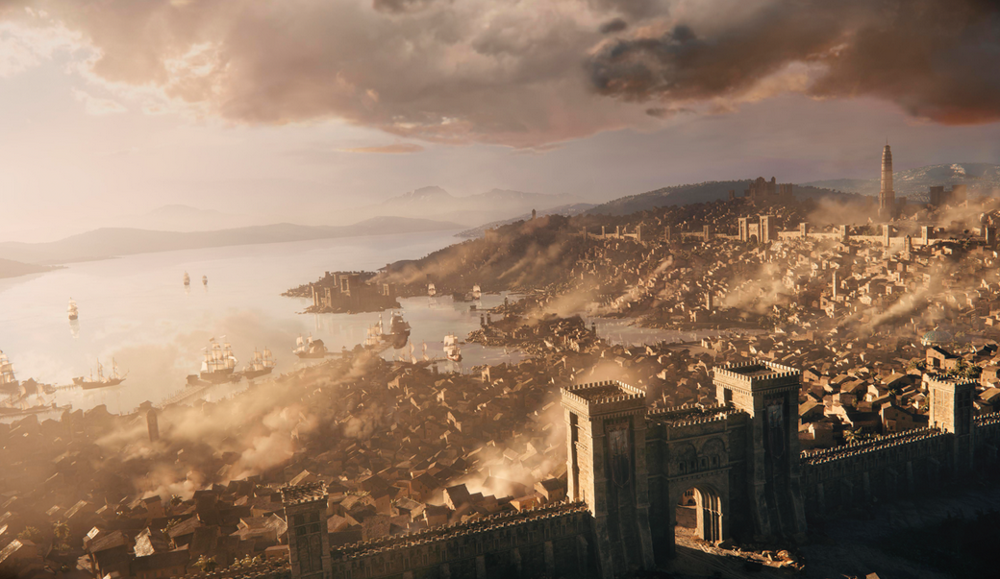
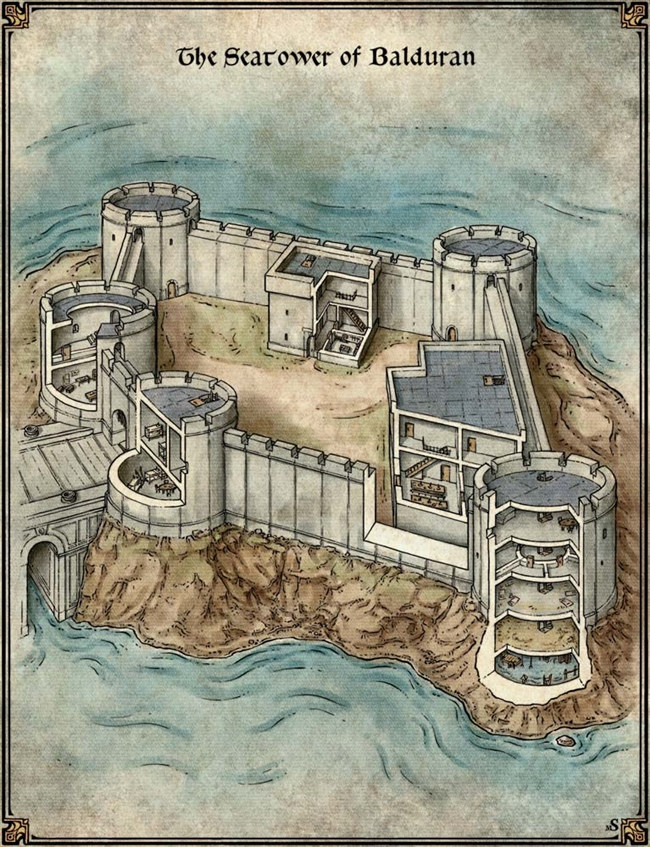
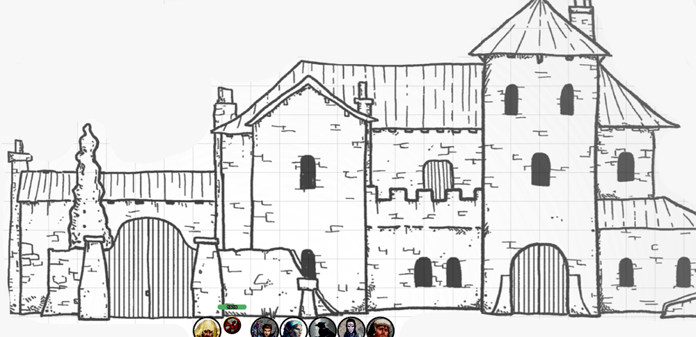
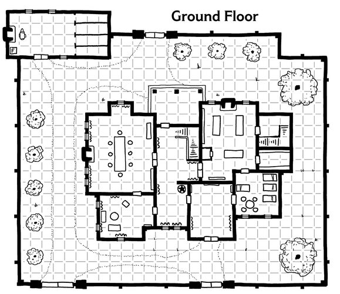

# 6 Mar 2024

[**Previously**](2024-02-28.md): With a veneer of approbation, we ventured into the belly of the Low Lantern tavern/ship to deal with the second Vanthampur son, Amrik. He and his devilish and not so devilish supporters and allies lie dead around us. The party is a sorry sight, but there is information to be gleaned and an escape to be made. We have a bunch of letters, including one from his brother Thurstwell talking of a "Elturian puzzlebox" which he stole from the family vault and how it may contain "the secrets of Zariel"

- [X] Kill Amrik Vanthampur
- [ ] Investigate scrolls found with Amrik
- [ ] Investigate the Elturian puzzlebox that Thurstwell stole from the family vault
- [ ] Investigate Thalamra Vanthampur and her son Thurstwell

---

We look around the lounge deck. Everyone has fled, apart from a kenku, who is cowering. Lunghiss gives him a gold piece, in solidarity.

Amrik had some leather armour and some daggers. Nothing magic, surprisingly. We find 47GP among the various pouches of the dead dudes, along with the previously found scrolls .

The lady Laraelra who previously introduced herself as The Captain comes downstairs. She doesn't seem that annoyed given the circumstances.

"Gentlemen, the Duke will not be very pleased. I suggest you make yourselves scarce."

Barrisso says we will off, as soon as we get all the loot.

"I'll pretend I didn't hear that."

She tells us Amrik didn't have any quarters on the tavern/ship, just an office. We leave.

---

We head back to the ship's deck and then back to Blaze Zodge. Lunghiss leads the way, scouting ahead in case there is retaliation coming our way. We don't encounter anyone.

We are shown through to the same room as before; only Zodge is there. We tell him what occurred in the Low Lantern tavern/ship, and show him the scrolls we found in Amrik's leather folder. As we show them to him, Karthis notices *(Intelligence/History check)* there are official seals on these documents which mean that they shouldn't be copies of the Armorial Rolls, but are the actual original copies from Elturel, complete with the High Observer's seal.

Cross-indexing the scrolls with Amrik's earlier list, we discover that those marked with a sword are descended from a current or historical Elturian knights or members of the Order of the Companion. Those marked with an X don't. Zodge can't enlighten us on why the Vanthampurs are doing.

Before anything, we need to take a long rest as some of the party are doubly exhausted. We rest in the barracks as it's probably safe.

---

We wake up, mainly refreshed. We ask Zodge for advice about getting to the Vanthampur's manor, where we know the Duke and Thurstwell to be. "The sewers are the domain of the Duke - she was in charge of the sewers originally." We remember she was the Master of Drains and Underways, from which she gained her wealth.

Zodge tells us people in the Watch would take the patriar's side in anything, and therefore are probably not of any help. For the first time we've met Zodge, he seems nervous about advising us. He seems out of his comfort zone. Directly attacking a ducal house is not his thing.

We ask Zodge about meeting Liara Portyr, the new head of the Flaming Fist. She is at the Seatower of Balduran, in the Lower City at the end of a causeway. This is the headquarters of the Flaming First.

---

The massive Seatower of Balduran rests on a rocky island in the bay of Baldur's Gate. Named after Balduran, the tower can be reached by a causeway linking it to the mainland. It has a full armory and catapults to battle hostile ships.

The only way to approach the tower is along the causeway. We sight it as we come through the Basilisk Gate into the Lower City:

<figure markdown>
  { width="400" }
  <figcaption>Lower City</figcaption>
</figure>

We enquire about getting a boat that will take us to near the Seatower. We find someone with a sign: *CROSS HARBOUR 2SP EACH HALF HOUR.* There seems to be a lot of activity of armoured figures around the harbour. Norgreath sends his imp to reconnoitre. There are a number of Banite people searching for stuff. No religion is banned, so these guys are tolerated.

We wait for half an hour.

Just as some of the warriors approach us on our own side, a large flat bottomed boat approaches, with a large creature standing 7’ tall.

In the middle of the boat is a very large creature: like a 7 foot ogre but grey, muscular and lean.

"Do I have some fares?", it asks.

We board and each hand over the 2SP fee, asking him to get as close to the Seatower as possible.

As he pulls on his oars, we notice they are bigger than human-sized oars. Also he pulls them so strongly we nearly slide off the benches.

---

We soon arrive at a muddy beach near the Seatower. We see four Fists, guarding the causeway. We tell them who we are and they allow us along.

We see the Seatower rising in front of us:

<figure markdown>
  { width="400" }
  <figcaption>Seatower of Balduran</figcaption>
</figure>

We arrive at the fortress itself. The portcullis of the main gatehouse is down; behind it are more Fists, and on the towers are archers.

We show our credentials and asks to see the marshal. We say we have no appointment but urgently need to see her.

After a while, we're allowed into the fortress and brought to an audience room, overlooking the harbour. Soon after, Liara arrives and everyone else leaves the room.

We give her a report of our adventures with Amrik and what we discovered.

She advises us to approach the ducal house in disguise. We ask about the Undercellar, but she is not sure it connects to the Vanthampur's villa. Liara suggests we approach the villa via the sea gate.

We ready ourselves and disguise ourselves as scholars looking for access to the library and their attendant bodyguards in order to access the Upper City. Lunghiss uses Disguise Self to blend in as another humanoid. He also uses Find Familiar to bring back his owl familiar, Archie.

---

We head towards the Sea Gate.
Our plan is to go through and pay the toll, rather than declare our real names and go as Flaming Fist.
We pay 10 silvers to get through, we’re not asked about our names or business.
Justin tries to see whether the guards recognize us going through, but doesn’t spot anything (Insight check).
Once we’re through, we take a left to get off the main path, looking out for anyone following us.
We’re on our way towards the temple area.
Most of the patriar villas are in this area that we’re walking through, the Manor Born.
We head towards the Vanthampur villa and try and observe what’s going on from a distance – what guards, what visitors, what’s the layout, and so on.
The villa is near the High Hall, the seat of government for Baldur’s Gate. So there are civil servant type folks in this area.

<figure markdown>
  { width="400" }
  <figcaption>Vanthampur Villa</figcaption>
</figure>

Also nearby is a tavern, the Helm & Cloak, which has window seats where one could observe the villa. It consists of two buildings: Helm is a rooming house, and Cloak is the drinking and eating area. A huge helm, that used to belong to a fire giant, is visible. In the Cloak, there’s a cloak of the goddess Sune, lady fire hair, draped over the entrance, and inside loads of trophies, the most prominent being a unicorn statue. We know that the Sword Coast and the wider area have many gods. There’s a unicorn goddess, a lesser deity, called Lurue, this statue reminds us of this goddess.

We head in and take up residence at such a window seat and observe for a while.
The imp will do a pass of observation around the villa as an invisible flying scout. Norgreath trusts him to report back, rather than going into a trance to see what the imp sees.

Taq reports there are three groups of guards, moving around the villa. The upper floor of the manor house has less space than the ground floor as it contains battlements. There is a servant's entrance at the back near the stables.

Taq enters the villa grounds:

<figure markdown>
  { width="400" }
  <figcaption>Vanthampur Villa - Ground Floor</figcaption>
</figure>

To the north, Taq sees a stables, where a man is working. Large doors in the villa open up into a hall hung with tapestries. To the west are stairs leading up: one human there is cleaning, while another orders her around. Nearby is a lounge, and to the north of that a dining room. To the east are servants' quarters, and a kitchen where someone is cooking. Beyond that are storerooms and stairs going up and down.

After Taq has reported what they see on the ground floor, Norgreath sends it back to report on the upper floor.

---

In the pub, Gralok overhears a conversation about the Vanthampurs: a vengeful spirit has killed two of the sons, and a third one is doomed all because of their mother's greed and ambition. Seemingly, Amrik's body was brought from the tavern/ship and brought back to the villa.

Gralok gets involved in the conversations, saying the villa is a dangerous place. The pub regulars ask if he is from The Steeps; he says he is staying in the Elfsong Tavern.

---

Meanwhile, Taq has been exploring the upper floor of the manor and returns. On a staircase, he encounters a winged cat - that could see him. The cat tried to grab Taq; luckily Taq fled unharmed. Gralok knows this creature to be called a tressym.

Kenku decides to approach the villa from the north and pick the lock of a gate there. He succeeds, then opens the gate and enters. A group of three guards inside the villa grounds see the gate opening - Lunghiss tries to hide behind a nearby tree.

One guard goes over to the slightly ajar gate to check. Lunghiss successfully stays hidden. From outside the gate, Norgreath casts Eldritch Blast with Genie's Wrath, with Agonizing Blast doing 10HP of damage.

Barrisso fires his bow at the same guy, doing 8HP of damage, felling him. The two other guards are now alert.

Barrisso moves inside and engages a second guard with scimitar and rapier. [The fight continues....](2024-03-13.md)

---

