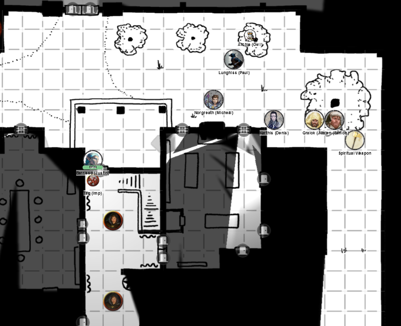
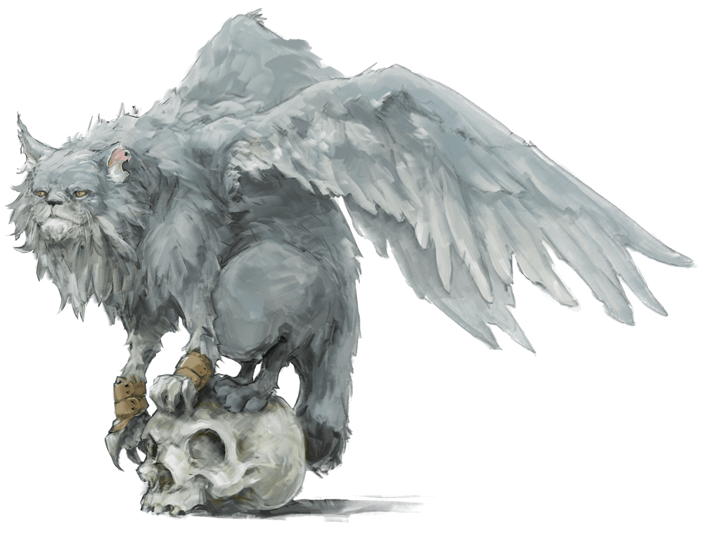
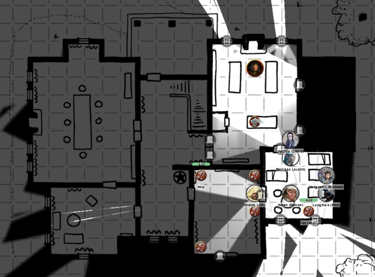
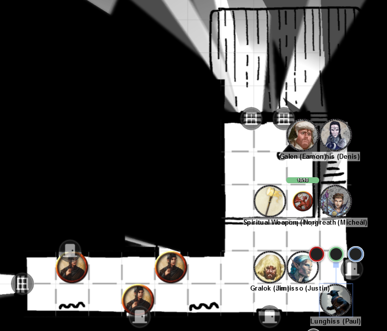
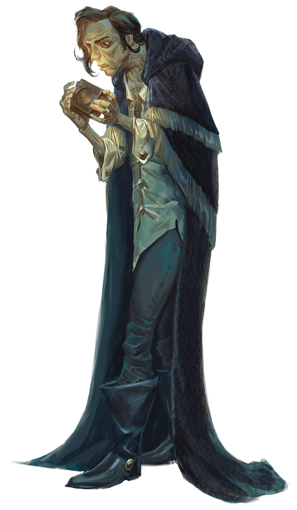

# 13 Mar 2024

[**Previously**](2024-03-06.md): After killing Amrik Vanthampur, and getting advice from Blaze Zodge and Liara Portyr, now head of the Flaming Fist, we have headed to the Vanthampur villa. There we want to defeat the remaining members of the family, and perhaps find the "Elturian puzzlebox" which may contain "the secrets of Zariel". As we enter the grounds, we disturb some guards and attack....

- [X] Investigate scrolls found with Amrik
- [ ] Investigate the Elturian puzzlebox that Thurstwell stole from the family vault
- [ ] Investigate Thalamra Vanthampur and her son Thurstwell

---

Lunghiss sneak attacks one of the two foes inside the gates of the Vanthampur villa, doing 11HP of damage and felling him.

Karthis moves through the gate and attacks the remaining enemy with a Fire Bolt, doing 7HP of fire damage; he's damaged but alive.

Galen casts Sacred Flame on the same opponent, doing 5HP of fire damage. He falls.

---

Taq is sent to investigate the nearby stables. There is a person there using an anvil with four horses.

Suddenly, more guards come around from the east side of the house. Barrisso and Gralok walk towards them, brazening it out. Karthis, Lunghiss, Galen and Norgreath attempt to drag the three bodies outside the gate.

A guard sees Barrisso and Gralok, and alerts his companions. He runs forward and shouts "What are you doing? Why are those people dragging our friends out the gate?".

Meanwhile, Galen moves towards the guards and readies the ability to Channel Divinity in order to use Order's Demand to charm any guards he can.

Barrisso wields his weapons and holds an attack until the guards are aggressive.

One of the guards reaches his dead colleagues and realises they are, well, dead. As he passes Gralok, the latter attempts to hit him with his greataxe but misses.

Karthis fires a Fire Bolt at the same guard, doing 10HP of fire damage, but the target still stands.

Lunghiss does a sneak attack with Inspiration - his 6HP of damage fells the guy.  Two guards remain.

A guard approaches us and Galen uses Channel Divinity to apply Order's Demand to him.

"What happened to the guys at the gate?"

"We heard a strange noise and came to investigate."

"But what was that fire and noise?"

"Oh someone was setting off spells."

Meanwhile, Norgreath moves and fires Eldritch Blast at the uncharmed guard, but misses.

Gralok attacks the uncharmed guard, and his 11HP of slashing damage, felling him.

Gralok's follow-up attack on the charmed guard does 16HP of damage, absolutely splatting him.

---

We've killed six out of the nine guards, so possible we can now go on the offensive. However, the three left arrive before we can do that.

Galen casts Spiritual Weapon as close to the guards as he can. However, his attack in this round with it misses.

After Galen misses with his Spiritual Weapon, Barrisso moves to engage. He attacks with rapier (hits, 6 HP of damage) and then scimitar (misses).

The guard behind responds by engaging with Barrisso. He jabs with his spear, but is parried by the scimitar.

Karthis attacks the one damaged with a Fire Bolt, but misses.

Archie, Lunghiss' owl familiar, flies to the closest tree.

The guard  who is damaged jabs a spear at Barrisso, hitting for 7HP of damage.

Lunghiss tries a sneak attack with the short bow, missing.

The third enemy loops around to engage Barrisso with his spear, missing.

Norgreath hits one with an Eldritch Blast and it falls.

The barbarian swings the greataxe and connects, doing 8HP of damage.

Galen hits for 5Hp damage with the Spiritual Weapon and the second guard falls.

Barrisso misses with both attacks.

Karthis misses with a Fire Bolt.

Lunghiss attacks again, succeeds a sneak attack with a shortbow, doing 21 damage, and the final enemy falls.

We search the dead guards. They are wearing standard uniforms with no valuables.

So we now have 9 bodies, we pile them behind a tree in the corner.

---

Taq enters the villa via the main porch on its north side.

<figure markdown>
  { width="400" }
  <figcaption>Vanthampur Villa - Taq Enters</figcaption>
</figure>

Inside, Taq sees two servants: one old and male, one young and female.

Lunghiss picks the locked door and opens it.

Barrisso calls the servants. "Come quick, there's trouble!"

Both servants believe him and leave the house. "We're the trouble." Gralok knocks them out and ties them up.

---

We all enter the villa. The hallway contains tapestries, book and other miscellanea, including a 6 foot wax statue of a tall woman cradling a tressym in her arms. We think the lady is the Duke. We think she doesn't look like a refined noble lady; the arms are well-built, and she looks very imposing. The various artworks in the hallway don't seem to be particularly skilled.

The double doors to our west take us into the dining room. This is a room with many windows. A wrought-iron chandelier is over an oak dining table. There are eight chairs, carved to look like devils. A window overlooking the gardens has blood-red curtains. On the south side of the room is a wine cabinet and another door.

Barrisso opens the curtains. We search the wine cabinet and find a set of 8 red crystal goblets, 16 bottles of expensive wine. Gralok, the barbarian, grabs a bottle, opens it with a knife and gulps some down.

Norgreath opens the bottle with a corkscrew, opens one, and pours glasses for anyone who would like one – no takers.
The barbarian finishes that bottle too.

Barrisso opens the door to the south and enters a parlour, which contains a high chair, coffee table and couches. The walls are lined with seven portraits. Two we recognise: one is Mortlock and one is Amrik. One is a fairly youthful figure, then three of much older men, all of whom have a physical resemblance to one of the younger members of the family. It's possible they are actually older version of the same people. The seventh painting is that of a tressym.

We recall from the family history that the Duke has married many times.

We go back to the hallway, and check a door to the east. Hearing no sounds, we enter.

A plaster shelf goes around the room at 9 feet in height, displaying vases. On the flagstone floor is an exquisite rug displaying a royal coronation. Tapestries display a dragon flying over a ship, and pilgrims on camels.

We enter a door to its east to find servant's quarters, with four sets of beds.

We enter the final room on the ground floor: a kitchen. A fireplace is at the north side of the room. A door on the left-hand side of the room seems to be for a dumb-waiter.

However, our immediate attention is drawn to a plump-winged cat, a tressym, sitting on a table. There's also a cook. She says "Can't you see I'm busy here?" and then realises we aren't members of the household.

<figure markdown>
  { width="400" }
  <figcaption>Tressym</figcaption>
</figure>

As Archie, Lunghiss' familiar, flies through the rooms to join us in the kitchen, he is attacked by a band of imps, who easily slay him.

<figure markdown>
  { width="400" }
  <figcaption>Vanthampur Villa - Imps Fight</figcaption>
</figure>

Gralok enters the room where the imps are and uses Great Weapon Master to attack, but misses with both attacks.

Galen enters the room and attacks with Sacred Flame, but misses.

Barrisso enters the room and attacks an imp with his rapier; he feels the damage is does is not optimum. He follows up with his scimitar attack.

One of the imps attacks Gralok, but misses.

Karthis stays in the servants' quarters but casts Fire Bolt at an imp; using Inspiration, he hits, doing 3HP of fire damage.

A second imp attacks Barrisso, and fails.

Lunghiss moves in to attack, but misses.

The third imp attacks Lunghiss, doing 5HP of damage.

The fourth imp attacks Gralok,

---

Norgreath hits the imp to the south with Genie’s Wrath (9HP force and 2HP cold damage) – the cold is resisted for a total of 10 damage, it is felled.

The barbarian hits the imp to the north east doing 6 damage, killing it.

Two imps are now down.

Galen the cleric moves in to attack with a  mace, doing a critical for 9HP of damage (delivering 4 damage).

Barrisso switches the scimitar for a silver dagger and attacks twice. He hits for 2HP of damage to the imp to the south with a rapier, and then 6HP of damage with a silver dagger, and it is felled.

The winged cat (Tressym) hisses at the imp as it is felled.

---

One imp remains. Karthis attempts to hit and misses.

So does Lunghiss.

Norgreath fires an Eldritch Blast with Agonizing Blast, but misses.

Gralok also misses.

Galen misses!

Barrisso attacks with his rapier, doing a possible 8HP of damage. His follow-up with a silver dagger fells it.

The tressym slashes his claws at the smoky remnants of the imp and hisses. It then rubs up against Barrisso. It seems happy we have killed the imps. Barrisso leans down to pet the cat-like creature.

Karthis realises that if a creature native to a different plane, that was summoned using magic (rather than moving), dies whilst summoned, then they don’t die but arrive back in their home plane – this may have happened to these imps.

---

Barrisso opens a door to the east; he hears a cry of "Get out of my pantry!" from the cook. He closes the pantry door.

We check another door east from the kitchen, and find stairs going downwards. Meanwhile, Gralok knocks out the cook.

We decide to check upstairs first, before we explore the basement.

---

Upstairs on the landing, we see at least two guards, maybe more, each in front of a door.

Karthis hits one with a Fire Bolt, doing 11HP of damage and killing him.

Galen casts Sacred Flame at another, but misses.

Gralok wields his greataxe but misses.

Norgreath uses Inspiration to cast Eldritch Blast with Agonizing Blast, doing 7HP of damage. His target is still living.

One of the guards doesn't move.

A guard in front of Gralok tries to skewer him but misses.

Lunghiss attacks the guard next to Gralok, but misses.

Barrisso attacks the same guy with his rapier and scimitar; the latter fells his opponent.

Another guard throws a spear, but misses.

<figure markdown>
  { width="400" }
  <figcaption>Upstairs Fight</figcaption>
</figure>

An imp appears and says "HOLD! Will you hear a message from my master, Thurstwell Vanthampur?"

"Speak quickly, rat."

"My master bids you to parlay with him: he has an offer to make you."

"If you mean in person, we agree."

Gralok can't help but attack a guard, doing 7HP of damage.

The imp shrieks "Why don't you obey the rules?! The barbarian must stand down!"

Gralok drops his greataxe.

A door to the south opens and a sickly-looking man enters the hallway. We assume this is Thurstwell:

<figure markdown>
  { width="200" }
  <figcaption>Thurstwell Vanthampur</figcaption>
</figure>

"I have a proposition for you."

"Speak."

"I have access to things that you will find interesting, and you have a propensity to do things that might be useful for him. Why don't we join these things together?"

"What do you offer?"

"A trinket."

"Are you talking about the puzzle box?"

"Yes, and a few other things."

"What do you want in return?"

"Kill my mother. She is in the dungeons below."

An imp brings an item to Karthis; a lozenge-shaped item.

"For such as you, Karthis, can use this to send messages to anyone that you know, anywhere on this world."

"What about this puzzle box?"

"It was brought here from Elturel just before the Fall. My mother knew the Fall would happen, as she is in league with Zariel."

"What secrets of Zariel does the box contain?"

"I don't know, I can't open it."

We ask him what backup he has. "I could have ten imps here in a moment if I wish. Do we have an agreement?"

[We ponder what to do....](2024-03-20.md)

