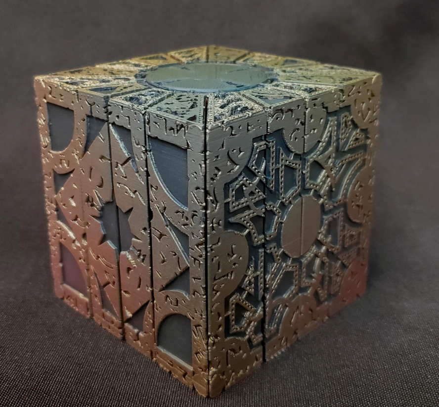
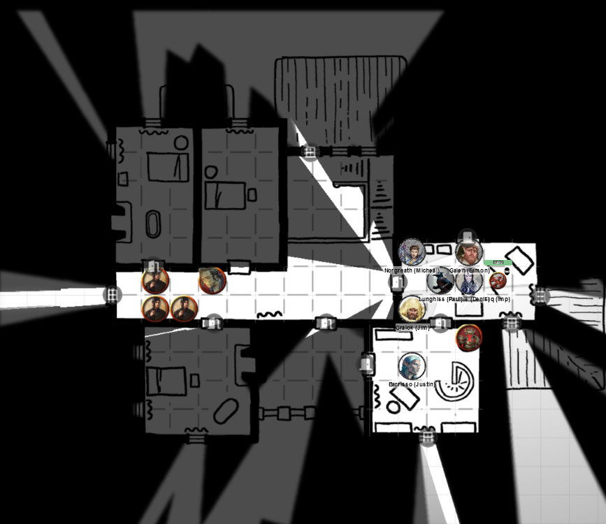
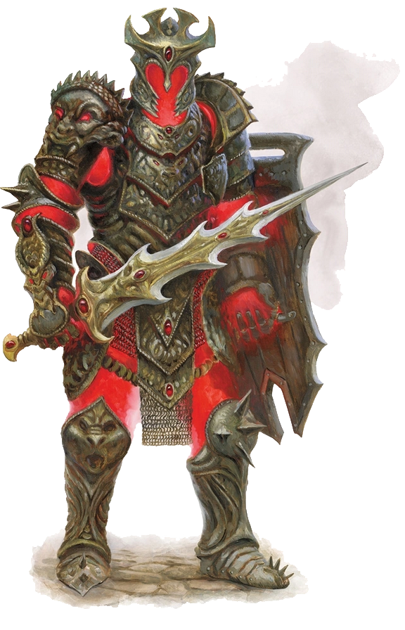

# 20	 Mar 2024

[**Previously**](2024-03-13.md): After killing Amrik Vanthampur at the Low Lantern tavern, we stormed the Villa Vanthampur where we suspect some of the remaining members of the family, slaying all its guards and a bunch of imps. The saturnine Thurstwell Vanthampur left the sanctuary of his quarters and offered to parlay. He has offered us the Elturian puzzlebox (and a few other things) in return for killing his mother Thalamra, who can be found in the dungeons below the villa. If we do not agree, he claims he can summon another ten imps instantly. We have to decide how to proceed.

- [X] Investigate scrolls found with Amrik
- [ ] Investigate the Elturian puzzlebox that Thurstwell stole from the family vault
- [ ] Investigate Thurstwell Vanthampur
- [ ] Investigate Thalamra Vanthampur

---

"Why can't your imps kill your mother?"

"She is protected from them."

Gralok decides to pre-empt any further discussion or strategy by attacking Thurstwell with his tail via Form Of The Beast. He does 11HP of damage.

Thurstwell falls dead! His consumptive air was not a ruse.

The guard in front of Gralok drops his weapon and immediately surrenders. The other two guards indicate they are ready to surrender. Only the imp seems ready to fight.

Karthis casts Fire Bolt at the imp. He hits, but unfortunately imps are immune to fire damage.

Galen attacks using Sacred Flame, but again imps are immune to fire damage anyway.

Taq (Norgreath's familiar) turns invisible - he tries to grapple the imp but fails.

Barrisso attacks the imp with rapier and scimitar, doing a total of 9HP of damage.

The imp goes invisible.

Lunghiss readies his shortbow, which he will fire if the imp reappears.

Norgreath binds the guard prisoners.

Gralok helps tying up the prisoners.

Karthis tries to detect the imp *(Perception)* but has no idea where it's gone.

---

Gralok enters the room where Thurstwell emerged from. It's a relatively plain and drab room compared to the rest of the house. There's a bed, a chest, an iron bathtub, a fireplace on the eastern wall, and on the far wall is a desk which is covered in knick-knacks: papers, books, and a cubic item.

Lunghiss doesn't find any traps. He tries to unpick the chest lock - with Inspiration, he succeeds.

Inside the chest is a jumble of stuff. There's a number of wrinkled but expensive garments. There's a set of red wax candles. A bundle of quills. A set of blank sheets of parchment. Several jars of ink, useful for scribing spells. An unlocked wooden coffer on top of a black-covered tome. And a mace.

In the coffer is 73GP, 120SP, and a Potion of Healing.

The black-covered tome has a title: *Apocalypto*. A poetic prophecy envisaging the end of the multiverse, which may be worth something - maybe 50GP.

On the desk is a letter:

???+ scroll "From Amrik to Thurstwell"

	It’s done. I’ve sent word to Vaaz. We’ll be rid of the oaf soon enough.
	I could use more of your divinations, though. My research using Elturgard’s
	armorial rolls suggest that the Majerus family were quite bountiful with their
	loins both during and after their service to the Companion. Given how many brats
	they seem to have had, they were probably rutting in their saddles. It’s likely they
	have any number of heirs in the refugee camps, so I think it’ll be well worth your
	time to cast forth your seventh eye or whatever and identify them for me.

	Amrik

Barrisso recalls a sergeant in the Order named Majerus.

The cube on the desk seems to be the puzzlebox - 6 inches to a side. It's composed of interlocking parts.

<figure markdown>
  { width="300" }
  <figcaption>Puzzlebox</figcaption>
</figure>

Lunghiss' theory *(Arcana check with Kenku Recall)* is that this item has been forged by devils and it is so intricate and arcane, it is notoriously difficult to open. Perhaps a master of arcana would know more.

Gralok, while looking under the bed, notices that at the fireplace there are some tiny ashy footprints on the hearth. We think this is the route for the imp in and out.

We search Thurstwell's corpse. He's wearing a fine hooded cloak with a white shirt, dark breeches, and short boots. Gralok attempts to stuff him up the chimney.

Back on the desk, there are other books that don't seem to be interesting. One other item is of interest: a draconic mask made of glazed bronze. The mask shimmers through the colour spectrum when viewed from various angles. Barrisso tries glancing through the mask, but the world seems the same.

We realise the mask resembles the colours of chromatic dragons. Karthis recalls something relating to this mask.
We previously found a dragon crown with an indentation that might fit this mask. Gralok realises there is an organisation, The Cult of the Dragon.

The Cult of the Dragon are strange: they believe in the supremacy of dragon-kind, and Tiamat as the ruler. They have tried to turn all dragons into dracoliches so they never die. Some rumours of the cult has them using masks of dragon-kinds that gives them special acolyte status. However, those masks have been specific colours, not combining all colours at once.

---

We leave the room and enter the one to the north-west. A more tasteful room: a bed, a claw-foot bathtub, a fireplace on the western wall. There's an iron-banded wooden chest. A large mirror is on the eastern wall.

The mirror's frame is carved with the images of rats, ravens, and spiders.

The chest is unlocked and contains clothing in blacks and silvers to fit a slender male. It could be Amrik's room.

A jewellery box carved from bone contains is a single gold signet ring bearing the motto *Stone Hearts Never Bleed*. Perhaps the family motto.

---

We enter the room to Amrik's room's west. It contains a wooden chest, a bed, and a night table. Inside the chest are some drab garments for a well-built man: perhaps Mortlock. There are some personal effects: seashells and a doll in the shape of a troll. Lunghiss takes them.

---

Across the corridor to the south is another room. It contains a dressing table with mirrors, and bottles of cosmetics. There's a folding wooden partition with a bird of prey in gold leaf. A tall black wardrobe with corsets and fine clothes. There's also three unlocked chests: one has shoes, another has three bridal gowns, and the third has seasonal hats.

On the dresser are six bottles of fine perfume (20GP each), a silver hairbrush inlaid with lapis lazuli (100GP), a wooden jewellery box with electrum filigree (75GP), containing a pearl necklace (250GP) and a cameo shaped like a tressym (50GP). 2 crystal vials don't smell of perfume - they are two Potions of Healing.

---

We leave and enter another room to its north. It looks like a study: it contains an oak writing desk, with a matching chair, and two black candlesticks. Around the room are three bookcases and a suit of black plate armour with longsword and shield. There's a wrought-iron staircase to the floor above.

<figure markdown>
  { width="400" }
  <figcaption>Villa Attack - Helmed Horror</figcaption>
</figure>

Suddenly, the suit of armour comes to life with a fiery orange glow and comes at Barrisso:

<figure markdown>
  { width="200" }
  <figcaption>Helmed Horror</figcaption>
</figure>

Lunghiss does a sneak attack (since he is the first attacking) and does a possible 21HP of damage (but he feels the creature takes less) along with 1HP of Booming Blade damage if it moves.

Karthis moves into the room and get an attack of opportunity from the armour (6HP of slashing damage). Karthis uses Witch Bolt, but misses.

Gralok attacks the suit of armour and hits, but like Lunghiss, he feels he doesn't do the full amount of damage.

Barrisso issues a Vow of Enmity to give him advantage on attacks. He then attacks with rapier and scimitar, but they both miss.

The suit of armour moves (activating Lunghiss' Booming Blade damage of a single HP). In fact, it seems to fly across the ground. It does a double attack at Gralok, doing 10HP of damage in total.

Galen casts Bless on Karthis, Barrisso, Gralok. As Galen moves away from the suit of armour, it gets an attack of opportunity but misses.

Norgreath casts Eldritch Blast with Agonizing Blast, doing 6HP of force damage and cold damage. The former is completely ineffective on the suit of armour.

---

Lunghiss sneak attacks but misses.

Karthis casts Fire Bolt and hits, doing 8HP of fire damage.

Gralok attacks with his greataxe but misses (even with Inspiration).

Barrisso casts Searing Smite as a bonus attack to add fire damage to his melee attack. His rapier hit then does 3HP of damage plus 2HP of fire damage.

The suit of armour double attacks Barrisso. The second attack hits, doing 9HP of slashing damage.

Galen casts Sacred Flame but the suit appears to take no damage.

Norgreath casts Witch Bolt, doing 13HP of lightning damage with 2HP of Genie's Wrath cold damage. The lumbering wall of metal is looking shaky.

---

Lunghiss with his silver dagger does a possible maximum of 11HP of damage, along with a possible 6HP from Booming Blade.

Karthis attempts Fire Bolt but misses.

Gralok readies an attack once he hears the suit.

Barrisso casts Searing Smite again, then attacks with his shortsword at the suit. With inspiration, he does 3HP of piercing damage and 5HP of fire damage.

The suit of armour moves - and triggers Lunghiss' Booming Blade damage. The 6HP of damage is enough to kill it!

---

In the room are bookcases containing around 200 books. We decide to take time for a short rest (if needed) and to check the books. We find 20 rare first edition books, each worth 25GP. The remaining 180 books are worth about 5GP each. We discover one book that looks worthless: *Last Charge of the Hellriders*. As we do, it flops open. A cavity is cut into the book. Out of the cavity falls a small iron keyring with two keys. [What are they for?](2024-03-27.md)

