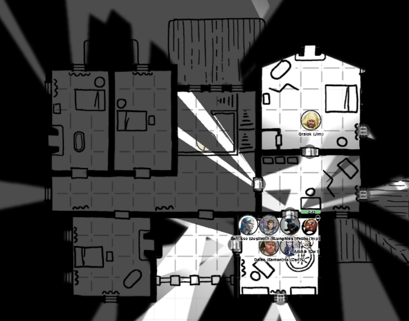
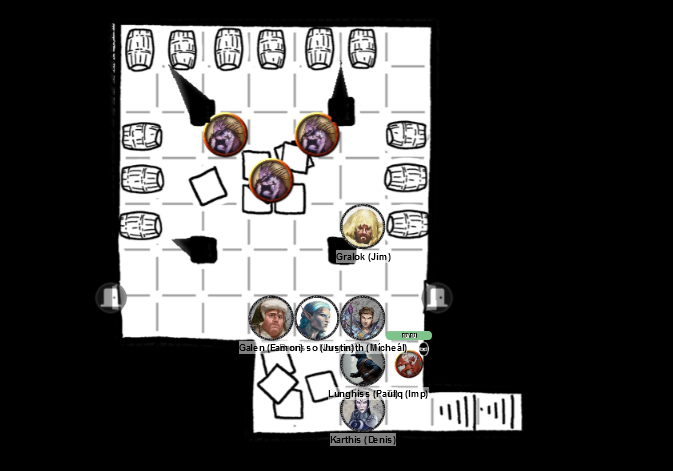
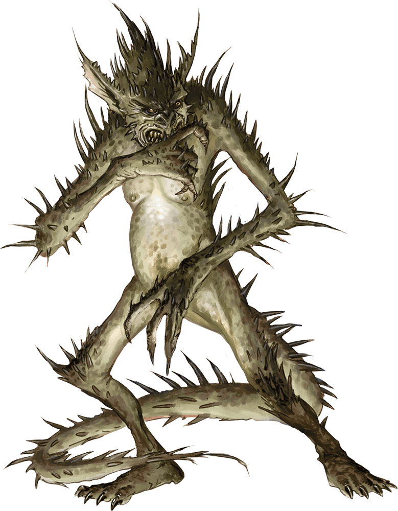

# 27 Mar 2024

[**Previously**](2024-03-20.md): We’re in the Vanthampur villa, where we encountered Thurstwell. He attempted to parlay, but Gralok used his tail to administer swift justice. We’ve searched the house and found quite a bit of loot, mostly illiquid assets. We found a draconic mask that seems to be linked to a dragon crown we previously found, and a letter from Amrik to Thurstwell about the Majerus family. As we searched, we were attacked by a Helmed Horror which we defeated. After that, we found a copy of *Charge of the Hellriders*, with a cavity in it containing an iron keyring with two keys.

- [X] Investigate Thurstwell Vanthampur
- [ ] Investigate the Elturian puzzlebox that Thurstwell stole from the family vault
- [ ] Investigate Thalamra Vanthampur
- [ ] Investigate the two iron keys we have found

---

We enter the final unsearched room on the first floor: a master bedroom. In the corner is the top end of the dumb-waiter we saw below. The room contains a cast iron bathtub, and a screen. It contains a chest with a padlock that resembles a scowling horned devil face.

<figure markdown>
  { width="400" }
  <figcaption>Villa Vanthampur - Master Bedroom</figcaption>
</figure>

Lunghiss checks the chest for traps, but fails to find any or indeed open the chest.

Gralok attacks the padlock with his greataxe and smashes it. Lunghiss looks inside and finds some thin black ledgers, along with several bags. One contains a set of calligrapher's supplies: quills, scrolls, and so on. Another bag contains a sheep's bladder pouch, containing 22PP, 85GP, and 113SP. There's also a set of panpipes. As Lunghiss removes bag 3, the bottom of the chest rises up and a cloud of poison gas fills the room. *(Those who fail take 11HP of poison damage)*. The party leaves the room, trying not to breathe, bringing the bags. Bag 3 contains a poisoner's kit.

After a while, the cloud of poison dissipates.

We examine the ledgers. They're in Infernal, which Norgreath can read, and they seem to be the legitimate business records of the Duke's dealings.

---

We return to the SE room and climb the spiral staircase there. It ends in a tiny square room with a peaked roof. An empty bookcase is to the west. Two filthy padlocks cages are on the floor. Each holds a gagged human prisoner (male and female) and a chamberpot.

We use the two keys found in the hollowed-out book earlier to open the cages. We release the prisoners and Norgreath talks to them.

The female prisoner says: "Can I leave?" We tell her we are the Flaming Fist, and that we plan to deal with the Duke later. "My name is Shaleen Zorax. The Duke's people caught me on the street and imprisoned me because I found out the Duke had rerouted the sewers to their bathhouse. I was working in the city offices. She has done similar work under this manor." We tell her we have already been to the bathhouse.  She says that the other prisoner was captured before her.

We turn to the male prisoner. His name is Kaejil Orunmar. Galen has noticed that imps often people sting people, and this man has been stung multiple times. Galen casts Cure Wounds on him. The man looks very grateful, but still traumatised.

"I'm a tax collector, and was trying to get dues from the Vanthampurs, and had sent messages to request payments. I was captured on my way to the High Halls. I've been here a few days, and just want to get out of here."

We send off the prisoners with a gold piece each.

---

We return to the ground floor, telling the innocents with us how to leave the grounds. Then we descend into the basement. It contains oil lanterns with green tinted glass at regular intervals. There a four pillars holding the ceiling. Barrels in the room have brass spigots. There's stacks of wooden crates.

Gralok approaches a barrel to take a drink. All hell breaks loose and three Spined Devils burst out of a crate:

<figure markdown>
  { width="400" }
  <figcaption>Villa Vanthampur - Spined Devils</figcaption>
</figure>

Karthis casts Witch Bolt at the nearest Spined Devil, but it misses.

A Spined Devil attacks with its tail, firing spines at Barrisso, doing 11HP of damage.

Galen attacks with his mace, but misses.

Barrisso moves in and attacks with his short sword and silver dagger. His shortsword hits, doing a small amount of damage.

Lunghiss attacks with his silver dagger, but misses, then retreats.

Norgreath uses Eldritch Blast with Agonizing Blast on the leading Spined Devil, doing 11HP of damage.

A foe tries to bite and use their trident fork on Galen, but misses.

Gralok attacks a Spined Devil to the rear, doing perhaps half of its 8HP of damage.

A wounded Spined Devil tries to fork and bite Barrisso. His fork connects with minor damage (2HP).

---

Karthis casts Witch Bolt, but misses.

A Spined Devil in front of Gralok attacks with his fork and bite, but misses.

Galen casts Sacred Flame but it does no damage.

Barrisso attacks, doing 3HP of damage from his shortsword.

Lunghiss attacks with his silver dagger, doing 16HP of damage (plus a possible 2HP from Booming Blade if they move).

Norgreath uses Eldritch Blast with Agonizing Blast, doing 9HP of damage and felling the devilish beast.

Galen is attacked by both fork and bite, losing 12HP of his 18HP total.

Gralok attacks with his greataxe, doing 4HP of damage, slaying his enemy. One remains.

Gralok does a second attack but misses.

---

Karthis attacks with his quarterstaff, doing 5HP of damage.

Galen attacks with his mace, doing 8HP of damage. He realises the mace he is using is magical (+1) against fiends (the Marble Mace), and he can call upon energy in the weapon to cause additional damage or heal himself. He does an extra 5HP to the Spined Devil.

Barrisso attacks with his silver dagger, doing 4HP of damage.

Lunghiss (using Inspiration) finishes off the remaining Spined Devil.

---

Gralok drinks from one of the barrels, and must cope with his heavy drinking *(Con save)*.

The crates contain food stuff, the barrels ales and water.

We exit a door to the east. It's a corridor leading to a sewer tunnel. As well as the expected smell, there's a smell of incense. Taq explores the tunnels.

In the meantime, Karthis explores a room to the west. It's full of racks of wine.

As we explore the sewer tunnels, we see a pair of creatures far west down one of the tunnels. Taq checks them out. They are human sized, wearing black robes and golden masks, and are each swinging a censer.

Taq explores a series of doors along that corridor, as the creatures retreat to the west. He finds double doors, with Infernal runes carved into it: *That Which Falls Can Rise Again*. He listens at it, and hear some noises: humanoid voices chanting in Infernal. Something about praising Zariel for her tireless efforts in waging what seems to be the "Blood War" and killing lots of demons.

Another door to the north reveals a room with trestle tables and candles.

A door to its left is a kitchen. Two working cast-iron stoves have piles of wood next to them. Shelves with dishes and utensils, spices and a preparation table.

We send Taq under the double doors with the Infernal runes. There are four humans kneeling - garbed similar to the pair walking the corridor - along with a large devil:

<figure markdown>
  { width="200" }
  <figcaption>Large Devil</figcaption>
</figure>

There's a statue which is a seven-foot tall angel with glowing eyes and a longsword. Tapestries on the wall depict nine different hellish landscapes.

We burst into the room.

Norgreath casts Eldritch Blast with Agonizing Blast at one of the humans, doing 7HP of damage.

Karthis casts Witch Bolt at the large devil, but it misses.

One of the kneeling humans gets up and draws a blade and rushes at Karthis but only reaches half way.

Barrisso attacks the human in front of Karthis; his rapier and shortsword make short work of him, and he falls.

Another kneeling human moves in front of Norgreath.

Lunghiss attacks that human, doing 15HP and killing it,

Gralok does Rage, then attacks with his greataxe but misses (even with Inspiration).

The large devil attacks with its clawed hands and hurls a bolt of flame at Gralok and another at Barrisso. Barrisso gets 9HP of fire damage. It says "Odious cannot let you live with this desecration!"

Galen attacks the human next to him with his mace, but misses.

That human tries to attack Galen with his scimitar, but misses.

Another human attacks Gralok with his scimitar; Gralok's tail does not reduce the damage, and he takes 3HP of damage.

---

Norgreath casts Eldritch Blast with Agonizing Blast at the devil, doing 6HP of damage.

Karthis casts Witch Bolt (at 2nd level) at the devil, doing 7HP of damage.

Barrisso attacks with his silver dagger but misses.

Lunghiss moves and attacks one of the humans: 14HP of damage finishes him off. One human, and the devil, remain.

Gralok attacks the devil with his greataxe; he does some of the possible 13HP of damage.

The large devil does three melee attacks: none connect with Gralok.

Galen attacks the remaining human, doing 3HP of bludgeoning damage.

The same human retaliates, but misses.

---

Norgreath casts Eldritch Blast with Agonizing Blast at the devi doing 6HP of damage.

Karthis' Witch Bolt does another 4HP of damage on the devil this round.

Barrisso uses Vow of Emnity to attack with advantage; his silver dagger does 5HP of damage which his shortsword misses. His Divine Smite does an extra 5HP of damage.

Lunghiss attacks the devil, but misses, then retreats.

Gralok attacks the human, doing 15HP of damage, killing him. Following up via Great Weapon Master, he does 3HP to the devil.

The large devil does three melee attacks on Barrisso: two connect, and Barrisso falls. The third gets Gralok, doing 2HP of damage.

Galen attacks the devil with his mace: with Inspiration, he hits, doing 8HP of damage.

---

Norgreath grabs Barrisso and administers a potion of healing on him (9HP of healing)

Karthis' Witch Bolt does another 8HP of lightning damage.

Barrisso stands up, healed. He then performs Lay On Hands, and gets an extra 15HP of healing back.

Lunghiss attacks but misses.

Gralok also misses.

The large devil attacks with two claws and a tail: all misses thanks to Gralok's tail.

Galen attacks with his mace, doing 7HP of damage.

---

Norgreath casts Eldritch Blast with Agonizing Blast at the devil, doing 6HP of damage.

Karthis' Witch Bolt does another 10HP of lightning damage.

Barrisso attacks with his advantage attack; his silver dagger connects for 3HP of damage.

Lunghiss does 11HP of damage with his silver dagger then retreats.

Gralok attacks with his greataxe, doing perhaps half of his 11HP of slashing damage.

The large devil attacks Gralok three times: all three connect, but he only takes half of the 16HP of damage administered since he is raging.

Galen attacks with his mace, but misses.

---

Norgreath casts Eldritch Blast with Agonizing Blast at the devil, but misses.

Karthis' Witch Bolt does 1HP of damage.

Barrisso attacks with his advantage attack: both his silver dagger and shortsword hit, doing 7HP in total.

Lunghiss attacks but misses.

Gralok attacks, doing maybe 5HP of damage - and the devil is dead.

The raging Gralok continues and attacks the statue, trying to knock it over. It doesn't budge. With a second shove, he topples the statue which shatters on the floor. It turns out that the [glow from the statue's eyes was a mace.....](2024-04-03.md)
