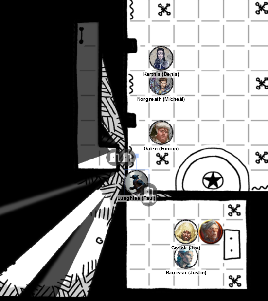
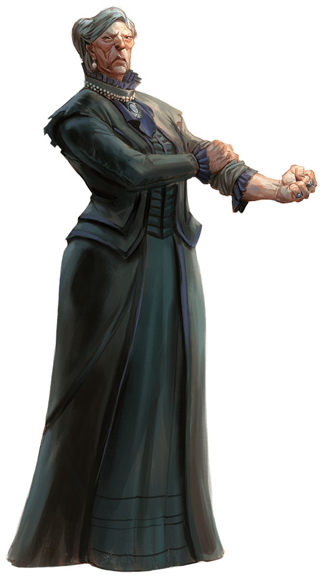
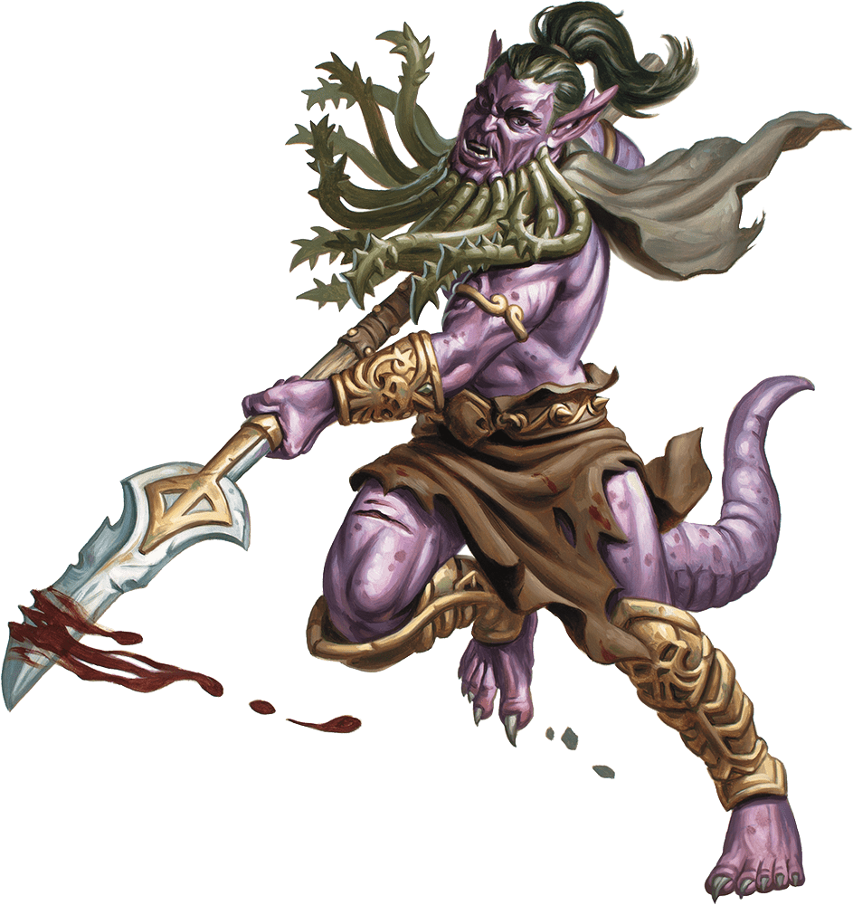
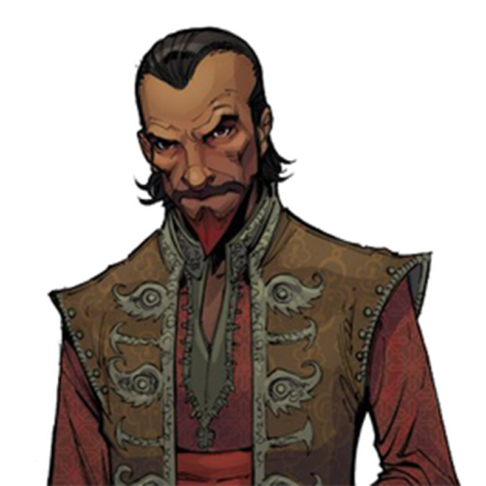
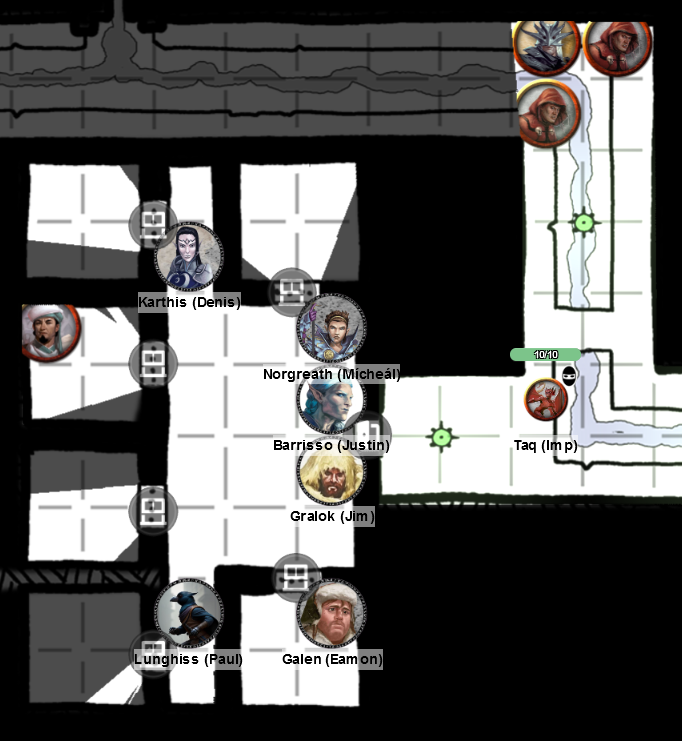

# 3 Apr 2024

**[Previously](2024-03-27.md):** We're in the Vanthampur villa. Having killed Thurstwell, and freed two prisoners of the family, we entered the basement where we think his mother, Duke Thalamra, can be found. After being ambushed by Spined Devils, we entered sewer tunnels linked to the basement and found a mysterious door with the text *That Which Falls Can Rise Again* above it. Beyond were humans wearing black robes and golden masks, and a large Barbed Devil. After defeating them, a raging Gralok breaks the seven-foot tall statue of an angel with glowing eyes and a longsword, to reveal what seems to be a magical mace.

- [X] Investigate the two iron keys we have found
- [ ] Investigate the Elturian puzzlebox that Thurstwell stole from the family vault
- [ ] Investigate Thalamra Vanthampur

---

The head of the mace is glowing with light. Gralok is quite wounded, and takes a potion of healing to get 6HP back. We spend 10 minutes resting, while Galen performs a Prayer of Healing. 

From a pearl necklace we acquired, we take the biggest pearl (100GP) and Karthis performs an Identify ritual on the mace. It's magical: +1 to damage and to hit for all attacks. Also, it gives the ability to the wielder (you do not have to attune) to extinguish its light as an action. The light is 5' radius, with dim light another 5' radius. Gralok takes this mace, as Galen already has a magical mace. 

We search the bodies in the room (only humans, as the devil has vanished). Each of the four humans wear golden devil face masks: no two masks are alike. Each are probably worth 25GP. 

We look at the nine tapestries in the room. They depict the nine layers of Hell. All seem different: some fiery, some cold, some rocky, some dark. Taq recognises Avernus. It has a winding river, with fireballs falling from the dark sky illuminating the landscape. Floating islands of rock hang in the air. 

Lunghiss searches the room; behind a tapestry to the south-west of the room, he finds a door. He checks the door for traps, then unlocks it with Thieves' Tools. It opens into a very short passage, with another door. Lunghiss peeks in. There's a corridor leading west, then north. At the end if a wooden ladder leading 15 feet up to a trapdoor. 

Lunghiss listens at the trapdoor. He hears someone repeatedly hitting metal - like a blacksmith. This is an escape route from the sewer to the blacksmiths we encountered at the gate to the villa.

---

At the south-west of the room, we find another door. Lunghiss unlocks it. Again, there is a short passage with another door. Lunghiss unlocks it.

There are two candelabras lighting the room. To the east, is an altar.

<figure markdown>
  { width="400" }
  <figcaption>Thalamra's Room</figcaption>
</figure>

There's a grey-haired woman, who sees Lunghiss. She is primed for action, and flings an Eldritch Blast at Lunghiss, hitting Lunghiss for 11HP of force damage. We presume this is the Duke, Thalamra Vanthampur.

<figure markdown>
  { width="200" }
  <figcaption>Thalamra Vanthampur</figcaption>
</figure>

Gralok takes a Elixir of Fortification, then rushes in to attack with his greataxe. As soon as he hits her, doing 7HP of damage, she engulfs him in hellish flames. He managed to take only half damage (7HP). 

Thalamra hits with her fists on Gralok, doing 4HP of damage, while shouting "HOW DARE YOU RUIN THE SANCITITY OF MY TEMPLE!!".

Barrisso hits her with his scimitar and rapier, doing a total of 20HP of damage.

Karthis notices the altar - a single block of obsidian with claw feet - bears a small angel-shaped flame. He fires a Fire Bolt at Thalamra, doing 5HP of fire damage.

Norgreath moves into the room and casts Eldritch Blast with Agonizing Blast. With Inspiration, he does 8HP of damage.

Galen moves inside the room and hits her with his mace, doing 2HP of bludgeoning damage. When Galen hits her, Thalamra takes a chance to look around and see where we all are.

Lunghiss hits her with his rapier, doing 8HP of damage (plus a possible extra 5HP with Booming Blade). She engulfs him in flame (Hellish Rebuke), doing 7HP of damage. Lunghiss leaves, with 3HP of damage.

---

Gralok hits her, doing 13HP of damage. In return, her Hellish Rebuke does him 11HP of damage.

Then, Thalamra moves - triggering the 5HP of Booming Blade damage. Galen gets an attack of opportunity, doing 3HP of bludgeoning damage. Gralok also get an attack of opportunity, doing 8HP of damage, felling her. As her body falls to the ground, she shouts "SEE YOU IN HELL!".

---

Her corpse bears a pearl necklace (worth about 500GP), and two pearl earrings worth 100GP each. She wears fine clothes. She has no weapons. She has also two keys in a pocket. Galen casts Cure Wounds on Lunghiss and Galen. Lunghiss takes a Potion of Fortification, getting temporary 8HP.

We search the room and find a hidden door on the southern wall. Lunghiss unlocks the opposing door, which opens up into a sewer. 

Lunghiss examines the altar, but there's nothing about the 9" tall angel-shaped flame that reminds him of anything. He tries to put it out with water from his water skin. He sees reddish runes around the flame. The runes are not the language Infernal, but are in the same script. 

Lunghiss *(Arcana check)* thinks the angel shape is being powered by these runes. Norgreath has seen something similar before, when a summoning occurred and someone had to draw a protective circle. Don't break the circle. Lunghiss makes an exact copy of the runes.

---

We leave the door to the south into the sewer passage, which runs east to west. We go east; here, a passage goes south as well. The sewer channel here slopes down slightly to a railing. 

We continue east - the passage goes south, then to a passage east and west - west to a unlocked door we haven't been through. Gralok opens the door. Beyond we see a broad-shouldered figure, with purple skin and a beard of writhing snakes, bearing a glaive. A number of doors lead off, and he bears a large ring of keys.

<figure markdown>
  { width="200" }
  <figcaption>"Snake Beard"</figcaption>
</figure>

Lunghiss moves in to attack, but misses and retreats.

Norgreath casts Eldritch Blast with Agonizing Blast, but misses.

Karthis casts Fire Bolt: it does minor damage, which the devil shrugs off.

"Snake Beard" moves to the door and shouts "THINK YOU FOOL THOSS? YOU FOOL NO ONE!".

Norgreath gets attacked by both his glaive and his beard. The glaive does 11HP of slashing damage. As soon as he hits, Norgreath feels the wound aching more than normal. 

Gralok uses his magical mace rather than the greataxe: with Inspiration, he does 7HP of damage. He then moves into the room.

Barrisso wields his silvered dagger and rapier, but both miss. He also moves into the room.

Galen casts Sacred Flame, but nothing happens.

---

Lunghiss hits, doing 13HP of damage, plus a possible 3HP extra with Booming Blade.

Norgreath takes extra damage from his still open wound. He uses Misty Step to move outside the room, then attempts to staunch the wound but fails.

Karthis casts Witch Bolt with Inspiration, doing 14HP of lightning damage.

"Snake Beard" attacks Barrisso with both beard and glaive, but both miss.

Gralok attacks him, doing 5HP of damage.

Barrisso attacks with silvered dagger and rapier. The rapier does 4HP of damage.

Galen casts Cure Wounds on Norgreath, getting 7HP of healing but also closing the wounds.

---

Lunghiss does 8HP of sneak attack damage to the devil - and a possible 8HP more with Booming Blade.

Norgreath casts Eldritch Blast with Agonizing Blast, but misses.

Karthis' Witch Bolt does a further 4HP of damage - and the devil dies, disappearing, but leaving his keyring behind, which clatters to the ground.

We check the six cells: two contain a human. One has a short man in his 50s wearing a kaftan, from somewhere to the South. We has dark hair and a goatee dyed crimson. 

"What did you do to annoy the Duke?"

"I tried to finagle my way into the service of the Duke, as my mistress **Sylvira Savikas** believed the Duke was secretly a devil-worshipper. She sent me to investigate. I pretended to be interested in the post of housekeeper. Unfortunately I was caught snooping through drawers, and was bundled into this cell. My mistress is a scholar of the Hells, but against worshippers of the Hells and their minions. She is based in Candlekeep. My name is **Falaster Fisk**.  

<figure markdown>
  { width="200" }
  <figcaption>Falaster Fisk</figcaption>
</figure>

We tell him about the altar with the angel-shaped flame. He doesn't really have much to offer, but thinks the runes power the flame.

He offers help; he has memorised the floor plan of this dungeon, including some secret places. He inquires have we found anything? We mention the puzzlebox, and he says his mistress would be quite interested to see it - and indeed, knows how to open it. We agree to meet her once we have wrapped up our current actions. He warns us about the patriar in the next cell.

She is an elderly lady, introducing herself as **Satiir Thione-Hhune**. Very well-dressed. 

"I have been detained here by the Vanthampurs long enough. Thank you for your assistance for freeing me. I wish to return to my own manor house." We tell her we need to recuperate first. She agrees under persuasion.

As this is a defensible position, we decide to take a long rest here.

---

After hour 3 (we get a short rest), there is some activity outside. Taq sees a group of six humanoids wearing black robes and golden masks approaching from the north.

<figure markdown>
  { width="400" }
  <figcaption>Jail Attack</figcaption>
</figure>

Taq enters the cells under the locked door (as a spider) and alerts Norgreath, Lunghiss and Galen. Norgreath, Karthis and Barrisso all hear something to their west - that is, something in the cells themselves. We wonder if it's an imp.

Outside the corridor, we hear a whispered conversation. They turn a key in the lock and open the door inwards. 

Gralok grabs the door and holds the door. 

Lunghiss readies a rapier attack with Booming Blade, to trigger if an enemy comes though the door.

A cultist tries to shove the door, but Gralok holds the door firmly.

Karthis readies a Fire Bolt, to trigger if an enemy comes though the door.

Taq stays under the door. 

Barrisso drinks his Potion of Dragon's Breath.

Another cultist tries to shove the door open, but Gralok resists.

Galen holds his action.

---

We come up with a plan: Gralok is to open the door, grapple an opponent, drag him into the room, and then someone closes the door. 

Lunghiss slams the door shut and holds it.

Karthis casts his readied Fire Bolt at the guy in the room, doing 5HP of damage.

Lunghiss holds the door against another shove.

Karthis casts Fire Bolt at the guy inside again, doing 18HP of fire damage.

Norgreath casts Eldritch Blast with Agonizing Blast, doing 13HP of damage. The guy falls.

Barrisso lets the door open again and grapples an enemy outside.

An enemy outside near the back throws a dart at Lunghiss, doing 4HP of piercing damage.

Galen moves to the door and uses Channel Divinity - Order's Demand to charm our opponents. Out of five opponents, three are affected, and drop their weapons.

Gralok grabs a guy at the front who is not charmed and drags him into the room. 

Lunghiss attacks the guy in the room, but misses.

[The battle continues...](2024-04-10.md)

