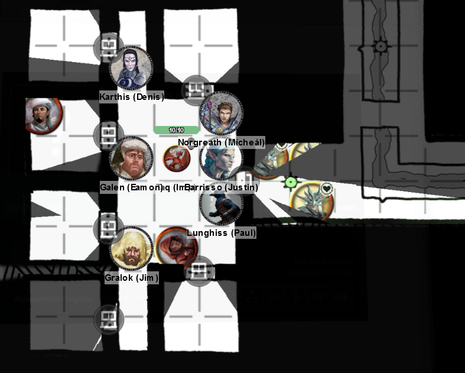

# 10 Apr 2024

**[Previously](2024-04-03.md):** We're in the Vanthampur villa. We entered the basement where we suspected his mother Duke Thalamra was, and defeated her. In the same room was a strange altar with an angel-shaped flame, seemingly being powered by a ring of runes. We ventured onwards, defeating a devil with purple skin and a snake beard, seemingly a guard of two prisoners. One is Falaster Fisk, servant of Sylvira Savikas of Candlekeep. She believes the duke to be a devil worshipper, and had sent Fisk to investigate. His mistress would be quite keen to see our puzzlebox. The second prisoner is an elderly woman named Satiir Thione-Hhune. We decided to take a long rest in the prison, hoping we could defend it easily. Unfortunately, we are discovered by six cultists. And possibly some invisible imps. We're now in the middle of battle, attempting to hold the door to the prison shut and taking in an enemy one at a time.

- [X] Investigate Thalamra Vanthampur
- [ ] Investigate the Elturian puzzlebox that Thurstwell stole from the family vault
- [ ] Investigate Satiir Thione-Hhune
- [ ] Investigate the basement and sewer tunnels under the Vanthampur villa
- [ ] Bring the Elturian puzzlebox to Sylvira Savikas of Candlekeep

---

The Vanthampur villa basement prison battle continues:

<figure markdown>
  { width="400" }
  <figcaption>Prison Battle</figcaption>
</figure>

A cultist casts Spiritual Weapon, then hits Gralok with it, doing 5HP of force damage. The same cultist does a blade attack on Gralok, but misses.

Karthis casts Fire Bolt at the same cultist, but misses.

Another (uncharmed) cultist comes around the corner and draws a weapon. Another two cultists comes around as well.

Norgreath casts Eldritch Blast with Agonizing Blast at the Spiritual Weapon cultist, doing 9HP of damage.

Barrisso attacks the same cultist, missing with both weapons.

An imp appears behind Lunghiss and stings him, doing 7HP of piercing damage plus 12HP of poison damage. Lunghiss is down.

A cultist moves through the jail door and attacks Norgreath, but misses.

Galen attacks with his mace, doing 5HP of bludgeoning damage to the cultist wielding the Spiritual Weapon.

A previously charmed cultist picks up his weapon, then moves in and attack Barrisso, but misses.

Another imp appears and stings Gralok for 5HP of damage, and 7HP of poison damage.

Gralok attacks a cultist with his greataxe, doing 5HP of damage.

---

The fallen Lunghiss rolls a death save, but fails.

Another imp has appears behind Karthis, and stings doing 4HP of damage plus 4HP of poison damage.

The Spiritual Weapon cultist attack with it against Barrisso, doing 2HP of damage. Then he attacks with his dagger against Gralok, doing 6HP of damage.

Karthis attacks the imp next to him with Shocking Grasp; with Inspiration, he does 6HP of damage.

Another cultist goes past Barrisso, who gets an attack of opportunity, doing 3HP of piercing damage. That cultist attacks Karthis with his scimitar, but misses.

Another (now uncharmed) cultist picks up his scimitar and enters the room. He passes Norgreath, who gets an unarmed melee attack of opportunity, doing 4HP of damage (including Genie's Wrath). That cultist misses.

Another (now uncharmed) cultist attacks Karthis with his scimitar, doing 6HP of damage.

Taq uses his sting on a damaged cultist; doing 5HP of damage, killing him.

Norgreath attacks the guy next to him with Eldritch Blast with Agonizing Blast, felling him with 14HP of damage.

Barrisso attacks the Spiritual Weapon cultist, doing 6HP of damage, following up with another 4HP of damage with his shortsword (using Inspiration).

An imp in the corner attacks Barrisso, doing 4HP of damage plus 12HP of poison damage.

A cultist inside the door attacks Barrisso, but misses.

Galen fells a cultist with his mace, then uses Healing Word to give Lunghiss 6HP of health back.

---

Lunghiss tries to pretend he is still down. A cultist is startled and leaps out of the way.

A cultist attacks Barrisso, doing 7HP of damage. Barrisso is down to 6HP.

The imp behind Gralok attacks, but misses.

Gralok misses, then Lunghiss.

The imp behind Karthis hits, doing 4HP of damage plus another 4HP of poison damage.

Karthis attacks the imp beside him with Shocking Grasp, killing him.

The cultist beside Karthis hits him for 2HP of damage.

The cultist outside the door attacks but misses.

Taq stings the cultist next to Karthis: he does 6HP of damage, then the poison damage finishes him.

Three cultists and two imps remain.

Norgreath casts Eldritch Blast with Agonizing Blast, felling a cultist.

Barrisso attacks an imp with his silver dagger, doing 4HP of damage. He follows up with his rapier, doing another 2HP of (half) damage. Barrisso performs a Misty Step to Karthis.

An imp stings Lunghiss, who is down again, with two levels of exhaustion.

Galen attacks a cultist with his mace, doing 6HP of damage.

---

The cultist attacks Gralok, but misses.

The imp behind Gralok attacks him, but misses.

Gralok attacks with his magic mace, finishing the cultist. He gets another attack, attacking an imp doing 5HP of damage.

Lunghiss succeeds in his death save.

Karthis casts Fire Bolt on the cultist. It misses, but he runs due to a morale check.

Taq chases the cultist but his attack misses.

Norgreath attacks an imp using Eldritch Blast with Agonizing Blast, doing 6Hp of damage.

Barrisso uses Lay on Hands with Lunghiss, doing 10HP of healing, the moves beside Karthis.

Galen attacks the imp but misses, even with Inspiration.

The imp attacks Galen, doing 6HP of damage.

Gralok attacks the imp: his 10HP of damage finish it.

Lunghiss chases the last cultist, but misses.

Karthis attacks him with a Fire Bolt, doing 1HP of damage.

The cultist lashes out at Taq with his scimitar, doing 3HP of damage. The cultist then tries to run. Taq gets an attack of opportunity, but misses.

Taq chases the cultist but misses.

Norgreath - who had performed Misty Step into a cell - now gets out again with Galen's help.

Barrisso double moves to within range of the fleeing cultist. Gralok also follows him.

Lunghiss gets within bow range of the fleeing cultist and takes him down.

---

We search the fallen cultists and get 83GP and 8 gold masks, each worth 25GP. Gralok sets down some caltrops as defence outside the prison. We put the dead cultists into the empty cells. Then we spike the main door.

Barrisso wonders if we can attune to the puzzle box. Falaster Fisk says - don't use it, it will hurt you! It will eat into your mind!

We take a short rest. During the hour rest, Karthis works out that the disk he has found can be use to send a message of up to 20 seconds telepathically to anyone he knows, anyone in this world. But only once.

We all get a long rest.

**Everyone goes up to Level 4**

---

Taq does a reconnaissance, starting with the western corridor outside the prison, then checking the eastern corridor, then the north. All are empty.

We go west in the corridor, then check a door to the south.

In this room are four large wooden tables. Each show marks where items were removed. At the south end of the room is a pedestal. On the wall, it looks like something once hung from a peg still there. On the floor, there is scattered coinage worth around 20GP. Barrisso casts Detect Magic, but detects nothing from the room. The strongest emanation of magic is from our puzzlebox.

We exit the room, and continue west along the corridor. Another door is to the north.

Opening it, we find a north-south corridor. We proceed north, then east. We listen to a door to the north but hear nothing. As an aside, the sewer seems to smell worse than when we arrived. We open the door.

In the room is a bed, some large candlesticks, a writing desk and chair, a small chair and table, and an iron chest. Two tapestries hang: one shows spirits rising from a river, another shows a dead man dangling from hooked chains.

Lunghiss opens the iron chest: inside is a silver pendant shaped like a right-handed gauntlet on the end of a silver chain. Galen recognises it as a holy symbol of Torm (worth 25GP). Many in the Hellriders worship Torm. The writing desk contains nothing.

[We continue to search...](2024-04-17.md)
