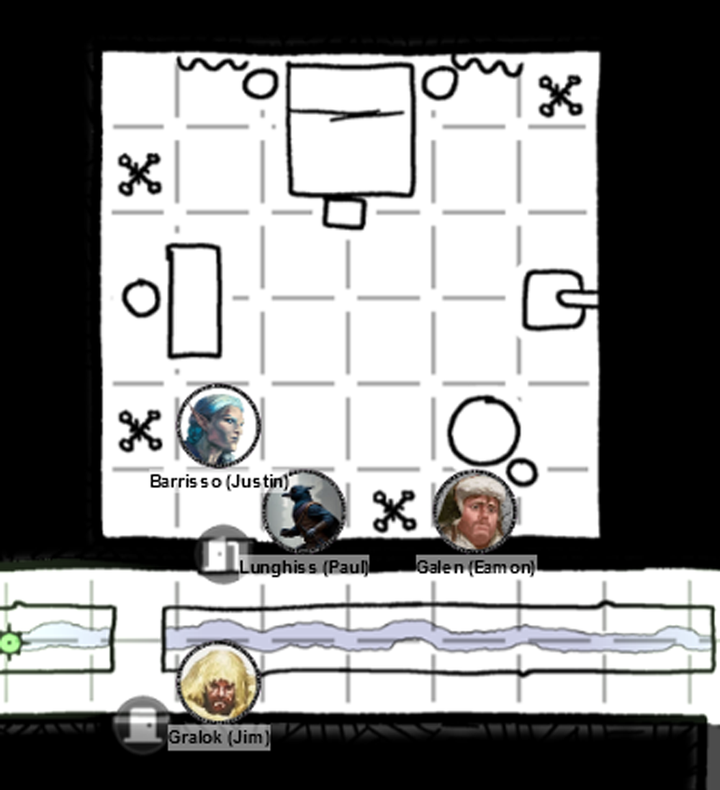
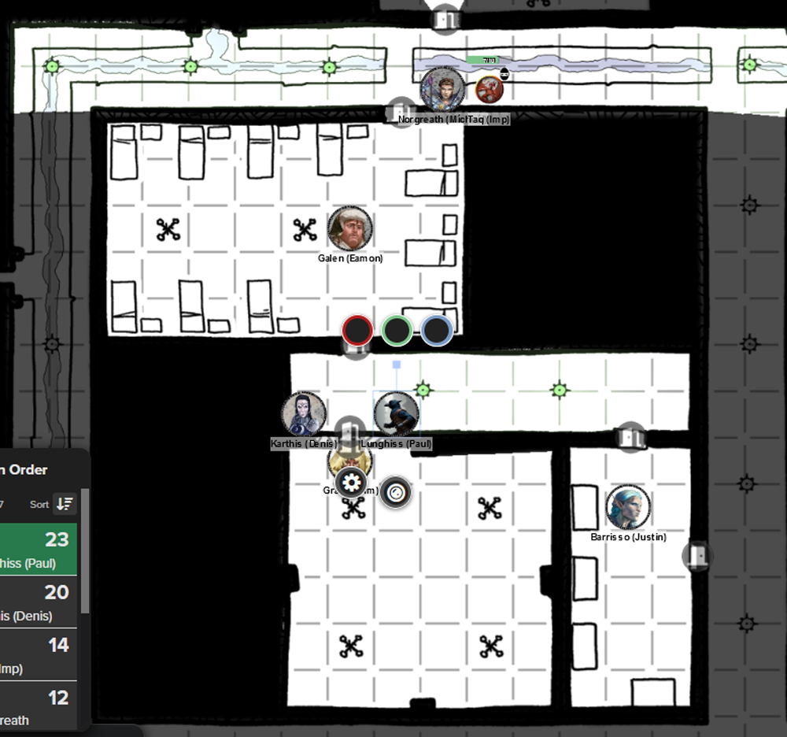
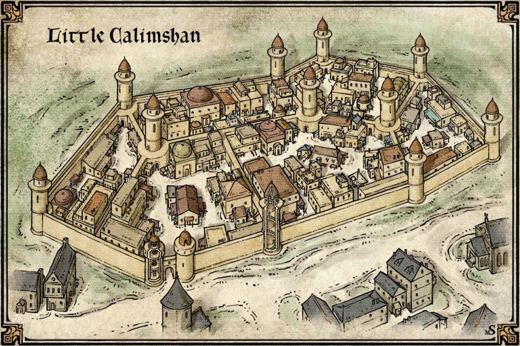
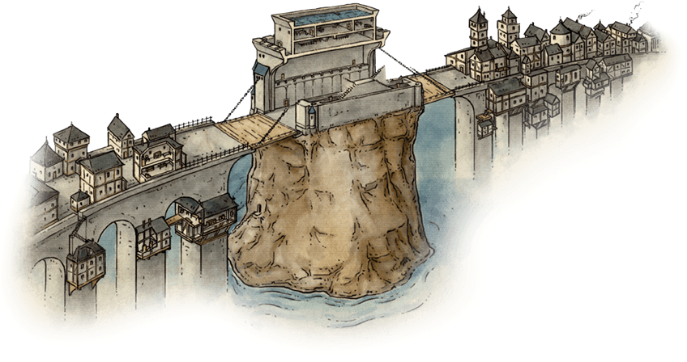
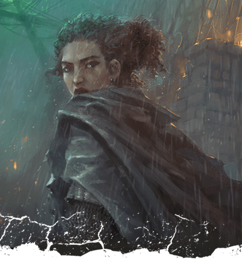
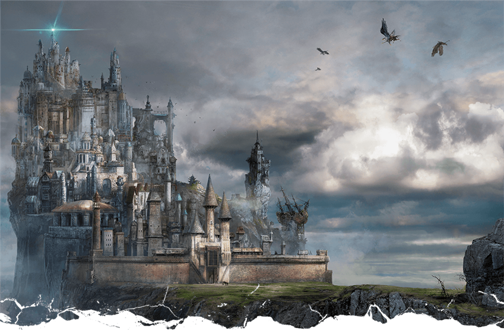
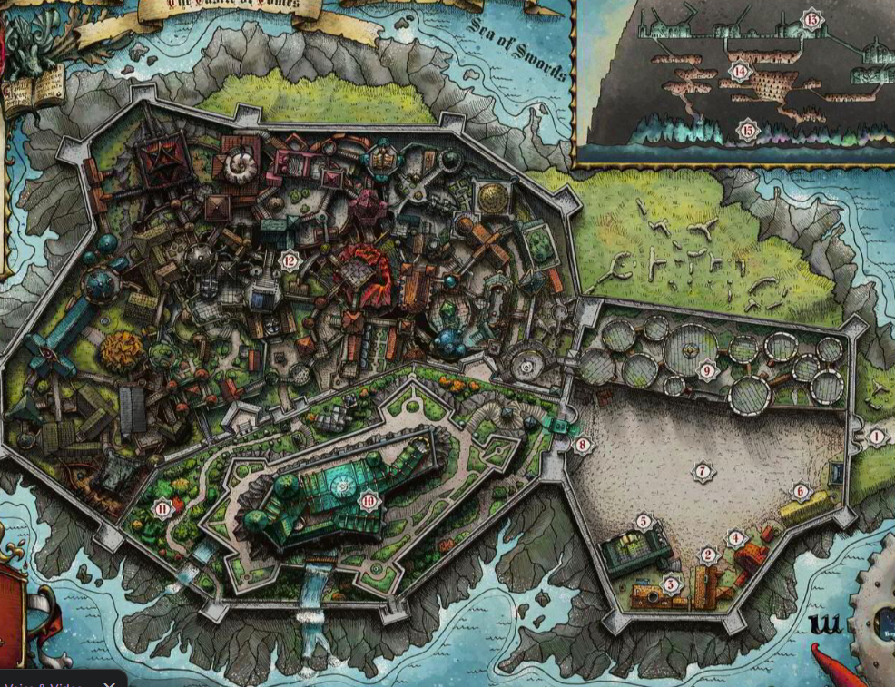
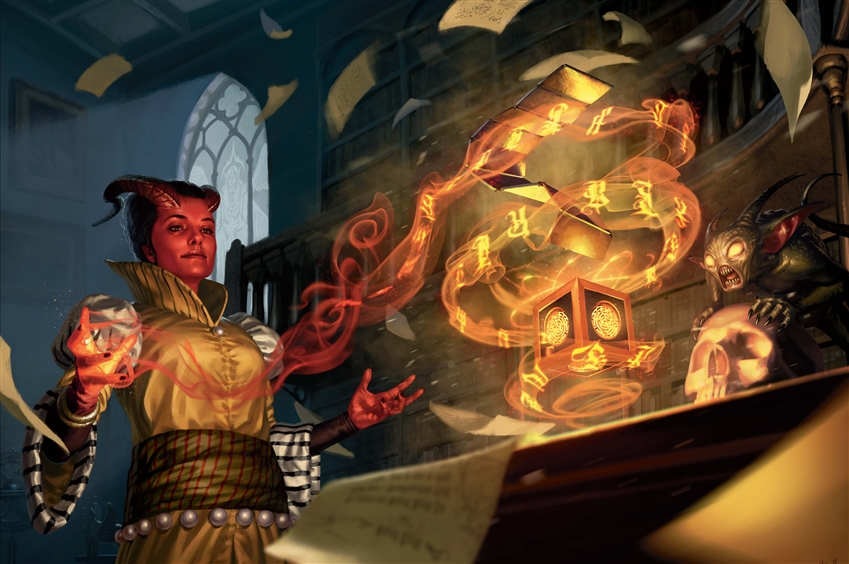

# 17 Apr 2024

**[Previously](2024-04-10.md):** We're in the basement and sewer tunnels area under the Vanthampur villa. Taking a long rest in a small prison, we were ambushed, and repelled an attack by six cultists. Afterwards, we left the two prisoners - Falaster Fisk, and Satiir Thione-Hhune - there for safekeeping while we scout the rest of the floor.

- [ ] Investigate the Elturian puzzlebox that Thurstwell stole from the family vault
- [ ] Investigate Satiir Thione-Hhune
- [ ] Investigate the basement and sewer tunnels under the Vanthampur villa
- [ ] Bring the Elturian puzzlebox to Sylvira Savikas of Candlekeep

---

We're still in the bedroom where we found a symbol of Torm:

<figure markdown>
  { width="400" }
  <figcaption>Torm Room</figcaption>
</figure>

We leave and enter a room to the south. It looks like a barracks, with a series of 10 bunk-beds. Two unlit candelabras are in the middle of the room. There are doors north and south. All bunk-beds have a locker next to them. Several of the bunks look dishevelled and the lockers have been thrown open. We find old clothing but nothing of value.

The door south leads to an east-west corridor. A door is on the south wall at its far east end.

In this room are a series of four wardrobes. Three on the west wall are empty. However, the one on the south contain robes and two gold masks (25GP each).

Lunghiss finds another hidden door in the corridor:

The room contains a plastered ceiling with winged devils, looking down at a circular disk in the middle of the room, with a nine-pointed star.

<figure markdown>
  { width="400" }
  <figcaption>Nine Point Star Room</figcaption>
</figure>

Karthis recognises the devils as Pit Fiends: very powerful devils, Dukes of Hell.

At this point, we feel we have explored the whole level. We collect the two prisoners, and leave by the secret exit through the blacksmiths. As we leave, we find some discarded coins near the hatch. As we leave, we find someone has fled with things we had intended to steal.

---

We free the staff of the villa who we'd tied up, and they flee the villa grounds. We then head back the way we came to the Fist, along the causeway to the Seatower of Balduran. At this point, Satiir Thione-Hhune wants to leave, and since we have no reason to hold her, we let her go. She asks the local watch to take her back to her house.

Falaster Fisk seems content to come along with us.

In the tower, we are given some hospitality, albeit brusque. Marshall Liara Portyr, the new head of the Flaming Fist, enters and asks everyone else to leave. She is fully armed and armoured.

"Back so soon?"

She asks who Falaster Fisk is. We tell her we rescued him from the villa, and tell her the full story up until now: killing the Vanthampurs, rescuing prisoners, temples to devils and so on. We think some people escaped from the villa, but we don't know what they escaped with. We also mention the puzzlebox.

"You've done really well. But if unknown people got away, you are in danger. There's going to be more political strife in the city. If Falaster thinks you should take this puzzlebox to Candlekeep, it might be a good idea to get out of Baldur's Gate for a while."

---

Before we leave for Candlekeep, we want to sell our loot and acquire more equipment if possible. We sell the gold masks, the holy symbol of Torm, the 180 books, nobles' clothes, for a total of 1,470 GP.

We spend 510GP on horses and equipment and another 20GP for rations for the journey. As we leave the stables, we see 100s of refugees from Elturel gathered around. Barrisso gives 10GP to help them.

As we head through the old city, there's a settlement with a wall around it. Falaster says "This is Little Calimshan."

<figure markdown>
  { width="400" }
  <figcaption>Little Calimshan</figcaption>
</figure>

This is essentially a ghetto for people from Calimshan. We assume Falaster is from there. We disappears into it, and returns with riding gear, his own horse, and a tome.

We head towards Candlekeep via Worm's Crossing:

<figure markdown>
  { width="400" }
  <figcaption>Worm's Crossing</figcaption>
</figure>

The crossing consists of two bridges, with Worm's Rock in the middle. Wooden drawbridges connect to the keep in the middle.

As we cross, Lunghiss senses he is about to be pick-pocketed. He sees a small child try to grab his rations. In Gralok's voice, he mimics "You've got to get better, kid." He then gives him some rations, and the kid runs off, confused.

We're now over the crossing and heading to Candlekeep. Periodically, we come across refugee camps, and merchant caravans pass us on the road. Baldur's Gate disappears behind us as we make our way down the coast way.

---

As darkness falls on the first night, we pass a group of refugees camped at the side of the road and further on, find a place to camp for the night. As we settle down, we hear someone coming along the road on horseback. Barrisso hails the rider, who is female. "I took you for refugees at first. Do you need assistance?" She says that since the Fall of Elturel, she has been helping refugees. She has dark skin, red hair, armour and a haunting gaze. "My name is **Reya Mantlemorn**."

<figure markdown>
  { width="300" }
  <figcaption>Reya Mantlemorn</figcaption>
</figure>

Barrisso introduces us, and says we are heading to Candlekeep. He asks her why she is so involved with helping the refugees. She says she's a Hellrider. We mention we were too, but have become part of the Flaming Fist, in order to find out more what happened to Elturel.

Reya offers to tell us the history of the Hellriders. Over a century past that the great troubles began near Elturel. Fiends roamed the land around the city. Fields despoiled, livestock slaughtered. The calvary of the High Rider - the leader of Elturel - fought them, but for every fiend they destroyed, two more appeared. The leader of Elturel prayed and a mighty angel arrived the next day. The angel found the Hellgate and said she would lead the calvary through it into Avernus, to destroy the forces of darkness there. The angel, riding a golden mastodon, rode through the gate with the High Rider's calvary. The angel was defeated and the remnants returned, hopeful that despite their defeat, the lords of Avernus would not attack again. The remnants of the High Rider's calvary were known from that day as the Hellriders.

We ask her about the Companion. It was summoned to help with another calamity. In summary: Elturel was beset by vampires, and the city beseeched the gods to grant aid. The Companion appeared over the city and its lights has held vampires at bay.

The long version: High Rider Klav Ikaia was the ruler of Elturel in 1444 DR when he was revealed to be a vampire lord. On the Night of the Red Coup, High Rider Ikaia and his vampires began a reign of terror which plagued the city for fourteen days. On the fourteenth night, the Companion — believed to be a gift from some unnamed god — appeared in the sky above Elturel as a second sun. Its light destroyed the vampires. High Watcher Naja Bellandi, who had led one of the major groups of resistance fighters, was hailed as a hero and became the first High Observer of Elturel. She was assassinated a couple years later and replaced by High Observer Cathasach Restat, who had been one of the founding members of the Order of the Companion.

---

The next morning we awake. Karthis has been copying into his spellbook. We discover the panpipes - which we found in the Duke's master bedroom - can be used to open locks within 15 feet - but can only be used eight times in total before the item is useless.

Rhea goes her own way, back toward Baldur's Gate, while we continue to Candlekeep. We pass the Cloak Wood, and a few days pass. Finally, we see Candlekeep in the distance:

<figure markdown>
  { width="400" }
  <figcaption>Candlekeep</figcaption>
</figure>

At the gatehouse, we are greeted by three monks, wearing symbols of Deneir.

"Welcome to Candlekeep. Please present a gift for inspection."

We take out the first edition books we have brought, but meanwhile Falaster says "It's OK" and shows the monks the tome he had retrieved. The monks study it, and the lit candle of their symbol seems to glow.

"This will be acceptable."

The gates open and we enter into an courtyard area called the Court of Air. To the north of the courtyard are a number of round towers of various widths.

<figure markdown>
  { width="400" }
  <figcaption>Candlekeep Overview</figcaption>
</figure>

To the south of the courtyard is The Hearth, a tavern, and next to it is the House of Rest, an inn. We are told to take our rest there.

Falaster says "Let's go to The Hearth and settle in, and then I'll see can we go and see my mistress Sylvira."

We enter The Hearth. There's a large firepit in the middle of the room, surrounded by tables. When we enter, a dozen people are around, some wearing purple robes who are presumably monks. One person is an ogre, wearing a silver circlet around his head, sitting in a corner with a big book, *The Sum of Theology*, studying it intently.

Falaster takes us up to the Emerald Gate that leads from the courtyard into Candlekeep. As we pass those in purple robes, they ask us for help. Falaster leads us through a maze of buildings to the main keep. It's full of bookcases and tables bearing specimen jars and various equipment. We are led into a chamber where there is a large 9-pointed star.

A tiefling in robes and a small fiend are there: the tiefling says she is delighted to see us. This must be Sylvira:

<figure markdown>
  { width="400" }
  <figcaption>Sylvira Savikas</figcaption>
</figure>

She introduces herself as Sage and Archmage of this tower, and Candlekeep in general. We introduce ourselves in turn, and tell us what has happened until now.

We show her the puzzlebox. She asks if we mind if she brings in her colleague, Traxigor. Traxigor is an otter, who scurries into the room in a red cassock. "What's new?" She gives our backstory. "They're brought something for us." She looks at the puzzlebox intently. "We should be able to open this, shouldn't we, Traxigor?"

She asks us do we know what a puzzlebox is for. We admit we don't, except the "Elturian puzzlebox" may contain "the secrets of Zariel".

"Zariel is known as one of the Lords of the Plains of the Nine Hells. She has been given dominion over Avernus. These puzzleboxes have been crafted by devils from infernal iron, like this one. I have opened several in the past. Their purpose is to safeguard their contents. Any lock can be picked but a puzzle entices you. The process of solving the puzzle that sealed this box can lure a person to bind themselves to the devil who created the box, cursing them for eternity. We wouldn't want that, would we?"

"I have spells and tools that will allow me to work on this. It will take me an hour."

---

Sylvira does her spellcasting, and we see the puzzlebox start to unravel, runes peeling off it. The inside of the box pops open, and a stack of nine metal plates, linked by dark chains and stamped with infernal runes, emerge.

Sylvira says "I can read it for you if you like".

*"Be it known to all that I, Thavius Kreeg, High Overseer of Elturel, have sworn to my master, Zariel, lord of Avernus, to keep the agreements contained in this oath.*

*I hereby submit to Zariel in all matters and for all time. I will place Her above all creatures, living and dead. I will obey Her all my days and beyond with fear and servility.*

*I recognize the dispensation of the device called the Solar Insidiator, hereafter called the Companion. In my capacity as High Overseer of Elturel and its vassal territories, I acknowledge that all lands falling under the light of the Companion are forfeit to Zariel. All persons bound by oath to defend Elturel are also considered forfeit. I further recognize that this dispensation will last fifty years, after which the Companion will return whence it came, taking Elturel and its oath-bound defenders with it, if that is Zariel's wish.*

*All this is my everlasting pledge."*

Sylvira reaches into the puzzlebox. Inside is a scroll. This scroll is a piece of one that was ripped in two. It holds a signature, written in blood - that of Thavius Kreeg. Sylvira says: "What do you know of Infernal contracts?"

"I have been suspicious of Kreeg for long time. But no one wanted to hear about the saviour of Elturel. My instincts told me he was a charlatan. These contracts are binding between mortals and devils. Normally when they are signed, there are identical copies on the same medium. These are then split, with the mortal keeping one half, and the devil the other. This contract can only be destroyed if both sides are brought together, and even then the wards on the contract make that difficult. An ancient dragon could burn it. Or a Wish spell. That would nullify the contract. But I don't know if that would restore Elturel."

"The only way to get the other half of the contract, is to go where it is: Avernus."

"Do you know what that contract is saying?" We ask her to elaborate. "The devils own the souls and the city. The city is not destroyed; it's in Hell. If we nullify the contract, we may be able to free the city."

"But how do we get to Avernus?"

"Ah!" says the otter. "I can do that!"

"How do we face a hoard of devils?"

"Yes!"

We ask if they have any help. They say they have been studying Elturel. They have some history that may help [guide our actions...](2024-04-24.md)

