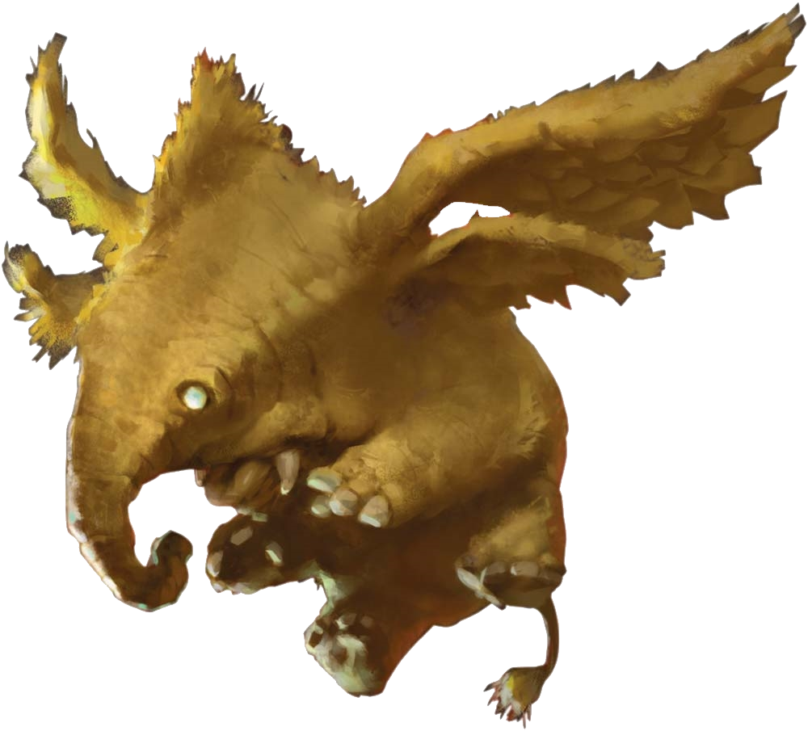
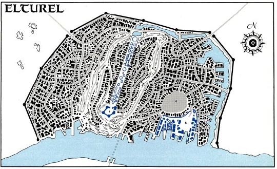
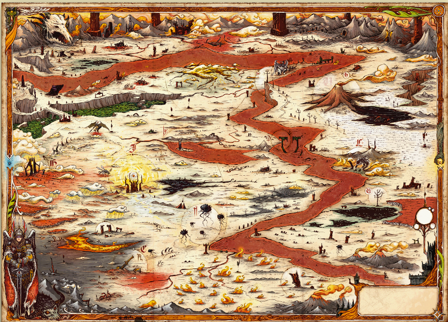
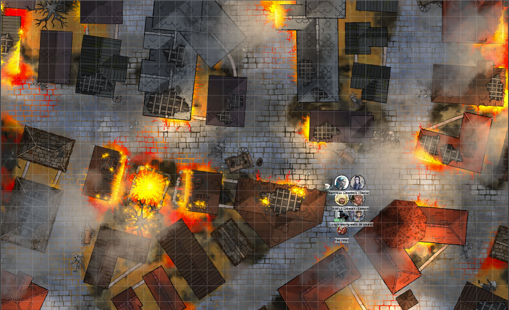

# 24 Apr 2024

**[Previously](2024-04-17.md):** After vanquishing the Vanthampurs, thoroughly searching their villa, and freeing their two prisoners, we returned with one - Falaster Fisk - to the Seatower of Balduran to meet Marshall Liara Portyr, head of the Flaming Fist. She advised us to go with him to his mistress, Sylvira Savikas of Candlekeep. Along the journey, we met Reya Mantlemorn, another Hellrider, who tells us about the history of the Hellriders and also of the Companion of Elturel. On reaching Candlekeep, Sylvira opens the puzzlebox, revealing runes that reveal that Thavius Kreeg, High Overseer of Elturel, made a pact with Zariel, lord of Avernus. Zariel had saved Elturel from a plague of vampires by giving them the Companion, a device also known as the Solar Insidiator. In return, after 50 years, the Companion returned to Avernus, bringing Elturel with it. The puzzlebox also contains half of an Infernal contract. If we can find the other half, we may be able to save Elturel.

- [X] Investigate the Elturian puzzlebox that Thurstwell stole from the family vault
- [X] Investigate Satiir Thione-Hhune
- [X] Investigate the basement and sewer tunnels under the Vanthampur villa
- [X] Bring the Elturian puzzlebox to Sylvira Savikas of Candlekeep
- [ ] Investigate Thavius Kreeg, High Overseer of Elturel
- [ ] Get to Avernus
- [ ] Find the other half of the Infernal contract between Kreeg and Zariel
- [ ] Free Elturel from Avernus

---

We realise that Thavius Kreeg is the "TK" who wrote some of the letters that we found. And possibly was in the Vanthampur villa and among those who escaped. When we mention Zariel from the letters, something flies into the room:

<figure markdown>
  { width="200" }
  <figcaption>Hollyphant</figcaption>
</figure>

"Zariel! That was the name of my angel!"

"Lulu, what do you mean?" says Sylvira.

"We were betrayed, but by who, I don't know."

"Are you saying Zariel went into hell to battle the devils?"

"She was my angel. She led the Hellriders into hell."

"And now she's leader of one of the layers of Hell?"

"IS SHE???"

Lulu is not happy.

"Sylvira and Traxigor have been kind to me."

"Were there any famous people in your party when you went to battle the demons?"

"I don't remember."

"Who was the leader of the Hellriders when they went into Hell?"

Lulu doesn't remember the name.

---

We spend a few days on research. In the meantime, we upgrade our weapons, silvering our primary weapons and arrows.

**Everyone goes up to level 5**

---

Traxigor (the magical otter) asks us to help him find a magical tuning fork, used to phase-shift to Avernus. We find a small clear glass bottle containing a dead sprite. It seems long dead. Barrisso does Detect Magic: none is detected. We ask Traxigor about it. "I.. I don't remember. You can have it if you like!"

Traxigor and Sylvira debate what they should tell us about.

"It's ... hot in Avernus. A lot of fire. And burning. But, you should be alright from that. However, things happen there in a different way to the Prime Material Plane. The PMP has rules which don't occur in Avernus. For example, distances seems different, as the plain of Avernus is infinite. It's all frankly diabolical. Some spells might act differently, such as Mage Hand - in Avernus, it looks like a claw. Watery things work less well: fiery things, better. The locals are immune to fire. The river Styx is dangerous - stay clear. Finding food is difficult, and if you do, you won't like it. There's no night or day. There the possibility you may change.. slightly. It's been known for some people's outlook to shift to match the native outlook. Sometimes, even their physical form changes. You should spend as little time as possible there. Healing is never as effective there as it would be on the PMP, but it can work."

We are also given a map of Elturel:

<figure markdown>
  { width="400" }
  <figcaption>Map of Elturel</figcaption>
</figure>

The whole city has been sucked into Avernus. The only way to save it is to nullify the contract, by bringing the two people together. This will hopefully also mean our souls are no longer doomed to Hell.

Lulu asked "Can I come? I remember the Avernian wastelands." We ask Lulu does she speak Infernal - at this moment, we realise she communicates with us telepathically.

Sylvira says "I heard about Lulu when she was telling tales of the Nine Hells, and I tracked her down and brought her here. I hoped to help her with her memory loss. I believe Lulu was at the Charge of the Hellriders. Lulu was Zariel's companion, and a Celestial. I think she can take care of herself."

We think we are ready to enter Avernus. Norgreath has the ability to create food and drink for us while in Avernus, but we will also take several days of rations.

Sylvira opens a scroll case and lays the contents out for us. "This is a representation of Avernus, mapped by a scholar from Candlekeep, whose sanity did not survive.

<figure markdown>
  { width="400" }
  <figcaption>Map of Avernus</figcaption>
</figure>

Sylvira thinks its up to us to figure out the places on the map once we get there.

---

We leave Candlekeep so that the spell can be cast to send us to Avernus. Traxigor asks us to gather in a circle around him. He gets out the magical tuning fork and starts his spell. A magical dome forms over us, and that dome collapses around us. Suddenly we see a different sky. It's hot and stinging. We seem to be in a city street of Elturel, with buildings collapsing and on fire:

<figure markdown>
  { width="400" }
  <figcaption>Elturel on Avernus</figcaption>
</figure>

The Companion hovers in the sky, dark. Traxigor looks up at it, nervously. The High Hall of Elturel is visible, south-west of us. To the east of us, there's a huge conflagration. There are dead bodies around. We hear a scream coming from around the corner. A woman along with two toddlers runs south towards us. They are fleeing from three Bearded Devils.

Karthis casts Ray of Frost, doing 12HP of damage.

Lunghiss attacks, but misses.

Barrisso dual-wields his sword sword and rapier, doing 10HP of damage in total.

Gralok attacks with his silvered great-axe, doing 12HP of damage. Gralok's second attack misses.

Norgreath attacks with Eldritch Blast with Agonizing Blast, doing 4HP of force damage and 3HP of Genie's Wrath (Cold) damage. His second attack misses.

Galen attacks, doing 7HP of damage.

A Bearded Devil attacks with both his glaive and his beard: Gralok and Barrisso. Gralok takes 12HP of damage, while Barrisso takes 6HP of damage.

The second Bearded Devil does an attack, both against Barrisso, but fortunately both miss.

The third Bearded Devil attacks Barrisso; the glaive hits for 11HP slashing damage.

[Our first battle in Hell continues....](2024-05-01.md)
