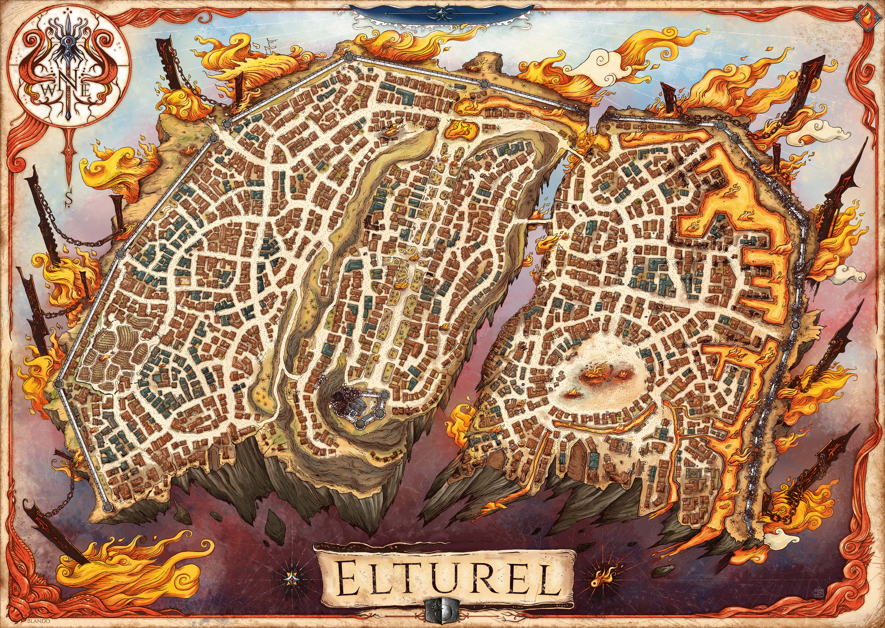
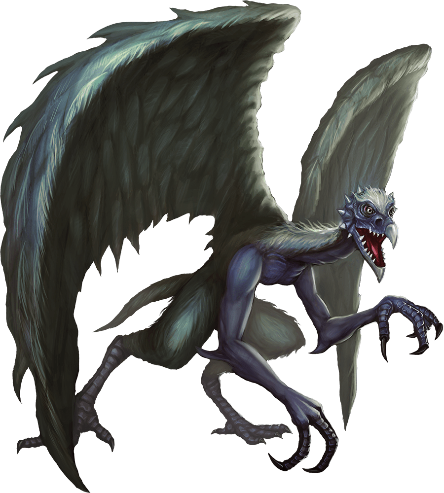
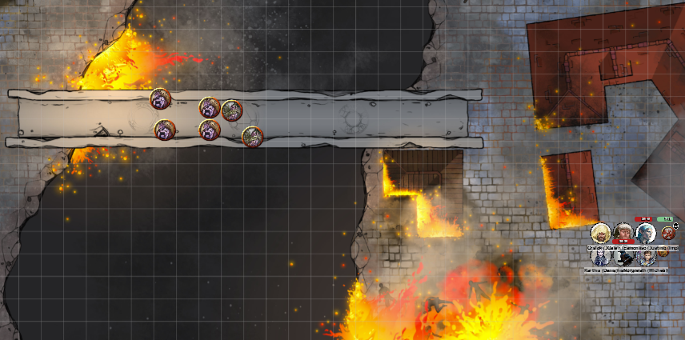

# 1 May 2024

**[Previously](2024-04-24.md):** We journeyed from Baldur's Gate to Candlekeep, where Sylvira Savikas opened the Elturian puzzlebox from the Vanthampurs' vault. Inside was half of an Infernal contract between Thavius Kreeg and Zariel, which resulted in Elturel being sent to Avernus. Traxigor of Candlekeep has phase-shifted us there, along with Lulu, a strange friendly creature that resembles a small golden flying elephant, who was once Zariel's companion. As we head to the The High Hall of Elturel, we end up in battle with three Bearded Devils to save a woman and her two infants.

- [X] Get to Avernus
- [ ] Investigate Thavius Kreeg, High Overseer of Elturel
- [ ] Find the other half of the Infernal contract between Kreeg and Zariel
- [ ] Free Elturel from Avernus

---

Karthis moves and casts Poison Spray at the devil north of Barrisso. "PUNY MORTAL"! he calls out, seemingly shrugging off the attack.

At that moment, the entire city lurches, as if in an earthquake. (DC 10 Dex save) Gralok falls prone to the ground. A building in the distance collapses.

Lunghiss attacks, doing 21HP of damage (with a possible 7 more)

Barrisso attacks with his rapier and shortsword, killing the guy to his north. His second attack targets the guy to his east, doing 16HP of damage.

Gralok stands up from his prone position, and attacks the guy to his north twice, doing 21HP of damage.

Norgreath casts Eldritch Blast (with Agonizing Blast) and Genie's Wrath, doing damage limited by the devil's cold resistance.

Galen attacks with his magic marble mace, but misses, even with Inspiration.

Lulu flies up beside Norgreath and says "Oh I think I can do this now!" and casts a Light spell.
Lunghiss notices that Traxigor is gazing at the black orb of the Companion in the air nervously, casts a spell and disappears.

The injured devil attacks Barrisso with his glaive and beard. His beard hits, doing 5HP of piercing damage. Barrisso fails to resist the effect of the attack's poison. (Con saving throw).

The second devil attacks Gralok similarly. The glaive hits, for 6HP of slashing damage: Gralok resists the bleeding effect (Con saving throw). The beard attack misses.

Karthis casts Toll the Dead on the the most injured devil.

Lunghiss hits the same devil: he's dead.

Barrisso double-hits the remaining devil, doing 13HP in total.

Gralok attacks the remaining devil twice, finishing him off.

Barrisso casts Lay on Hands on himself to neutralise the poison.

---

Galen casts Prayer of Healing. Fortunately it seems to take its full affect, even here in Avernus, and does 12HP of healing.

We talk to the woman. Her name is Harkina, and she thanks us for saving her. From her, we gather we are north-east of the docks. Around the circumference of the city, there are ... things that loom over the city walls.

"So many people have died since the city came here: the attacks by creature, no water, collapsing building. We had been hiding in a tavern, but the provisions ran out so we came searching. That's how the fiends found us.

"I think the city has been split in two. This side - the Eastern side - seems worse off than the West."

The things outside the walls, Harkina refers to as "the anchors" but she doesn't know what exactly they.

We give her and her children a day's rations. We offer to bring her to the High Hall, but say it may be dangerous. She looks nervous, but decides to follow us.

---

He find a nearby building and climb to its roof to survey the area.

<figure markdown>
  { width="600" }
  <figcaption>Current View of Elturel</figcaption>
</figure>

We can see that the city is split in two, with two bridges crossing the divide. The city is suspended above the plain of Hell by the "anchors" that we had previously seen.

We decide to head to the nearest bridge, the southernmost of the two.

---

As we travel west, sitting at the corner of a building is a creature which doesn't seem antagonistic.

<figure markdown>
  { width="200" }
  <figcaption>Winged Demon</figcaption>
</figure>

It speaks to us in Abyssal. Devils don't normally speak Abyssal, but demons do. It says:

"Are you looking forward to seeing the souls quenched en masse when the city reaches the waters below? I am!"

Now we realise the "earthquake" felt like the city sank slightly downwards.

"How long until the celebration?"

"Oh, it's hard to weigh souls, until we reach the river Styx."

One of the tales about the Styx is that it is a pathway through the Lower Planes. The Great Wheel philosophy says the plans are arranged on a great wheel - the good planes are the upper planes, and the evil plains are the lower planes. If no good people remain the city will fall into the Styx.

We ask if he know what happened to Avernus.

"Its fate has come."

We ask if the bridge is being protected.

"Probably. Devils don't like to see me around. I'm here on business, but not urgent."

"Any words of wisdom?"

"You are not from here and neither am I. You need to watch your back."

The demon doesn't seem to want to align with our intentions, so we say farewell.

---

We approach the rift that divides the city.

<figure markdown>
  { width="400" }
  <figcaption>Chasm Bridge</figcaption>
</figure>

The bridge is 20 feet wide and 100 feet long, spanning the chasm. The bridge has holy runes etched into the stonework, indicated it is blessed by the god Torm. There are six Infernal creatures on the bridge, scanning all directions. Two are Bearded Devils, four seem to be Spined Devils.

Karthis casts Shatter, centred in the middle of the demons, doing 21HP of damage to those who don't save (all but one save). We notice that the bridge itself takes some damage from the spell.

Barrisso casts Protection from Evil and Good on himself.

A Spined Devil does two ranged attacks with its tail spines, doing 15HP of damage to Karthis.

The second Spined Devil attacks Barrisso similarly: one hits, for 8HP of damage.

A third Spined Devil attacks Karthis; one hits for 9HP of damage. Karthis is now at 2HP.

The fourth Spined Devil attacks Barrisso, but misses.

Norgreath attacks a Spined Devil with Eldritch Blast (with Agonizing Blast) and Genie's Wrath, killing a devil. His second attack misses.

The two Bearded Devils rush towards us but stop at the end of the bridge.

Lulu goes and hides.

Gralok moves in front of the Bearded Devils, and uses Form of the Beast to rage. One greataxe attack hits for 5HP.

Galen moves and casts Sacred Flame at a Bearded Devil, but it saves.

Lunghiss casts Tasha’s Hideous Laughter but it fails. He thinks that the devils are resistant to these spells.

---

Karthis casts Witch Bolt at a Bearded Devil on the bridge; using Inspiration, he does 10HP of damage.

Barrisso moves up shoulder to shoulder with Gralok. His second rapier attack and shortsword hit, for 12HP of damage.

A Spined Devil fires his tail spines at Barrisso, but both miss.

The second Spined Devil does the same at Gralok; the second attack hits for 11HP of damage.

A third Spined Devil flies and lands on our side of the chasm, then does fork and bite attacks on Gralok, but both misses.

Norgreath casts Eldritch Blast (with Agonizing Blast) and Genie's Wrath twice at the northmost Bearded Devil, killing it.

The other Bearded Devil hits Gralok for 4HP of slashing damage; he also suffers an Infernal wound (Con save failed), suffering 5HP of damage at the start of each turn. His beard attack misses.

Gralok attacks for a total of 27 damage, but the Devil still stands.

Galen casts Toll the Dead on a Spined Devil, but it saves.

Lunghiss attacks the remaining Bearded Devil, finishing him.

---

Karthis casts Toll the Dead on the nearby Spined Devil, but it saves.

Barrisso attacks the Spined Devil with his rapier, doing 4HP of damage - his other attacks miss.

The Spined Devil flying north of the bridge attacks Lunghiss; he defends himself with a Shield spell.

Another Spined Devil lands south and fire spines at Galen, doing him a lot of damage.

Norgreath casts Eldritch Blast (with Agonizing Blast) and Genie's Wrath, killing a Spined Devil. His second attack wounds another Spined Devil.

Gralok climbs onto the bridge, then a building, to reach a flying Spined Devil, doing 17HP of damage, killing the devil. One remains. He backflips off the building as it collapses, gaining Inspiration.

Galen casts Toll the Dead, but misses.

Lunghiss fires a silvered arrow at the flying Spined Devil with his shortbow, doing 6HP of damage.

Karthis casts Ray of Frost, finishing the Spined Devil off. The bridge is now clear.

---

Galen starts casting Beacon of Hope, then Prayer of Healing to heal the party.

Suddenly another "earthquake" happens. Norgreath falls over, but picks himself up. Not far from us, a building collapses, and we hear cries from help from it. We rush to the building. The party uses their skills to find people to rescue. Three Shield Dwarves struggle free from the building, but as they do, a patrol of four devils arrive: three Spined Devils, and one a Merregon.

Lulu blows her trumpet at them; out of it comes a very loud, sparkly cone of effect. All of those creatures take some radiant damage. The three Spined Devils die instantly; the Merregon doesn't, but looks injured. Gralok attacks, then Lunghiss, finishing the Merregon off.

The three Shield Dwarves are two labourers and a mason; the latter is an acolyte of Moradin. She says she only has a single Cure Wounds spell left, which she catches on Karthis.

---

We wait for a few minutes until Galen's Prayer of Healing ends and takes effect. We give the Dwarves some healing as well, and they seem fully healing. They don't have armour but have weapons, and want to accompany us to the High Hall.

[We proceed to cross the bridge....](2024-05-08.md)

