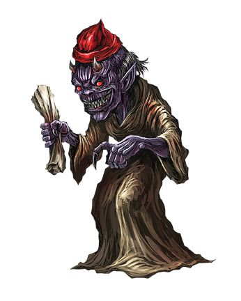
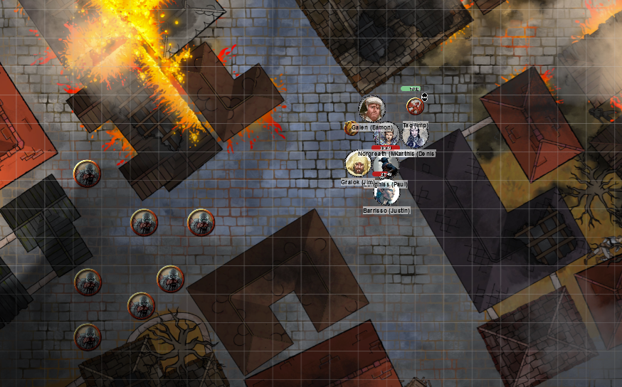
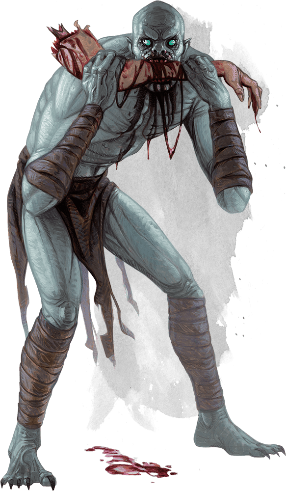
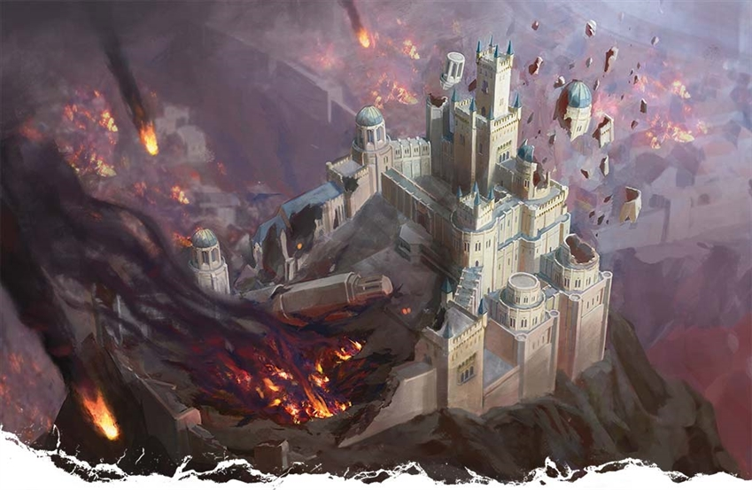
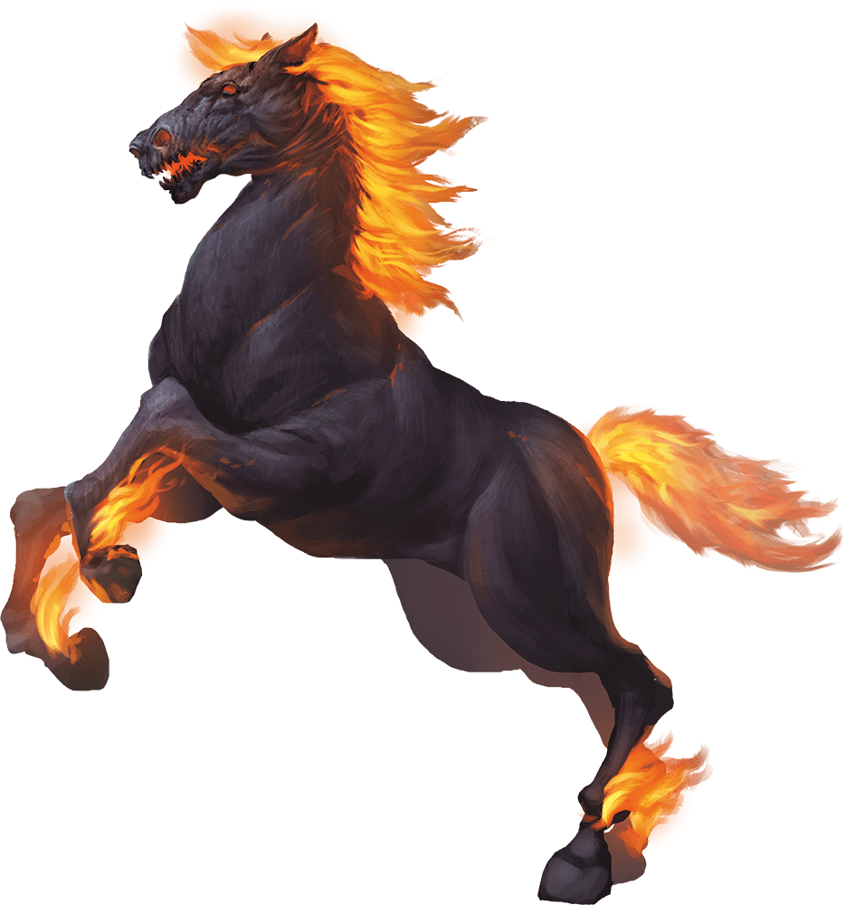
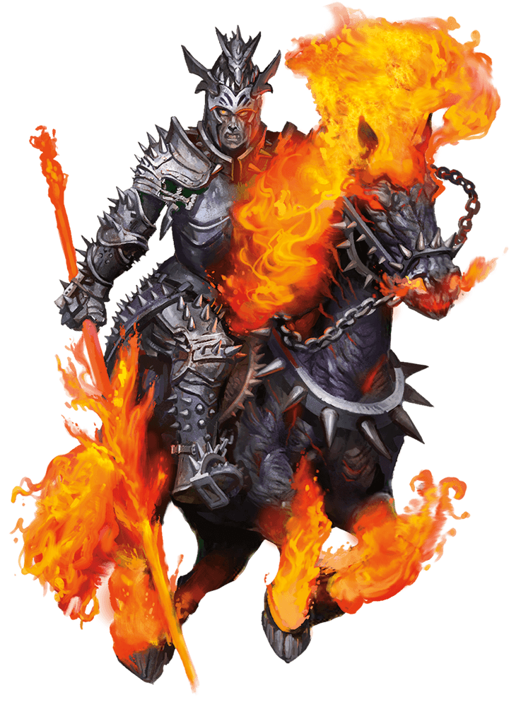
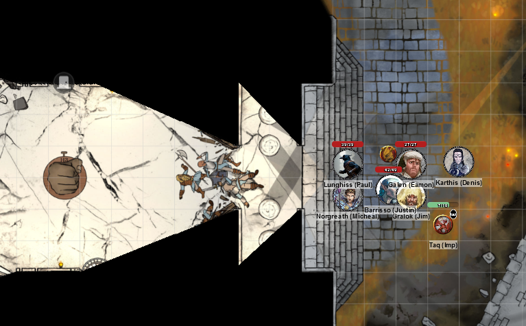
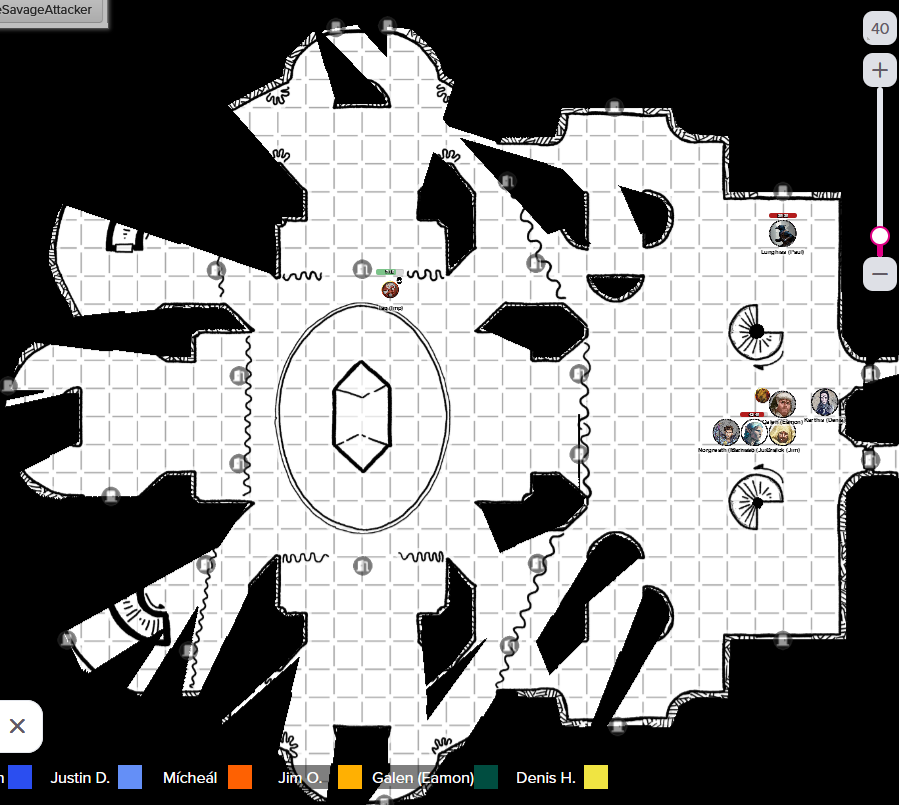
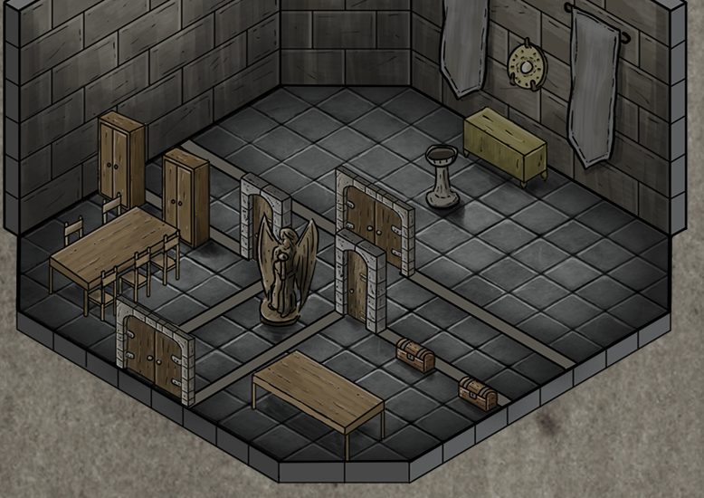

# 22 May 2024

**[Previously](2024-05-08.md):** In Elturel, currently floating above Avernus, we crossed a bridge going east to west, discovering that runes of Torm on it can be activated, offering it as a defensive position. We investigated an apothecary, where a young girl with magical powers named Lysandra asked her to help rescue her father from bearded devils in a house in the south of the city. We infiltrated the house in magical disguise, finding fifteen humanoids penned in. After defeating the devils inside the house, another band of them arrive. But, still in our magical disguise, we fool them, and leave with the captives. Lysandra tells us that the High Rider Klav Ikaia, a vampire, is back, hiding in a temple. The Hell Riders who died here have risen as Hell Knights, who are scouring the city for other Hell Riders to slay and turn into followers of Zariel. We leave the civilians we have rescued with rations at a secure defensible house and continue on our way.

- [ ] Make our way to the High Hall of Elturel
- [ ] Find the Duke of Baldur's Gate, possibly at the High Hall
- [ ] Investigate Thavius Kreeg, High Overseer of Elturel
- [ ] Investigate the vampire High Rider Klav Ikaia
- [ ] Find the other half of the Infernal contract between Kreeg and Zariel
- [ ] Free Elturel from Avernus

---

As some of the party are injured, we decided to take a short rest back at the apothecary we previously found. It contains an unbroken cask, while everything else is smashed. Barrisso performs Detect Magic: he senses nothing. At this point, he takes a short rest.

Lunghiss checks the cask. It seems superficially damaged from glass exploding, but it seems intact. He opens the top of the cask. Inside is a slightly viscous liquid. It's not recognisable. It smells slightly sulphurous. We think *(party Perception check)* it's a cask of alchemist's fire. This might not be good against devils and demons, but it may be good against vampires...

---

We leave the apothecary and head towards the High Hall, ducking between buildings and keeping cover. On the way, we overhear a conversation between a male halfling and an unknown type of devil. The devil is offering the halfling (we find out named Pilster) a quill, to write on a piece of paper he holds, making some kind of bargain.

<figure markdown>
  { width="200" }
  <figcaption>Perchillux</figcaption>
</figure>

We shout out "HOLD". Gralok grabs the paper but has an uneasy feeling that it has an affinity to the skin of the halfling.

Perchillux says "Hey, this isn't your business. We're doing a legal contract."

Gralok reads the contract. The halfling says "I could do with a second opinion."

The contract says that Pilster's soul is the price for the contract. It would also condemn the souls of his entire family, but that is not as clear.

Pilster is shocked. "He told me the only soul would be mine!".

Perchillux grabs the agreement, and Gralok punches him in the face.

Gralok tries to knock the devil over but fails. He tries again: Perchillux jumps nimbly away.

Barrisso attacks with his rapier twice, and shortsword once. One rapier hits for 4HP of piercing damage.

Galen attacks with his marble mace, doing 3HP of damage. He expends some of its energy which adds another 1HP of damage. Galen feels the mace improve, and realises his mace is now a +1 mace, but +2 against devils.

Karthis casts Toll the Dead, doing 9HP of damage.

Perchillux has long bony fingers, with nails resembling quills. He flicks one at Gralok, shooting a black substance at him. Gralok dodges the "ink". Where it hits, it leaves a sigil of infernal nature which dissipates. Perchillux himself then disappears. If invisible, we can attempt to attack him *(with disadvantage)*. Galen *(Religion check)* thinks the sigil is related to an archdevil named Dispater.

Lunghiss moves in and attacks where he thinks the devil might be (with disadvantage) but misses.

Norgreath twice attempts an Eldritch Blast (with Agonizing Blast) but misses.

---

Gralok attacks with his mace twice; the second attempt is a hit which connects, doing 8HP of damage.

Barrisso attacks with his rapier - he does 4HP of piercing damage. His second attack also hits, doing 6HP of damage. His shortsword misses.

Galen attacks with his marble mace but misses.

Karthis casts Ray of Frost, but misses.

Pilster is freaked out by the goings on.

Lunghiss attacks, but misses.

Norgreath realises the devil is not here anymore. The halfling however is very cheery he's gone.

"It came upon me and seems to know I was starving. How can we get out of here?" He mentions his wife, Merrywile, who is in a building nearby with his wife. We leave him with some rations, and continue on to the High Hall.

---

As we continue on our journey, we are attacked by a pack of ghouls:

<figure markdown>
  { width="400" }
  <figcaption>Ghoul Pack Attack</figcaption>
</figure>

The ghoul at the very front (the leader?) is wearing equipment of his former life: studded leather armour, a backpack, and a belt with a pouch.

Gralok uses Form of the Beast and uses claws to attack: three hit, doing 23HP of slashing damage. The first ghoul is down; six are left.

A ghoul attacks Gralok:

<figure markdown>
  { width="200" }
  <figcaption>Ghoul</figcaption>
</figure>

But it misses.

Norgreath uses Eldritch Blast (with Agonizing Blast and Genie's Wrath), hitting twice for 26HP. A second ghoul is down.

Barrisso attacks with rapier and shortsword, doing 13HP of piercing damage.

Another ghoul attacks but misses.

Karthis casts Fire Bolt at the ghoul that Barrisso damaged, finishing it. Four ghouls remain.

A ghoul claws Gralok, but misses.

Galen attacks a ghoul with his marble mace, but misses.

Lunghiss does a Booming Blade sneak attack with Savage Attacker, doing 23HP of damage. Another ghoul is down.

A ghoul claws Gralok, doing 4HP of damage, but a Con save means he is not paralysed.

Another ghoul bites Gralok, doing 3HP of piercing damage.

---

Gralok attacks the ghoul to his west. His 24HP of damage kill it. Two ghouls remain. He gets another attack to the ghoul to his south, doing 7HP of damage.

Norgreath uses Eldritch Blast (with Agonizing Blast and Genie's Wrath); his first attack hits, doing 10HP of damage.

Barrisso attacks, but misses.

A ghoul retaliates, but misses.

Karthis attacks the same ghoul with a Fire Bolt: the 17HP of fire damage kill it. One ghoul remains.

Galen attacks with his marble mace but misses.

Lunghiss attacks it with Booming Blade sneak attack with Savage Attacker and does 28HP damage; it's dead.

---

The leader of the ghouls seems to have magical studded armour. The pouch contains a potion, with a Common label "INVIS", which Lunghiss takes. Its backpack is an explorer's pack. Norgreath takes the armour and puts it on.

---

We finally arrive at the High Hall:

<figure markdown>
  { width="400" }
  <figcaption>High Hall</figcaption>
</figure>

Only some of its watchtowers stand, and its gates are shattered. One side of the castle is rubble, and surviving buildings are blackened with soot. In the centre of the ground, the High Hall cathedral still stands, apart from some of its towers floating in the air, with no support.

Taq the imp familiar is sent into High Hall to reconnoitre. It approaches the entrance to the cathedral, seeming bodies everywhere. It searches the various towers nearby. While it looks around, a creature rides up the hill towards us on the outside of the hall. Galen recognises the steed as being a hellish horse known as a *nightmare*.

<figure markdown>
  { width="400" }
  <figcaption>Nightmare</figcaption>
</figure>

Galen recalls that the riders are *night hags*, and can steal souls. However, this rider is not a night hag, but looks heavily armoured:

<figure markdown>
  { width="200" }
  <figcaption>Narzugon</figcaption>
</figure>

As soon as Lulu sees it, she says "We should hide! This thing is very powerful." The party tries to sneaks away and hides. We find a building and pile into it. We find ourselves in a simple, damaged two storey house. There are no creatures living or dead. In the front room, we notice some of the furniture is sitting on a chest, made of grey wood with a tarnished bronze latch with no lock.

We can't hear any hoof noises outside. Taq, who is a creature of this plane, recognises the rider as a *narzugon*. Eventually, the rider spots something in the distance and heads away from us in pursuit of it.

Lunghiss checks the chest and opens it: inside is a set of antique silverware, worth 240GP.

---

We move out and head towards the cathedral entrance:

<figure markdown>
  { width="400" }
  <figcaption>Cathedral Entrance</figcaption>
</figure>

The archway leads to a long hall containing eight columns, north and south. Some of them represent Torm. It looks like the infernal magic of Avernus was warped some of them to resemble a female devil wielding a sword. Two doors leading into the inner sanctum are broken open and the guards lie dead in the doorways, eviscerated.

We enter into a huge grand foyer area, with pillars north and south, carved with scenes from Torm's life. Two stairwells lead upwards. Huge curtains separate the foyer from the temple proper. Some of the curtains are shredded. Through the holes, we can see the high altar to the west, taking the shape of a gauntleted hand. A lever is next to the fist.

<figure markdown>
  { width="400" }
  <figcaption>Cathedral Interior</figcaption>
</figure>

In the interior, we see not just human bodies, but those of infernal creatures.

To the west are stairwells, choked with rubbles as sections above were destroyed: perhaps to the hovering towers we say earlier.

As Taq passes a westerly altar, he notices it has been desecrated with entrails tied together into a form. Barrisso patrols the area, performing Detect Magic. Near the altar, he finds a human body among other bodies with its eyes open and seems to be alive.

He sits up. "Thank the gods! You're not devils, are you?" It's a man of about 50, steadying himself with an oaken staff. "Have you come to save us?" "Who are you?"

"I'm Seltern Obranch. I follow Silvanus." "You're a druid?" "Yes." "What brings you here?" "This temple was the High Hall of Elturel."

He tells us of the chaos after the Companion changed. Fiends descended on the city and taking people at random, searching for Hellriders. As he was neither of those, he was able to use his abilities to hide. People gathered at the cathedral to help. He thinks the fiends have retreated to the catacombs. He saw that once Hellriders were killed, they become Hell Knights. The catacombs have secret entrances.

Barrisso decides to pull the lever beside the fist altar; this flattens the panel. Galen searches and find a panel, with an entrance leading down.

Barrisso also checks the desecrated altar, cleaning it as best he can. Barrisso senses Torm's power cleansing the altar. At the same time, Barrisso is cured of his current wounds.

In the meantime, Taq reports that one of the towers floating above the high hall has had its floors completely collapse leaving a hollow shell, [while the other looks like this:](2024-06-05.md)

<figure markdown>
  { width="400" }
  <figcaption>Cathedral Tower</figcaption>
</figure>
