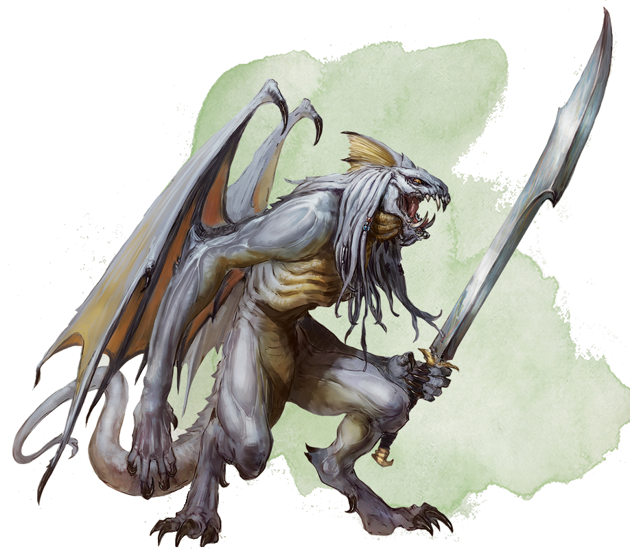
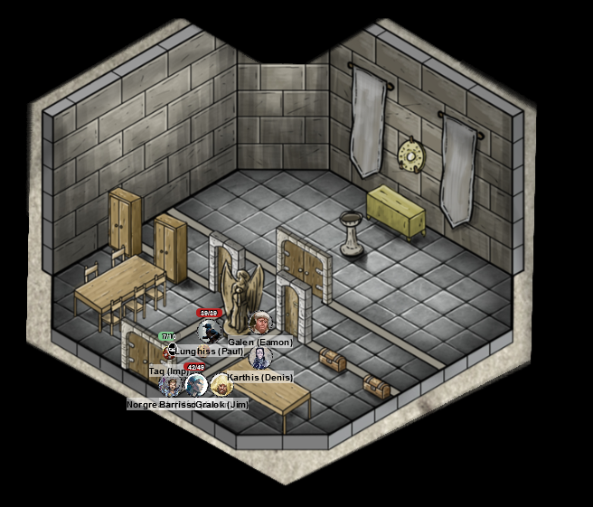
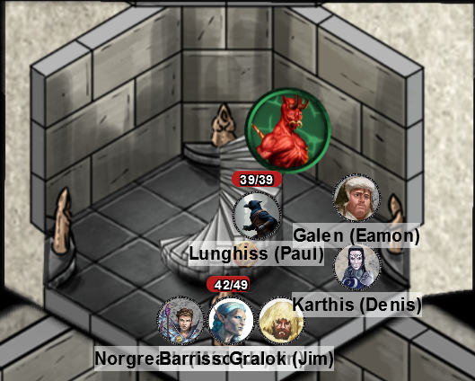
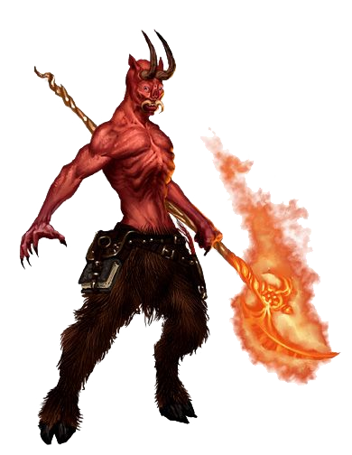
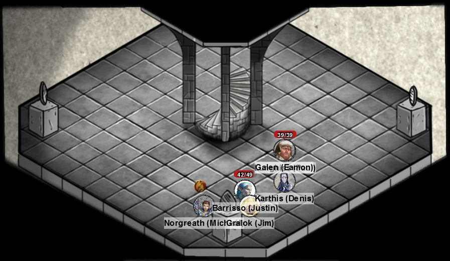

# 5 June 2024

**[Previously](2024-05-22.md):**  We're in Elturel, currently floating above Avernus. On our way to the High Hall, we found some alchemist's fire in an apothecary, then interrupted a devil named Perchillux attempting to make a deal with halfling named Pilster. We attacked Perchillux, but he eventually turned invisible and escaped. Soon afterwards, we fend off an attack by a pack of ghouls, finding some magical studded armour and an invisibility potion. We finally reach the High Hall, and are scouting its cathedral. We find, hiding amongst bodies, Seltern Obranch, a druid and follower of Silvanus. He tells us he thinks the fields who attacked Elturel have retreated to the catacombs. Barrisso pulls a lever next to the high altar (the shape of a gauntleted hand, which opens an entrance leading down....

- [x] Make our way to the High Hall of Elturel
- [ ] Find the Duke of Baldur's Gate, possibly at the High Hall
- [ ] Investigate Thavius Kreeg, High Overseer of Elturel
- [ ] Investigate the vampire High Rider Klav Ikaia
- [ ] Find the other half of the Infernal contract between Kreeg and Zariel
- [ ] Free Elturel from Avernus

---

Before we go down the entrance at the altar, we decide to check the floating tower about us. As we pass a curtain, we hear a screeching discordant tune from above us. We look up to see a choir balcony where we think the noise is from - two spiral staircases lead up to it. Two winged creatures leap down from on high to attack us:

<figure markdown>
  { width="200" }
  <figcaption>Winged Creature</figcaption>
</figure>

Gralok throws a spear at each, but they miss.

Karthis casts Witch Bolt at the north-most enemy, doing 7HP of damage.

Norgreath attempts an Eldritch Blast (with Agonizing Blast and Genie's Wrath) at each creature, and one hits. He notes the creature does not seem to take the full effect.

The south-most enemy moves towards the group and attacks Gralok. It attacks with its giant sword and also its claw, but misses.

Galen casts Toll the Dead, doing 14HP of damage.

Lunghiss does a Booming Blade sneak attack with Savage Attacker, but misses.

Barrisso casts Hunter's Mark on the south-most enemy, then attacks twice: one hits, for 10HP of damage.

Galen is attacked by the north-most creature: both attacks hit. It does 21 slashing damage in total.

---

Gralok goes into a Rage, then attacks the southmost creature. His second attacks hits with a crit, doing 12 damage. His third attack also hits for 10 more damage.

Karthis maintains his Witch Bolt, which does another 4HP of damage to the north-most enemy.

Norgreath casts an Eldritch Blast (with Agonizing Blast and Genie's Wrath) twice at the south-most enemy; both hits succeed, and the creature falls.

Galen casts Healing Word, getting back 5HP of health. He then casts Toll the Dead at the remaining enemy, doing 7HP of necrotic damage.

Lunghiss attacks, but misses.

Barrisso attacks with his rapier, doing 11HP of damage.

The creature hits Galen twice, doing 19HP in total: Galen is now down.

---

Gralok attacks with his claws three times: two hit, doing a total of 17HP of damage.

Karthis does another 4HP of damage from his Witch Bolt.

Norgreath casts an Eldritch Blast (with Agonizing Blast and Genie's Wrath), finishing off the creature.

---

Meanwhile, Taq has scouted the balcony above. There is a huge pipe organ: playing it is a human in a cloak and hood. Another number of similar individuals are nearby. Taq thinks they are armed and armoured.

---

We search the bodies of the creatures - which are a strange cross between a dragon and a devil. They only have normal weapons.

---

Barrisso casts Lay on Hands on Galen: he is now stable at 1HP.

---

We decide to ascend to one of the floating towers. Taq and Lulu will bring some of our ropes up so that we can climb up. They loop the ropes over a statue in the tower.

Barrisso climbs up. The statue is of a tall winged form. It seems to be a statue of Deva. *(Religion check)*.

Barrisso ensures the rope is secure. We all climb up - Karthis injures himself falling at one point.

<figure markdown>
  { width="400" }
  <figcaption>Top of Tower</figcaption>
</figure>

We pull up the ropes behind us.

On the statue of Deva is the following inscription:

*Let the faithful now adjourn and garb themselves accordingly.*

*Let them take the sacred objects that they may properly adorn the altar of our god and make the lord welcome in his sanctuary.*

We check the room on the left. It contains a pair of large cabinets and a table.

The cabinets hold white robes and sandals. Galen recognise them as items of Lathander.

On the other side are brass-bound chests and a table. Lunghiss opens one: it contains altar cloths, candlesticks, and chalice. The other one a thurible, and incense.

Some of us take off our armour and don the robes, then head into the room at the back. It has a holy water font, and an altar beneath a sun disk symbol on the wall. Tapestries show the hosts of heaven warring with the forces of darkness.

We put the altar clothes on the altar, then place the candlesticks and chalice on the altar.
Barrisso *(Religion check)* recalls the full ritual that we should follow. Gralok gives a prayer to Lathander. A spiral staircase of gold and marble appears, going up.

We ascend the staircase to an octagonal room:

<figure markdown>
  { width="400" }
  <figcaption>Octagonal Room</figcaption>
</figure>

There's a table with four objects (a book, a sword, a stone, and a pitcher), and four bronze statues that seem to accept the objects. A strange goat creature is surrounded by an amber wall of force, blocking our way up another set of stairs.

One statue is a young woman with her arms at her waist. A religion check indicates she is St Arabella.

Another is a male in armour, one hand in a fist, the other aloft. Tiras, an inquisitor who sought out disorder and cleansed corruption from the church.

The third is female, with her hands against a chest as if holding something to her heart. Saint Eela, devoted her life to promoting Lathander to the faithless. Known to travel to the most dangerous parts of the world.

The last is male, with one palm up, and the other slightly clenched above it. It is Saint Mago, who died fighting a fire in a temple of Lathander, retrieving worshippers from it.

We give the sword to Tiras, the pitcher to Mago, the book to Eela and the stone to Arabella. As soon as we place the stone in the statue's hands, the amber energy field disappears, freeing the goat creature with a flaming ranseur inside it:

<figure markdown>
  { width="300" }
  <figcaption>Goat Creature</figcaption>
</figure>

Norgreath attacks, but misses.

The goat creature attacks Barrisso, then Galen. He hits Galen, doing 10HP of piercing damage, and also 5HP of fire damage.

Lunghiss does a Booming Blade sneak attack with Savage Attacker. He does 27 damage, plus another 10 if the enemy moves.

Barrisso casts Hunter's Mark. His rapier hits, doing 15HP of damage including Hunter's Mark, but his other attacks miss.

Galen attacks with his marble mace, but misses.

Karthis casts Witch Bolt (at 2nd level). Using Inspiration, he gets 21HP of lightning damage. The devil looks bloodied.

Gralok attacks with his mace: one attack hits, doing 5HP of damage.

---

Norgreath casts Eldritch Blast (with Agonizing Blast and Genie's Wrath) twice: both hit. It does 21HP of damage, as the devil is resistant to cold.

Lulu hides.

The goat creature attacks Galen and Karthis. He hits Karthis, doing 7HP of piercing damage and 5HP of fire damage.

Lunghiss, doing 23 HP of damage, kills him with his next attack.

---

Gralok takes the discarded ranseur, which seems to be non-magical.

We climb the stairs to another larger octagonal chamber, open to the elements:

<figure markdown>
  { width="400" }
  <figcaption>Second Octagonal Room</figcaption>
</figure>

There are four pedestals. On each is a concave mirror untouched by the elements. Another area of magical amber blocks the stairs up. It holds two humans in rich clothing. *(Religion check)* We think there's something not quite right about what they're wearing. We put ball bearings and oil on the stairwell to act as a trap if they are freed.

We check the pedestals. The mirrors can be angled in different directions. They are currently positioned towards the ground. We check for inscriptions, but there seem to be none.

We turn all four mirrors to shine light towards the amber. Once this happens, it starts melting away, and the encased figures are released, and fall to the stairs, slip on the oily ballbearings and [start tumbling down below.](2024-06-12.md)

