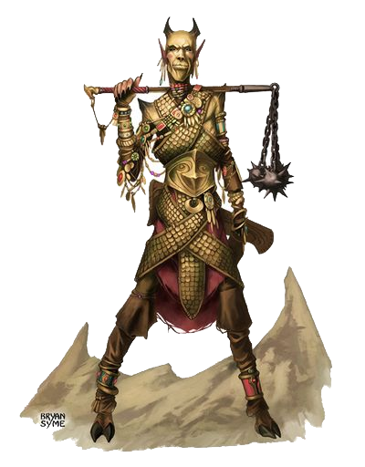
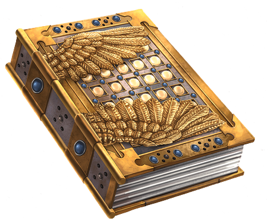
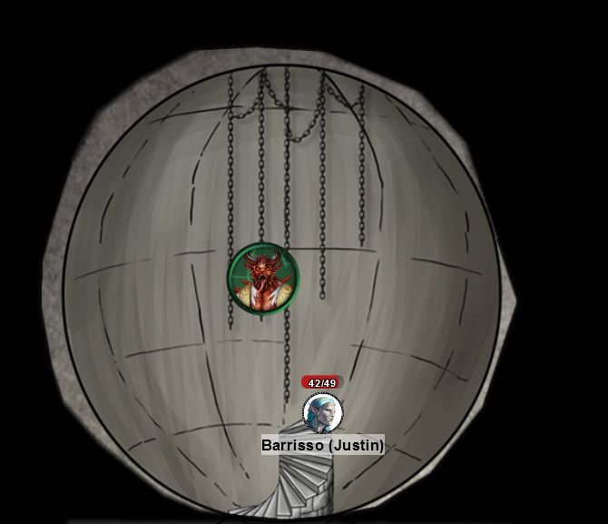
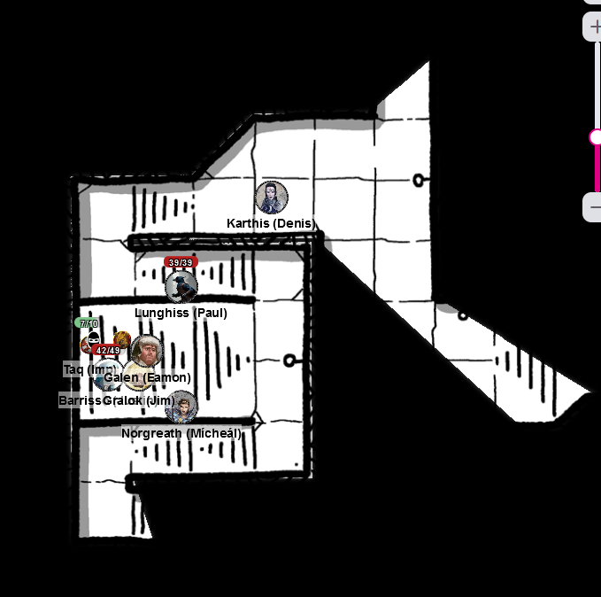
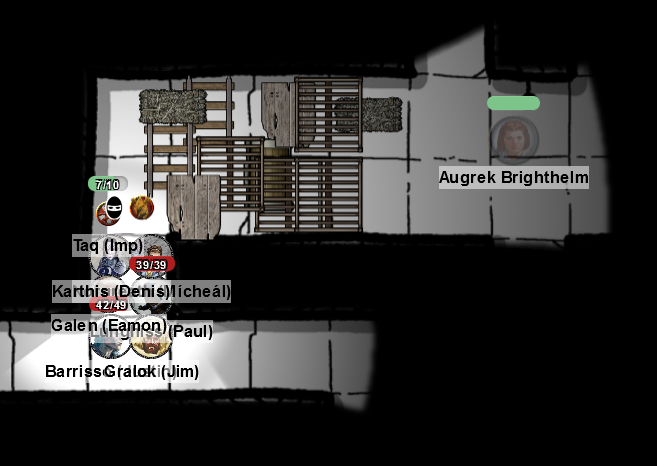
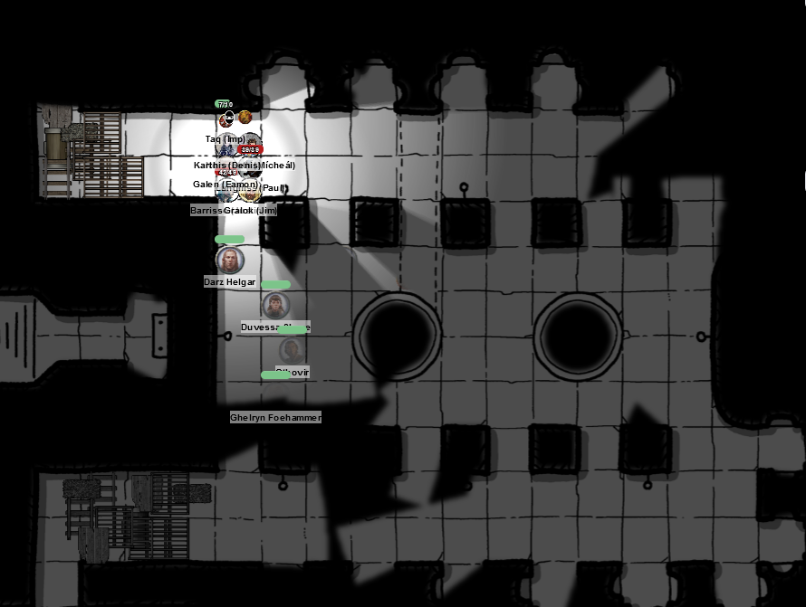

# 12 June 2024

**[Previously](2024-06-05.md):**  We're in the High Hall of Elturel, in its Cathedral. We defeated winged creatures who swooped down on us from a choir balcony, then used ropes to climb up to a floating tower, containing a statue of Deva. Following a series of rituals and puzzles, we have unlocked staircases and ascended to an octagonal room containing a number of mirrors. Using them to unblock an energy field around the staircase up, we have released two humans in rich clothing, who now tumble down due to the mix of oil and ball-bearings we pre-emptively placed there.

- [x] Make our way to the High Hall of Elturel
- [ ] Investigate the floating tower.
- [ ] Find the Duke of Baldur's Gate, possibly at the High Hall
- [ ] Investigate Thavius Kreeg, High Overseer of Elturel
- [ ] Investigate the vampire High Rider Klav Ikaia
- [ ] Find the other half of the Infernal contract between Kreeg and Zariel
- [ ] Free Elturel from Avernus

---

The two humans pick themselves up and dust themselves off. They are wearing rich silks and gold jewellery. Karthis realises *(Religion check)* doesn't think they are religious clerics, just noble people.

Barrisso asks them to identify themselves. They are thankful we rescued them. They tell us they are called Ktharn and Chuld, and they own a caravanserai. The last they remember was coming to the High Hall to make some offerings. Both offer us gold necklaces in thanks. Barrisso is suspicious of their intentions. *(Insight check)*. Barrisso tries to cast Detect Magic surreptitiously on the necklaces. Gralok takes one. When they see Justin casting the spells, they throw off their illusion and appear as they really are, Gilded Devils.

<figure markdown>
  { width="200" }
  <figcaption>Gilded Devil</figcaption>
</figure>

Karthis casts Toll the Dead but misses.

Gralok rushes and attacks the nearest with his mace. The first attack does 7HP of bludgeoning damage, the second 10HP.

One of the gilded devils attacks Gralok twice with his flail. Both attacks fail. As a bonus action, the gilded devil turns Gralok's necklace against him.

Lunghiss attacks, but misses.

The second gilded devil attacks Gralok twice, hitting for a total of 20HP.

Barrisso casts Branding Smite, then attacks the damaged devil twice with his rapier.

Galen attacks with his marble mace, doing 8HP of bludgeoning damage. He unleashes the radiant damage (10HP) from the mace.

Norgreath twice casts an Eldritch Blast (with Agonizing Blast and Genie's Wrath); both miss.

---

Karthis attacks the uninjured devil with a level 3 Witch Bolt, doing 21HP of lightning.

Gralok attacks the other devil, doing 5HP of damage.

That devil attacks Gralok, doing 17HP of damage. Gralok is now at 6HP.

Lunghiss does a Booming Blade sneak attack with Savage Attacker. He gets a crit, doing 51 damage, plus another 11 if the enemy moves. But the enemy doesn't move, he's obliterated.

The other devil attacks Barrisso. Gralok gets a reaction attack on him, and does 7HP of bludgeoning damage. The devil continues to attack Barrisso, doing 9HP of bludgeoning damage.

Barrisso attacks him with his rapier and shortsword, doing 19HP.

Galen casts Healing on Gralok, doing 11HP of healing. He then attacks with his mace, doing 9HP of bludgeoning damage.

Norgreath twice casts an Eldritch Blast (with Agonizing Blast and Genie's Wrath); both miss.

---

Karthis does 4HP with his Witch Bolt.

Gralok attacks with his mace, doing 17HP of damage.

Lunghiss attacks, but misses.

The devil says "Would you like to make a trade? I can help you open a chest above for a valuable treasure."

Barrisso says "No thank you."

The devil attacks Barrisso; one gets through, doing 15HP of bludgeoning damage. He also casts his Betrayal of Riches on Gralok, who (with Inspiration) saves, taking only 5HP of damage.

Barrisso attacks with rapier and shortsword, doing a total of 14HP of piercing damage. He then uses Divine Smite to get 18HP of extra damage.

Galen attacks with his mace, doing 9HP of bludgeoning damage. The second devil is dead.

---

Galen casts Prayer of Healing to heal some of the party. In the meantime, Barrisso moves the mirrors that originally removed the energy barrier: it does not reappear.

Barrisso uses Lay on Hands to give Gralok 10HP of healing.

---

We decide to ascend to the next floor. It's a small octagonal room contains four chests, one open. It bears an image of an open book. There is another staircase up, sealed by amber energy.

The party retreats back down to the mirrors level and takes a long rest.

**The party goes up to Level 6**

---

We intend to open the remaining chest, the open book. The others are already open:

- Sword
- Clasped Hands
- Brass instrument

Barrisso does Detect Magic: On the open book chest, he detects School of Abjuration.

We decided to return to a lower floor to get the book symbol we used earlier. However, it cannot be removed from the hand of the statue.

Lunghiss uses the Pipes of Marvellous Emancipation on the locked chest. As he plays the pipes, one pipe out of eight disintegrates. As he plays it, the lid of the chest opens.

Inside, is a heavy golden book, with clasps that looks like angels' wings. It sits on a velvet cushion.

<figure markdown>
  { width="400" }
  <figcaption>Golden Book</figcaption>
</figure>

Lunghiss does not recognise it *(Arcane check)*. Barrisso performs Detect Magic on it: yep, it's magical.

Galen looks at the book and says "I don't believe it. I think this is the Book of Exalted Deeds, a holy artefact whose authors have been clerics and paladins of various good faiths.

As soon as he picks up the book, the amber energy disappears and the way up is now open.

The stairs spiral up and terminate in a great sphere; the upper hemisphere is festooned with silvery chains, with a creature hanging from them:

<figure markdown>
  { width="400" }
  <figcaption>Sphere Room</figcaption>
</figure>

As we look up, the chains start moving and the figure starts descending. Barrisso using Detect Evil and Good is overwhelmed by the figure's evilness.

Barrisso uses Channel Divinity - Abjure Enemy on the creature once it is range of him. The creature fails, and cannot move from fear.

Karthis casts Witch Bolt, doing 7HP of lightning damage.

Galen casts Spiritual Weapon as a bonus action, doing 6HP of force damage. He then casts Toll the Dead, doing 19HP of necrotic damage.

Barrisso notices the creature resembles the high priest that he met in his temple before the Fall of Elturel. The high priest was called Colan Jynks, a high priest of Lathander.

The priest animates the chains in the chamber: four chains sprouts razor barbs. One chain attacks Galen and hits: those aimed at Gralok, Karthis, and Lunghiss miss.

Gralok uses Form of the Beast and attacks with his claws, doing 4HP of slashing damage.

Lunghiss does a Booming Blade sneak attack with Savage Attacker. He does 20 damage, plus another 9 if the enemy moves.

Norgreath as a bonus action, casts Hex, giving the priest disadvantage on his wisdom saving throws. He then twice casts an Eldritch Blast (with Agonizing Blast and Genie's Wrath), doing 26HP of damage.

---

Barrisso casts Hunter's Mark on the creature, then attacks, doing 24HP of damage.

Karthis does a power surge to do an extra 12HP of damage.

Galen casts Spiritual Weapon, doing 11HP of force damage. He then casts Toll the Dead, doing 2HP of necrotic damage.

The priest is free to move since he has taken damage. He uses the animated chains to attack; the first misses Lunghiss. Gralok gets a reaction attack, doing 8HP of damage. The second chain attack hits Galen, doing 10HP of bludgeoning damage; he's now on 12HP of health.

Gralok attacks with his claws, doing 12HP of slashing damage.

Lunghiss (using Inspiration) hits, doing 22HP of damage: the priest is dead.

---

The six silver chains are each worth 100GP. We search the priest, but he has nothing of value. We seems to have cleared the floating tower, and decide to return back to the Cathedral. We return to the ground, retrieving our ropes.

---

Back at ground level, we can still hear the discordant music. The curtains have been rent even more than before. We return to the altar, where we had opened an entrance with a stairway leading down.

<figure markdown>
  { width="400" }
  <figcaption>Cathedral Underground</figcaption>
</figure>

Galen uses his mace to light the way, and Norgreath casts the Light cantrip. Galen sees a small isolated tomb, with a young woman lying on a bier, with a great sword beside her. As soon as the party make our way to the tomb, Taq is overcome by extreme pain. Barrisso casts Detect Magic, but detects nothing. Lunghiss checks for traps but finds nothing. The woman is definitely dead.

We leave the tomb, and go south, then east.

We find ourselves in a room which was barricaded off:

<figure markdown>
  { width="400" }
  <figcaption>Cathedral Barricade</figcaption>
</figure>

Beyond we hear the sounds of ordinary people. We call out to them "what is going on?" The people all start talking with each other, and shortly two humans arrive at the barricade. One we recognise: it is Grand Duke Ravengard, the Duke of Baldur's Gate. They help us through the barricades into what seems to be a crypt.

<figure markdown>
  { width="400" }
  <figcaption>Cathedral Crypt</figcaption>
</figure>

It's home to about 100 people. Standing before a large font is a haggard woman clutching a book who introduces herself as Pherria Jynks. Next to her is Ulder Ravengard. She is wielding what looks like a ceremonial mace; he is armoured with a shield across his back, and has a longsword. He is slightly injured.

They ask us of the news above. We tell them of our adventures so far, and how we need to get the Infernal contract. We also tell them that Elturel is sinking lower and lower towards the river Styx. We tell them about the pact that Thavius Kreeg made.

Ravengard tells us he came to Elturel on a diplomatic mission about the Dead Three cultists, when Elturel was sucked into hell, he rallied his men and cut their way out of an ambush by devilish knights. He gathered a group of his Flaming Fist and Knights of Elturel and secured the High Hall. However, there was a meteor strike what wiped out a third of the fortress.

"Only 12 of my 20 men survive", he says "but our ranks have been strengthened by Elturian knights. The rest of our forces are in the city, gathering supplies (of which there are not much) and looking for allies. A group of devils assaulted the hall, so we retreated to the crypt. We had a plan to retrieve a something from the cemetery: Pherria Jynks says there is a special helm sacred to Torm. If we can retrieve it, we may get a connection with Torm to guide us. I would go myself but I do not think [these people would survive in that time."](2024-07-03.md)
