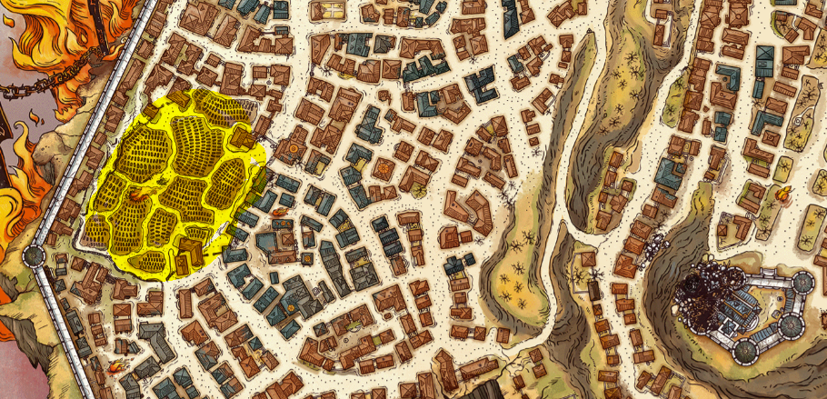
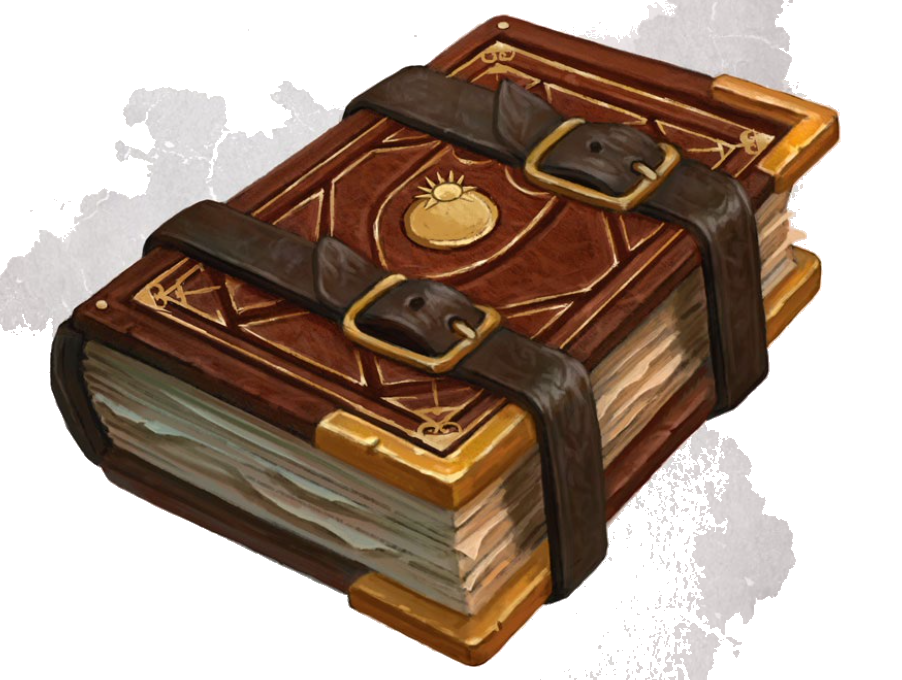
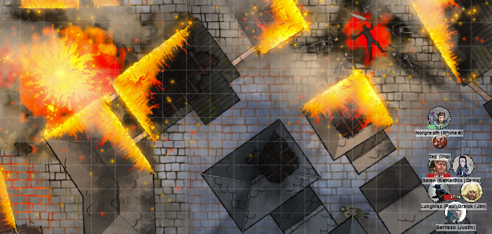
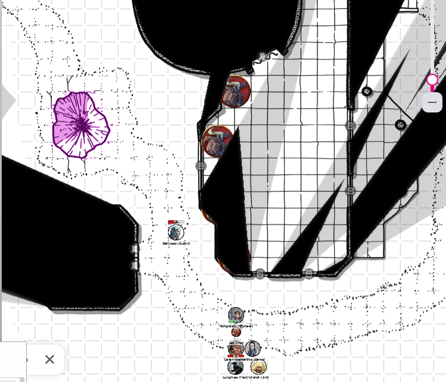
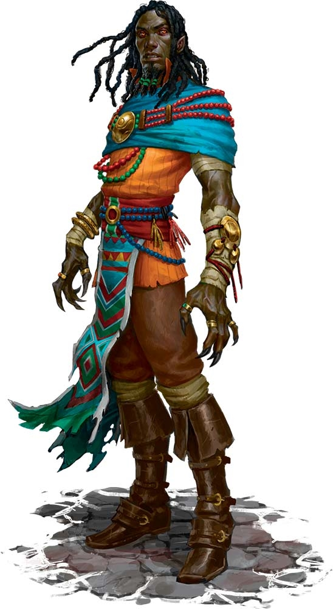

# 3 July 2024

**[Previously](2024-06-12.md):** We're in the High Hall of Elturel, in its Cathedral. Ascending a floating tower, we defeated two gilded devils who had disguised themselves as human merchants. On the next level, a chest was opened magically, to yield a holy artefact, the Book of Exalted Deeds. At the top of the tower was a sphere, where we defeated the now-corrupted Colan Jynks, a high priest of Lathander. We returned back to the cathedral, then through an entrance in an altar found ourselves in the crypt where many of the former residents of Elturel are holed up, including Grand Duke Ravengard, the Duke of Baldur's Gate. He is accompanied by Pherria Jynks. She says that the cemetery contains a helm sacred to Torm, which will offer us a connection to Torm himself to guide us.

- [X] Investigate the floating tower.
- [X] Find the Duke of Baldur's Gate, possibly at the High Hall
- [ ] Go to the cemetery.
- [ ] Find the sacred helm of Torm.
- [ ] Investigate Thavius Kreeg, High Overseer of Elturel
- [ ] Investigate the vampire High Rider Klav Ikaia
- [ ] Find the other half of the Infernal contract between Kreeg and Zariel
- [ ] Free Elturel from Avernus

---

The cemetery we need to go to is to our west:

<figure markdown>
  { width="400" }
  <figcaption>Cemetery Location</figcaption>
</figure>

Galen takes a long rest, and attempts to attune to the Book of Exalted Deeds. Galen says "Attuning to this book healed all my wounds." *(The book heals D6 per round.)* "Does anyone want my potion of greater healing?"

We ask the Grand Duke and Pherria Jynks about Thavius Kreeg, High Overseer of Elturel. Ravengard says that when he descended to Elturel (in our time, two weeks ago), he expected to deal with Kreeg, but he wasn't there. From Ravengard's point of view, it seems that in Avernus, it has been the same amount of time.

We tell Ravengard about Kreeg's Infernal contract with Zariel. We show him the half of the contract that we have.

Karthis recalls word for word the pledge we made as a Hellrider:

???+ scroll "Oath of the Hellriders"

    I solemnly pledge my soul and blood and blade to serve as a knight of Elturel and
    share the Oath of the High Observer in honoring the Gift of the Companion. I
    shall guard the realm of Elturgard and all those lands which lie under Elturel’s
    Shield, upholding the laws of Elturgard and the commands of the High Observer.
    I shall live my life in strict accord to the Creed Resolute, placing it and this oath
    above all other doctrines. I shall be bound to all others who swear this oath,
    declaring them now and forevermore, whether in life or beyond the veil of death,
    to be my brothers in arms. To ensure the perfect harmony of our brotherhood, I
    shall permit no difference in faith to come between us, but rather hold the
    Companion, which I shall never attribute to one god or another, as our common
    star.

The book that Pherria Jynks is clutching is the Tome of the Creed Resolute.

<figure markdown>
  { width="400" }
  <figcaption>Tome of the Creed Resolute</figcaption>
</figure>

Barrisso asks Jynks how she feels about the oath, now that the Companion is seen as an artefact of Hell. She is in shock at what we have revealed, as it explains all that has happened.

We ask about the vampire Klav Ikaia: they know something. Lysandra had told us he was hiding in a temple. Jynks and Ravengard know that someone is organising supplies in the east in Shiarra's Market. Cross-indexing with what Lysandra has said, that must be Klav Ikaia. Some of the High Knights of the Order of the Companion were transformed into Hell Knights. When other Elturian knights have been killed, they transformed into devils. It seems that if one of our party dies, we would come back as a Hell Knight.

When we look at the tome, it describes the moral courses of action for a knight, plus advice on maintaining armour. We remember that oftentimes in the Hellriders someone would say "Recall the Creed!". We read the tome for small print, but can't find anything suspicious.

Jynks adds one more thing: "There are two big fonts in this room with holy water. Take some if you need it." We take some waterskins full of holy water.

---

Lunghiss uses his Disguise Self to disguise himself as a bearded devil, to make it look like he is escorting prisoners (the rest of the party) through the wastes of Elturel. It may give us even an element of surprise if seen by another devil. He also casts Comprehend Languages, and gets some quick language lessons from Norgreath.

---

As we head towards the cemetery, we find a charred humanoid in the middle of the road. The corpse is clutching a silvered longsword, and surrounded by skeletons.

<figure markdown>
  { width="400" }
  <figcaption>Charred Corpse</figcaption>
</figure>

As Barrisso approaches the corpse, hellfire erupts from it: he takes 14HP of fire damage. He continues searching. The longsword is silvered, but not magical. There is a charred belt pouch, containing a steel vial containing a potion. We take everything.

We continue onwards to the cemetery. We can see severed humanoid body parts adorn the fence posts. Some writhe, undead.

Ahead of us is a large chapel dedicated to Torm, Helm and Lathander, but now glowing with a fetid radiance. To our left, is an octagonal one-storey building is to our left.

Barrisso follows to the path that went around the chapel and to the octagonal building:

<figure markdown>
  { width="400" }
  <figcaption>Cemetery</figcaption>
</figure>

He finds a hole filled with a deep purple mist, from which he detects necromantic magic. Inside the chapel, through a window he sees two horning creatures. He checks the main door of the octagonal building, but detects no magic. He returns to the party and tells us what he has seen.

The octagonal building contains destroyed furniture such as a desk and chair. Some holy symbols of the four good gods are scattered. A large tome has survived on the collapsed desk. At the rear of the chamber is a person.

<figure markdown>
  { width="200" }
  <figcaption>Gideon Lightward</figcaption>
</figure>

He is a cleric of Lathander, looking very gaunt. His hands have turned into talons, and he has a red look to his eyes. He turns to us and says:

"Can you help me rid the chapel of its infestation? I am **Gideon Lightward**."

We asks what he needs us to do. Barrisso attempts Detect Evil and Good. He detects undead and evil. "What are your intentions?".

"Demons have found their way into the city through a gate in the lower regions of the chapel. We cannot have demons in Elturel: we must wipe them out. I have placed guardians around the chapel."

On the purple mist: it's a manifestation of the energies drawing demons here.

Barrisso suspects this guy had become a native of this (devil) plane, and is opposed to demons. He may be evil, but may be a temporary ally, as we need to get into the temple to get the helm. We offer him our help.

He says he will secure the perimeter. We take a chance to look at the book in the chamber. It has a title page, Gideon's Testament. It describes holy visions, dialogues with "the Woman in White", and his ruminations on his experiences.

???+ scroll "Gideon's Testament"

    The Woman: Tell me, O Master, of what is the greatest evil.

    Gideon: It is that of the Abyss. It is the teemless horde of chaos which seeks to rip down civilization.

    The Woman: And why should civilization be not destroyed?

    Gideon: Civilization is that which gives life meaning. It is the font of morality and thought. Of art and of science. It is the gods’ place to stand between Man and Chaos. It is their aegis which is their ultimate purpose, for behind their shield we create greatness and dedicate it to their honor.

    *One night, however, Gideon awakens from a strange and formless dream and sees a disturbing vision in his bedchamber:*

    There I beheld her. Her beauty was so great it seemed to burn my eyes. And yet through my blindness I could see her with greater clarity than any other sight that I have ever beheld.

    Two great wings of white she had. And a sword of celestial steel so sharp that I could hear the hum of its edge. A weapon made to cleave the division between soul and mind. But then I saw this essence of perfection cast away her sword. Her wings turned black. Her eyes turned to pits of fire. And a great and terrible purpose furrowed her brow.

    *The next day he speaks with the Woman in White, who tells him that she, too, has had a vision of this angelic being, and that its name is Zariel.*

    Gideon: But why should she have turned from the light?

    The Woman: She turned from the light because it blinded her.

    Gideon: Does not the light let us see?

    The Woman: That is the lie of the light. We think only of what it illuminates, but not of what it conceals from us.

    *Gideon realizes that the Great Blindness – the Great Lie — is that the gods protect man from chaos.*

    … but it is not so! Helm? Torm? Tyr? Lathander? None of them battle the Abyss.

    They claim the glory of that war, but shed no blood in it! This is why Zariel turned from Heaven. She saw the truth of her holy purpose; the Great Need to stand against Chaos. And she saw that her “holy” power was powerless because her gods had willed it so. Thus she allied herself with Hell! For it is Hell who fights chaos! It is Hell which sacrifices itself in the Blood War! Hell which fights eternal so that we poor mortals may eke out a few years of freedom upon the mortal plane!

    Without her, all would become Chaos. And all those who do not stand with her are servants and abettors of Chaos, though they know it not.

Zariel has not always been a devil, but an angel, and led the Hellriders into Hell; did she become corrupted there?

We head towards the chapel; the entrance is on the eastern side, up a series of steps. A series of pillars are carved into heroes of Elturel's past. Karthis rattles off the names of all the heroes. (*History check)*
Some horned skeletal minotaur creatures approach us from the north, resembling the beings that Barrisso saw inside the chapel.

Lunghiss does a shortbow sneak attack on the nearest creature, doing 16HP of damage.

One of the minotaurs attacks Lunghiss. Lunghiss casts Shield, so the attack does not hit.

Galen casts Channel Divinity: Turn Undead: he turns one of two creatures.

Karthis moves and casts Witch Bolt *(getting a critical)*, doing 17HP of lightning damage on the most distant minotaur.

Norgreath casts Thunder Step, doing 6HP of damage.

One of the creatures moves away from Galen, as it is turned.

Gralok attacks a creature with his greataxe, doing 5HP of damage.

Barrisso attacks with his rapier and shortsword, doing a total of 12HP of piercing damage.

The minotaur furthest away attacks Galen, but misses.

---

Lunghiss does a Booming Blade sneak attack with Savage Attacker: he does 24HP of damage, with a further 10HP if the opponent moves.

One of the minotaurs attacks but misses.

Galen casts Spiritual Weapon but the initial attack misses. He then attacks with his marble mace, missing.

Karthis's Witch Bolt does another 6HP of damage.

Norgreath casts Eldritch Blast (with Agonizing Blast and Genie's Wrath) twice: he does 26HP of damage, which dies.

One of the creatures keeps moving away.

Gralok attacks with his greataxe: both hit, doing 19HP of slashing damage.

Barrisso attacks the same minotaur with two rapier and one shortsword attack: his 17HP of damage almost finish it off. He casts Divine Smite, doing 9HP of extra damage *(with Inspiration)*. It dies.

The remaining terrified minotaur disappears.

---

We approach the main door of the chapel. Lunghiss *(Arcana check)* thinks that the excellent recitation by Karthis of the heroes might power these pillars in a positive way. Karthis recites the names to the pillars. As he does so, [each pillar starts glowing with radiant energy in a 5 feet radius...](2024-07-18.md)
