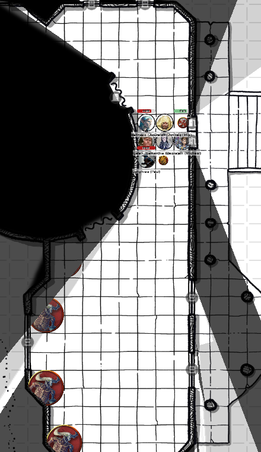

# 18 July 2024

**[Previously](2024-07-03.md):** In the High Hall of Elturel, we told the Grand Duke Ravengard about Thavius Kreeg's evil pact with Zariel, the ruler of Avernus, and explain that we are in Avernus to find the other half of the infernal contract. We figure out that the vampire Klav Ikaia is in a place called Shiarra's Market. We head to the cemetery to find the sacred helm of Torm. In the grounds is a hole filled with a deep purple mist, from which we detect necromantic magic. At an octagonal building there we meet Gideon Lightward, a corrupted undead cleric of Lathander. He asks us to rid the cemetery chapel of an infestation of Demons which are coming through a gate in the lower regions of the chapel. We head to the entrance to the chapel and there fight a number of skeletal minotaurs. We find that the pillars of the entrance, which resemble heroes of Elturel, produce radiant energy that may aid us...

- [X] Go to the cemetery.
- [ ] Rid the cemetery chapel of its infestation for Gideon Lightward.
- [ ] Find the sacred helm of Torm.
- [ ] Investigate Thavius Kreeg, High Overseer of Elturel
- [ ] Investigate the vampire High Rider Klav Ikaia at Shiarra's Market
- [ ] Find the other half of the Infernal contract between Kreeg and Zariel
- [ ] Free Elturel from Avernus

---

We notice the radiant energy from the pillars will damage our foes. Perhaps we should lure them outside. We open the doors of the chapel to see four skeletal minotaurs inside (as far as we are aware, these are not Demons).

<figure markdown>
  { width="200" }
  <figcaption>Chapel Interior</figcaption>
</figure>

Norgreath casts Eldritch Blast (with Agonizing Blast and Genie's Wrath) twice at a minotaur: he does 20HP of damage, then moves outside.

Gralok walks to a pillar and holds an action.

A second minotaur runs towards Barrisso at the door and tries to gore him.

Lunghiss attacks and missed, then disengages.

Galen attacks with his marble mace but misses.

Barrisso attacks with his rapier and shortsword, doing a total of 18HP of piercing damage.

Karthis casts Fire Bolt, doing 14HP of fire damage.

A third minotaur (the non-injured one) runs to the entrance and attacks Galen, doing 18HP of slashing damage.

---

Norgreath casts Eldritch Blast (with Agonizing Blast and Genie's Wrath) twice at minotaur 1: he does 24HP of damage.

Gralok attacks with a thrown handaxe *(a crit)* and does 12HP of damage, killing minotaur 1. He throws a second handaxe at minotaur 2, doing 6HP of damage.

Lunghiss attacks but misses, and then retreats again next to a pillar.

Galen moves away from the door, then casts Spiritual Weapon. (The minotaur gets a reaction attacks but misses.) His Spiritual Weapon does 12HP of force damage. He also casts Sacred Flame, doing 16HP of fire damage.

Barrisso casts Toll the Dead, doing 14HP of necrotic damage.

Karthis casts Fire Bolt, doing 15HP of fire damage.

A minotaur emerges from the door and turns left to attack Galen, doing 10HP of slashing damage.

Another minotaur moves outside and attacks Lunghiss. He is hit, but Uncanny Dodge means he only takes 10HP of slashing damage.

Norgreath casts Eldritch Blast (with Agonizing Blast and Genie's Wrath) at the minotaur next to Galen: it dies. He casts again at another minotaur, doing 16HP of damage.

Gralok attacks the minotaur next to Lunghiss with his mace, doing 10HP of bludgeoning damage. A second attack does 6HP, finishing him off. Gralok can move inside an attack again: he does another 5HP of damage.

Lunghiss does a Booming Blade sneak attack with Savage Attacker: he does 17HP of damage, with a further 7HP if the opponent moves, then disengages.

Galen's Spiritual Weapon does another 10HP of damage, then casts Toll the Dead, doing another 11HP of necrotic damage.

Barrisso attacks with his rapier and shortsword. He does 17HP of slashing damage.

Karthis casts Fire Bolt, doing 16HP of damage, killing the last minotaur.

---

We explore the ground floor of the chapel. It's an L-shaped building, with smashed fine furniture and stained glass strewn everywhere. One window remains intact, its subject Lathander amid fallen soldiers as the spirits of the dead rise to stand with him. There appear to be no more creatures here. Barrisso says a quick prayer. A glowing rapier appears in front of him, which he reaches for *(it's a +2 rapier)*.

Another window lies on the floor, but intact. It seems to depict the god Torm, placing a golden helm on a man kneeling before him. It is the fabled time when **Lannish Fogel**, (a hero of Elturel's past and a paladin of Torm) was presented with the helm.

Curtains divide the chapel from a circular space in the middle of the ground floor. Barrisso opens a curtain to reveal two creatures, and a staircase going down. The space has shattered wardrobes, dressing tables and mirrors, suggesting it was a sacristy. The two creatures guarding the staircase are insectoid and carrying tridents:

<figure markdown>
  { width="200" }
  <figcaption>Insectoid Devil</figcaption>
</figure>

On hearing us, one creature turns to look at us. Barrisso says, in Infernal: "Good day, fellow hell-hounds."

It replies in Infernal, but telepathically: a very uncomfortable feeling, with a skittering insectoid feeling.

"Did you come to kill the demons?"

It points its trident downstairs.

Barrisso and the devils get into an argument about who should go down the stairs. He tries to intimidate the devils, but they are not convinced. He tries to persuade them.

"Mortal, you do not understand: we are bound to this place." It seems that Gideon Lightward has bound them here.

They say there might be twelve demons down below.

(Barrisso heals Lunghiss for 10HP.)

A noise is heard on the stairs and a number of smaller creatures, vaguely bear-looking, appear, led by a giant man-scorpion. The insectoid devils turn to fight them.

Lunghiss recognises the smaller demons as a dretch, one of the most minor of demons.

<figure markdown>
  { width="200" }
  <figcaption>Dretch</figcaption>
</figure>

Karthis casts Fire Bolt at the man-scorpion, but it misses.

Galen casts Spiritual Weapon and attacks the man-scorpion, but the attack misses.

Galen casts Sacred Flame, doing 3HP of damage.

The dretches seems to be trying to attack the devils, but are unintelligent and not realising they cannot reach beyond the man-scorpion.

Barrisso casts Hunter's Mark on the man-scorpion. He then attacks with his rapier; the second attack hits, doing 12HP of piercing damage. He uses Divine Smite on the fiend to do an extra 11HP of damage.

The man-scorpion attempts an attack of opportunity on Barrisso as he retreats, but misses.

Gralok attacks with his mace; the second attack hits, doing 10HP of bludgeoning damage.

Lunghiss does a Booming Blade sneak attack with Savage Attacker: he does 33HP of damage, killing the man-scorpion.

Norgreath casts Eldritch Blast (with Agonizing Blast and Genie's Wrath) at a dretch, doing 14HP of damage. He casts again at another dretch, doing 14HP of damage again.

A undamaged dretch moves forward and attacks an insectoid devil, and seems to damage it.

---

Karthis casts Toll the Dead on an injured dretch, but it saves and takes no damage.

Galen attacks with Spiritual Weapon but misses. He then casts Toll the Dead, doing 7HP of necrotic damage, killing the demon.

Another dretch moves up, releasing a cloud of green gas that obscures people's vision *(-1 to hit)*.

Another dretch moves up and attacks an insectoid; a bite attack does damage.

Barrisso saves against the effect of the gas. He then attacks an injured dretch, using his bonus action to move the Hunter's Mark to this creature. His first attack (9HP of damage) kills the dretch. His second attack does 10HP of damage.

Gralok attacks with his mace, doing 5HP of damage. He receives an attack of opportunity, getting 3HP of damage.

A dretch attacks Barrisso, but misses.

Another dretch also attacks Barrisso, but both attacks also miss.

An insectoid kills a dretch, then its second attack also kills another dretch. One dretch is left.

Lunghiss does a Booming Blade sneak attack with Savage Attacker: he does 25HP of damage, finishing off the last dretch.

---

An insectoid points its trident down to the bottom of the stairs. We move down to the bottom. We find a room ransacked, covered with knives, saws, small pools of acid and embalming fluid: a room obviously used for preparing bodies for burial.

<figure markdown>
  { width="400" }
  <figcaption>Chapel Basement</figcaption>
</figure>

We open a door and find more steps north leading downwards. Beyond that are more steps leading east and west. We follow the steps west into a large rubble-strewn pillared vault. Daises contain five marbled statues: four are unrecognisable as their features have been marred by rock falling from the ceiling. The fifth is a kneeling man. He is clearly Lannish Fogel, an is wearing a golden helm on his head. Barrisso checks the other statues but does not spot another such helm.

Barrisso takes the helm and places it on his head. The rest of the party see him putting on the helm, then collapse to the ground. He closes his eyes and his hands clutch at the helm as if trying to take it off. We are unable to pull the helm from him. Barrisso stops scrabbling and falls unconscious. Lunghiss tries to remove the helm, with no effect. We perform first aid on him, just in case.

Galen casts Protection from Evil and Good on Barrisso. Then we bring him back up the stairs. We attempt to pull the helm off

Karthis, as a ritual, casts Tenser's Floating Disk in order to carry Barrisso. We head back to the High Hall and Ravengard.

On our way back, rain starts to fall and we realise it is acidic as it starts to burn our flesh. A balding man in a fur robe is standing in a nearby doorway, beckoning us in. We go to the doorway to take shelter. "Quickly: come inside and receive Torm's blessing."

We go inside and he closes the door. "I saw you coming from the graveyard. Did you encounter Gideon Lightward?" We ask how he knows him. "He was the main priest of Lathander before the city fell. I know that he has fallen, as has a strange affinity for the undead."

"I have encountered this rain before. You just need to wait it out. Would you permit me to give you a blessing from Torm?" He does so *(we all get 9 temporary hit points)*, and then advises us to bring Barrisso back to Jynxs. His name is Lindar, and he says he was sent out to help people by Jynx and Ravengard. He tells us not to trust Gideon's motives, but he is obsessed with defending the city from demons, even though he is a devil. Perhaps the demons and devils should be left to fight each other.

At this point, the rain has stopped, and [we continue on our way....](2024-07-25.md)

