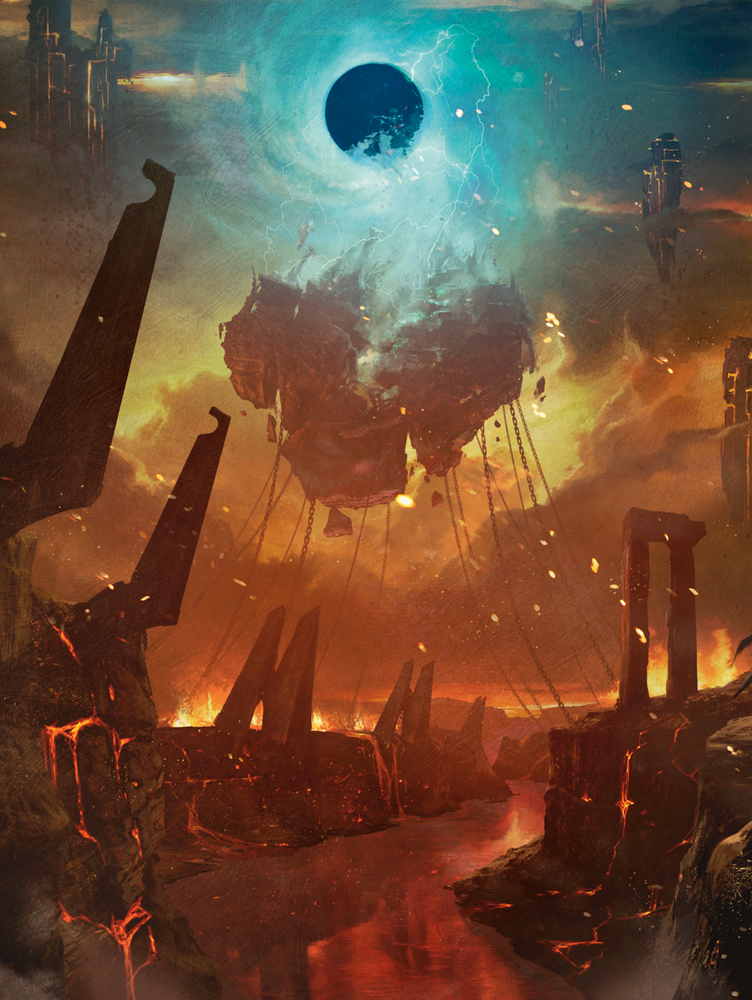
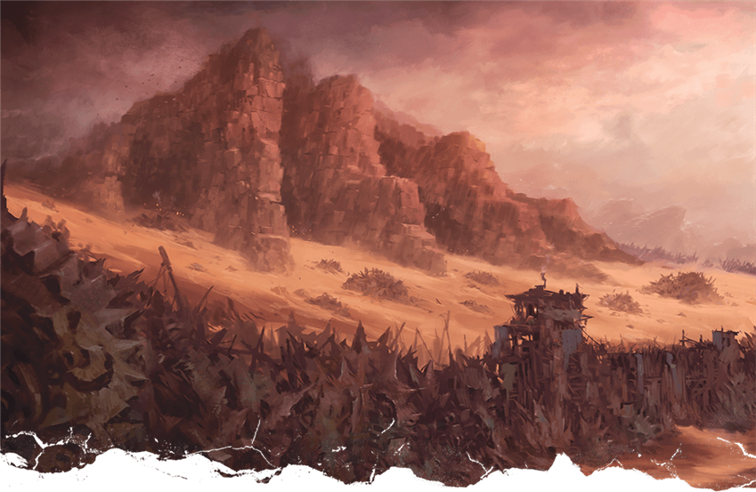
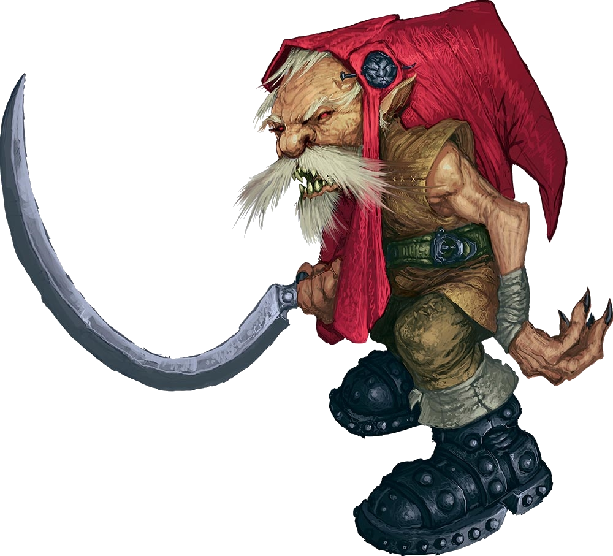
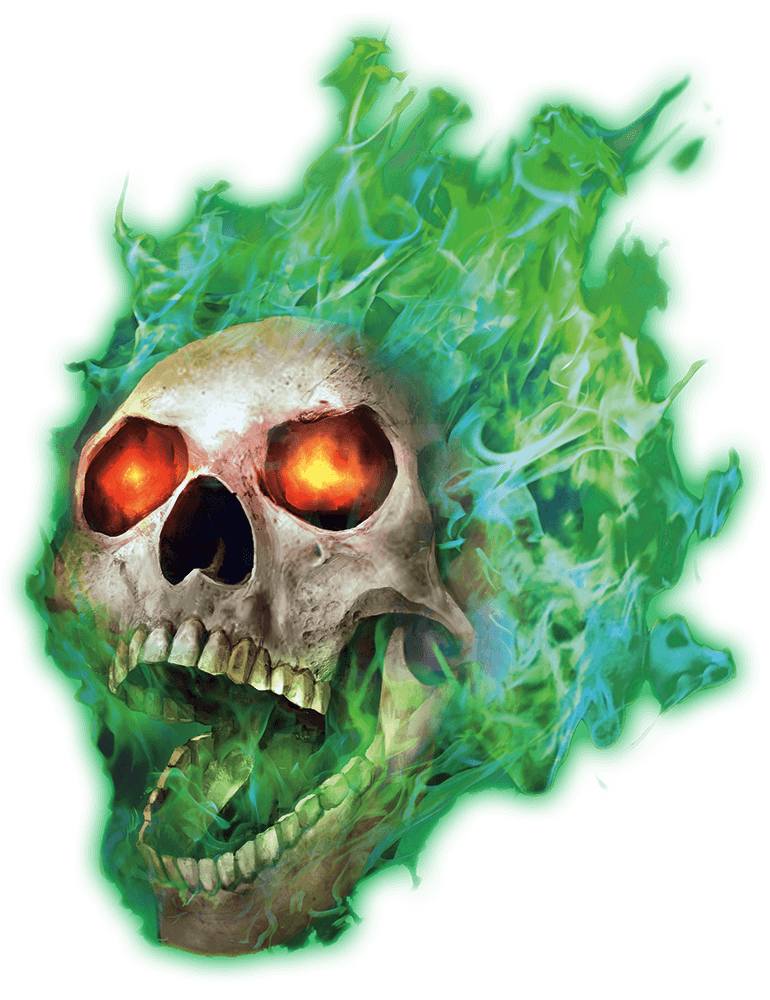
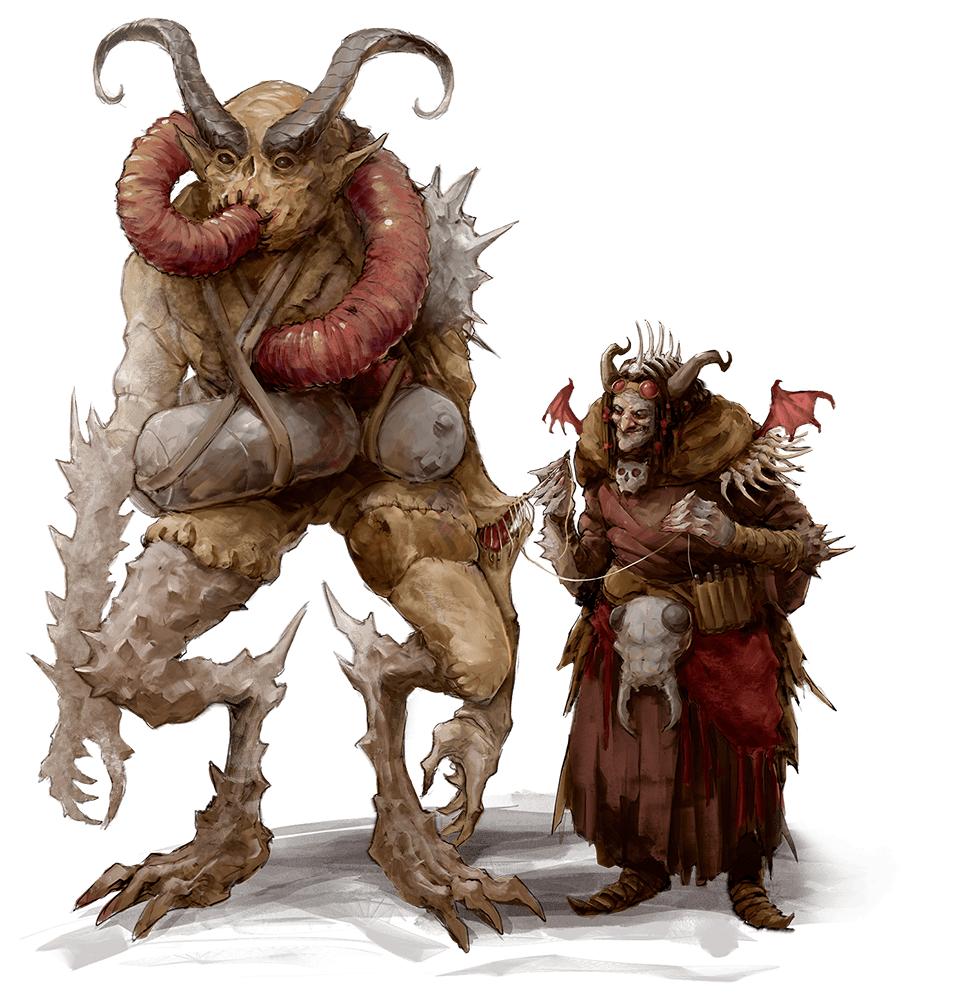
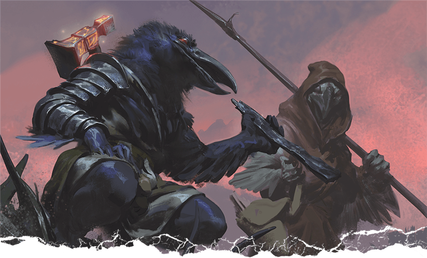

# 1 Aug 2024

**[Previously](2024-07-25.md):** We found the helm of Torm in the chapel of the graveyard and Barrisso donned it and immediately collapsed. We brought him back to Jynks who revived him whereupon he revealed visions of being alongside Lord Olanthius, Lady Yael of Idyllglen, Zariel, solar of Celestia and the rest of the party at Elturel, as if awaiting battle. Another vision reveals the aftermath of a battle, and Zariel giving her sword to Lady Yael for safekeeping, telling Lulu to protect Yael. A battle with gnolls in this vision ensues. In the aftermath, we see a giant demon gnoll take Lady Yael through a portal. The vision ends with us being told to "seek the kenku". Lulu remembers them as being at Fort Knucklebone, where we immediately leave for.

- [ ] Go to Fort Knucklebone.
- [ ] Seek Zariel's blade, as revealed in Barrisso's vision (it will "sever Elturel's chains")
- [ ] Find the two kenku as revealed in Barrisso's vision.
- [ ] Investigate Thavius Kreeg, High Overseer of Elturel
- [ ] Investigate the vampire High Rider Klav Ikaia at Shiarra's Market
- [ ] Find the other half of the Infernal contract between Kreeg and Zariel
- [ ] Free Elturel from Avernus

---

We make our way to the most north-easterly of the chain anchors. En route we come to the bridge of runes that [we crossed before](2024-05-08.md). Two Spined Devils are on the bridge. Some pounding on a door is heard from the building just this side of the bridge. We investigate the door and Barrisso forces it open. 

As he does so an avalanche of 12 zombies erupts out of the open door. Barrisso is knocked prone as are the zombies. 

Lunghiss hits with a sneak attack and fells one of the zombies. 

Barrisso realises as he prises himself up that these zombies were all residents of Elturel before the fall. He swings his short sword doing 3HP of damage.

Karthis casts Fire Bolt and does 11HP to the one Barrisso just hit.

Norgreath targets a fresh zombie and casts Eldritch Blast and hits one for 12HP. A second blast does a further 11HP which fells it. 

Gralok smacks one of the damaged ones and fells it. A bonus attack results in 5HP to another zombie. 

Galen performs Turn Undead on the zombies. Of the nine zombies, seven are instantly destroyed. Lunghiss spears one of the remaining and fells it.

Barrisso finishes off the last one.

---

We search the building. It appears to be a school. The zombies have done a lot of damage to the place. A basement area is found with five large casks each with 3 gallons of fresh water. We fill our water-skins. We seal up the casks and close up the building again. We reach the bridge. Four Spined Devils occupy it. They are unaware of us. Two stand in the middle of the bridge and one closer to each end.

Karthis casts Ray of Frost on the closest devil but misses.

Lunghiss holds until Gralok acts. 

The four devils react to the Ray of Frost and fly over to attack us. They fly up into the sky and attack us with spines. The first one attacks Karthis who reacts and uses Arcane Deflection which causes it to miss. A second spine hits for 6 piercing and 6 fire damage. Barrisso is hit by a spine for 11HP. Galen is hit by a spine for 11HP. Gralok is hit for 10HP.

Norgreath attacks a devil with an Eldritch Blast and does 9HP. A second blast hits for 15HP. The devil is pushed back.

Gralok rages and swings at the nearest devil. He hits for 10HP. A second smack does 6HP.

Lunghiss then sneak attacks the same devil and kills it. 

Galen casts Order's Demand on the three devils. The three devils are charmed and drop their weapons. 

Barrisso casts Bane on the three remaining devils.

Karthis casts Toll the Dead on the damaged devil. The devil dies.

Lunghiss uses Cunning Action to perform Hide and from hidden he attempts a sneak attack with his short bow and his silvered arrow. He kills the creature. 

The one remaining devil is still charmed and does not attack. Norgreath attacks the last devil using Eldritch Blast and does 12HP. He misses with a second. The devil is no longer charmed.

Gralok throws a silvered javelin at the remaining devil. He does 5HP. He throws a second javelin but misses. 

Galen casts Toll the Dead on the remaining devil. The devil falls dead. 

---

We cross the bridge and make our way to the north east gate in the walls of Elturel. The gates are open. We exit the city and observe the giant chain that ties the city to the plane. The chains are covered in spikes and prongs that extend out from each link. Weirdly, these make climbing somewhat easier.

We tie ourselves together with ropes and make our descent. After descending a few links we realise the contact we are having with the infernal iron is causing us distress with its corrosiveness. Those without gauntlets wrap their hands. We mitigate the effect of the iron is this way.

We reach the bottom of the chain, and see that it is attached to huge posts embedded in the ground. The posts are also made of infernal iron. There are about 50’ high. We rope ourselves down. Lulu leads the way and we head for Fort Knucklebone.

The journey is oppressive primarily because of the environment. The absence of natural light is highlighted by the orange flow of fire that pervades the whole space. The stench of the place is very unpleasant. We push on. Looking back and above us, we can see Elturel suspended in the sky:

<figure markdown>
  { width="400" }
  <figcaption>Elturel</figcaption>
</figure>

Ahead a low set of hills are seen in the distance. Contact with creatures are universally avoided as we make our way. A hill of rust covered stone that appears to be that of a hand crawling its way out of the ground, A tower with a gate looks like an entrance. A curtain wall is seen with a number of figures which look like that are on watch. We have arrived at Fort Knucklebone:

<figure markdown>
  { width="400" }
  <figcaption>Fort Knucklebone</figcaption>
</figure>

The gate is shut.

As we get closer to the gate, we see that the creatures manning the gatehouse look like fierce gnomes with red caps:

<figure markdown>
  { width="200" }
  <figcaption>Red Cap Gnome</figcaption>
</figure>

One of them yells down to us, in Common, "What’s the password?". Shortly afterwards we hear one other say "We don’t have a password". The gate occupants fall about laughing. We ask for admittance. They put a "duty" before us to stand on our heads to see if we are worthy of admission but we tell them to feck off. They let us in.

Within there is a courtyard. There we see a gang of people who are around a war machine. They are not paying us any attention. Elsewhere, people are busy standing guarding. A skull with glowing red eyes floats near some tents. A couple of imps sit on the tents and there is a creature the like of which we have never seen (half-insectoid, half-mammalian) with a tube that connects head and chest.

We ask Lulu about the kenku we are supposed to meet but she cannot recall anything.

We grab the nearest thing that can speak, the flameskull, and ask for the kenku. He identifies as **Barnabas**:

<figure markdown>
  { width="200" }
  <figcaption>Barnabas</figcaption>
</figure>

He wants his tooth back in return for helping us with the kenku. A redcap named **Grubba**, has his tooth.

Barrisso attempts to convince Barnabas to help us before we get him his tooth. He does not succeed.

We approach Grubba. He is totally uncooperative. We learn nothing. Barrisso is ultimately frustrated and sits down, dejected.

After a while two creatures appear: a lady clad in rags (we later find out her name is **Mad Maggie**) and a somewhat insectoid-mammal-like creature named **Mickey**:

<figure markdown>
  { width="200" }
  <figcaption>Mad Maggie and Mickey</figcaption>
</figure>

The lady has eyes that move independently from each other. She has two ravens that rest on her shoulders. The ravens have red eyes at they scrutinise us very closely. She wears a long tattered shift covered in mud, mould and blood. She is touching the larger creature beside her. This creature is build of different fiendish parts. It is trudging alongside her, Suddenly, each of the creatures eyes focus keenly on our group and on Lulu. "My my, where did you find such a treasure" she says, focusing on Lulu.

"We are looking for some kenku", we say. 

"You want to eat them? Don’t you have one of your own?", they reply.

The conversation continues inanely for a while. We discover that the kenku keep the war machines going. The lady mentions that she has a picture of Lulu. In the picture, Lulu is far bigger than she now is.

She is interested in why Lulu is here. We tell her that we want to see the Kenku. They have information we seek. She is not happy with our answers. The insectoid agrees to let us ‘talk’ to the kenku if the lady can talk directly with Lulu. We talk with Lulu and she agrees provided we are there. The woman agrees. The lady asks Lulu "why do you want to talk to the Kenku?"

"I want to remember."

"Where you here before?"

"I think so, but I don’t remember".

With that, two kenku appear from near the war machine:

<figure markdown>
  { width="400" }
  <figcaption>Chukka and Clonk</figcaption>
</figure>

We later find out their names are **Chukka and Clonk**. They look a little different from regular kenku. They shake their heads as they walk. The lady beckons for the two Kenku to approach. Looking at the kenku, we conclude that these could not possibly be alive when Lulu was last here. Perhaps they have some lore. As they approach, Lulu gets somewhat nervous. When Lulu speaks, the Kenku absolutely lose their shit. They prance about and mimic, in Lulu’s exact voice, "love" repeatedly.

The kenku have a racial memory and Lunghiss gets in the mix and learns the whole of the kenku’s lore. Mad Maggie, the lady, is their employer. She is here at least a century and looks after this place: a repair shop for the war machines used by the devils in their war.

We learn that the kenku recognised Lulu’s voice. They know no more, however. We need to get Lulu to remember. Mad Maggie listens in. She says "Do you want Lulu to remember?, Is that it it?". Mad Maggie wants us to reveal what we are really about. [However, we are reluctant to reveal the connection with Zariel and the sword....](2024-08-14.md)

