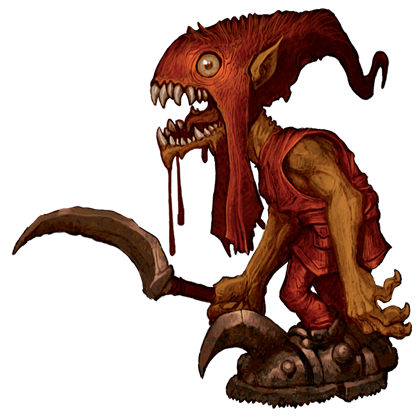
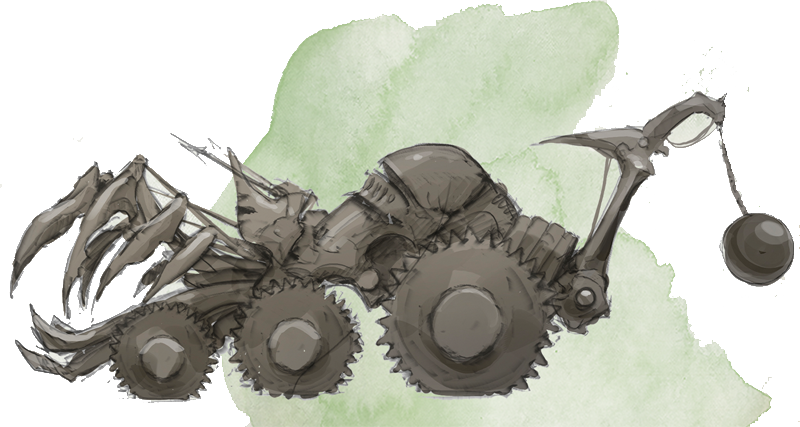
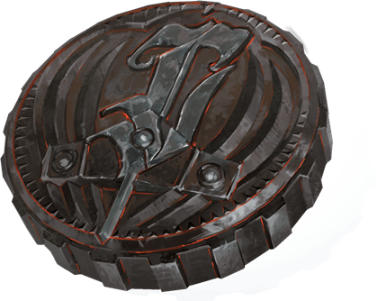

# 14 Aug 2024

**[Previously](2024-08-01.md):** The helm of Torm we found in the chapel of the graveyard and which Barrisso donned revealed visions that ended with us being told to "seek the kenku". Lulu remembered them as being at Fort Knucklebone, a stronghold on the plain of Avernus itself. There we encounter Barnabas, a flying skull with glowing red eyes, and Mad Maggie, the employer of two kenku, along with her companion Mickey. She is here at least a century and looks after a repair shop for the war machines used by the devils in their war. The kenku recognise Lulu but do not know any more. We wonder if we should reveal to Mad Maggie the reason we are here: to find Zariel's sword.

- [X] Go to Fort Knucklebone
- [X] Find the two kenku as revealed in Barrisso's vision
- [ ] Seek Zariel's blade, as revealed in Barrisso's vision (it will "seek Zariel's blade: it's the key to her heart, and will sever Elturel's chains")
- [ ] Investigate Thavius Kreeg, High Overseer of Elturel
- [ ] Investigate the vampire High Rider Klav Ikaia at Shiarra's Market
- [ ] Find the other half of the Infernal contract between Kreeg and Zariel
- [ ] Free Elturel from Avernus

---

Gralok blurts out "We're looking for Zariel's sword!", while munching some cheese he stole from the Vanthampurs.

"An artifact of the archduchess! I think we might be able to help each other", says Mad Maggie.

A redcap tries to steal Gralok's cheese, so he hits out with his mace, doing 9HP of bludgeoning damage. Mad Maggie doesn't seem to be too concerned about the assault. Gralok warns him off his cheese.

The redcap kicks Gralok; Gralok gets knocked prone and then booted in the face for 13HP of damage. We see a few redcaps jump down from the gatehouse to find out what is going on. We also see another type of redcap come to see, that looks even creepier:

<figure markdown>
  { width="200" }
  <figcaption>Creepy Redcap</figcaption>
</figure>

Gralok uses Form of the Beast and attacks with his claws, doing a total of 23HP of slashing damage.

The redcap attacks Gralok with his sickle, doing 16HP of damage to Gralok.

Gralok attacks with his claws again, finishing the redcap off. He then picks up his cheese. We notice that the five creepy redcaps dance around his body, while the ordinary redcaps curse and spit. Gralok joins in with the dancing, badly. 

After the creepy redcaps stop their dance, the ordinary redcaps come to their fallen comrade, dip their caps in the blood of their friend, put their caps back on, and take his body away.

---

We apologise to Mad Maggie for the violent cheese interlude. Mad Maggie says "Don't worry about him. My fey contact will deliver another cohort soon enough. Chukka and Clonk might have have something to say", looking at her kenku. "Maybe I can give you a tour!" She leads us on.

"This is the outer court.... this is the rampart... most importantly here are the courtyards. They contain the shed." 

This is where we see the strange war machines and where Chukka and Clonk came from.

We see a number of machines in states of disrepair or even scrap. A number of devils on the largest vehicle seem to be about to leave Fort Knucklebone. 

"This is where Chukka and Clonk do their work. But they found this machine... well, we'll talk about that in a minute."

She leads us on.

"This is the well", showing us a clear-water spring with a tavern around it. 

"This is the arcade". It's filled with tents, a bazaar to trade at.

"This is the hostel." This seems to be where people can stay, pitch a tent, and chill. 

"This is my domain. Feel free to settle down in the hostel and rest - there's no charge."

"Chukka and Clonk have been working on some machines. We recently came across something that might help with this... memory problem. However, it's not quite working right and missing something. Chukka and Clonk have helped me understand what they are. If you can find them for me and bring them back, you can help fix up this dream machine. What do you say?"

We ask what things they are.

"We need a Nirvanan cogbox; they come from Mechanus. They are used in a variety of infernal machines."

"Then we need a heartstone. Used by night hags to infiltrate the dreams of their victims. It’s used as a prism or beam-splitter in the dream machine."

"Then we need Phlegethosian sand. This is obsidian sand pounded from the jagged, rocky plains of Phlegethos, the fourth layer of Hell."

"Lastly, some astral pistons. Another component used in various pieces of infernal machinery. The pistons are actually extruded into the astral plane, maximizing their mechanical output. It’s an outdated technology and rarely used these days."

We ask are any of these available locally?

"A guy has a set of astral pistons in his forge."

Would he give them up, we ask.

"You have to figure that out. His name is **Uldrak the Tinker**. His shop is based out of a titanic helmet located in the western end of the plains of fire. He had a set of astral pistons in stock a few years back when one of my riders (now dead) needed repairs for an antique war machine. It’s possible he might still have a supply."

The heartstone?

"My own history.... I used to be in a coven and **Red Ruth** stole **Gella's** heartstone. I heard she is still around, at Mahadi's Emporium. Perhaps check in there?"

"The cogbox - they're from the Modrons. A Modron ship crashed on the shore of the Styx. Pass through the dragon's jaws at the edge of the disk."

We're reminded of the map of Avernus that we have:

<figure markdown>
  { width="400" }
  <figcaption>Map of Avernus</figcaption>
</figure>

On the map, Fort Knucklebone is in the middle-right. The dragon's skull is upper-left.

We ask her about the Phlegethosian sand.

"I don't know. You're going to have to find that."

Barrisso asks her for more information. Mad Maggie gets irate that we weren't listening careful. 

---

For his new spells, Norgreath needs an undead eyeball encased in a gem worth at least 150GP to cast Shadow of Moil, and a pickled tentacle and an eyeball in a platinum vial (worth at least 400GP) to cast Summon Aberration. He thinks he can get them in the bazaar.

---

We decide to talk to the kenku Chukka and Clonk. We recall they were excited to hear Lulu's voice. 

We see the vehicle they have been working on, the Demon Grinder:

<figure markdown>
  { width="400" }
  <figcaption>Demon Grinder</figcaption>
</figure>

It's giving them problems. When Lulu talks to them, they say that they can't figure out why it's not working and would appreciate some help. Beside them is a set of caves with ladders carved into the rock; in those are more kenku. If we can help them, perhaps they can help us with transport. 

Karthis investigates the Demon Grinder and notices we need to remove a demonic energy surge from a gear.

Galen casts Protection from Evil and Good on Clonk, who is able to the fix the gear and get the Demon Grinder to work properly. Clonk claps him on the back. Clonk goes out and tells Mad Maggie the Demon Grinder is now working. "Ah, you are useful! You can borrow the Demon Grinder, but do you have anything to power it?"

We need souls for it. Soul coins to be precise:

<figure markdown>
  { width="200" }
  <figcaption>Soul Coin</figcaption>
</figure>

"You could find some demon ichor. That works but not as well."

We go to the bazaar in the hope of getting fuel for the Demon Grinder and components for Norgreath's spells. At the bazaar is an imp acting as a moneychanger; it has a stack of soul coins. We have been told a soul coin comes with a number of charges. If brand new, it comes with three charges. Each charge will power a machine for a day. A flask of demon ichor will last six hours. 

Barrisso wonders can a soul from a soul coin be saved. Lunghiss *(Arcana check)* thinks that if someone casts a spell that removes a curse from a soul coin, maybe the soul gets released. The coin will then rust and be destroyed. We don't know if the alignment of a soul in a soul coin can be determined. Barrisso our Paladin decides he cannot acquiesce to the use of soul coins. 

We decide to ask in the bazaar if demon ichor happens to be a thing that is sold. It contains six stalls. The first is the soul coin moneychanger imp, **Sarcasia**. 

The next stall is an apothecary offering vials, including demon ichor, exotic herbs and weird potions and salves that would aid us to ward off the affects of Avernus. The stall-owner is a gaunt leathery creature, a mephit. 

The next stall is run by a hulking red-skinned devil, with an array of weapons and armour forged from special metal, Avernian steel. 

The next stall is owned by a cloaked humanoid surrounded by a penumbra of shadows. It sells a set of glowing jars. Others refer to it as the "soul broker". It also offers a number of scrolls and contracts.

The next stall is owned by a malformed devil nicknamed **The Glutton**. He sells a variety of exotic foods including roasted imps, fungi, and flesh of fallen heroes. Gralok wants to be buy some roasted imp, but is told: "No soul coin, no imp."

The next stall is run by strange-looking imps; they have a collection of tomes, scrolls and maps. 

We ask Sarcasia about their trade. "I don't take your coin but I can offer you loans." "How would we repay?" You could sign a contract." We snort with laughter. 

Sarcasia looks at Karthis, takes a scroll and says "You're Karthis, aren't you? Nothing to trade then." and rolls up her scroll. This is related to [all our souls have been traded already](2024-01-17.md). (*"When the devils of Avernus brought down Elturel, the Grand Duke of Baldur’s Gate was claimed as a prize for Hell. So too shall you claim for Zariel the souls of those who once served Elturel."*)

Sarcasia says she will also accept magic in exchange. Not cast magic, but magical items. We can trade a Potion of Fire Breath, and a magical communication device that Karthis has, for one soul coin. 

We go to the apothecary stall owner, Morwyn. One soul coin works out at nine vials of demon ichor, or around 54 hours of travel. A soul coin itself gives 72 hours of travel. [We ponder what to do next...](2024-08-21.md)

 

