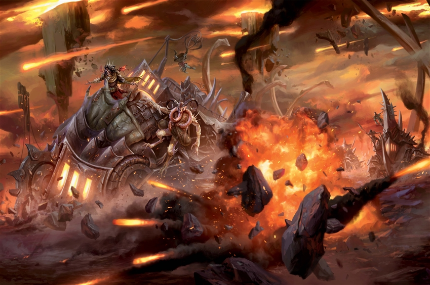

# 21 Aug 2024

**[Previously](2024-08-14.md):** At Fort Knucklebone, we found the kenku we were told in a vision to seek, Chukka and Clonk. They work for Mad Maggie, employed in her war machine workshop. She thinks she can help Lulu regain her memories with the help of a "dream machine", but first we need to find four items to repair it. We also help Chukka and Clonk with repairing one of their vehicles, named the Demon Grinder. They say we can borrow it, but we also need fuel for it: either soul coins (unethical) or demon ichor (a bit more ethical). Norgreath also needs components for his new spells, which we may find at the bazaar.

- [ ] Find enough soul coins and/or demon ichor to fuel the Demon Grinder
- [ ] Find components for Norgreath: an undead eyeball encased in a gem worth at least 150GP, and a pickled tentacle and an eyeball in a platinum vial (worth at least 400GP)
- [ ] Find a Nirvanan cogbox for the dream machine - a Modron ship crashed on the shore of the Styx. Pass through the dragon's jaws at the edge of the disk
- [ ] Find a heartstone for the dream machine - try Red Ruth at Mahadi's Emporium, as she stole Gella's heartstone
- [ ] Find Phlegethosian sand for the dream machine - found on the jagged, rocky plains of Phlegethos, the fourth layer of Hell
- [ ] Find astral pistons for the dream machine - try Uldrak the Tinker, found in a titanic helmet located in the western end of the plains of fire
- [ ] Seek Zariel's blade, as revealed in Barrisso's vision (it will "seek Zariel's blade: it's the key to her heart, and will sever Elturel's chains")
- [ ] Investigate Thavius Kreeg, High Overseer of Elturel
- [ ] Investigate the vampire High Rider Klav Ikaia at Shiarra's Market
- [ ] Find the other half of the Infernal contract between Kreeg and Zariel
- [ ] Free Elturel from Avernus

---

We trade the Potion of Fire Breath, and a magical communication device that Karthis has, for one soul coin. Barrisso says that as long as we trade the soul coin without using up the soul, this can still be considered ethical.

We're not sure that Norgreath can find his components here at the bazaar, as we would need more soul coins to trade: only soul coins seem to be accepted at the bazaar.

We exchange our soul coin for nine vials of demon ichor with Morwyn, the apothecary. But we're not sure if we have enough demon ichor to do all the travelling we need to.

---

We ponder our destinations. The problem with Mahadi's Emporium is that it moves: it was last seen south of here, over the Styx. We wander the bazaar to talk to people and hopefully get more information on where we can find the items we need.

We approach Morwyn, the apothecary. We ask her are there locations where we can cross the Styx: she tells us there is a ford to our south, west of the tar pits. She looks at our map:

"Zariel built a bridge across between two watchtowers. The bridge is guarded, but if you are driving over in an infernal machine, they won't stop you. There are other options. There are ramps, for example. Another option is boatmen who will ferry you across, even with your machine."

We ask her about the black tentacled creatures featured on the map: she doesn't know anything about them.

We ask Morwyn about Phlegethosian sand. "That tends to be used for various reasons, including necromancy. A warlord named **Feonor** uses it; her location is near **Bel's Forge** on the Styx, on our side of the river to the north of the volcano."

---

We talk to Chukka and Clonk. How many hours would it take to get to the necromancer in the Demon Grinder?

The Demon Grinder does about 20kph. Roughly we would need 2.5 hours per hex on the map. So it's about a 10 hour round trip to the necromancer. Lunghiss asks about a castle-like structure on the map on the route, but Chukka and Clonk have no idea.

---

Norgreath pleads that he needs his material components for his new spells, so we go and talk to Mad Maggie again. We ask about an undead eyeball encased in a gem worth at least 150GP, and a pickled tentacle and an eyeball in a platinum vial (worth at least 400GP). "How did you know I had these things?", she asks. "What will you offer me?"

We ask what she would like.

"Maybe you can bring me... information. I would like a truthful tale of all that you encounter, and all that you suspect." We ask if there is anything specific she would like. "Do you have any babies?" We decline.

She hands over an an undead eyeball encased in a gem. The gem is glowing and the eyeball inside is floating around inside. She also hands over a platinum vial and a pickled tentacle and an eyeball, both moving around. Norgreath can now casts his spells.

---

We return to the Demon Grinder and climb in. A Demon Grinder is a bulky, armored coach that rumbles loudly as it crushes obstacles and enemies in its path with the help of a swinging wrecking ball. Iron jaws are mounted on the front of the vehicle, which handles like a garbage truck.

It has three traits:

* **Crushing Wheels:** The Demon Grinder can move through the space of any Large or smaller creature. When it does, the creature must succeed on a DC 11 Dexterity saving throw or take 22 (4d10) bludgeoning damage and be knocked prone. If the creature was already prone, it takes an extra 22 (4d10) bludgeoning damage. This trait can’t be used against a particular creature more than once each turn.

* **Magic Weapons:** The Demon Grinder's weapon attacks are magical.

* **Prone Deficiency:** If the Demon Grinder rolls over and falls prone, it can’t right itself and is incapacitated until flipped upright.

It has four action stations:

* **Helm** *(Requires 1 Crew and Grants Three-Quarters Cover):* Drive and steer the Demon Grinder.

* **Chomper** *(Requires 1 Crew and Grants Half Cover):* Melee Weapon Attack: +9 to hit, reach 5 ft., one target. Hit: 25 (6d6 + 4) piercing damage. A target reduced to 0 hit points by this damage is ground to bits and spit out through pipes on both sides of the Demon Grinder. Any non-magical items the target was holding or carrying are destroyed as well.

* **Wrecking Ball** *(Requires 1 Crew and Grants Half Cover):* Melee Weapon Attack: +9 to hit, reach 15 ft., one target. Hit: 40 (8d8 + 4) bludgeoning damage. Double the damage if the target is an object or a structure.

* **2 Harpoon Flingers** *(Each Station Requires 1 Crew and Grants Half Cover):* Ammunition: 10 harpoons per station. Ranged Weapon Attack: +5 to hit, range 120 ft., one target. Hit: 9 (2d8) piercing damage.

Gralok takes up position at the chomper. Barrisso is at the wrecking ball. There are two harpoon flingers, only one of which is armed. Lunghiss mans one of the harpoons; Galen mans the empty harpoon. Karthis decides to drive, but later Gralok takes over so Karthis can cast spells, and Galen instead mans the chomper.

We head out north-west of the city, along a defined route to a ramp over the river. Before we get to the ramp, we veer north-east to the necromancer's lair. The demon ichor produces a terrible stench and noise as it is consumed by the engine.

Soon, we see a red plume of dust billowing up in the distance, in the direction we are travelling: it looks like another similar infernal war machine heading towards us:

<figure markdown>
  { width="400" }
  <figcaption>Infernal Machine</figcaption>
</figure>

We spot the crew: they consist of boar-headed and rat-headed humanoids, wearing goggles. We continue at full speed and veer slightly off course. Karthis notices the other vehicle also changes direction for a direct collision. At our maximum speed, we move 100ft per round.

We try to keep our distance from them and inflict damage. At 240ft, Karthis casts Fire Bolt *(with Inspiration)* at the enemy driver and hits, doing 6HP of damage.

We close to 200ft. Lunghiss readies his harpoon to fire at the enemy chomper operator.

Norgreath readies his usual attacks.

Galen readies his Dispel Magic spell.

We have closed the distance to 120ft. Lunghiss fires his harpoon: *(with Inspiration)*, he does 14HP of damage to the enemy chomper operator.

One of the enemy fires a harpoon at Barrisso, who mans our wrecking ball, but misses.

Norgreath casts Eldritch Blast (with Agonizing Blast and Genie's Wrath) at the enemy driver, but misses.

Gralok continues driving the vehicle.

Galen casts Dispel Magic at the enemy vehicle's engine, but the spell does not seem to overcome the magics powering the enemy vehicle.

An enemy were-rat fires at Lunghiss, doing 8HP of damage, halved by Uncanny Dodge.

Karthis casts Lightning Bolt at the chomper operator and driver. The bolt does 37HP of damage in a line through the enemy vehicle: the driver suffers 18HP of damage (half damage), another two enemies suffer 37HP of damage. The vehicle suffers a mishap: some of its shielding armour falls off.

The vehicles are now 60ft apart. Barrisso successfully casts Hold Person on the driver. The vehicle will now continue in the same direction.

Gralok tries to ram the enemy vehicle in the side. Each creature in our vehicle takes 7HP of damage, but our enemies take more (6D6). The vehicles come to a shuddering stop. We see our five opponents: three were-boars, including the driver, and two were-rats. Some look bloodied.

Lunghiss fires his harpoon at the held driver: along with sneak attack damage, he does 19HP of damage.

The were-rat fires his harpoon at Lunghiss. Lunghiss uses his reaction to cast Shield, which is sufficient to deflect the harpoon.

Norgreath casts Eldritch Blast (with Agonizing Blast and Genie's Wrath) at the enemy driver; with advantage, he does 29HP of damage.

Gralok decides to reverse our vehicle to ram the enemy again. It does more damage to us than it does to the enemy.

Galen uses the chomper on the enemy harpoonist on our side of the enemy vehicle. He grinds him up until he is quite dead. Galen tries to use Command on three opponents, using Common, shouting "Flee!". The harpoonist were-rat on the far side of the vehicle doesn't react. However, the chomper and wrecking-ball operators jump out and run away from the vehicle.

Karthis jumps out of the vehicle and casts Lightning Bolt at both the driver and harpoonist. The were-rat harpoonist suffers 13HP of damage, while the driver takes the full 27HP of damage and dies. He then jumps back in.

Barrisso jumps into the enemy vehicle and melee attacks the were-rat, using Divine Smite. His first attack with his rapier kills the were-rat.

The remaining two enemies are about 30 feet away on the other side of the enemy vehicle. [Lunghiss gets ready to attack....](2024-09-04.md)
