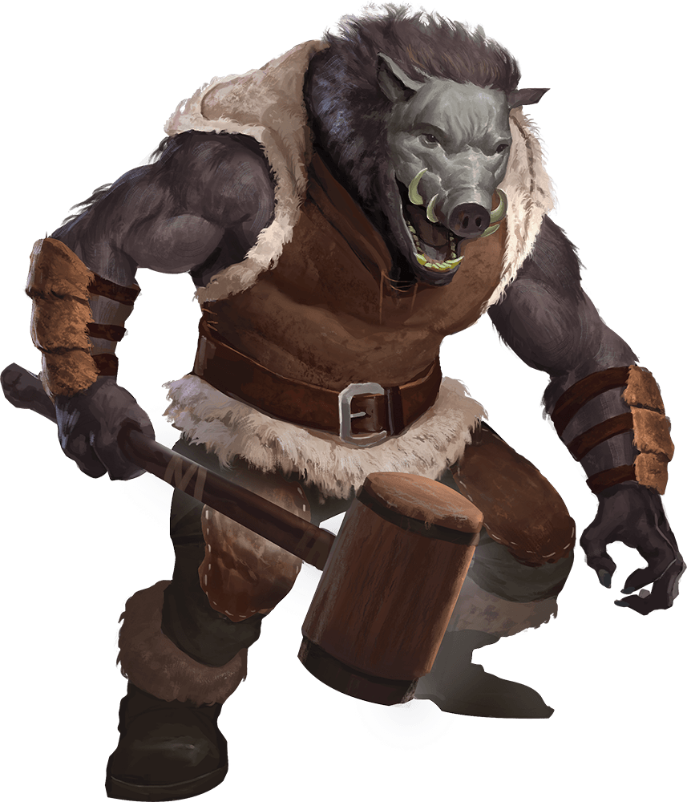
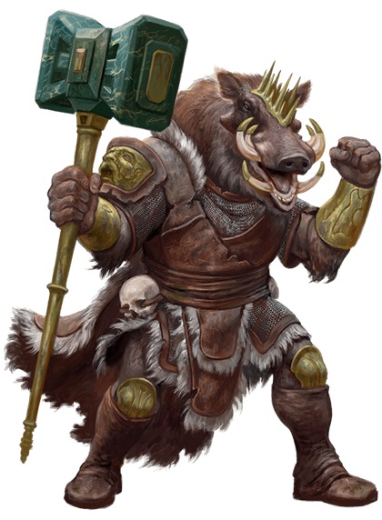

# 4 Sep 2024

**[Previously](2024-08-21.md):** At Fort Knucklebone on Avernus, we borrowed a Demon Grinder attack vehicle from the kenkus Chukka and Clonk. With a soul coin, we bought nine vials of demon ichor, enough to power the machine for 54 hours. Morwyn, the apothecary at the bazaar gave us information on crossing points for the Styx river. She also told us that we can get Phlegethosian sand (one of four items we need to repair a 'dream machine' to get Lulu's memories back) from a necromantic warlord named Feonor near Bel's Forge on the Styx, on our side of the river to the north of the volcano, a 10 hour round trip from Fort Knucklebone. From Mad Maggie, Norgreath also got the material components he needs for his new spells, in return for promising to bring her information about what we will see on our travels. On our way to Feonor, we were attacked by a similar vehicle, manned by five were-beasts. We took out their vehicle with lightning bolts and by ramming it, and have finished off three of the enemy. Two were-boars are currently fleeing the vehicle after Galen cast Command on them, and Lunghiss is about to attack...

- [X] Find enough soul coins and/or demon ichor to fuel the Demon Grinder
- [X] Find components for Norgreath: an undead eyeball encased in a gem worth at least 150GP, and a pickled tentacle and an eyeball in a platinum vial (worth at least 400GP)
- [ ] Find Phlegethosian sand for the dream machine - from a necromantic warlord named Feonor at Bel's Forge
- [ ] Find a Nirvanan cogbox for the dream machine - a Modron ship crashed on the shore of the Styx, accessible through the dragon's jaws at the edge of the disk
- [ ] Find a heartstone for the dream machine - try Red Ruth at Mahadi's Emporium, as she stole Gella's heartstone
- [ ] Find astral pistons for the dream machine - try Uldrak the Tinker, found in a titanic helmet located in the western end of the plains of fire
- [ ] Seek Zariel's blade, as revealed in Barrisso's vision (it will "seek Zariel's blade: it's the key to her heart, and will sever Elturel's chains")
- [ ] Investigate Thavius Kreeg, High Overseer of Elturel
- [ ] Investigate the vampire High Rider Klav Ikaia at Shiarra's Market
- [ ] Find the other half of the Infernal contract between Kreeg and Zariel
- [ ] Free Elturel from Avernus

---

Lunghiss leaves the vehicles and fires his shortbow at one of the were-boars, doing 7HP of piercing damage.

Norgreath casts Eldritch Blast (with Agonizing Blast and Genie's Wrath) at the same were-boar, killing it. His second attack damages the other were-boar, but does not kill it.

Gralok attempts to drive our Demon Grinder vehicle over the were-boar. There's an almighty noise as our furnace ruptures. The speed of the vehicle decreases to 70 feet per round until we repair it.

Galen casts Toll the Dead on the were-boar. He suffers 10 necrotic damage, but is still alive.

The were-boar is no longer under the influence of the Command spell from Galen, but is weaponless, apart from his tusks. He turns and snarls at us, but puts his hands up in surrender.

Karthis stands down.

Barrisso is in the vehicle and waits to drive over to the were-boar.

The group surrounds the were-boar:

<figure markdown>
  { width="200" }
  <figcaption>Were-Boar</figcaption>
</figure>

"Why did you attack us?"

"Cos Raggadragga said to!", pointing at one of the dead were-boars, presumably the leader.

"Where did you come from?"

"Across the wastes. You had a war machine, we wanted it."

He points north, not quite in the direction of Bel's Forge.

"What do you know of Bel's Forge?"

"It's dangerous. Because of Bel."

Lunghiss knows a little about Bel *(Arcana check)*; a creature high up in the devil hierarchy. Taq *(Int check)* says that Bel used to be an archduke of Avernus. The archduke we know of today is Zariel. We are aware there are shifts in the hierarchy as plots, deaths, and loss of faces occur.

We ask the were-boar about Feonor, what's he like.

"I think he's actually a she."

Barrisso demands that the were-boar get us the Phlegethosian sand. Norgreath intimidates him successfully. "I don't know where the sand is! But if you think Feonor has it, I can show you where she lives."

---

We check the vehicles to see which is in best condition. First we check the dead bodies. The leader, Raggadragga, a were-boar, has a maul near his body:

<figure markdown>
  { width="200" }
  <figcaption>Raggadragga</figcaption>
</figure>

Gralok picks up Raggadragga's maul, which is magical. He also examines his bracers: these are also magical. He also has a pouch with three soul-coins in it. Behind his seat is a battered metal chest. Inside are containers with a total of 64 vials of demon ichor (which can power either the Demon Grinder or the were-creatures' vehicle). We now have a total 72 vials (we have used one vial). The vehicle has a net strung on the back, pinioning various pieces of metal scrap to the vehicle. We think we can use some of the pieces to make repairs. The other dead bodies don't seem to have anything worthwhile. We abandon the bodies in the wastes.

To repair the furnace rupture on our vehicle, we need certain tools, which we don't have. We split the party among the two vehicles. We head back to Fort Knucklebone, where we want to find someone to repair the vehicles. We approach the kenkus, Chukka and Clonk, and explain what has happened.

"Do you want repairs? Can you pay? One coin.

That's only for one vehicle. Norgreath tries to persuade them to fix both for one coin. The kenkus laugh. We then try and offer them the captured vehicle, if they fix our Demon Grinder and fit it out with a missing weapon point and an offensive acid sprayer. They accept the deal. The repairs will take two days.

---

We find out more about Raggadragga's maul. Raggadragga's Maul is made of Avernian Green Steel. When you take the Attack action, you can direct one of your attacks at the ground of a space within 5 feet of you, even if it is occupied by another creature. If the result of your attack roll is 15 or higher, a 5-foot-long, 5-foot-wide, 5-foot-deep fissure opens in the space that you attack. For every 5 above 15, the length, width, and depth of the fissure each increase by 5 feet (for instance, an attack roll result of 25 will create a 15-foot long, 15-foot-wide, 15-foot-deep fissure). You can use this property a number of times equal to your proficiency bonus, regaining all expended uses when you finish a long rest. You have a +1 bonus to attack and damage rolls made with this magic weapon. Proficiency with a Maul allows you to add your proficiency bonus to the attack roll for any attack you make with it. This weapon has the following mastery property. To use this property, you must have a feature that lets you use it.

- **Topple**. If you hit a creature with this weapon, you can force the creature to make a Constitution saving throw (DC 8 plus the ability modifier used to make the attack roll and your Proficiency Bonus). On a failed save, the creature has the Prone condition.

Lunghiss takes the bracers, which are Bracers of Celerity, giving him an extra 10ft of speed.

---

We go to see Mad Maggie. We tell her of our encounter with the were-people, as we know she wants gossip as currency. "Ahhh! Sit! Sit" She puts out black cushions for us. She prepares something in a circle around us, then takes some skulls on the circumference, pointing inwards. "You don't mind if my sisters listen in, do you? So... what have you seen?"

We tell her of the encounter with Raggadragga and his crew, and how we have captured both an enemy vehicle and a were-boar.

"Interesting that you overcame Raggadragga so easily! It gives me hope you will bring back more information."

"Do you have any advice for when we meet Feonor?"

"Hmm... don't die?"

We ask about Bel's Forge, and Bel.

"Bel used to rule this plane, as an archduke, as Zariel is now. These things are Asmodeus's gift. Bel has a forge to run."

"Would it be a bad thing if we do anything to damage the forge?"

"To your health? Yes."

"Who are Feonor's allies?"

"She has an ally in Mahadi, of the wandering Emporium. Her rivals are the other warlords."

"Is there one she would be pleased to see brought down?"

"She is not actively seeking that, but she would not be displeased."

"Was Raggadragga a warlord?"

"No, he just had delusions of grandeur."

"What would Feonor value by way of trade?"

"Do you have several ghouls to give her? She has a fondness for the undead."

---

Norgreath communes with his marid genie patron. It asks that certain things be procured, so that its sponsorship of Norgreath is worthwhile. It wants a portion of the things that Norgreath collects for its collection.

Norgreath asks his genie patron for advice on saving his soul. He says that Elturel needs to be saved, its chains severed, and the pact broken. The two halves of the infernal contract must be combined, then destroyed, to break the pact. Or you could try and persuade Zariel to break the contract. You should seek the flying fortress of Zariel to find more about the contract. Norgreath tells the rest of the group about his discussion.

We find a place to have a long rest, and have a quiet life for a few days. Galen with Lunghiss' assistance goes to talk to the kenkus about getting tools for the vehicle. They put together a smith's kit for him (Galen has proficiency in this), suitable for fixing a vehicle. [Time passes...](2024-09-11.md)
