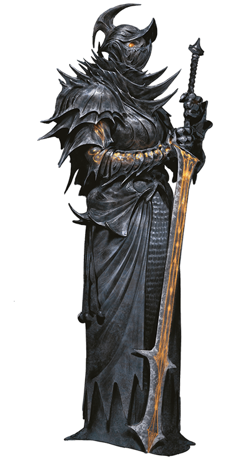

# 11 Sep 2024

**[Previously](2024-09-04.md):** In our Demon Grinder vehicle, acquired from the kenkus at Fort Knucklebone, we fought some were-creature raiders led by one named Raggadragga while on our way to Feonor near Bel's Forge to get some Phlegethosian sand. We acquired his magical maul, an extra 64 vials of demon ichor to power our vehicle, a were-boar hostage who will help us find Feonor, and a captured vehicle. We returned to Fort Knucklebone, where we divulged information as requested to Mad Maggie. We offer the kenkus the captured vehicle if they fix our Demon Grinder and fit it out with a missing weapon point and an offensive acid sprayer. They accept the deal. The repairs will take two days and we take a long rest (we do not heal as well on Avernus).

- [ ] Find Phlegethosian sand for the dream machine - from a necromantic warlord named Feonor near Bel's Forge
- [ ] Find a Nirvanan cogbox for the dream machine - a Modron ship crashed on the shore of the Styx, accessible through the dragon's jaws at the edge of the disk
- [ ] Find a heartstone for the dream machine - try Red Ruth at Mahadi's Emporium, as she stole Gella's heartstone
- [ ] Find astral pistons for the dream machine - try Uldrak the Tinker, found in a titanic helmet located in the western end of the plains of fire
- [ ] Seek Zariel's blade, as revealed in Barrisso's vision (it will "seek Zariel's blade: it's the key to her heart, and will sever Elturel's chains")
- [ ] Investigate Thavius Kreeg, High Overseer of Elturel
- [ ] Investigate the vampire High Rider Klav Ikaia at Shiarra's Market
- [ ] Find the other half of the Infernal contract between Kreeg and Zariel
- [ ] Free Elturel from Avernus

---

We spent time waiting for the repairs and improvements to be done to our Demon Grinder. After two days, Chukka and Clonk tell us it's ready. The vehicle now features an Acid Bile Sprayer. This hose weapon is attached to demonic organs that produce an acidic bile that dissolves flesh on contact.

* **Acidic Bile Sprayer** *(Requires 1 Crew and Grants Half Cover, Recharge 5–6)*. Acidic bile sprays from a nozzle in a 30-foot cone. Each creature in the cone must make a DC 12 Dexterity saving throw, taking 40 (9d8) acid damage on a failed save, or half as much damage on a successful one. A creature reduced to 0 hit points by this damage is dissolved, leaving behind any objects it was carrying or wearing.

The Demon Grinder now has full armour and health back.

Our were-boar hostage, Razorfang, is in the vehicle. We head off to Feonor, with Karthis driving. Lunghiss mans the harpoon, Barrisso takes charge of the acid sprayer, Galen takes charge of the chomper, and Norgreath uses the wrecking ball.

We pass the point we met the were-boar crew, and keep going. After a while, we feel that Avernus itself is oppressing us: the whole evil of the plane is weighing on our bodies and souls *(Con check)* Barrisso, who fails, takes 1HP of psychic damage.

---

We pass what look like trees but made from wrought iron, leading up to a ramp that appears to go over the Styx. Bodies, writhing in torment and encased in metal armour, are speared on these trees. We see bloating stirges feeding on their blood.

We wonder if we should approach the nearest of the bodies and speak to them, but Barrisso decides to observe one from afar. They are in agony. On their metal armour is a symbol. Galen thinks it's an old symbol of Elturel before the Companion: these must be the Hellriders. We decide we must free them.

From the vehicle, Norgreath casts Eldritch Blast (with Agonizing Blast and Genie's Wrath) at a stirge. It explodes in a pile of gore. His second attack misses a second stirge.

Galen misses with his crossbow.

Karthis hits with a Fire Bolt, doing 3HP of fire damage, killing it.

Barrisso thinks that if if removes the Hellrider from their spikes, they will die, but that this may be a mercy. Lunghiss *(Religion check)* thinks if someone good dies, they will go to the plane of their deity; if evil, they will go to a lower plane. If this is a Hellrider who came to Avernus, and a good person and die here, they will be released to their upper planes. Or, they could be trapped here.

Barrisso calls to the Hellrider, but they do not react to that name. As we try to remove him from the tree, a group of five stirges run towards us. They are still a few rounds away.

Galen holds some healing until the Hellrider has been removed from the spikes.

Norgreath flies up to the Hellrider (a Warlork ability) and physically lifts him off the metallic branch, unfortunately ripping him more as he does so. His body crumbles to dust. At least he is saved from eternal pain.

Lunghiss fires his shortbow (with disadvantage) at the stirge horde, but misses.

Gralok and Barrisso prepare for the coming attack.

Karthis casts Fire Bolt at the stirges, but misses.

Galen waits.

Norgreath stays flying and fires with his longbow, but misses.

Lunghiss misses again with his shortbow.

As the stirges get closer, we notice another group of them further back.

Gralok uses his shortbow and one falls.

Barrisso fires his longbow: 10HP of damage kills a stirge. The second attack misses.

Karthis casts Fire Bolt but misses.

Galen fires his crossbow but misses.

Norgreath fires his longbow, killing one.

Lunghiss' shortbow does 4HP of damage, killing another stirge. One of the forward group remains.

Gralok's shortbow finishes off the last of the forward group.

The second group of stirges are now around 320 feet away.

Gralok's second attack kills one with 4HP of damage.

Barrisso fires his longbow twice; his second shot kills a stirge.

Karthis tries to see how many stirges there are, but fails.

Norgreath attacks, but misses.

Lunghiss kills another stirge with his shortbow.

We hear from the trees in the distance a horrible scream of fear and terror as a creature descends from the sky on a horse with flaming hooves. Seated on this nightmare is a black-armoured figure with red glowing eyes and a two-handed sword on its back:

<figure markdown>
  { width="200" }
  <figcaption>Haruman</figcaption>
</figure>

Gralok fires his shortbow at the rider, but misses.

Barrisso also fires, but misses.

Karthis tries to count the stirges, but again fails. He cast a Fire Bolt at the stirges, killing one.

Lulu, when she sees the rider coming towards us, says "I've just remembered something! When Zariel was replaced she said to me 'This is who I am now. When demons die they cry out my name in terror' That is one of her lieutenants, Haruman.". Barrisso recalls Haruman [from his vision](2024-07-25.md).

*("As the man draws near the trio before you, he brings his horse to a stop and then dismounts. The trio does likewise. A herald steps forward and announces, "Haruman, Lord Knight of the Far Hills greets Lord Olanthius.")*

Galen casts Bless on all of the party.

Norgreath casts Shadow of Moil.

Lunghiss fires his shortbow, killing another stirge.

Gralok fires his shortbow, but both attacks miss.

Barrisso fires his longbow twice but misses.

Karthis tries to count the stirges again, but fails. His Fire Bolt kills another one.

Galen fires his crossbow, but misses.

Norgreath casts Eldritch Blast (with Agonizing Blast and Genie's Wrath) at Haruman, doing a total of 16HP of damage.

Lunghiss casts Shadow Blade with his bonus action, then fires his shortbow at Haruman but misses.

The stirges gets closer: there are 35 of them.

Gralok attacks Haruman with his shortbow, but misses.

Barrisso fires his longbow at Haruman, doing 6HP of piercing damage. His second attack also hits, doing another 3HP.

Karthis casts Fireball at the stirges: the 43HP of fire damage kill them all.

Haruman is now within 30 feet of us. He issues a Terrifying Command. Lunghiss and Karthis both fail, and are Frightened for one minute.

Lunghiss tries to oppose his Frightened state *(Charisma save)* but fails.

Galen casts Spiritual Weapon, doing 17HP of damage to Haruman. He then casts Sacred Flame at him, but Haruman saves.

Norgreath casts Eldritch Blast (with Agonizing Blast and Genie's Wrath) at Haruman twice, but both miss.

Lunghiss fires his shortbow, doing 7HP of damage. He successfully rolls a charisma save and is free of being Frightened.

Gralok rages, then throws two silvered javelins at Haruman, but they miss.

Barrisso casts Hunter's Mark on Haruman, then fires his longbow twice, doing 15HP of damage.

Karthis casts Witch Bolt, but misses. He also successfully rolls a charisma save and is free of being Frightened.

Haruman attacks Gralok three times successfully, doing 57HP of damage - Gralok is down to 6HP of damage. He then calls out to us all in a deep voice: "You must not release the traitors!"

Barrisso pleads that we didn't know they were traitors.

In the meantime, Galen attempts Banishment on Haruman. The creature pops out of existence, but since it seems to be from this plane of existence, it will be back in one minute. The nightmare is still there. We jump into the Demon Grinder and [drive away towards Feonor....](2024-09-18.md)
