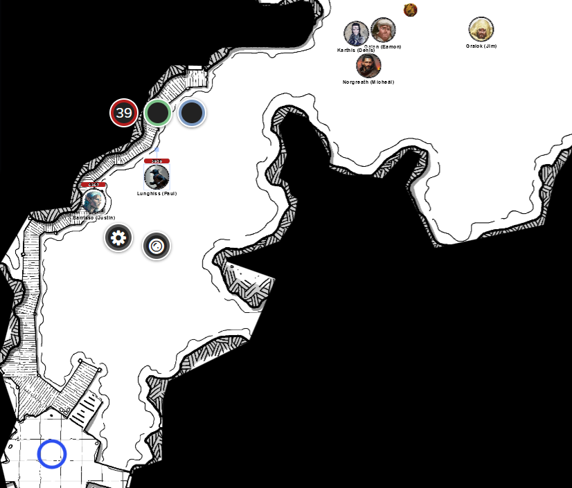
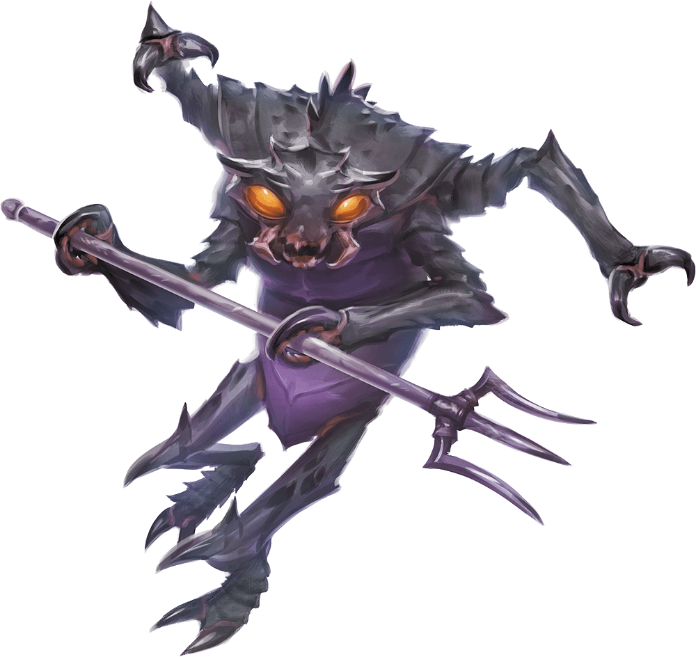
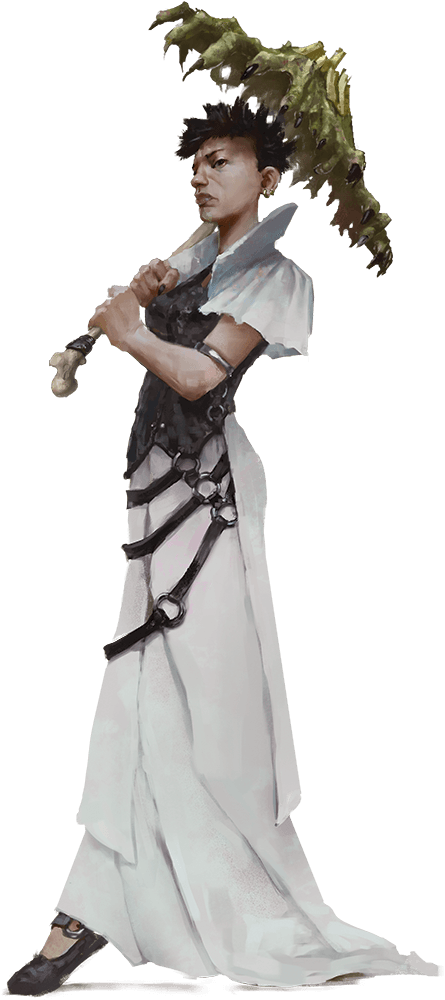
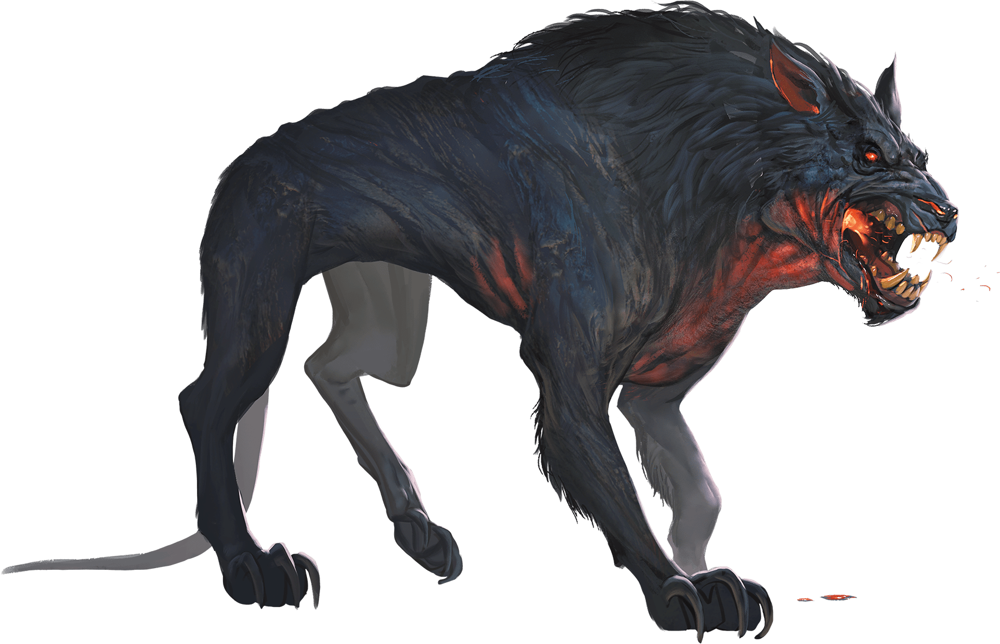

# 18 Sep 2024

**[Previously](2024-09-11.md):** In our repaired and upgraded Demon Grinder vehicle, we left Fort Knucklebone once more to head to the necromancer Feonor near Bel's Forge to get some Phlegethosian sand (one of the four ingredients for the "dream machine" to bring back Lulu's memories). On the way there, we found a long line of steel trees upon which still-living Hellriders were impaled in eternal torment. We freed one, only to be attacked by a deluge of stirges and then by Haruman, one of Zariel's lieutenants: seated on a nightmare, a black-armoured figure with red glowing eyes and a two-handed sword on its back. After it almost killed Gralok with one blow, it roared "You must not release the traitors!" and we decided we should retreat. Galen cast Banishment on the creature and we used the time available to drive away in the Demon Grinder towards Feonor....

- [ ] Find Phlegethosian sand for the dream machine - from a necromantic warlord named Feonor near Bel's Forge
- [ ] Find a Nirvanan cogbox for the dream machine - a Modron ship crashed on the shore of the Styx, accessible through the dragon's jaws at the edge of the disk
- [ ] Find a heartstone for the dream machine - try Red Ruth at Mahadi's Emporium, as she stole Gella's heartstone
- [ ] Find astral pistons for the dream machine - try Uldrak the Tinker, found in a titanic helmet located in the western end of the plains of fire
- [ ] Seek Zariel's blade, as revealed in Barrisso's vision (it will "seek Zariel's blade: it's the key to her heart, and will sever Elturel's chains")
- [ ] Investigate Thavius Kreeg, High Overseer of Elturel
- [ ] Investigate the vampire High Rider Klav Ikaia at Shiarra's Market
- [ ] Rescue the Hellriders
- [ ] Find the other half of the Infernal contract between Kreeg and Zariel
- [ ] Free Elturel from Avernus

---

We flee from the nightmare in our Demon Grinder; we decide we should try and injure it before Haruman is returned from wherever he was sent by Galen's Banishment spell.

Galen's Spiritual Weapon attacks the nightmare and does 16HP of force damage. Galen casts Toll the Dead on it as well, doing 11HP of necrotic damage.

Norgreath casts Eldritch Blast (with Agonizing Blast and Genie's Wrath) at the nightmare, but misses.

Lunghiss fires one of the vehicle's harpoons at the beast, doing 8HP of piercing damage.

Gralok fires his shortbow twice: one hits, doing 8HP of piercing damage.

Barrisso is manning the vehicle's acidic bile sprayer, but it cannot reach the nightmare. He casts Toll the Dead but the creature saves.

Karthis casts Ray of Frost, doing 8HP of cold damage and also slowing the nightmare down.

Lulu trumpets "WE NEED TO LEAVE!".

The nightmare flies towards us through the air and attacks Gralok, but misses, and soars away.

Galen's Spiritual Weapon can't reach the nightmare this round. Galen casts Toll the Dead but it takes no damage.

Norgreath casts Eldritch Blast (with Agonizing Blast and Genie's Wrath) (with advantage because of the active Shadow of Moil) at the nightmare, felling the beast.

---

The form of the creature remains, suggesting that maybe it is not a summoned creature. Barrisso casts Detect Magic on the creature's harness and tack and registers a positive. Gralok takes everything the creature is wearing. At that point, Karthis guns the vehicle and off we roar.

Galen casts Cure Wounds on Gralok, doing 18HP of healing. Barrisso gives Gralok a potion of greater healing to use, which gives him 13HP of healing back.

---

As we head north-east towards Bel's Forge, we see a figure appear in the sky behind us, then fall to the ground, then land on his two feet. He picks up his sword and sweeps it around, as if searching for something, then sees us in the distance, points his sword at us and watches us disappear...

---

We take a short rest in the vehicle as Karthis drives. Barrisso tries to attune to the nightmare's tack but fails, as it is not complete: Haruman is still wearing his spurs.

We head towards Bel's Forge. We follow the course of the Styx; we see a boat travelling along the Styx, sailing away from us, and creatures on the far side of the river. Some of us take damage from the lingering effects of being in Avernus so long. Razorfang our hostage points out where we can find Feonor's lair.

We decide to drive our Demon Grinder right up to her lair, going slowly in an attempt not to look aggressive. However, as we negotiate a gorge with a sandy floor crowded in by rocks, we think our Demon Grinder may not be able to handle these narrow confines, and decide to park the vehicle and continue on foot.

In the walls of the gorge we see what looks like a door, made of worked stone, similar to the surrounding rock. There's a walkway which follows the wall; as we follow it south, we see five humanoid creatures, which look undead:

<figure markdown>
  { width="400" }
  <figcaption>Feonor's Lair</figcaption>
</figure>

The creatures turn to us, but make no other action.

We see several stone doors off the gorge. To the east is a cavern entrance.

Barrisso shouts "I would speak with Feonor!".

One of the undead turns to us, and with his very long tongue lisps at us "Feonor? What business do you have?"

"We wish to trade."

"Hmmm."

It turns to another creature and whispers to it in a language you do not understand. That creature turns and disappears into the complex.

Two mezzoloths appear and chitter to each other, then disappear:

<figure markdown>
  { width="200" }
  <figcaption>Mezzoloth</figcaption>
</figure>

Shortly after, a human with milky-white eyes appears, carrying a parasol, made of bones covered in human skin. We presume this is Feonor:

<figure markdown>
  { width="200" }
  <figcaption>Feonor</figcaption>
</figure>

We gain the impression that the various entrances of the complex now have undead gathered at them: her court has arrived.

Barrisso says "My good lady Feonor! Are you in the mood for some trade?"

She has a scowl on her face of deep irritation. The mezzoloth in front of her chitters, and suddenly Barrisso's mind gets a feel it is speaking directly to it.

"My lady asks what you wish to trade?"

"We would like some Phlegethosian sand, which we believe m'lady has. We have in our possession an infernal tack which we can offer in exchange."

There's more chittering and staring.

"How much sand?"

We realise we don't know exactly how much.

"We need to repair a machine with some."

There's more murmuring.

"Show us the tack."

"Would things improve if we tell you who the previous owner was? It was Haruman. How much sand is it worth to you?"

"My lady says it may be a curse. It may be detrimental to have his tack."

"But it may be a good thing to give him back his tack."

"You may have a reasonable argument, mortal." *(Successful persuasion check)*

A mezzoloth comes over to check the tack, and responds "The tack is incomplete."

Barrisso argues this is a good thing, as Haruman wants to restore his equipment.

"Agreed", says the mezzoloth.

One of the ghouls comes back with a wooden chest, and opens the lid. The chest is full of iridescent black sand. Barrisso asks if it's OK to cast Detect Magic on the sand: Feonor nods. Barrisso does his detect magic, but no school of magic: that suggests it's not an illusion.

We offer the mezzoloth the tack: the nearest one says "Give my lady's best wishes to Mad Maggie." Everyone retreats except the ghouls.

---

We decide next to try and find Mahadi's Emporium, from where we hope to find a heartstone for the dream machine. Taq flies up into the air and observes the sights of the wider area. We decide to head back the same route we came, and go to Fort Knucklebone, with Taq scouting ahead.

After a while, we come across the wreck of a war machine: a four-person one, smaller than ours. The front is covered by a bronze devil's face, with a red crystal tube emerging tongue-like from the mouth. The vehicle is rusted, and the rear completely torn away.

Barrisso *(Arcana check)* thinks the tongue-like item is a weapon. Lunghiss does not spot any traps, but he feel we need to figure out how to safely detach the tube. Lunghiss investigates, and sees that the tube 3 feet long, 2 inches wide, and weighs 25 pounds. It has a slot for a soul coin: it expends the energy outwards. A soul cannon, so to speak.

He also spots two seats holding the badly-decomposed corpses of the original occupants: they are both cambions, half-devil creatures.

Lunghiss detaches *(Arcana check)* the tube. It has a range of 200 feet, and inflicts 8D10 damage on a hit. Lunghiss *(Perception check)* finds on one cambion a leather pouch with a soul coin; the other cambion has a platinum ring. The ring has an aura of alteration magic. Nothing else is left in the wrecked vehicle.

---

We continue on our way to Fort Knucklebone. We see ahead of us a pack of eight hell hounds, 300 feet away:

<figure markdown>
  { width="400" }
  <figcaption>Hell Hound</figcaption>
</figure>

Karthis casts Ice Storm, trying to include as many hell hounds as possible. They take damage, a mix of 24 and 12 HP of damage.

Lunghiss waits.

Gralok drives towards them, closing 100 feet.

The hell hounds dash towards us: they are now 100 feet away.

Galen fires a crossbow (with inspiration), doing 9HP of damage.

Norgreath casts Eldritch Blast (with Agonizing Blast and Genie's Wrath) at the beast, doing 11HP of force damage: the hell hound dies.

Barrisso fires his longbow twice, doing 14HP of damage.

Karthis casts Lightning Bolt, doing a mix of 32HP and 16HP of damage: two hell hounds die.

Lunghiss fires his harpoon at a damaged hell hound: with inspiration, he hits, doing 11HP of damage and killing it.

Gralok drives through two hell hounds, but both of them save and avoid all damage.

Four hell hounds are now around the Demon Grinder and can attack us. They all cast Fire Breath, doing various amounts of damage to the party.

Galen casts Toll the Dead on a damaged hell hound: his 15HP of necrotic damage hurts it but doesn't kill it.

Norgreath casts Eldritch Blast (with Agonizing Blast and Genie's Wrath) twice: his first kills a hell hound, the second hurts one.

Barrisso attacks with his rapier and shortsword from the vehicle: his 12 piercing damage kills the hell hound that Norgreath hurt. His second and third attacks wound a hell hound. Two remain.

Karthis casts Shatter, doing 7HP of damage to each hell hound.

Lunghiss performs a sneak attack with his shortbow: his 15HP of damage kill a hell hound. One remains.

Gralok drives at the remaining hell hound but misses.

The hell hound attempts to bite Lunghiss, but misses.

Galen casts Toll the Dead, doing 8HP of necrotic damage.

Norgreath casts Eldritch Blast (with Agonizing Blast and Genie's Wrath) twice: one hits, for 13HP of force damage.

Barrisso attacks three times: his last shortsword attack hits, killing it. All the hell hounds who attacked us now lie slain. [We head onwards....](2024-09-25.md)
