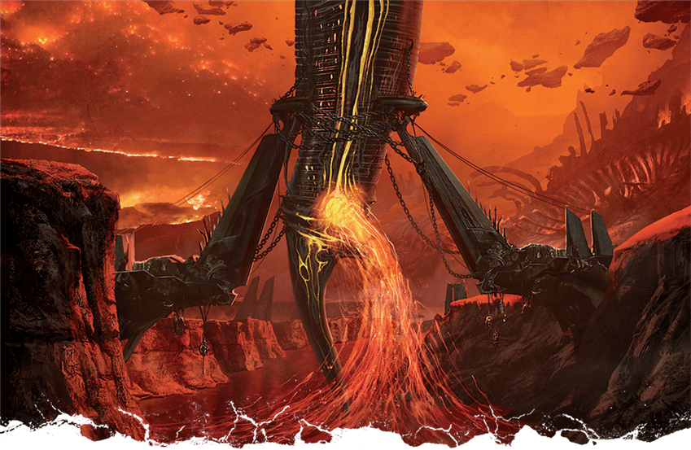
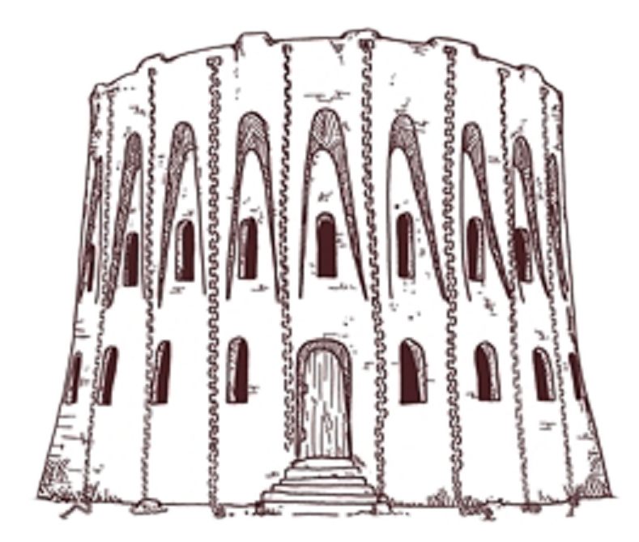
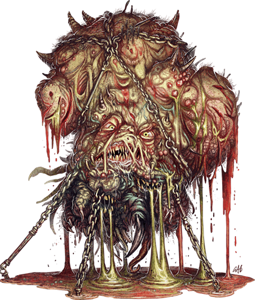

# 25 Sep 2024

**[Previously](2024-09-18.md):** After our almost lethal fight with Haruman, lieutenant of Zariel, we killed his nightmare steed and stole its tack, then continued on our way towards Feonor's lair. We made a deal with her, giving her the tack in return for Phlegethosian sand. On the way back, we found a wrecked war machine and managed to remove a weapon from it we can only describe as a "soul cannon". Soon after, we attack a pack of eight hell hounds, and dispatch them.

- [X] Find Phlegethosian sand for the dream machine - from a necromantic warlord named Feonor near Bel's Forge
- [ ] Find a Nirvanan cogbox for the dream machine - a Modron ship crashed on the shore of the Styx
- [ ] Find a heartstone for the dream machine - try Red Ruth at Mahadi's Emporium, as she stole Gella's heartstone
- [ ] Find astral pistons for the dream machine - try Uldrak the Tinker, found in a titanic helmet located in the western end of the plains of fire
- [ ] Seek Zariel's blade, as revealed in Barrisso's vision (it will "seek Zariel's blade: it's the key to her heart, and will sever Elturel's chains")
- [ ] Investigate Thavius Kreeg, High Overseer of Elturel
- [ ] Investigate the vampire High Rider Klav Ikaia at Shiarra's Market
- [ ] Rescue the Hellriders
- [ ] Find the other half of the Infernal contract between Kreeg and Zariel
- [ ] Free Elturel from Avernus

---

Galen casts Prayer of Healing, giving the party back 22HP of healing each.

As we drive, thick purple clouds gather above us and issue acid rain. Luckily we can all take refuge in the vehicle.

We arrive back at Fort Knucklebone. We go straight to Mad Maggie, to relate what has happened and that we got some Phlegethosian sand. The floating flameskull Barnabas is there, along with the  insectoid-mammal-like creature named Mickey.

She urges us to sit down on cushions, rearranges her collection of skulls to face to us, and asks us to recount our experiences.

<figure markdown>
  { width="200" }
  <figcaption>Mad Maggie and Mickey</figcaption>
</figure>

Gralok picks up one of Mad Maggie's skulls, and from it hears a faint whispering noise. However, he cannot cannot discern what it's saying *(Persuasion check)*. Gralok suffers 9HP of necrotic damage, and drops the skull.

Norgreath *(Arcana check)* thinks there is some of ritualised spellcasting going on, but does not know what spells are involved.

We sit down with Mad Maggie and tell her everything that has happened, not holding anything back. She looks interested when we tell her we got the Phlegethosian sand, and tells us to bring it to Chukka and Clonk. We ask her for the story of what happened to Haruman. We ask why he holds a grudge to the Hellriders. "The Hellriders deserted Zariel, and escaped."

We bring the sand to the kenkus. They store it away and tell us to go and get the three other components. We set up camp and take a long rest.

We decided to head off and cross a bridge we know is over the Styx, hugging the banks of the Styx until we reach it. Then we will head west to find Uldrak the Tinker, found in a titanic helmet which we can see on our map, alongside a giant sword.

---

After four hours of driving, we see in the distance a massive iron structure, two metal arms, stretching across the Styx:

<figure markdown>
  { width="400" }
  <figcaption>Styx Structure</figcaption>
</figure>

Hefty clamps are affixed, to lash what looks like a large vessel between the arms. Even from the distance, we hear a thrumming noise from it.

As we continue on, the ambient temperature increases to an uncomfortable degree. *(Anyone with heavy or medium armour, has disadvantage on an easy Con save)* Everyone saved, but once we near the bridge, people are affected by the heat and suffer a level of exhaustion.

We finally approach a watchtower leading to the bridge:

<figure markdown>
  { width="200" }
  <figcaption>Styx Watchtower</figcaption>
</figure>

The ground around each tower has been cleared and flattened in a 60' radius. The stone span behind crosses the Styx: it is 40' wide, with 5' balustrades each side. Carved into the bridge walls are bas reliefs. At the far end of the bridge, we can see a similar watchtower. We don't see anything moving around.

On the bridge are six carvings, with six inscriptions, each showing a particular scene.

The first shows a female devil with bat wings and horns, amidst lush forest surroundings. We recognise this as Zariel. The inscription reads "She served in the armies of the Lord of the Nine, in the younger days when Avernus had not become the Ninth." Karthis knows *(Arcana check)* that the Lord of the Nine is Asmodeus.

The second carving shows Zariel, depicted with Lulu (in giant form), along with two people, Yael and Haruman, and six devils. There are cartouches under each of the devils showing their names: Zilannen, Tozromon, Brullmerath, Xilka, and Venthroxoth. The inscription under says "In memory of her comrades lost over the long eons of struggle."

The third carving shows Zariel, kneeling before a bearded, noble-looking devil, that we recognise as Asmodeus. Her wings are on fire. The inscription reads "At the feet of the Archfiend her heart was opened to the truth, and she ascended to the ranks of the esteemed."

The fourth carving shows Zariel in chains. Above are displayed five dragon's heads. The inscription reads, "At the false word of the coward Bel, she was sealed in the prisons of the Progenitor." Karthis recognises the dragon head as Tiamat, the Progenitor of the description.

The fifth carving shows Zariel on the frontlines of a titanic battle between devils and creatures that look like a mix of devils and demons. The inscription reads, "In glory did she triumph where false Bel failed, in the name of the Lord of Nessus."

The sixth and last carving shows Asmodeus crowning Zariel. The inscription reads "All hail the Archduchess of Avernus, may she rule eternally at the left hand of the Archfiend."

We continue across the bridge to the other side.

---

A distance from the other wide of the Styx, we see a disgusting scab rising as a hill 300 feet high from a giant pool of blood. Many black chains converge on it, similar to the chains holding Elturel to the ground. We do not see anything moving.

We continue one.

---

We encounter a 15 foot glob of quivering flesh attached to the scaffold. Two fiends, wrapped in chains, are standing on top of the scaffold torturing the bloated creature below them by tightening the chains:

<figure markdown>
  { width="200" }
  <figcaption>Tortured Demon</figcaption>
</figure>

Demon ichor is oozing from its wounds, forming a pool. A jackal-heading fiend is using a horn to shout at the prisoner in multiple languages. We recognise it speaking in Infernal, saying "Tell me everything you know about ...".

Karthis recognises the blob as a demon, while the two fiends are chain devils.

"Tell me all you know about Zariel's flying fortress."

This sounds interesting, but we decide to stay on the mission and continue to Uldrak the Tinker.

---

Fumes fill the air, arising from the ground around us, and some suffer poison damage.

As we continue on, we see a barren hill with more acrid smog around it. Arising from the hill are a pair of leaning monoliths, 50 feet tall. South-east of us we see the ground on fire in patches, just like on our map.

We finally see our destination: a giant sword thrust into the ground, alongside a massive cracked helm, on top of a hill. They must have fit a titan. In the pommel of the sword is a giant stone that gleams with scarlet radiance. The helm is where we hope to find Uldrak the Tinker, from whom we can get astral pistons.

We leave the Demon Grinder and climb the hill to the helm. There is a creature here, a Spined Devil. Around the helm is all sort of detritus similar to Chukka and Clonk's scrapyard. We see tracks of other war machines in the area. We guess they come here for repairs.

The Spined Devil carries a tool belt similar to our vehicle repairing tools.

Barrisso asks, "We are looking for Uldrak."

The devil looks at us and says "How would you know if it was Uldrak?" in Infernal. In Giant, it says something we don't understand.

We ask if he would be willing to trade. He speaks again in Giant, and Barrisso asks him to switch language. He says "No".

"We are looking for astral pistons."

"Uldrak might."

"Where is he?"

"Sons of Gond are not so easily found."

"Can you help us talk to Uldrak?"

"It is me!"

We ask him to trade with us. We first offer soul coins.

"I would like the end of my curse. I would like to regain my true form."

We guess he must have been large enough to fit the armour around him.

"I must spill the blood of she who cursed me - Tiamat. However, I have learned that a disciple of Tiamat, a dragonborn named Arkhan the Cruel, carries a vial of Tiamat's blood in a reliquary around his neck. My sword has a pommel with an Orb of Dragonkind in it. But I do not know how to dislodge the pommel."

The sword has been buried millennia, and seen better days. Norgreath flies up the pommel to see if he can dislodge it. He pushes it, but it does not move. Next, he ties a rope around it, then drops the other end to the ground.

Gralok climbs up the rope and tries to break the orb out of the pommel using his maul. Out pops the six-foot gem, which falls to the ground. Barrisso puts his hand on it, and [something happens...](2024-10-02.md)

