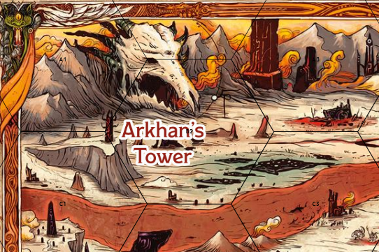
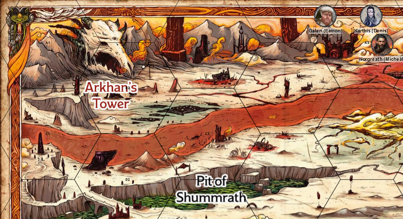
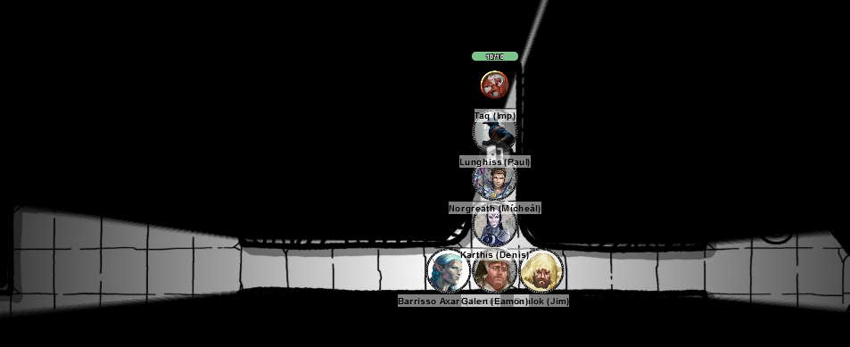

# 2 Oct 2024

**[Previously](2024-09-25.md):** After trading with Feonor for Phlegethosian sand, we returned to Fort Knucklebone and talked with Mad Maggie, had a long rest, then set off again to find the second ingredient we require for the dream machine: astral pistons, from Uldrak the Tinker. On our route we encountered an ornate bridge with six carved panels, detailing the story of what happened to Zariel when she came to Avernus. We then passed the strange sight of a large blob of flesh (seemingly a demon) being tortured by two devils to tell them the location of Zariel's flying fortress - something we ourselves want to know. But we headed on to our destination: the location of a giant helmet and sword on our map. There we meet a spined devil who turned out to be Uldrak the Tinker himself, but a curse has changed him from his original giant form. He asks us to "spill the blood" of Tiamat. Fortunately, rather than having to kill it, a dragonborn named Arkhan the Cruel, who is a disciple of Tiamat, carries a vial of Tiamat's blood in a reliquary around his neck. Uldrak's giant sword has a pommel with an Orb of Dragonkind in it, which he suggests we can trade with Arkhan for the vial. We dislodge the orb from the pommel...

- [ ] Use the Orb of Dragonkind to get a vial of Tiamat's blood from Arkhan the Cruel
- [ ] Revert Uldrak the Tinker to his giant form
- [ ] Find astral pistons for the dream machine - try Uldrak the Tinker, found in a titanic helmet located in the western end of the plains of fire
- [ ] Find a Nirvanan cogbox for the dream machine - a Modron ship crashed on the shore of the Styx
- [ ] Find a heartstone for the dream machine - try Red Ruth at Mahadi's Emporium, as she stole Gella's heartstone
- [ ] Find out from the tortured blob where Zariel's flying fortress is.
- [ ] Seek Zariel's blade, as revealed in Barrisso's vision (it will "seek Zariel's blade: it's the key to her heart, and will sever Elturel's chains")
- [ ] Investigate Thavius Kreeg, High Overseer of Elturel
- [ ] Investigate the vampire High Rider Klav Ikaia at Shiarra's Market
- [ ] Rescue the Hellriders
- [ ] Find the other half of the Infernal contract between Kreeg and Zariel
- [ ] Free Elturel from Avernus

---

The freed orb falls and shrinks down to the size of a crystal ball. On touching the orb, Barrisso has a vision: he sees Uldrak in his original form, in front of Tiamat: an awesome five-headed dragon. He senses a curse being placed on Uldrak. Barrisso puts the orb down, and tells the rest of the party about the vision.

Uldrak tells us that Arkhan is at a place called Arkhan's Tower; this is near to the dragon's jaws through which Dis is accessible:

<figure markdown>
  { width="400" }
  <figcaption>Arkhan's Tower (Map)</figcaption>
</figure>

Uldrak tells us there should be bridges to cross the Styx on our way. Or perhaps ferrymen. Or we could even fly or teleport across?

We ask Uldrak about Mahadi's Emporium. He says last he heard, it was on the northern side of the Pit of Shummrath:

<figure markdown>
  { width="400" }
  <figcaption>Pit of Shummrath (Map)</figcaption>
</figure>

Uldrak thinks that the Modron ship we seek is far to the south-east. He also tells us that many warlords who get their war machines repaired with him are scouring the landscape for Zariel's sword. 

We ask Uldrak about an obelisk we see on our map, near to Arkhan's Tower. It's the Obelisk of Ubbalux. There is a creature there which seeks aid from passers-by. 

In the middle of our map is a tower with an orb over it: it's called The Demon Zapper. To the west of the map is another structure, The Arches of Ulloch. This is a form of gate: many people have died trying to use it.

To the north of where Uldrak is is a structure: some form of crypt, with 50 foot tombstones leaning together. People he deals with steer clear of the area.

We reassure Uldrak we will get the vial of Tiamat's blood and will return. We decide to go via the crypt, then onwards to the Pit of Shummrath, then to the Obelisk of Ubbalux, and finally to Arkhan's Tower. 

---

After driving a while, ahead of us is acrid smog around a hill, surmounted by giant tombstones. We also see dozens of armoured humanoid knights kneeling in motionless reverence before these monoliths. We recognise the armour as old-fashioned and of Elturel: similar to the Hellriders we encountered earlier.

Norgreath sends Taq in to reconnoitre. He sees the figures are entirely motionless. All of them have their swords out with the blade buried in the ground, kneeling with their heads on their pommels. He see stairs between the monoliths, leading downwards into the hill. 

We leave the Demon Grinder and head to the hill. Once close enough, we see the armoured figures are dead; long dead. We decide to descend into the hill. As we go down, we see a pair of basalt doors. A relief on them shows a knight locked in combat with a devil, both wielding burning swords. 

Lunghiss checks the doors *(Perception check)* - the doors have no visible means to open them, or traps. He tries pushing them; they do not move. Karthis casts a Fire Bolt at the door, to see if "burning" is a clue. Nothing happens. 

Gralok uses his Raggadragga's Maul to create a pit that goes under the doors. We head under them into a passageway:

<figure markdown>
  { width="400" }
  <figcaption>Avernus Tomb</figcaption>
</figure>

We head east into a rectangular room containing iron burial urns, each engraved with a coat of arms from a noble of Elturel. There are also swords, lances, and shields hanging from racks on the walls. Lunghiss *(Perception check)* does not detect any traps. Barrisso uses Divine Sense, and senses the goodness and holiness of this place, compared to outside. (As as aside, he detects that Lulu is good.) It looks like knights of Elturel have been interred in this tomb; magical protection must be in place to have protected the metal equipment on the walls. Barrisso does not detect any magical effect from them.

Gralok touches an urn and, suddenly, three ghosts appear. Barrisso says that we will leave the crypt, but asks for their story. 

"We fought and died alongside the angel Zariel. Her crusade ended in failure, and she and most of her generals fell to evil and transformed into fiends. Our souls are cursed to remain here. We yearn for a true afterlife, but the oath that we swore to Zariel binds us to her service. If you can help us, we would be grateful. One of Zariel's generals, Olanthius, killed himself rather than embrace tyranny. But she raised him as a death knight. Olanthius despised Zariel, but is bound to her service in a supernatural way. There is still good in him: he was forced into tyranny. Olanthius keeps quarters here in these catacombs. His wounds may contain evidence of his humanity, that you might be able to appeal the goodness that is left. If you redeem him, you may redeem us all."

Lunghiss asks about redeeming Zariel. "There was divinity, pureness, and drive in her. If she could be redeemed, that would be wonderful."

(Asmodeus turned Zariel's zeal to fight fiends to make her join as a devil against demons in the Blood War.)

Barrisso asks their aid, but as ghost bound to this tomb, they have no real aid to offer us. They cannot tell us about the infernal contract we seek, or Zariel's flying fortress. They tell us Olanthius's location is hidden from them, but he keeps a chamber within these catacombs.

---

We continue east from the room; we find another room, with four memorials steles. Each is engraved with hundreds of names: at the top it says "Here lie the fallen". On the wall across from the steles, is a blindfolded angel on the top of a mammoth; the angel holds her sword high. Around her are the bodies of fallen comrades. Lulu seems in shock looking at the image. "This is Zariel when she has turned. She only rode me when she was pure. Maybe there is a spark of goodness still in her."

Lulu adds "I used to be able to change my shape into that; I served Zariel as her war-mount. Why did I not remember that? What happened to me that I lost my memory? Thank you for helping me getting my memories back."

There is an aura of necromantic magic from the names on the steles. We recognise some as current names from Elturel. Galen uses Dispel Magic on one of the names to remove any necromantic enchantment on it. The spell is successful, but the name is unaffected. 

To the north of the room Lunghiss finds a secret door. Through it, a passageway leads north to a small room containing a large writing table. On the table are eight leather-bound journals. They are the journals of Olanthius, as a death knight. He does not seem to have accepted becoming a devil, and blames himself for not seeing Zariel's fall from grace and her single-mindedness to destroy demons at all costs. He describes Haruman, his one-time comrade, as a heartless man bereft of compassion. Olanthius mourns his fallen warriors and feels powerless to help them. He also speaks well of General Yael, who he respects and seems to adore. He hints he knows where Yael hid the sword of Zariel, but does not say the location. He also explains that he took his own life rather than face damnation, but was turned into a 'undead monster' to serve her forever-more. We search the chamber, but find nothing else. 

We leave the chamber, go back on our route, then head south. We find ourselves in a hall with recesses, each containing iron burial caskets with a single fresh red rose on its lid. Barrisso says a prayer, but does not see any change. 

We continue on south, then west. We enter another chamber, containing a number of undead dressed like spellcasters and wrapped in bandages. 

Barrisso attacks a creature with his rapier and short sword, doing 22HP of piercing damage. As he retreats, two creatures attack but miss.

Galen casts Channel Divinity - Turn Undead. Four fail their saves, while three succeed. 

An injured creature moves towards Barrisso and attacks using its Dreadful Glare. A Rotting Fist attack does 11HP of bludgeoning damage, and 10HP of necrotic damage, but he is saved from Mummy Rot. *(Con save)* 

Lunghiss does a Booming Blade sneak attack with Savage Attacker. As his weapon is not magical, he only does 17HP of damage, plus an extra 9HP if the creature moves in the next round.

Norgreath casts Eldritch Blast (with Agonizing Blast, once with Genie's Wrath) at the creature twice, killing it.

Karthis moves and casts Lightning Bolt through two zombies; those who fail take 27HP of lightning damage, the rest 13HP.

Gralok rages and uses Form of the Beast, then attacks with his claws, doing 20HP of slashing damage.

[The battle continues....](2024-10-09.md)

 

