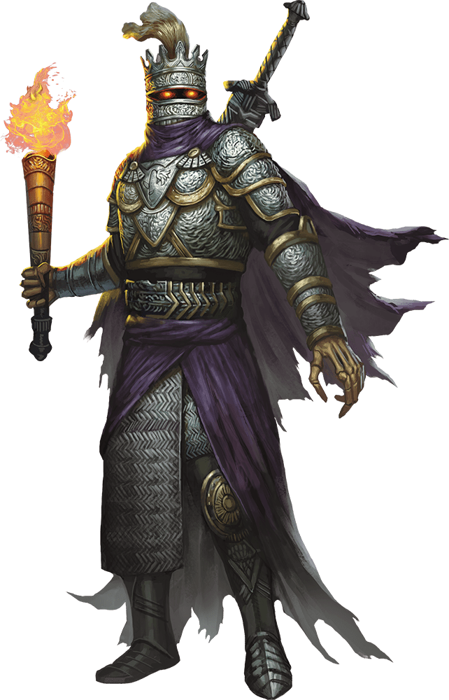
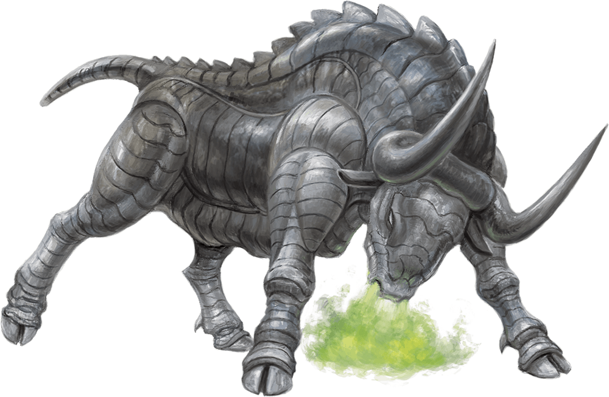

# 9 Oct 2024

**[Previously](2024-10-02.md):** We are on a quest to get astral pistons from Uldrak the Tinker: to do this, we need to help him revert to his giant form by "spilling the blood of Tiamat". We have gained the Orb of Dragonkind from his giant sword's pommel, which we can use to get a vial of Tiamat's blood from Arkhan the Cruel. We decided to travel to several points on our map: the Crypt of the Hellriders, then onwards to the Pit of Shummrath, then to the Obelisk of Ubbalux, and finally to Arkhan's Tower. At the Crypt of the Hellriders, we encountered some ghosts, who told us the sad tale of Zariel's general, Olanthius, and asked us to redeem him, and in doing so, them also. We found Olanthius's quarters in the crypt, where we read his journals. Further on into the crypt, we encountered some mummy-like creatures, and are now in battle...

- [ ] Investigate the Crypt of the Hellriders
- [ ] Investigate the Demon Zapper.
- [ ] Investigate the Arches of Ulloch
- [ ] Investigate Mahadi's Emporium (at the Pit of Shummrath)
- [ ] Investigate the Obelisk of Ubbalux
- [ ] Use the Orb of Dragonkind to get a vial of Tiamat's blood from Arkhan the Cruel
- [ ] Revert Uldrak the Tinker to his giant form and get the astral pistons
- [ ] Redeem Zariel's general Olanthius, and in doing so redeem the ghosts in the Crypt of the Hellriders
- [ ] Find a Nirvanan cogbox for the dream machine - a Modron ship crashed on the shore of the Styx
- [ ] Find a heartstone for the dream machine - try Red Ruth at Mahadi's Emporium, as she stole Gella's heartstone
- [ ] Find out from the tortured blob where Zariel's flying fortress is.
- [ ] Seek Zariel's blade, as revealed in Barrisso's vision (it will "seek Zariel's blade: it's the key to her heart, and will sever Elturel's chains")
- [ ] Investigate Thavius Kreeg, High Overseer of Elturel
- [ ] Investigate the vampire High Rider Klav Ikaia at Shiarra's Market
- [ ] Rescue the Hellriders
- [ ] Find the other half of the Infernal contract between Kreeg and Zariel
- [ ] Free Elturel from Avernus

---

Barrisso hits the nearest mummy twice for 12HP. Stepping back to allow Gralok engage means he suffers an opportunity attack suffering 13HP bludgeoning and 12HP necrotic damage. He avoids Mummy Rot.

The mummy moves to engage Barrisso. The mummy gazes at Gralok for no effect. The attack on Barrisso downs him, but he avoids getting Mummy Rot.

Norgreath hits the mummy with an Eldritch Blast which downs the mummy.

Lunghiss can only do a regular attack, doing 11HP of damage to the only mummy that remains unturned. He then disengages.

Galen uses Embodiment of the Law to cast Bless as a bonus action on Norgreath, Lunghiss, Gralok and Karthis. He then casts the cantrip Sacred Flame on the mummy, doing 3HP of fire damage.

Gralok advances into the main chamber and engages the last unturned mummy, using Form of the Beast to swipe it three times with claws and drops it. He then advances on one of the turned mummies and claws it for 9HP.

Karthis moves into the chamber and casts Fire Bolt at the mummy engaged with Gralok. The spell does 13HP of damage. The mummies appear to be vulnerable to fire.

Barrisso makes a death save.

A mummy attacks using Dreadful Glare at Karthis, but he saves; he then attacks Gralok but misses.

Norgreath casts Eldritch Blast (with Agonizing Blast, once with Genie's Wrath) at the unturned mummy twice, killing it.

Lunghiss does an attack, doing 12HP of damage plus 10HP of thunder damage if they move.

Galen casts Cure Wounds, doing 17HP of healing to Barrisso.

Gralok, using Form of the Beast, attacks with his claws, doing 22HP of damage.

Karthis casts Fire Bolt, doing 20HP of damage (as they are vulnerable to fire).

Barrisso casts Lay on Hands and gives himself 20HP of healing.

A mummy uses Dreadful Glare at Norgreath, but misses.

Norgreath casts Eldritch Blast (with Agonizing Blast, once with Genie's Wrath), killing one mummy, and damaging another.

Lunghiss does a Booming Blade sneak attack with Savage Attacker, doing 30HP of damage plus 10HP of thunder damage if they move.

Galen casts Sacred Flame, doing 6HP of radiant damage.

Gralok using Form of the Beast, attacks with his claws, doing 19HP of damage.

Karthis casts Fire Bolt at the damaged mummy, killing it. One remains.

Barrisso attacks with rapier and shortsword, doing 5HP of damage.

The mummy uses Dreadful Glare on Barrisso, but fails. It then hits him with Rotting Fist, but misses.

Norgreath casts Eldritch Blast (with Agonizing Blast, once with Genie's Wrath), doing 22HP of damage. As he hits it, he notices a necklace on its neck, with four round beads.

Lunghiss attacks but misses.

Galen casts Sacred Flame, doing 11HP of damage.

Gralok attacks, doing 18HP of damage.

Karthis attacks using Fire Bolt, killing the mummy.

---

Barrisso uses Detect Magic on the necklace, detecting magic from the beads. He also detects magic from a wand on the same corpse. The necklace is from the school of Evocation, the wand from the school of Divination.

In the same room, is a huge iron urn filled with human bones. On the wall to its north is a relief showing mounted knights going through a portal into a fiery landscape. Gralok grabs a femur, to use to some effect later.

We head east, then south, into another chamber. This has exits leading east and west.

There is an ankle-deep mist in the room, which reveals a ritual symbol on the floor, daubed in blood. There are hundreds of slivers of parchment in the symbol. Barrisso *(Arcana check)*) realises they are names in Common. Lunghiss *(Arcana check)* recognises them as connected to the steles we have seen. We take the parchment outside the circle, thinking it might counter whatever evil magic is being performed.

Barrisso *(Arcana check)* thinks these pieces of parchment are forming a devilish contract. We pile them together and burn them. We then return to the room with the steles. Barrisso uses Detect Magic, and finds a difference between the steles south and north in intensity: the two to the north are much stronger. We think that the steles to the south are associated with the parchment we burned. Gralok hits those southern steles with his maul, and releases the ghosts from their torment, with sighs of relief.

We retrace our steps, to the room with the iron urn, then head north then west. We are in a room with another urn. We search the room, but do not find any secret doors. We continue west, find more alcoves, caskets and roses.

We come to another chamber with an urn, with an exit east. No one finds anything unusual. We head east, finding more alcoves, with caskets and roses. To the south of us, we perceive a secret door. Lunghiss checks the door and thinks it is safe. Through the door, we find parchment similar to above. We fire bolt the parchments, return to the steles room, and hit the steles with the maul. As we strike the last name on the last stele, and the last ghost sighs in relief, we are infused with a divine blessing that lasts for 24 hours.

---

We return to a room we were in earlier, and hear a very deep thudding noise coming from above us, and an unearthly wailing noise. We head towards the exit, and see a creature entering the crypt:

<figure markdown>
  { width="200" }
  <figcaption>Olanthius</figcaption>
</figure>

Barrisso says to the creature "Long live Elturel!". It turns to us and raises his hand, and you think he catches sight of Lulu. Lunghiss thinks *(History check)* this is Olanthius.

Norgreath talks to Olanthius. He says "Where did you find her?" We tell him about Candlekeep. We tell him that Lulu is trying to regain her memories, and we are helping her to free Elturel. He says "You have released the Hellriders? My duty was to keep them here." Norgreath says "Your duty has run its course. Can you help us to restore Elturel to its former glory?"

"If only that were possible."

"In talking to Lulu, we think there is goodness in Zariel, that could undo this huge wrong. We think we need to locate Zariel's blade, to resolve this."

"Yael hid the blade." Olanthius's eyes dim when he says this.

"Do you know where she hid the blade?"

"I do not."

"Do you know where Yael is?"

"She is where the blade is. Give her my best."

He does not know where Zariel's flying fortress is at any moment.

We have redeemed the ghosts in the crypt. However, this has not redeemed Olanthius. He is bound to Zariel, and we need to redeem her.

"Have you used the Arches of Ulloch? There is a trick you can employ. If you drive your machine thru the arches, and you are of one mind where you want to go, you will go there."

---

We we leave the crypt, and we get an impression of what have made the noise we heard: outside are what look like two metal bulls:

<figure markdown>
  { width="400" }
  <figcaption>Metal Bull</figcaption>
</figure>

They are attached to a chariot, and breathing green vapour. They do not seem to want to attack us.

We go back to our Demon Grinder, and head across the plains. We decide to head to the Demon Zapper, the nearest point on the map to us. Small meteors pelt us; we hide under our vehicle from it. After a while, we get back into our vehicle and continue on our way.

---

After a while, we arrive what we think of as the Demon Zapper. It looks like a giant upraised beetle. A 10 foot diameter sphere of glowing force is suspended between the spines of the zapper. There are a number of dead forms around: devils, maybe 10 in number. However, there are [many more piles of ash.](2024-10-16.md)
