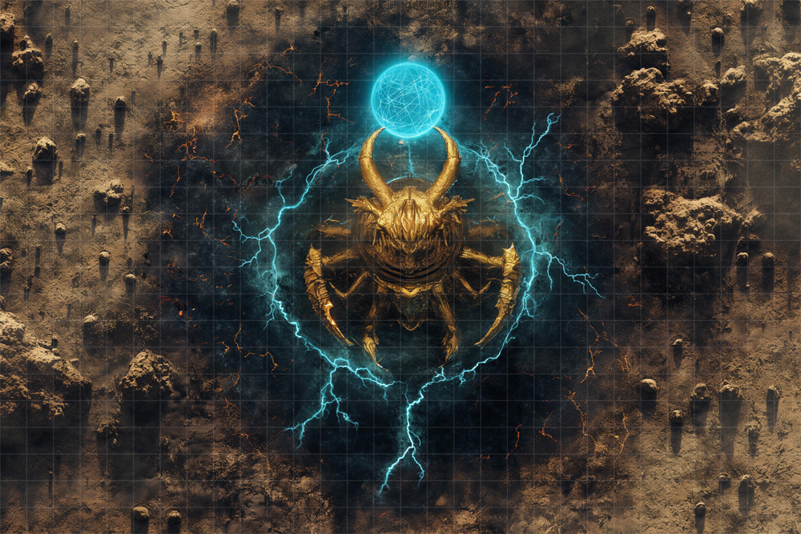
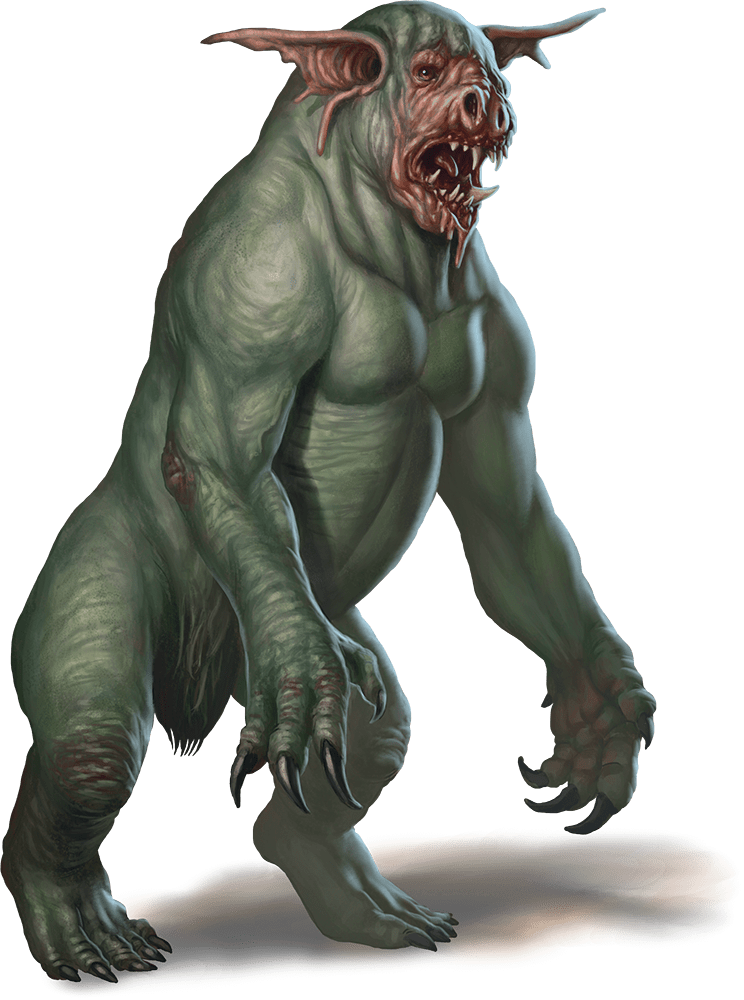
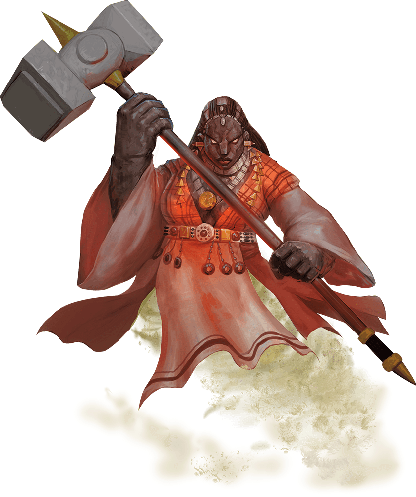
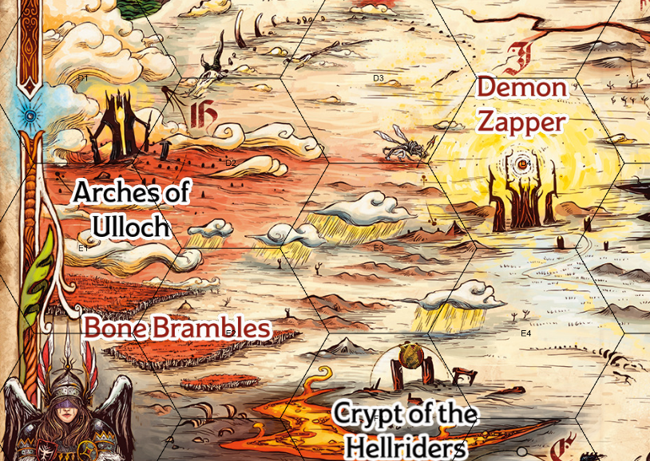

# 16 Oct 2024

**[Previously](2024-10-09.md):** We are on a quest to get astral pistons from Uldrak the Tinker. On route to Arkhan the Cruel's tower, we investigated the Crypt of the Hellriders. There we fought mummies, read the journals of Olanthius (Zariel's general), and freed the souls of the Hellriders. Olanthius himself returned to the crypt, and told us that Yael has Zariel's Blade. He also told us that we can use the Arches of Ulloch to seemingly teleport ("If you drive your machine thru the arches, and you are of one mind where you want to go, you will go there.") We left the crypt and headed to the next point on our map, the Demon Zapper.

- [X] Investigate the Crypt of the Hellriders
- [ ] Investigate the Demon Zapper.
- [ ] Investigate the Arches of Ulloch
- [ ] Investigate Mahadi's Emporium (at the Pit of Shummrath)
- [ ] Investigate the Obelisk of Ubbalux
- [ ] Use the Orb of Dragonkind to get a vial of Tiamat's blood from Arkhan the Cruel
- [ ] Revert Uldrak the Tinker to his giant form and get the astral pistons
- [ ] Redeem Zariel's general Olanthius, and in doing so redeem the ghosts in the Crypt of the Hellriders
- [ ] Find a Nirvanan cogbox for the dream machine - a Modron ship crashed on the shore of the Styx
- [ ] Find a heartstone for the dream machine - try Red Ruth at Mahadi's Emporium, as she stole Gella's heartstone
- [ ] Find out from the tortured blob where Zariel's flying fortress is.
- [ ] Seek Zariel's blade, as revealed in Barrisso's vision (it will "seek Zariel's blade: it's the key to her heart, and will sever Elturel's chains")
- [ ] Investigate Thavius Kreeg, High Overseer of Elturel
- [ ] Investigate the vampire High Rider Klav Ikaia at Shiarra's Market
- [ ] Rescue the Hellriders
- [ ] Find the other half of the Infernal contract between Kreeg and Zariel
- [ ] Free Elturel from Avernus

---

At the Demon Zapper, there are around a dozen dead devils, and many more piles of ash, presumably demons zapped by the zapper. We stay outside what seems to be the killzone and examine the tower. A lightning-like effect hovers between its prongs, but according to Karthis, not actually lightning. It seems more like radiant energy.

<figure markdown>
  { width="400" }
  <figcaption>Demon Zapper</figcaption>
</figure>

While we observe it, we see on the other side of the zapper, other creatures approaching: demons. We get the impression they are under some kind of compulsion, focusing on the sphere element of the zapper, and walking towards the tower. As they come closer to it, a five feet wide beam of radiance shoots towards them, and a swathe of them are turned to ash. Three are unaffected, but they continue on towards the sphere, and then stop, seemingly enraptured.

In our vehicle, we approach the demons: the demons that remain are dretches, which we previously saw in Baldur's Gate:

<figure markdown>
  { width="200" }
  <figcaption>Dretch</figcaption>
</figure>

We remember there was also a larger demon in the group: Gralok approaches that area, but only ash remains. The three dretches are still comatose. Gralok approaches the group and grapples one. It feels disgusting, and has a horrible odour, even to a barbarian. The rest of the party notice *(Perception check)* the sphere is humming. We move away, staying away from the axis between the demons and the sphere.

Gralok throws the dretch he is holds to the ground, then runs north. A ray of radiance fires, but Gralok dodges it, fortunately taking only 13HP of damage.

Karthis examines the tower and realises it's a machine. The mechanism reminds him of the plain of Mechanus, or Nirvana. He checks the base for an entrance, but can't see one from this distance. We climb into the Demon Grinder, and drive towards the tower.

We arrive at the base of the tower, and check it for any kind of entrance. *(Perception check)* We find, instead of an entrance, very fine ladders, which seem to lead up to the mandibles. The other half of the party *(Perception check)* see an animal form within the sphere. Gralok *(Nature check)* spots that it is a white unicorn with a golden mane. Karthis recalls that unicorns are Celestials from the upper planes, and creatures of goodness, native to Arborea.

The party begins the climb two ladders. As we ascend, we see in the distance another group of creatures approaching: again, demons. We continue up the ladders. After 40 feet, we reach the bottom of the tower's mandibles. The whole tower starts to hum. A radiant beam shoots out to the demons: Lunghiss hears the screaming whinny of the trapped unicorn, and we *(Con check*) we take some damage from the loud noise of the beam.

We shout at the unicorn, and note that it turns towards us. Gralok shouts in Common. In Elvish, Karthis asks "How can we help you?" The unicorn speaks back to Karthis in Elvish: "Free me!". We hear the pain and anguish in its voice. "Destroy the mechanism!"

Gralok starts attacking the mandibles holding the sphere, and damages it.

Karthis attacks with a Fire Bolt, but misses. Karthis sees something emerging from the base of the tower: a large female figure, carrying a giant maul. Norgreath tells us it's a dao, an earth genie:

<figure markdown>
  { width="400" }
  <figcaption>Dao</figcaption>
</figure>

Lunghiss attacks the mandible with his rapier, doing 12HP of damage.

The dao reaches our level, and says "What are you doing?"

Barrisso replies, "We are freeing this unicorn."

"The unicorn enables this structure to destroy demons."

"Don't care."

"Zariel has set it so."

"Don't care."

"I am bound to protect this structure. If you continue, I may have to intervene."

"Would you not prefer to be free also?"

"I... would."

"How can we free you?"

"Part of my contract that binds me here, prevents me from seeking out a sage who could divine the solution to my problem. But I know where that sage is. If you could travel there - and it's not too far away - you could seek out this sage in the corrupted forest beside us, and follow her instructions to break the pact. Do that, and I will help you by giving you an introduction to Bel. The name of the sage is Red Ruth. "

(Red Ruth is also the person we need to get a heartstone from, for the dream machine.)

"The forest is called the Bone Brambles."

We promise the unicorn we will return to rescue it.

---

Galen performs a Prayer of Healing, healing the party for 12HP of healing each. He also casts Cure Wounds on Barrisso to bring him almost back to full health.

The party takes 1HP of psychic damage from the environment.

We head south-west, towards the Bone Brambles:

<figure markdown>
  { width="400" }
  <figcaption>Bone Brambles - Map</figcaption>
</figure>

As we drive across the wastelands, we can see a swarm of approximately 50 flying creatures ahead. We recognise them as being stirges, gorging themselves on some dead creatures. We decide to avoid them and continue on our way.

---

We are attacked by a meteor shower, and crawl under our vehicle for safety. The rain of stone intensifies into a meteor storm, the stones growing bigger until they are blazing plummeting orbs of fire. The vehicle absorbs bludgeoning damage, but we also take fire damage (14HP, plus half of the bludgeoning damage if failed, or 7HP fire damage if saved). (Lunghiss takes no damage due to his Evasion class feature.)

---

We make it to the Bone Brambles; a maze of bone-like vines stretch before us. We see calcified corpses, with narrow paths wending deeper into the woods. The paths are too narrow for our Demon Grinder. We drive around the woods to see if there are wider entrances. We find five entrances in total. The party *(Survival check)* finds our way through a maze of bones, and find ourselves at a dead end. At this point, three creatures appear from the vines around us. When they see Karthis and Barrisso, they ask "Remind us of the world of life!". Gralok *(Nature check)* thinks they are something like dryads, as if they were undead spirits of dryads.

Karthis asks "What can we answer for you?"

"Tell us what it is like!"

Annoyed at the lack of response, they attacked. Their visages become rictuses of anger, and they protrude claws.

Lunghiss does a Booming Blade sneak attack with Savage Attacker on a creature, doing 15HP of damage, plus 6HP if it moves (only half damage as his weapon is silver, and not magical.) He then disengages.

Karthis casts Fire Bolt, but misses.

Galen performs Turn Undead: only one creature is turned.

Gralok rages, then uses Form of the Beast to attack with his claws, doing 21HP of damage.

Norgreath casts Eldritch Blast (with Agonizing Blast, once with Genie's Wrath), doing 13HP of damage. The cold damage does not affect it.

A dryad wails. The party *(Con save*) saves from the worst effects, but still suffer 13HP of psychic damage. Another wails again. The whole party saves again, taking 11HP of damage.

Barrisso attacks with his magic rapier: the dryad dissipates. He attacks with his silvered short sword, using Divine Smite, doing 23HP of damage.

The turned dryad phases out and disappears through the brambles.

Lunghiss casts Shadow Blade, then uses it to sneak attack with Savage Attacker and Booming Blade the remaining unturned dryad. He does 32HP of psychic damage and thunder damage, and 5HP of thunder damage if it moves.

Karthis casts Fire Bolt, doing 4HP of fire damage, killing it.

---

The party is quite injured, and feel [we need a long rest.](2024-10-23.md)
