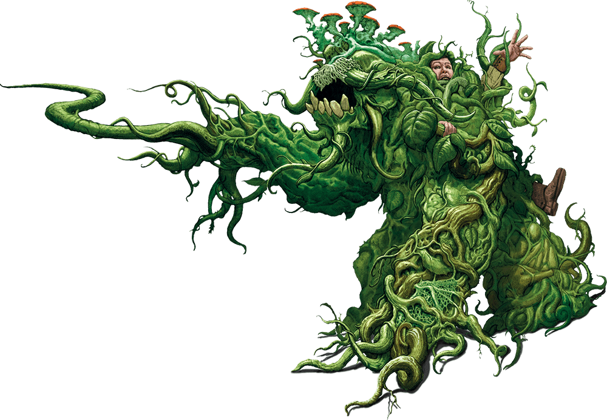

# 23 Oct 2024

**[Previously](2024-10-16.md):**  En route to Arkhan the Cruel's tower for Tiamat's blood, we stopped at a construct called the Demon Zapper. Karthis recognised it as a machine, the mechanism reminding him of the plain of Mechanus, or Nirvana. We realised its demon-zapping beams are powered by a trapped unicorn. We tried to destroy the machine, but were confronted by its guardian, a dao (earth genie). It told us that it is bound by a contract to protect the machine. However, if we find a sage in the Bone Brambles, they could help release it from its contract. We set off for the Bone Brambles, where we fought some undead dryads. A tough fight, afterwards we decided we need a long rest.

- [X] Investigate the Demon Zapper
- [ ] Find the sage in the Bone Brambles
- [ ] Release the unicorn in the Demon Zapper
- [ ] Investigate the Arches of Ulloch
- [ ] Investigate Mahadi's Emporium (at the Pit of Shummrath)
- [ ] Investigate the Obelisk of Ubbalux
- [ ] Use the Orb of Dragonkind to get a vial of Tiamat's blood from Arkhan the Cruel
- [ ] Use Tiamat's blood to revert Uldrak the Tinker to his giant form and get the astral pistons
- [ ] Redeem Zariel's general Olanthius, and in doing so redeem the ghosts in the Crypt of the Hellriders
- [ ] Find a Nirvanan cogbox for the dream machine - a Modron ship crashed on the shore of the Styx
- [ ] Find a heartstone for the dream machine - try Red Ruth at Mahadi's Emporium, as she stole Gella's heartstone
- [ ] Find out from the tortured blob where Zariel's flying fortress is.
- [ ] Seek Zariel's blade, as revealed in Barrisso's vision (it will "seek Zariel's blade: it's the key to her heart, and will sever Elturel's chains")
- [ ] Investigate Thavius Kreeg, High Overseer of Elturel
- [ ] Investigate the vampire High Rider Klav Ikaia at Shiarra's Market
- [ ] Rescue the Hellriders
- [ ] Find the other half of the Infernal contract between Kreeg and Zariel
- [ ] Free Elturel from Avernus

---

We retreat back through the path of bone brambles back to our Demon Grinder vehicle. We decide to find safety back in the Crypt of the Hellrider: we considered a hill, but Gralok points out we would be exposed to acid rain and deities know what else. On our way, we are exposed to damage *(Con save)* due the oppressive environment of Avernus.

After a while, we come across a enormous pile of small bones, that looks like they were gathered and placed deliberately. We continue on.

We arrive at the Crypt of the Hellriders. Barrisso is concerned about the Demon Grinder being stolen. Gralok *(Athletics check)* removes the steering, hopefully thwarting any hellish miscreants.

We pass the silent still suits of armour, and climb the stairs down into the crypt. We find a room which we hope to barricade as we take a long rest. However, we find nothing to barricade with, and decide not to desecrate the place. We take a long rest.

**The party goes up to Level 8.**

The party is (almost) fully recovered, apart from Gralok. We leave the crypt, and head back to the Bone Brambles. On our way, we encounter noxious fumes *(Con save)*: Galen takes one level of exhaustion. We make our way through the brambles until we get to an area where we see, embedded in the brambles, a hawthorn staff. Karthis uses Mage Hand to take the staff. He feels resistance from the brambles, trying to hold it. Lunghiss adds his Mage Hand, and between them, can pull the staff towards us. Barrisso uses Detect Magic: the staff belongs to the school of abjuration.

We continue searching for another path through the brambles.  We find ourselves in a dead end, whereupon we are attacked by three creatures that seems to be made of the same stuff as the brambles:

<figure markdown>
  { width="400" }
  <figcaption>Shambling Mound</figcaption>
</figure>

Gralok uses Form of the Beast, then attacks with his claws, doing 21HP of slashing damage.

Lunghiss (with Inspiration), does a Booming Blade sneak attack with Savage Attacker: he does 27HP of damage, with a further 13HP if the opponent moves, then disengages.

Galen casts Toll the Dead, possibly doing 19HP of necrotic damage, but the creature saves.

Norgreath casts Eldritch Blast twice (with Agonizing Blast, once with Genie's Wrath) on the creature, doing 7HP of damage.

Karthis casts Fireball at the three creatures; they seem to take the full blast of the 23HP of damage each.

One of the creatures does a slam attack against Gralok: since Gralok is raging, he takes 6HP of damage.

Barrisso moves and attacks with his halberd: with Inspiration, he still only does 2HP of damage.

The injured creature attacks Gralok, but misses.

The last creature moves and attacks Barrisso, doing 10HP of bludgeoning damage.

---

Gralok attacks with his claws, doing 22HP of slashing damage.

Lunghiss (with Inspiration) does a Booming Blade sneak attack with Savage Attacker on the injured creature: he does 21HP of damage, with a further 8HP if the opponent moves, then disengages.

Galen casts Sacred Flame, doing 8HP of radiant damage. Galen also casts Spiritual Weapon, doing 13HP of force damage, killing the creature. Two remain.

Norgreath casts Eldritch Blast twice (with Agonizing Blast, once with Genie's Wrath) on a creature, doing 14HP of damage.

Karthis casts Fireball at the two creatures: he does 23HP of fire damage to both.

A creature attacks Gralok, doing 19HP of bludgeoning damage.

Barrisso switches to his rapier and shortsword; as he is Lucky, he does 17HP of piercing damage, with an extra 14HP of damage from Divine Smite.

The damaged creature attacks, but both attacks miss.

---

Gralok attacks with his claws, doing 23HP of slashing damage.

Lunghiss (with Inspiration from Karthis) does a Booming Blade sneak attack with Savage Attacker on the injured creature: he does 34HP of damage, with a further 7HP if the opponent moves, then disengages.

Galen casts Toll the Dead on the same creature, but it fails. Galen's Spiritual Weapon does 13HP of force damage.

Norgreath casts Eldritch Blast twice (with Agonizing Blast, once with Genie's Wrath) on the creature, doing almost 9HP of damage, killing it. His second attack does 8HP to the remaining creature.

Karthis casts Fire Bolt, doing 20HP of fire damage.

Barrisso attacks with rapier and shortsword: His rapier does 7HP of damage, and he uses Divine Smite to add 12HP of damage to it. He attacks again with his rapier: he does 10HP of damage. His third attack with his shortsword does 5HP of damage, killing the final creature.

---

We search the creatures and the area, but find nothing of use. We backtrack from the area, through the brambles, eventually find a cave-like area filled with bones. Body parts hang by twine from the entrance, and the ceiling is strung with garland made of bloody entrails. [The air buzzes with flies...](2024-10-30.md)
