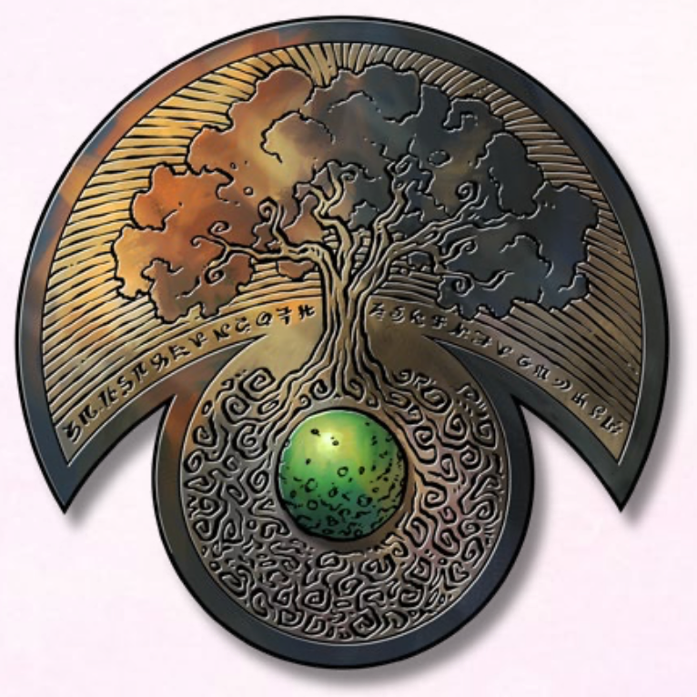

# 30 Oct 2024

**[Previously](2024-10-23.md):**  En route to Arkhan the Cruel's tower for Tiamat's blood, we agreed to save a unicorn trapped in a weapon called the Demon Zapper. The guardian of the weapon, a dao, has agreed not to fight us if we release her from her contract by dealing with a sage in a forest called the Bone Brambles. In that maze, we fight a number of creatures until we finally find her lair.

- [x] Find the sage in the Bone Brambles
- [ ] Release the unicorn in the Demon Zapper
- [ ] Investigate the Arches of Ulloch
- [ ] Investigate Mahadi's Emporium (at the Pit of Shummrath)
- [ ] Investigate the Obelisk of Ubbalux
- [ ] Use the Orb of Dragonkind to get a vial of Tiamat's blood from Arkhan the Cruel
- [ ] Use Tiamat's blood to revert Uldrak the Tinker to his giant form and get the astral pistons
- [ ] Redeem Zariel's general Olanthius, and in doing so redeem the ghosts in the Crypt of the Hellriders
- [ ] Find a Nirvanan cogbox for the dream machine - a Modron ship crashed on the shore of the Styx
- [ ] Find a heartstone for the dream machine - try Red Ruth at Mahadi's Emporium, as she stole Gella's heartstone
- [ ] Find out from the tortured blob where Zariel's flying fortress is.
- [ ] Seek Zariel's blade, as revealed in Barrisso's vision (it will "seek Zariel's blade: it's the key to her heart, and will sever Elturel's chains")
- [ ] Investigate Thavius Kreeg, High Overseer of Elturel
- [ ] Investigate the vampire High Rider Klav Ikaia at Shiarra's Market
- [ ] Rescue the Hellriders
- [ ] Find the other half of the Infernal contract between Kreeg and Zariel
- [ ] Free Elturel from Avernus

---

We have made our way into the centre of the maze of brambles. In the middle of this clearing is a hovel made of bones, briars, entrails and all manner of death-wreathed detritus. A creature stands before the hovel. This is the hag, Red Ruth: the same Red Ruth from whom we require a heartstone.

Red Ruth looks a little bit like Mad Maggie. Karthis recognises her as a Night Hag: a hag that has been thrown out of the Feywild because they are so malign. They are known for capturing souls in a special bag to use later or even to eat. We recall that Mad Maggie said Red Ruth would be where we could get a heartstone. Time to engage with the hag. 

She calls out to us, "Potions or divination?" Barrisso asks the hag for a price. She asks for soul coins: three for divination and one for potions. Barrisso asks about a heartstone. She is taken aback at the question, as it is fundamental to her powers. The party are keen to get the divination and we have three soul coins to pay for it. Barrisso is reluctant to give over the soul coins. 

We try haggling with the hag to reduce her price down to two coins. She is implacable. Norgreath offers the silver headpiece also. She is somewhat intrigued by this. She accepts the offer. We hand over the silver headpiece and two soul coins to the hag. We ask for the divination to free the Dao Ralzala from her contract with Zariel. 

The hag asks us all to sit on the ground in a circle, while she gathers bones from the brambles around and lays them around us in a circle. She stands in its centre. We see that the robe she is wearing is made of tiny, stitched-together bones. There are a number of tiny baby skulls in a necklace around her neck. They start chattering and seem to be singing nursery rhymes each in a different language as she makes her way to the centre of the circle. 

She waves her hands wide, and chants. She takes a bit of the brambles that has a thorn and pricks her finger. She lets the drop of blood fall to the ground, and looks intently at it for a while. She says that Ralzala must drink the blood of a titan to free her from her pact. 

When her divination has completed, Lunghiss attempts to pickpocket the heartstone from Red Ruth. She notices and screeches in a horrible fashion and reaches out to grab Lunghiss' feathery arm with her horrible claw. She hits him and does him 12HP of slashing damage. 

Karthis casts Lightning Bolt at the hag. She dodges but still takes 11HP of lightning damage. (She is not resistant to lightning.)

<a name="pickpocket">

Lunghiss attempts the pickpocket again. He fails, but Barrisso gives him inspiration and he succeeds in relieving her of a mysterious coin:

<figure markdown>
  { width="200" }
  <figcaption>Mysterious Coin</figcaption>
</figure>

As a bonus action, Galen casts Spiritual Weapon, and hits the hag for 7HP. Galen then casts Sacred Flame on her. She takes 3HP of radiant damage. 

Barrisso swings his rapier and hits twice. He invokes Divine Smite and does a total of 43HP. The hag screams in pain. 

Norgreath puts a hex on Red Ruth, then casts Eldritch Blast and does 6HP of damage. His second blast misses. Norgreath uses his inspiration but with no benefit. 

Gralok rages and smacks the hag with bear claws. One out of four of his attacks hits, doing 6HP of damage. Red Ruth dissipates into the ether. 

As she does so, there rises from the briars behind her something that looks like a tree of bones that comes to life. We liken it to an undead treant. 

Karthis casts Witch Bolt at the undead tree. A persisting bolt of lightning attaches to the tree creature, and does 25hp lightning damage to the tree creature this round. 

Lunghiss sneak attacks the tree creature but misses. 

Galen swings the spiritual weapon at the undead tree creature and hits, doing 9HP of damage. Galen then attempts to turn the undead tree. The undead tree creature is affected. 

Barrisso sees no enemy so he investigates the hovel. He finds Red Ruth's stash of potions. It consists of seven potions: all seem to be different. He puts them all into his backpack. Six of them are in similarly sized potion bottles, all with stoppers, signifying a quaffing application. One is a more spherical vial with a narrow spout signifying a pouring application. 

Back in the fight, Gralok attacks the undead tree creature with his claws: only one attack hits, doing 5HP of damage.

Karthis's Witch Bolt does 3HP of damage.

Lunghiss sneak attacks the undead tree but misses. 

Galen moves the spiritual weapon closer to the undead tree. He then casts Toll the Dead on the undead tree. It has no effect.

Barrisso casts Detect Magic on the items we've found and on the surroundings. All of the potions found are magical. Nothing else is detected. 

Norgreath casts Eldritch Blast on the undead tree. It misses. His second blast hits and does 10HP of damage. 

The tree hits Gralok and does 8HP of bludgeoning damage. 

Gralok smacks at the tree with his bear claws. He misses 2 out of 4 times, but still does 15HP of damage. 

Karthis's Witch Bolt does 3HP of damage. Lunghiss sneak attacks the undead tree and does 20HP of damage. 

Galen invokes Sacred Flame, but the tree saves. 

Barrisso searches the outside of the hovel.

Norgreath casts Eldritch Blast at the tree creature and does 17HP of damage. 

The tree creature smacks at Gralok who receives 14HP. 

Gralok hits the undead tree and kills it.

---

Galen searches the undead tree's remains. The undead tree has a cavity, inside of which is the skeleton of a dead gnome. The gnome skeleton wears a hat and clutches a wand. 

Gralok puts on the hat and takes the wand in hand. The hat is a beret, and Gralok's appearance changes to that of a beret wearing, onion bedecked, striped polo neck-clad, moustachioed and ridiculously condescending Frenchman smoking a Galois who suddenly feels very affronted by the absence of a decent wine or a palatable brioche, but seeing as no one else seems to give a flying damn, Gralok eats some more cheese. Galen takes the wand off Gralok.

We perform an analysis of the seven potions. We believe we have found a Potion of Climbing, a Potion of Healing, a Potion of Hill Giant Strength, a Potion of Water Breathing, a Potion of Darkvision, and a Potion of Group Healing (temp HP for up to six). The pouring flask has Oil of Etherealness. 

Galen casts Cure Wounds on Gralok and he recovers 29HP. Barrisso and Gralok spread the Oil of Etherealness over themselves in an effort to engage with the hag. It takes about 10 minutes to administer the oil.

Gralok and Barrisso cross over into the Ethereal plane. There, they find Red Ruth waiting for them. 

Red Ruth surprise attacks, casting Magic Missile at Barrisso. He takes 23HP of damage. 

Barrisso uses a lucky point to hit the hag and also invokes Divine Smite, damaging her for 26HP. His second attacks hits and, again invoking Divine Smite, damages her for 31HP. She dies.

--- 
We search her and take all her possessions. While we wait for the Oil of Etherealness to wear off, we play dragon chess. It ends in the most spectacular stalemate (both make Int rolls and both roll zero). 

Time passes, and Barrisso and Gralok return to the grove. There, the party examines the hag's possessions. She had a necklace of baby skulls, a robe of tiny bones, and a set of five belt pouches. One pouch contains her heartstone, one contains our two soul coins, one has material components for spells, and one is her soul bag. The last one, a leathery bag with a draw string, turns out to be a Bag of Holding. We recover the silver headpiece we gave her as well. 

Gralok checks the Bag of Holding. The bag's interior is larger than its outside. Inside are nine scrolls:

**2nd Level**

* Alter Self
* Blur
* Misty Step
* Shatter

**3rd Level**

* Dispel Magic
* Fear
* Sending

**4th Level**

* Arcane Eye
* Confusion

We decide we should return to the the Demon Zapper and to Ralzala the dao.....
