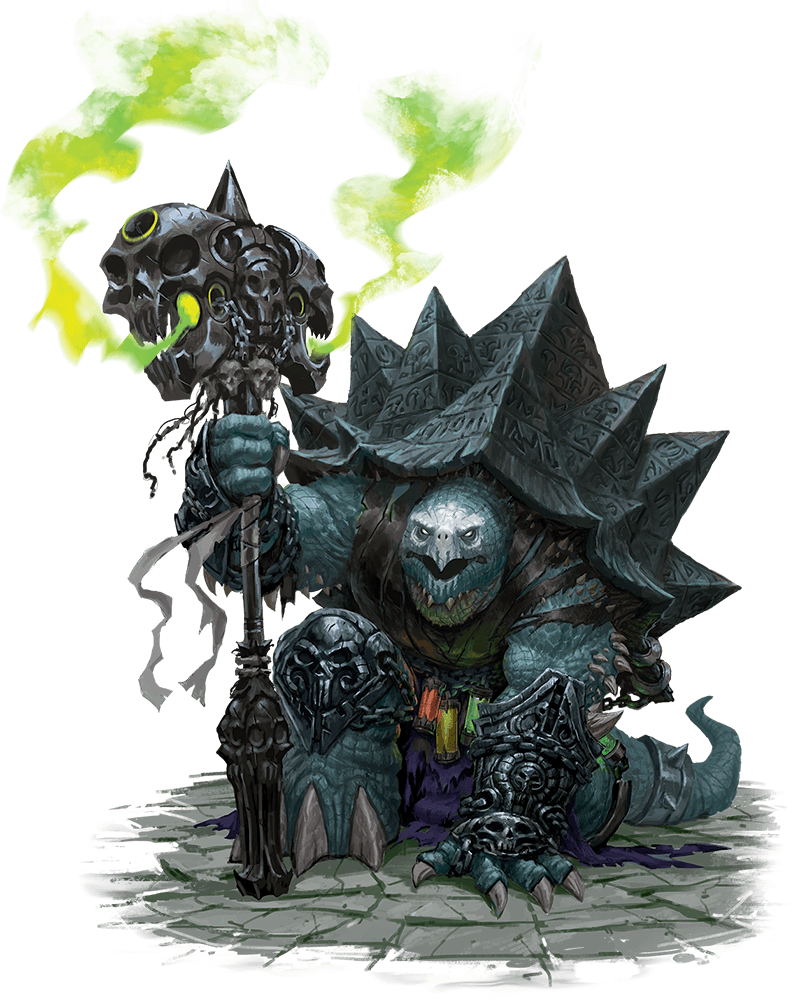
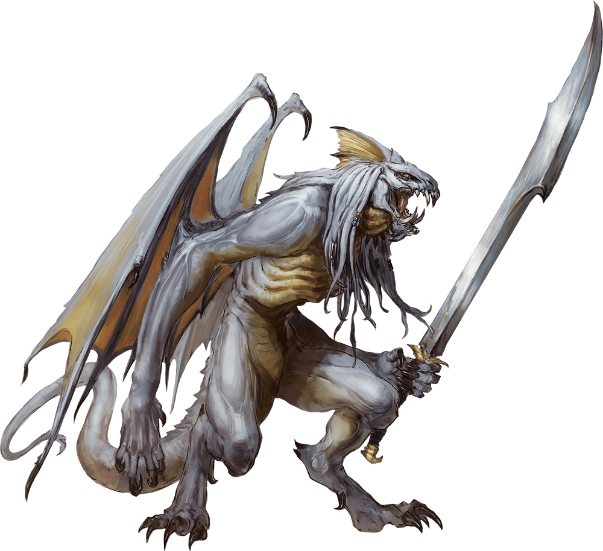
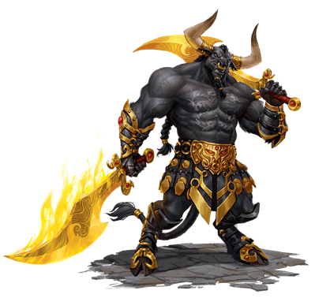
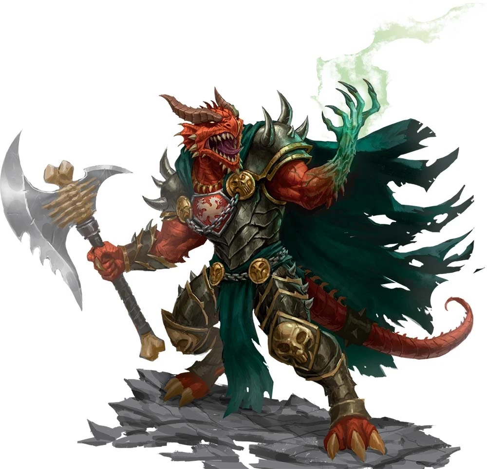

# 6 Nov 2024

**[Previously](2024-10-30.md):**  En route to Arkhan the Cruel's tower for Tiamat's blood, we agreed to save a unicorn trapped in a weapon called the Demon Zapper. The guardian of the weapon, a dao named Ralzala, agreed not to fight us if we release her from her pact, by dealing with a sage in a forest called the Bone Brambles. In the Brambles, we met the sage - who turned out to be Red Ruth, someone we were already looking for to gain a heartstone for the Dream Machine. Red Ruth told us that Ralzala must drink the blood of a titan to free her from her pact. At that moment, Lunghiss attempted to pickpocket the heartstone, and all hell broke loose. The party defeated an undead treant and, eventually, Red Ruth in the Ethereal Plane, gaining the heartstone, a Bag of Holding (her "soul bag"), a mysterious coin (pickpocketed), and a stash of magical potions. 

- [X] Find a heartstone for the dream machine - taken from Red Ruth in the Bones Brambles
- [ ] Find the blood of a titan for Ralzala: Uldrak the Tinker's, once restored
- [ ] Release the unicorn in the Demon Zapper
- [ ] Investigate the Arches of Ulloch
- [ ] Investigate Mahadi's Emporium (at the Pit of Shummrath)
- [ ] Investigate the Obelisk of Ubbalux
- [ ] Use the Orb of Dragonkind to get a vial of Tiamat's blood from Arkhan the Cruel
- [ ] Use Tiamat's blood to revert Uldrak the Tinker to his giant form and get the astral pistons
- [ ] Redeem Zariel's general Olanthius, and in doing so redeem the ghosts in the Crypt of the Hellriders
- [ ] Find a Nirvanan cogbox for the dream machine - a Modron ship crashed on the shore of the Styx
- [ ] Find out from the tortured blob where Zariel's flying fortress is.
- [ ] Seek Zariel's blade, as revealed in Barrisso's vision (it will "seek Zariel's blade: it's the key to her heart, and will sever Elturel's chains")
- [ ] Investigate Thavius Kreeg, High Overseer of Elturel
- [ ] Investigate the vampire High Rider Klav Ikaia at Shiarra's Market
- [ ] Rescue the Hellriders
- [ ] Find the other half of the Infernal contract between Kreeg and Zariel
- [ ] Free Elturel from Avernus

---

The party climb into the Demon Grinder, and head back to the Demon Grinder. There, Galen casts Prayer of Healing, giving everyone 13HP of healing. We call out to Ralzala the dao, that we have returned from Red Ruth. She arises from the ground underneath the Zapper, and approaches us. Barrisso greets her, and tells her about our fight with Red Ruth, and how drinking the blood of a titan can free her. We realise we know of a titan: Uldrak the Tinker. Ralzala reminds us she is still under the pact, and we reassure her we will get the blood for her. At that moment, there is a huge buildup of energy in the Zapper: those who fail a Con save take 4HP of damage.

We decided we need to get to Arkhan the Cruel first; that way, we can restore Uldrak to his Titan form, then (hopefully) get some of his blood to release Ralzala from her pact. We head to the Crypt of the Hellriders and take a long rest. During the rest, Gralok discovers his hat is a Hat of Disguise. Karthis discovers his new staff is a Staff of the Howling Wind, while his new wand is a Wand of the War Mage. 

Barrisso examines at the heartstone. It is a lustrous black gem, which Barrisso realises that as a side power, can cure disease. However, he is worried there is a consequence to that power. 

<a name="drawn">

Lunghiss studies the mysterious coin. (With inspiration), he does not think it is of this dimension, this universe. Barrisso notes it is radiating conjuration magic. Then something strange happens: Lunghiss feels it is pulling on him and the party. Lunghiss throws the coin *(Wis saving fail)*. There's a feeling of a series of tendrils coming it to grab each of the party, then being released. Lunghiss sidles over to the coin on the ground, picks it up, and puts it in his pocket. There's no weird sensation anymore. The coin is something to be researched...

</a>

---

We head to the Arches of Ulloch. On the way, we are rained on by burning acid, and some take damage. As we travel on, we encounter a huge crater created by a 20-foot skull. Barrisso attempts Detect Magic on the skull, but detects nothing. We continue on.

---

As we get close to the Arches, we see they are ornate, every inch engraved with images of the Blood War: demons warring with demons. We do not see anything moving around. We drive to within a 100 feet away, at which point the stonework emits a high-pitched humming sound. We drive at full speed towards the arch, and as we cross the archway, a sheet of flame fills it. We find ourselves arriving where we think we wanted to go: Arkhan the Cruel's tower.

Its black spires rises hundreds of feet into the sky, its ramparts filled with skulls on iron spike. Its peak splits into five spikes, raking the sky. At its peak is a white dragon, stained with ash and soot. We see other movement at the top of the ramparts. 

We walk towards the entrance to the tower: as we do, the dragon roars loudly. A figure emerges from the tower to greet us, almost an armoured turtle:

<figure markdown>
  { width="200" }
  <figcaption>Armoured Turtle</figcaption>
</figure>

"Hold! What is your business here?"

"We wish to see Arkhan."

"Why do you wish to see him?"

"To trade."

"What do you want to trade?"

"That is for us to discuss."

As we talk, four attendants to this creature surround him: they look like ghouls, holding bones of different kinds which they gnaw on, eyeing us hungrily. 

"We have the Orb of Dragonkind - we believe your master wants it."

"Interesting! Wait there."

As he turns, we can read the Infernal runes on his armour: they are prayers to Tiamat. He enters the tower, then comes out again.

"My master is at the monument. I will take you there."

He points to the giant skull in the background. We follow him.

---

A hundred feet to either side, is a pack of ghouls, keeping pace with us. The white dragon is circling the armoured creature. We definitely think it's an adult. 

Lunghiss remembers *(History check)* that white dragons often have a lair that is found in the centre of a winter storm, a glacier, or somewhere cold. So it's strange this white dragon is here in Avernus. Karthis *(Arcana check)* realises that truly ancient white dragons have the ability to surround themselves with magical cold storms, to make themselves feel at home.

Eventually we reach the colossal dragon skull, leaning against the mountain, surrounded by bones the size of houses. Smoke rises from its maw. There is an army tent pitches among the bones. Parked next to it is a 2-wheeled infernal war machine. Gathered around the tent are a dozen reptilian winged humanoids: abishai:

<figure markdown>
  { width="200" }
  <figcaption>Abishai</figcaption>
</figure>

They enter the tent, and after a while another creature emerged, who seems to be a bodyguard, accompanied by a manticore, and then another creature with a burning green hand:

<figure markdown>
  { width="200" }
  <figcaption>Bodyguard</figcaption>
</figure>

<figure markdown>
  { width="200" }
  <figcaption>Arkhan the Cruel</figcaption>
</figure>

Green Hand says "I hear you have come to bargain with me". This must be Arkhan. 

We offer the Orb of Dragonkind in exchange for his blood. He asks why we need the blood, as he cannot betray his mistress (Tiamat). 

"Tiamat is here against her will. I am here to free her."

"We are on a mission to remove Zariel from this plane. This would help Tiamat, would it not?"

"I need more from you."

"I need to kill with this hand. Provide me with a spirit that is destined for the Upper Planes."

"No, no deal."

"I could take your flying elephant thing."

"I would fight to my dying breath to stop you."

"That would be nice."

Barrisso asks about Arkhan's hand.

"I struck off my own hand, and grafted another to it to give me the power I need. But it has a price."

"Are you managing it?"

"We are in negotiation."

With Persuasion, Barrisso is asked by Arkhan to show him the orb. He does, and Arkhan says "That was in Uldrak's blade". 

"Perhaps, perhaps not."

"Yes."

"The providence is important for the power it will give me. You want to use the blood to transform Uldrak?"

"Yes, but it would aid you."

He strides forward, his one good hand releasing something at his neck. Barrisso gives him the vial. "We have an agreement?" "We do."

We ask Krull (the turtle) what the easier way across the Styx is. He says the easiest way is to cross the river on the back of the white dragon. But she would probably want to eat us.

It looks like we need to take the long way around.

---

We arrived at the edge of the Styx, and see what looks like a ferryport. Some creatures man a large flatbed boat with a gangplank on the dock, wide enough for our Demon Grinder. The creatures are tall and skeletal, clad in black robes and holding a long staff. 

Karthis asks them "Can you take us across the river?"

"YES."

"Is there a cost?"

The creatures looks surprised.

"For a vehicle and party of your size, it depends how far you wish to travel. Across the river is three soul coins."

Barrisso asks the creature his name. He looks at Barrisso strangely; Karthis tells him it's because if you know the true name of a devil, you can bind it. 

"What may I call you?"

"You may call me **Schilla**."

We decide we can't afford the three soul coins, but [wonder what to do...](2024-11-13.md)

