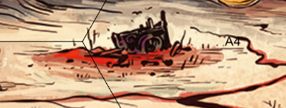
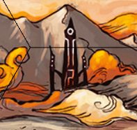
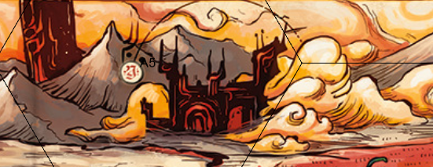

# 13 Nov 2024

**[Previously](2024-11-06.md):** After defeating Red Ruth, we acquired both a heartstone (one of the four ingredients for the "dream machine" to restore Lulu's memories) and also the information needed by Ralzala the dao to break her pact and allow us to free the unicorn from the Demon Zapper (she needs to consume the blood of a titan). We informed Ralzala of this, and that we knew where to get such blood: from Uldrak the Tinker, a titan who has been shapeshifted into a devil. Via the teleporting powers of the Arches of Ulloch, we arrived across the Styx at Arkhan the Cruel's tower and parlayed with him. After some tense negotiations, he agreed to swap a vial of Tiamat's blood for the Orb of Dragonkind that we have. Our current problem is to try and recross the Styx without having to pay three soul coins.

- [X] Investigate the Arches of Ulloch
- [X] Use the Orb of Dragonkind to get a vial of Tiamat's blood from Arkhan the Cruel
- [ ] Use Tiamat's blood to revert Uldrak the Tinker to his giant form and get the astral pistons
- [ ] Find the blood of a titan for Ralzala: Uldrak the Tinker's, once restored
- [ ] Release the unicorn in the Demon Zapper
- [ ] Investigate Mahadi's Emporium (at the Pit of Shummrath)
- [ ] Investigate the Obelisk of Ubbalux
- [ ] Redeem Zariel's general Olanthius, and in doing so redeem the ghosts in the Crypt of the Hellriders
- [ ] Find a Nirvanan cogbox for the dream machine - a Modron ship crashed on the shore of the Styx
- [ ] Find out from the tortured blob where Zariel's flying fortress is.
- [ ] Seek Zariel's blade, as revealed in Barrisso's vision (it will "seek Zariel's blade: it's the key to her heart, and will sever Elturel's chains")
- [ ] Investigate Thavius Kreeg, High Overseer of Elturel
- [ ] Investigate the vampire High Rider Klav Ikaia at Shiarra's Market
- [ ] Rescue the Hellriders
- [ ] Find the other half of the Infernal contract between Kreeg and Zariel
- [ ] Free Elturel from Avernus

---

We decided that rather trying to argue with the ferry-creatures, we will take a long detour, following the Styx to the east. As we travel, the party feels some psychic oppression from the environment *(DC 15 Con Save)*. 

As we drive along the riverbank, we see four dragons flying over the giant dragon skull that borders the mountain range to the north. We keep an eye on them, but continue heading east.

We reach a river of black sludge that runs into the Styx, about 100 metres wide; we decide we need to detour around it. We turn back, then head north. We notice something unusual: a pillar, a few meters wide but a thousand meters tall. As we approach it, we see a dome-shaped mound next to it, fifty metres high. Norgreath sends his familiar Taq to investigate. Taq returns: they're both made from bones. We get closer, and realise the tower of skulls is made from demon skulls, while the mound *(Arcana check)* is made of Baatorian skulls, another creature that lived in Hell. Nearby is an obsidian stone megalith, with words in Infernal: 

*FORGET NOT THE GLORIES OF THE BATTLE OF LOST MEMORIES. SEE BEFORE YOU THE ENEMIES OF HELL AND REMEMBER THEIR FOLLY. WE HONOR FOREVER THE DEEDS OF ZARIEL, SHE WHO ROSE BY HER BLADE. SHE WHO TRIUMPHED IN THE RIFT WAR. SHE WHO IS NEW-CROWNED ARCHDUCHESS OF AVERNUS*

We continue onwards.

---

As we pass the last black sludgy lake, noxious fumes fill the air. *(DC 15 Con save)* Lunghiss suffers a level of exhaustion. We reach the end of one of the tributaries of sludge, which seem to arise from the ground and flow in various directions, ending in the Styx. 

We continue on towards a structure we see to the north of the tributaries. 

<figure markdown>
  { width="200" }
  <figcaption>Skewed Building</figcaption>
</figure>

The building is about 150 metres long by 24 metres high, and is tilted to around 35 degrees as if partially subsided; what was a flat roof is now angled upwards. It is surrounded by uneven, marshy ground. Taq turns invisible, and reconnoitres the building. He fails to find a route through the marsh. There is a grand double-door entrance on the south side of the building, along with a series of windows on the first floor. On each end of the building are smaller, closed, doorways. On the rear of the building are just windows. Taq does not see any signs of habitation. Taq turns into a spider and crawls under the doorway. He enters a grand hallway, thirty metres in length, with two corridors east and west, full of rubble. Taq sees signs of passage through the detritus. He returns to the party, and we continue on.

---

We experience a wave of extreme heat. *(DC 10 Con Save)* Lunghiss suffers a second wave of exhaustion. 

<figure markdown>
  { width="200" }
  <figcaption>Strange Tower</figcaption>
</figure>

We reach a tower, with a central towers, connected to others by buttresses. At the top is a triangular structure, with something that seems to be floating in a hollow within in. We continue on.

Going eastwards, we encounter a gorge. Across the gorge, we see a track where infernal war machines have previously passed south-eastwards. We find a ramp build into the side of the gorge. At full speed, we head towards the ramp and jump the crossing successfully. 

The castle-like structure nearby is surrounded by mountains and blasted desert. We notice its main entrance is open. A portcullis inside the gate is raised three feet from the ground. 

<figure markdown>
  { width="200" }
  <figcaption>Castle</figcaption>
</figure>

Taq sees a variety of devils - around a dozen - lounging on the battlements or sitting around in front of the fortress. He goes invisible and flies through the main entrance. A passageway on the other side ends in a set of closed double doors to a circular keep. Taq changes into a spider, then looks under the doors. He spots a small gap in the wall of the keep to the east where it has been damaged. He sees a circular chamber, fifty feet in diameter. Inside we see more places where the wall of the keep has crumbled. Perched high above Taq are four large bird-like creatures, with red feathers. Taq returns to the party. We continue east.

---

The party experiences a sense of psychic evil again. In front of us, we see a small convoy of devils: four bearded ones, being commanded by another creature: what seems like a normal human, with a cap draped in chains, and whose armour is made from links of chains. Chained between the bearded devils is a roc, a giant bird. We decided to attack the party.

We attempt to ram the party in our Demon Grinder. Barrisso aims the vehicle's acid sprayer at the enemy. The vehicle's chomper weapon at the front attacks the party, doing 27HP of piercing damage. 

As the vehicle hits, its crushing wheels, at which point Gralok leaps out and attacks twice, hitting the chain devil. We can see a smaller chain has been tied around the roc's beak, so that it can't open it.

Norgreath flies into the air and casts Eldritch Blast (with Agonizing Blast). He misses once but with Inspiration, hits for 12HP of damage.

Galen casts Bless on the whole party.

A bearded devil engages with Galen, and attacks with both glaive and beard, hitting with the glaive. A second bearded devil attacks Barrisso with both glaive and beard, doing 21HP of damage. A third bearded devil attacks Gralok, doing 3HP of damage. The final bearded devil attacks Galen, doing 23HP of damage.

The chain devil attacks Gralok, doing 24HP of damage. Gralok is now grappled.
 
Lunghiss fires his harpoon, doing 16HP of damage to the chain guy: [he falls.](2024-11-20.md)

