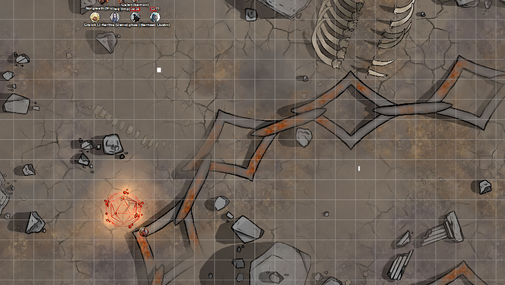

# 20 Nov 2024

**[Previously](2024-11-13.md):** The party continued their journey along the Styx, stumbling upon two colossal structures made of demon and Baatorian skulls, chilling testaments to the ancient conflicts on Avernus. The party then explored a mysterious, tilted building, possibly an ancient ruin or a forgotten laboratory. They viewed a strange tower from a distance, with a mysterious object floating within its peak. Finally, the party confronted a group of devils, mainly bearded devils but including a powerful chain devil, who were transporting a captured vrock. A tense battle ensued, in which Lunghiss fells the chain devil....

- [ ] Use Tiamat's blood to revert Uldrak the Tinker to his giant form and get the astral pistons
- [ ] Find the blood of a titan for Ralzala: Uldrak the Tinker's, once restored
- [ ] Release the unicorn in the Demon Zapper
- [ ] Investigate Mahadi's Emporium (at the Pit of Shummrath)
- [ ] Investigate the Obelisk of Ubbalux
- [ ] Redeem Zariel's general Olanthius, and in doing so redeem the ghosts in the Crypt of the Hellriders
- [ ] Find a Nirvanan cogbox for the dream machine - a Modron ship crashed on the shore of the Styx
- [ ] Find out from the tortured blob where Zariel's flying fortress is.
- [ ] Seek Zariel's blade, as revealed in Barrisso's vision (it will "seek Zariel's blade: it's the key to her heart, and will sever Elturel's chains")
- [ ] Investigate Thavius Kreeg, High Overseer of Elturel
- [ ] Investigate the vampire High Rider Klav Ikaia at Shiarra's Market
- [ ] Rescue the Hellriders
- [ ] Find the other half of the Infernal contract between Kreeg and Zariel
- [ ] Free Elturel from Avernus

---

After the chain devil falls, Gralok breaks *(Athletics)* the chains that surrounds him.

Barrisso attacks a bearded devil with his rapier and short sword, killing the creature. Three bearded devils remain.

Karthis casts Toll the Dead on a bearded devil: he takes 10HP of necrotic damage.

The vrock prisoner tries to break the chains holding it: while he doesn't succeed, they are visibly looser.

Norgreath casts Eldritch Blast (with Agonizing Blast), with Genie's Wrath killing the wounded bearded devil. His second blast kills a second bearded devil. Only one remains.

Galen casts Cure Wounds on Gralok, doing 13HP of healing. Gralok uses the reaction to perform a Claws attack on the last bearded devil, doing 6HP of damage.

That last bearded devil attacks Gralok with his glaive, but misses. A follow-up attack with his beard also miss.

Lunghiss does a Booming Blade sneak attack with Savage Attacker, finishing him off.

---

Gralok decides to attack the vrock, doing substantial damage. 

Karthis casts Fire Bolt at the creature, but it seems to be resistant to fire, taking only 2HP of damage.

The vrock screeches and lifts its talons and summons another vrock into existence. 

Norgreath casts Eldritch Blast (with Agonizing Blast), with Genie's Wrath, on the injured original vrock, doing 8HP of damage.

Galen casts Toll the Dead on the damaged vrock, but it saves.

The second, summoned vrock emits a horrible screech. Gralok, Galen and Barrisso are in range: Galen fails *(Con save)* and is stunned.

Lunghiss does a Booming Blade sneak attack with Savage Attacker; he does 19HP of damage, but the creature is resistant to silver weapons.

Gralok attacks the same vrock, doing 33HP of slashing damage. 

Barrisso attacks the same original vrock, doing a 21HP of damage, killing it. He then performs Misty Step to reach the other vrock, and attacks, doing 18HP of damage.

Karthis casts Lightning Bolt on the vrock, doing 27HP of lightning damage. Or would, but the vrock dodges, and is also resistant to lightning damage.

Norgreath casts Hex on the vrock, giving him disadvantage on Wisdom saving throws. He then casts Eldritch Blast (with Agonizing Blast), with Genie's Wrath, but misses.

Galen is stunned.

The summoned vrock throws a cloud of toxic spores at an area *(Con save)*: the affected party saves.

Lunghiss does a Booming Blade sneak attack with Savage Attacker; he does 32HP of damage, even with a silver weapon. (Lunghiss is so dreamy.). Plus another 18 thunder damage if the vrock moves.

Gralok attacks with his claws, doing 30HP of damage.

Barrisso attacks with his rapier and short sword, doing 15HP of damage.

Karthis casts Toll the Dead, doing 16HP of necrotic damage: the vrock is dead.

---

We search the remains. We find a short sword, a Bloodfuel Shortsword, +1, which is given to Lunghiss. We take a short rest.

---

We drive east, across a red-hewn landscape, approaching a strange feature that looks like an open pit with teeth. Barrisso tests the red sand below us: it seems solid. He renters the vehicle and we continue north of the pit. 

The party *(Perception check)* sees that Karthis our driver has not spotted unsolid ground in front of us, and points it out. Karthis *(Dex save)* stops us falling into the pit. However, the vehicle has a furnace rupture, and its speed decreases by 30 feet until this mishap ends. 

Galen attempts to fix it with his vehicle tools, and successfully repairs it.

---

We drive south of a huge, square-based tower. We see ahead of us a broken chain extended across the landscape, colossal and spiked, partially buried under the soil. We see other severed pieces of chain scattered around. They look like the chains that hold down Elturel. Standing on top of a section of chain, we see in the distance a chain devil, doing an action we cannot make out. The chain devil seems to be summoning a rotating rune spell of some kind:

<figure markdown>
  { width="400" }
  <figcaption>Giant Chain</figcaption>
</figure>

We also see some other forms on the far side of the chain: Taq sees they are two spined devils and two bearded devils. We decided to gun our vehicle towards the chain devil, attacking him first, with Galen casting Slow.

Galen casts Slow: the chain devil, a bearded devil, and a spined devil are now Slowed.

Karthis casts Ice Storm: 17HP for those opponents who don't save, 8HP if they save. 

Lunghiss moves and hides behind a rock near the chain devil.

Gralok throws a javelin at the chain devil, but misses. Gralok notices the summoned rune spins and knocks the javelin away before it reaches the chain devil.

The rune, similar to a Spiritual Weapon, hits Gralok for 17HP of damage.

Barrisso moves and casts Hunter's Mark on the chain devil. 

The slowed spined devil flies over the chain, and gets one tail spine attack at Gralok, but misses.

The second spined devil attacks Gralok twice, but misses.

Karthis casts Shatter at the chain devil and another devil, doing 7HP to both.

The non-slowed bearded devil moves towards the party.

The slowed bearded devil climbs onto the chain.

Norgreath moves, then casts Hex at the chain devil. He then casts Eldritch Blast (with Agonizing Blast), with Genie's Wrath, doing 15HP of damage.

Galen casts Dispel Magic on the chain devil's summoned weapon, and dispels it.

Lunghiss attacks the non-slowed spined devil, doing 19HP of damage, plus 10HP if he moves: Lunghiss then disengages.

Gralok attacks a bearded devil with his claws: two succeed, doing 13HP of damage.

The chain devil summons his magical weapon back into existence. 

Barrisso moves towards the chain devil, and attacks the bearded devil beside Gralok with rapier and short sword, doing 11HP of damage.

The slow spined devil moves beside Barrisso, then bites but misses.

The second spined devil lands beside Gralok, but Lunghiss' thunder damage takes effect and he dies.

Karthis casts Wind Wall at the chain devil and the two non-slowed devils: he does 22HP of bludgeoning damage to those who don't save, 11HP if they do.

The non-slowed bearded devil attacks with beard and glaive against Barrisso.

Norgreath casts Eldritch Blast (with Agonizing Blast), with Genie's Wrath, doing 18HP of damage to the chain devil.

Galen uses Channel Divinity: Order's Demand on four of the devils: three drop their weapons, and regard Galen as [their good friend....](2024-11-27.md)

