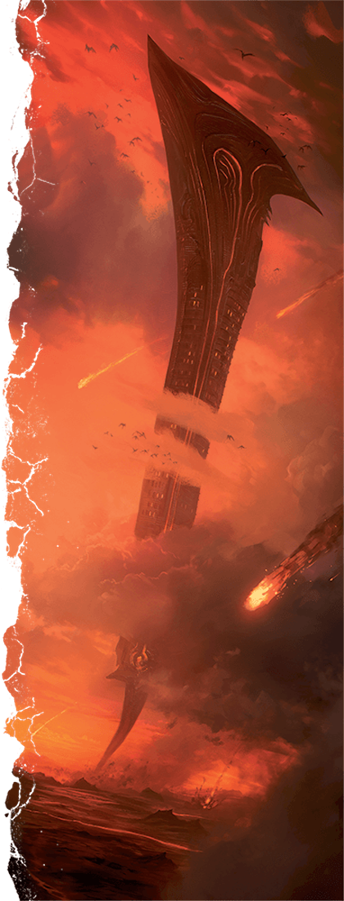
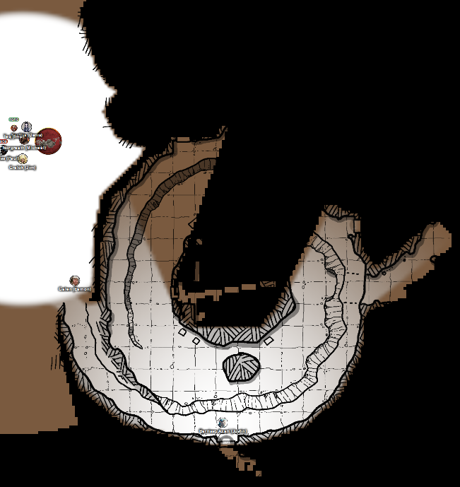
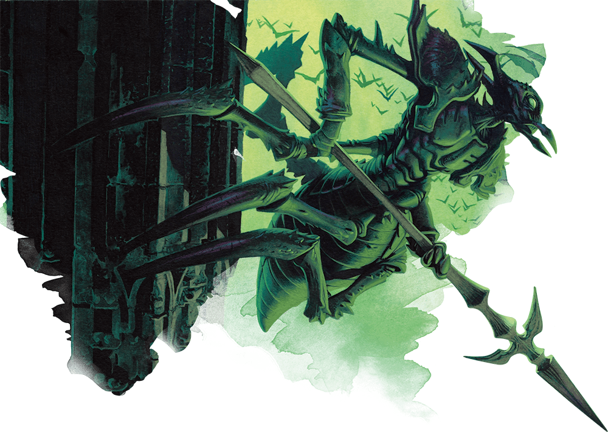
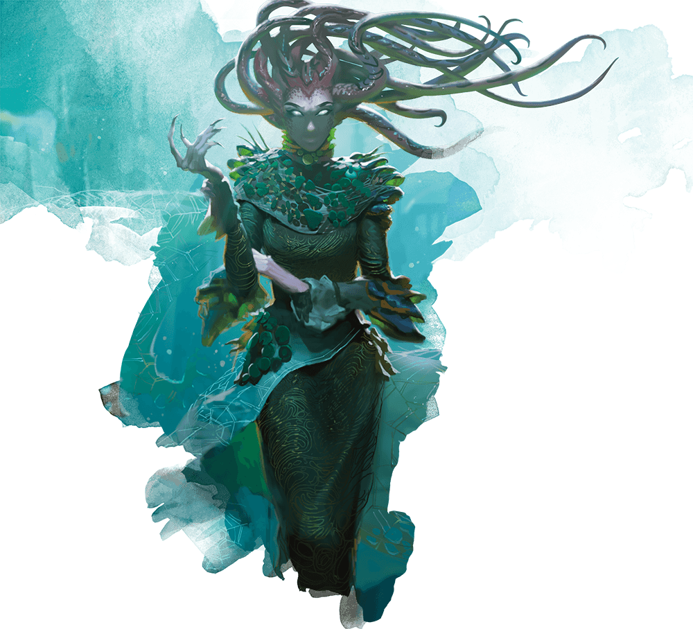

# 4 Dec 2024

**[Previously](2024-11-27.md):** The party defeated the powerful chain devil and his minions, navigated treacherous terrain, and narrowly escaped a deadly meteor shower along with other regional effects. Of course, when you ended up back in Fort Knucklebone you had to share all of these experiences with Mad Maggie. You then delivered the Heartstone to the Kenku mechanics, Chukka and Clonk, seeing that the Dream Machine was almost complete. After resting from all of your trials, you emerged stronger and more experienced!

- [ ] Use Tiamat's blood to revert Uldrak the Tinker to his giant form and get the astral pistons
- [ ] Find the blood of a titan for Ralzala: Uldrak the Tinker's, once restored
- [ ] Release the unicorn in the Demon Zapper
- [ ] Investigate Mahadi's Emporium (at the Pit of Shummrath)
- [ ] Investigate the Obelisk of Ubbalux
- [ ] Redeem Zariel's general Olanthius, and in doing so redeem the ghosts in the Crypt of the Hellriders
- [ ] Find a Nirvanan cogbox for the dream machine - a Modron ship crashed on the shore of the Styx
- [ ] Find out from the tortured blob where Zariel's flying fortress is.
- [ ] Seek Zariel's blade, as revealed in Barrisso's vision (it will "seek Zariel's blade: it's the key to her heart, and will sever Elturel's chains")
- [ ] Investigate Thavius Kreeg, High Overseer of Elturel
- [ ] Investigate the vampire High Rider Klav Ikaia at Shiarra's Market
- [ ] Rescue the Hellriders
- [ ] Find the other half of the Infernal contract between Kreeg and Zariel
- [ ] Free Elturel from Avernus

---
 
After a long rest, we decide that, now that we have Tiamat's blood, we will return to Uldrak the Tinker. Once he reverts to his giant form, we should both (a) get the astral pistons needed to repair the Dream Machine, and (b) persuade him to give him some of his blood so that Ralzala the dao can break her oath and help us free the unicorn from the Demon Zapper.

As we travel, we are exposed to acid rain *(7HP of damage unless one makes a Dex saving throw)*, heat damage *(DC 5 Con save)*, and a caustic bog *(DC 12 Con save)*.

We reach the bridge across the Styx that we encountered in an earlier crossing: one with engravings telling the story of Zariel. We cross the bridge - as we get to the far side of the bridge, we look up and see a an absolutely enormous flying structure like an inverted hook or sword, ploughing the landscape. We make an educated guess that this is Zariel's flying fortress:

<figure markdown>
  { width="200" }
  <figcaption>Zariel's Flying Fortress</figcaption>
</figure>

To our south, we see a tower rising from a hill, with a trackway that war machines much have been using, circling that hill. The hill seems to have a tunnel underneath the structure. Gralok thinks the tracks are very recent: the last few days. We decide to send Taq the imp to investigate.

The tunnel is a wide ramp, in a spiral, which enters the hill. As it enters, he sees to his left a lower level, while on his right is a stone doorway. Taq finds piles of infernal machine parts, as if this is a location where they are repaired. Taq finds a doorway that seems to go directly under the tower: it turns into a spider, and heads underneath. 

The interior is not occupied: it is a carved square chamber, about 30 feet high, containing a group of barrels and other items, that contain demon ichor for fuelling machine. There are also workbenches that hold smith's tools, wheels, tyres, and other assorted items. 

Taq searches further and finds two vehicles: a Devil's Ride (a motorbike), and a Scavenger (with a grabber hook - not as big as our vehicle). 

The party decide to investigate under the tower. 

<figure markdown>
  { width="400" }
  <figcaption>Under the Tower</figcaption>
</figure>

Barrisso opens a door, too narrow for a vehicle, and find an abandoned storage facility. He enters a chamber to his east, and finds old signs of cooking fires, but not currently occupied. An opening north leads to a stairway going down and east. A corridor goes east, then spirals clockwise downwards, and eventually north. We continue due north, reaching a blank wall. Barrisso *(Perception check)* believes there is a way through the wall. We find it, and continue north. 

We find ourselves in a large, natural chamber, propped up by six columns. A passageway west leads into the chamber under the tower. The chamber contains two vehicles: a Devil's Ride (a motorbike), and a Scavenger, as seen by Taq earlier. Galen tries to disable the Scavenger with his smith's tools, but cannot manage it. As he tries, a insectoid-like creature appears in the northern passage. 

<figure markdown>
  { width="400" }
  <figcaption>Insectoid</figcaption>
</figure>

It approaches us, and chitters at us, but does not seem to want to attack us. Karthis casts Witch Bolt at it, but misses.

Norgreath casts Eldritch Blast (with Agonizing Blast), with Genie's Wrath at the creature: he does 15HP damage.

Hiding in the corridor is another creature, a Drow elf, which attacks Gralok with two short swords: it does 5HP of piercing damage, but the blade also poisons. A second attack does 9HP of piercing damage, plus extra poison damage (another 10HP of damage). It then attempts to run away, but Gralok with his Sentinel feat hits him with his Raggadragga's Maul, going 11HP of bludgeoning damage. 

Gralok then uses Form of the Beast, and attacks the Drow with his claws: he does 23HP of slashing damage.

The chittering insectoid attacks Gralok, but misses. We see another five in the corridor outside...

Lunghiss does a Booming Blade sneak attack with his Bloodfuel Shortsword +1, with Savage Attacker on the Drow; he does 36HP of damage, plus another 13 thunder damage if the Drow moves.

Galen casts Cure Wounds to heal Gralok, doing 25HP of healing.

Barrisso attacks the Drow: his second attack does 5HP of piercing damage. He then uses Divine Smite to add 3HP damage. His shortsword attack does 6HP of damage, killing the Drow.

Karthis casts Fireball at the insectoids in the corridor to our north. Our of five, three are now dead, the rest injured.

Norgreath casts Eldritch Blast (with Agonizing Blast), with Genie's Wrath at the original insectoid: he does 12HP damage, killing it. He then casts at an injured one in the corridor, doing 8HP of damage.

Six pillars of stone burst from the ground underneath us (Bones of the Earth). Those who fail a Dex roll take 24HP of damage, and restrained. Something invisible seems to be casting spells at us.

Gralok attacks a damaged insectoid; his second attacks kills it. His third and fourth attack kill another.

Lunghiss is pinned to the roof; he frees himself and climbs to the ground.

Galen is also pinned, but gets down safely.

Barrisso heads north into the corridor, and [sees a medusa there...](2024-12-11.md)

<figure markdown>
  { width="400" }
  <figcaption>Medusa</figcaption>
</figure>

