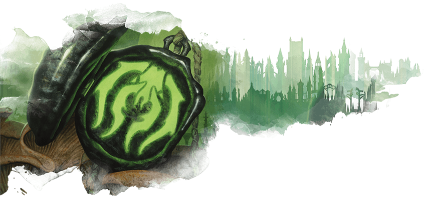
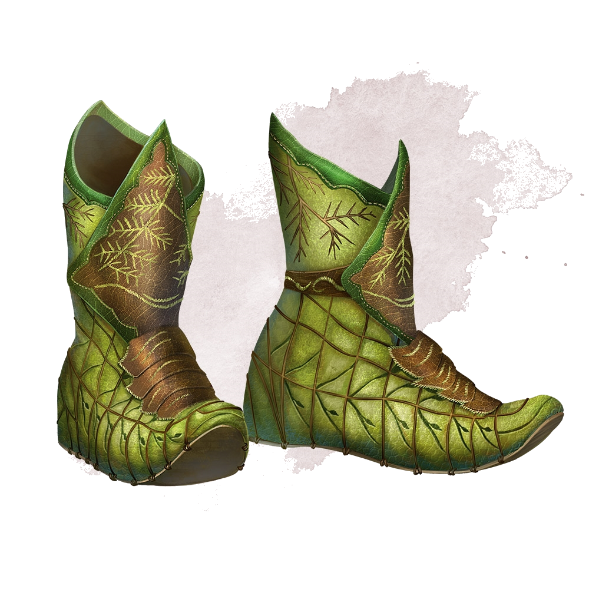
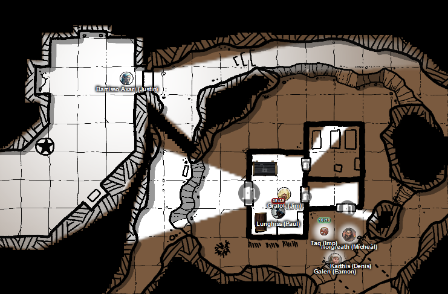
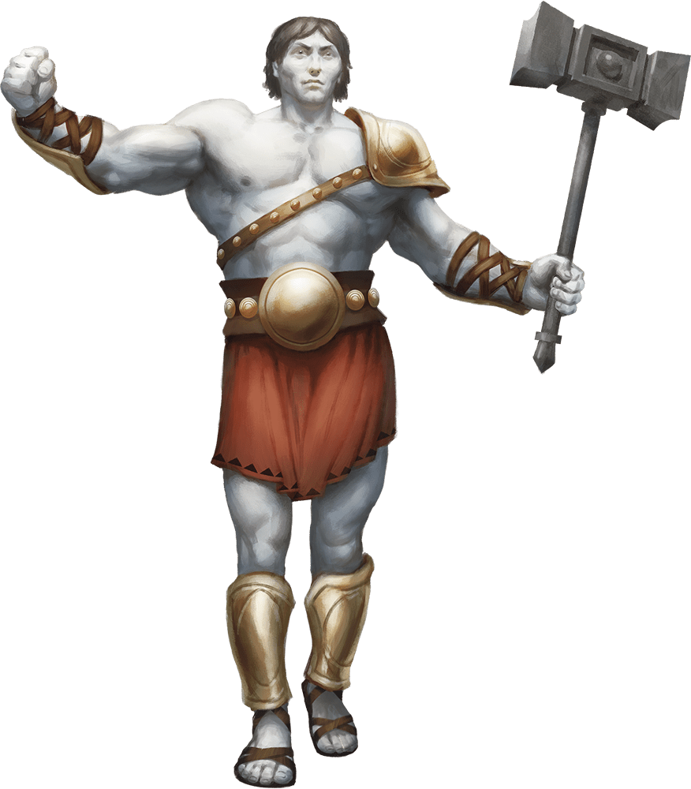

# 11 Dec 2024

**[Previously](2024-12-04.md):**  The party have Tiamat's blood, and plan to return to Uldrak the Tinker to revert him to his giant form. We leave Fort Knucklebone and recross the Styx, seeing Zariel's Flying Fortress flying above us. We encounter a tower on a hill, seemingly used as a workshop for war machines. We search under the tower, and encounter a group of insectoids backed up a Drow magic user, and then a medusa...

- [ ] Use Tiamat's blood to revert Uldrak the Tinker to his giant form and get the astral pistons
- [ ] Find the blood of a titan for Ralzala: Uldrak the Tinker's, once restored
- [ ] Release the unicorn in the Demon Zapper
- [ ] Investigate Mahadi's Emporium (at the Pit of Shummrath)
- [ ] Investigate the Obelisk of Ubbalux
- [ ] Redeem Zariel's general Olanthius, and in doing so redeem the ghosts in the Crypt of the Hellriders
- [ ] Find a Nirvanan cogbox for the dream machine - a Modron ship crashed on the shore of the Styx
- [ ] Find out from the tortured blob where Zariel's flying fortress is.
- [ ] Seek Zariel's blade, as revealed in Barrisso's vision (it will "seek Zariel's blade: it's the key to her heart, and will sever Elturel's chains")
- [ ] Investigate Thavius Kreeg, High Overseer of Elturel
- [ ] Investigate the vampire High Rider Klav Ikaia at Shiarra's Market
- [ ] Rescue the Hellriders
- [ ] Find the other half of the Infernal contract between Kreeg and Zariel
- [ ] Free Elturel from Avernus

---

Karthis moves, and Norgreath casts Fly and moves, towards the medusa.

The medusa calls out in Common, in a strange accent: "I have more magics that can destroy you, if you threaten me and my minions. I only wish to leave this plane. Can you help me with that?"

The Banishment spell, which Galen can cast, would do this.

We tell her we can do that, and would she offer us anything in return. She responds that she has accumulated treasure, and we are welcome to it. There are two chests in the building behind: one contains demon ichor, the other contains potions and items. We ask her about her story, as we figure that Mad Maggie would love it.

"I have come from the great world of Ravnica." We tell her we do not know of it.

"I came here to bargain with the devils. They trapped me here: no route back was proffered."

Galen casts Banishment on the medusa, and she disappears.

---

In a room to the north, Lunghiss opens one of the treasures, a chest, to find seven flasks of demon ichor. The second chest is locked. Lunghiss opens it to find three vials with Wyvern Poison written on them in Common. There's also a stash of three bags, with 1024 gold pieces, 1024 silver pieces, and 2048 copper pieces.

In another room to the east is a bedroom. On the far wall is a nest, where we assume the insectoid lived.

As we leave this room, we see 22 separate stone figures, that have been dragged to their current position, judging by the scratch-marks in the floor. One looks like Raggadragga, some look like bearded devils: it's a random assortment. All presumably frozen by the medusa.

We return and search the Drow; it has 5 soul coins. It also wears a pair of magical boots. The insectoids have nothing of interest bar one, which has a magical signet ring:

<figure markdown>
  { width="400" }
  <figcaption>Signet Ring</figcaption>
</figure>

We discover the boots are Boots of Elvenkind (Lunghiss wears these):

<figure markdown>
  { width="200" }
  <figcaption>Boots of Elvenkind</figcaption>
</figure>

The ring is a Golgari Guide signet ring: it enables the wearer to cast the Entangle spell (3 charges, D3 charges regained at dawn). Galen gets this.

Barrisso moves west and up to a mezzanine level to find a room where there is a statue of a pristine, rather dapper-looking devil, Asmodeus:

<figure markdown>
  { width="400" }
  <figcaption>Dapper Devil</figcaption>
</figure>

There is an obsidian altar, with nothing on it. Various niches seem to have had statues, but have been torn away. Barrisso explores a room to the south: nothing there. In an small room off to the east, it seem a robing room, but with no robes.

In another room, Barrisso finds two sarcophagi and a number of urns. A bigger central chamber contains metallic scrap: bits of vehicles, parts of armour, and so on.

We take a long rest.

---

We start driving towards Uldrak's Grave. Those who fail a save take psychic damage of 1HP. We then suffer a heatwave: those who failed would suffer exhaustion, but no one does.

We arrive at Uldrak's Sword, and make our way to his helmet, his workshop. We find him and tell him that after a long adventure, we have obtained some of Tiamat's blood from Arkhan the Cruel to free him of his curse. We then tell him we would need his blood after he changes back to a titan, in order to rescue a unicorn.

Barrisso asks him are you a man of honour? "I used to be". We tell him if he gives us a sample of his blood, we can free a unicorn from eternal servitude.  After some wavering, he asks us for the blood. He grabs the vial, and looks around at the world he has been living in for a long long time. He pulls the top of the vial and quaffs the blood.

Worryingly, for a time, nothing happens. He checks his various body parts for change and, all of a sudden, he expands into a huge creature, much higher than even a storm giant:

<figure markdown>
  { width="300" }
  <figcaption>Uldrak the Titan</figcaption>
</figure>

He kneels down, and pulls his giant sword from the ground. When he speaks to his, his voice almost knocks us over. He says "I DON'T BELIEVE IT", his attempt at a whisper still deafening. "YOU'VE LIFTED MY CURSE! OF COURSE YOU CAN HAVE SOME OF MY BLOOD FOR THE UNICORN!".

He lowers his giant arm, and using his fingernail, opens up a vein: we take some of it into a vial.

"I will take my helm: anything in there is yours."

He raises his arms in salute: "I'm going to return home now, to plane-shift back to Elysium." He bid farewell. We ask what kind of titan he is: he says he is an Empyrean. "Mortals, survive your trip to Avernus; you have been most helpful."

---

In what was his workshop under the helmet, we find supplies for repairing infernal war machines, but no fuel. There are also the astral pistons we need to repair the Dream Machine to get Lulu's memories back: we find nine in total. Now, only the cogbox remains to be found to repair that machine. First, we will return to the Demon Zapper.

---

We head due north, or the Avernus equivalent. We are attacked by a miasma, but none of the party take damage. We reach the Demon Zapper, and climb to the platform to find Ralzala the dao. She appears, and we tell her we have the titan's blood that she needs to break her contract. She asks which titan it belongs to: we tell her we undid Uldrak's curse, and obtained his blood. She says "I accept your offer", takes the vial, sniffs it, then drinks it. The dao then jumps in the air and flies around, screaming in ecstasy. "I AM FREE!", it cries. Then, it disappears.

---

We climb to where the unicorn is trapped. Galen's uses his smith's tools to try and free the unicorn. The sphere around the unicorn collapses slowly, and the weapon firing at the demons is no more. All that remains is the prone form of the unicorn. Barrisso finds it is injured, and uses Lay on Hands. It is still bloodied, so Galen cures it using Cure Wounds for 23HP, then another 18HP.

Lulu tells us the unicorn is called Mooncolor. Lulu has conveyed to her that we have freed her from her imprisonment within the Demon Zapper. However, she has no ability to move between the planes, but wants to return to the Beastlands. Again, using Banishment, this is something that we can do. Galen casts the spell, and [she disappears.](../2025/2025-01-08.md)
