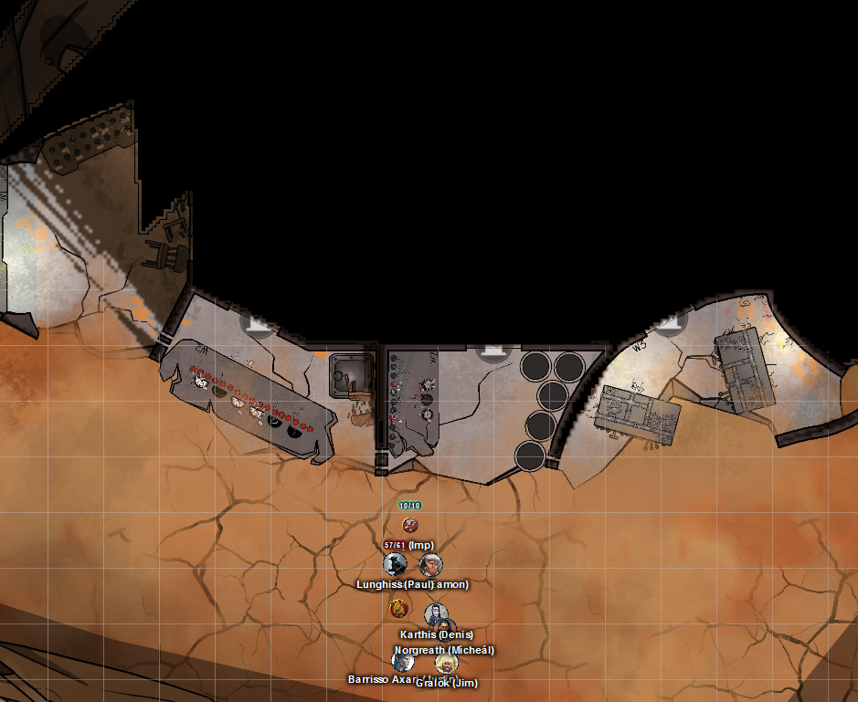
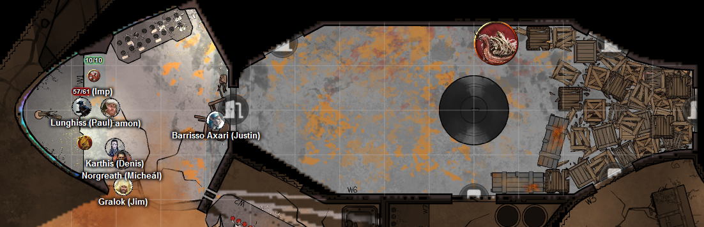
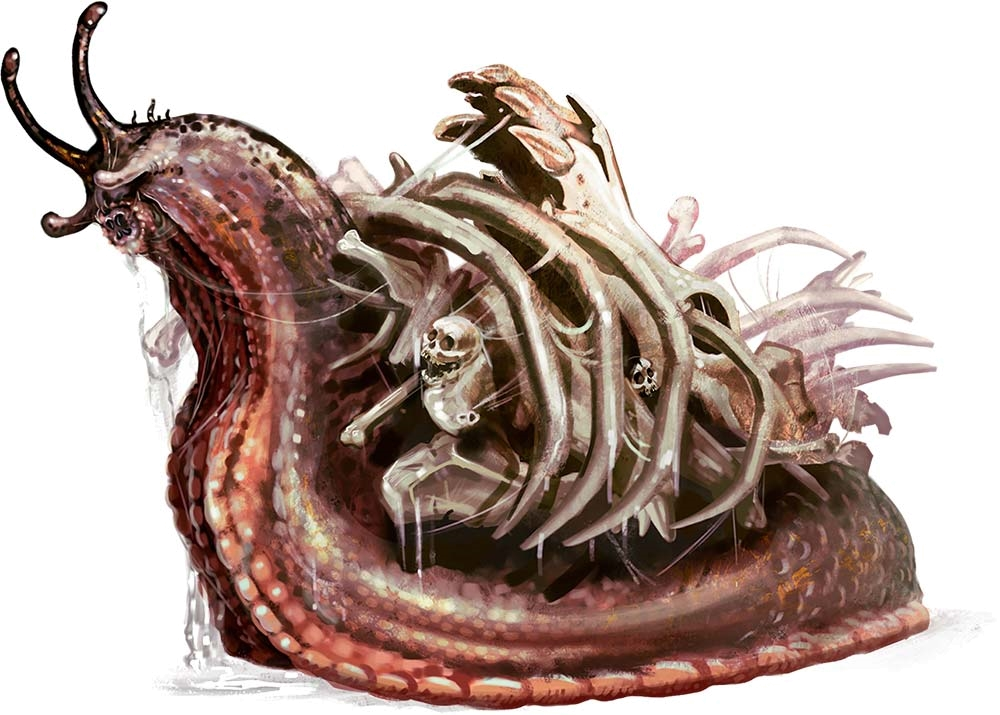

# 8 Jan 2025

**[Previously](../2024/2024-12-11.md):** The previous session had a lot of successes: in combat with a medusa, we came to an arrangement where, using Banishment to return her to her native realm of Ravnica, she left us her considerable treasure, including Boots of Elvenkind and a Golgari Guide signet ring.  We then returned to Uldrak the Tinker and, using the blood of Tiamat, reverted him to his former giant titan form. A delighted Uldrak gave us some of his (titan's) blood in a vial before returning to Elysium. From his workshop, we gained the astral pistons needed to mend the dream machine to restore Lulu's memories. We then returned to the Demon Zapper and, using the titan blood from Uldrak, freed Ralzala the dao of her oath to guard the zapper. After she disappeared, we freed the trapped unicorn, named Mooncolor, that powered the machine. Galen again used Banishment to return her to her native Beastlands.

- [X] Use Tiamat's blood to revert Uldrak the Tinker to his giant form and get the astral pistons
- [X] Find the blood of a titan for Ralzala: Uldrak the Tinker's, once restored
- [X] Release the unicorn in the Demon Zapper
- [ ] Investigate Mahadi's Emporium (at the Pit of Shummrath)
- [ ] Investigate the Obelisk of Ubbalux
- [ ] Redeem Zariel's general Olanthius, and in doing so redeem the ghosts in the Crypt of the Hellriders
- [ ] Find a Nirvanan cogbox for the dream machine - a Modron ship crashed on the shore of the Styx
- [ ] Find out from the tortured blob where Zariel's flying fortress is.
- [ ] Seek Zariel's blade, as revealed in Barrisso's vision (it will "seek Zariel's blade: it's the key to her heart, and will sever Elturel's chains")
- [ ] Investigate Thavius Kreeg, High Overseer of Elturel
- [ ] Investigate the vampire High Rider Klav Ikaia at Shiarra's Market
- [ ] Rescue the Hellriders
- [ ] Find the other half of the Infernal contract between Kreeg and Zariel
- [ ] Free Elturel from Avernus

---

We now have all the items for the dream machine - used to restore Lulu's memories - apart from a Nirvanan cogbox. We believe we can find this on a Modron ship that has crashed on the shore of the Styx. Before that, we decide to go the Crypt of the Hellriders and have a long rest.

On our way, some of the party take psychic damage. We arrive at the crypt, and have a long rest in a safe room.

**Everyone goes up to Level 10.**

---

During our long rest, Norgreath has a strange dream in which he finds an ornate pedestal made of blue-veined marble, upon which is a golden bowl with sapphires. Sitting on a table next to it, is a matching ewer filled with liquid. He tries to communicate with his mentor. As he pours water in to the bowl, it does not obey the laws of physics: it swirls around in coils, which mesmerise Norgreath. A voice says repeatedly: "Bring me the sword."

---

We leave the crypt, and drive towards the Arches of Ulloch. The arches can be seen from miles away: as we get closer, we see graven images from the Blood War. When we get within 100 feet, it starts to resonate and hum as we get closer. We visualise our destination: a location on the map near the Modron ship.

We appear where we want. We see a towering wreck rising from the scorched hellscape. It looks like a giant sword blade tilted at an angle, and partly buried. Much of the hull is rusted and torn asunder. Wind screams as it tears through the superstructure. Six giant vulture creatures circle above the ship: they look like vrocks. We make our way to an opening on the ground in the vessel:

<figure markdown>
  { width="400" }
  <figcaption>Modron Ship</figcaption>
</figure>

Barrisso enters a room on the west side, long ransacked. Everything seems complicated, metal tables with holes in them, nothing he has seen before. In front of a door to the east is a barricade. We open the door to find a large room with a creature:

<figure markdown>
  { width="400" }
  <figcaption>Modron Ship Interior</figcaption>
</figure>

The room is 20-foot tall; in the middle is a large circular column. The large creature, resembling a giant snail whose "shell" is made from bones from other creatures, is unlike anything we have seen before:

<figure markdown>
  { width="400" }
  <figcaption>Bone Whelk</figcaption>
</figure>

Lunghiss moves, then fires his short bow at the whelk: with sneak attack, he does 22HP of damage.

Gralok moves towards the creature, then throws a javelin at it; he kills it. As it dies, it issues a Death Scream: a blood-curdling shriek heard all around us. The boxes within 10 feet of the creature when it dies rot to nothingness. It seems that attacking these creatures from range is a good idea.

---

We open a door north-west to find another bone whelk.

Norgreath casts Eldritch Blast (with Agonizing Blast), with Genie's Wrath; the first blast misses, the second hits for 18HP of damage.

Barrisso casts Toll the Dead; the creature saves, and takes no damage.

Karthis moves, then casts Fire Bolt, but misses.

Gralok fires his short bow at the whelk, doing 10HP of damage, killing the creature. As before, it issues a Death Scream, but nothing harms us.

---

We search the northern rooms, plus the room where the original creature was: we find nothing of interest.

Barrisso removes some detritus, then opens a door to the north-east. He finds a chamber with an opaque window. The ground is covered in junk: there are two decaying flower-like things, collapsed onto the ground. Karthis casts Fire Bolt at one, and burns it to a crisp. He does the same with the other.

Barrisso returns to the other room, then opens a door to the east. He find another empty room.

We return to the black metal column in the centre of the floor. Lunghiss uses Perception, and finds a catch: a small recess in the iron of the column. He pulls it.

A three-foot square panel swings open into the chamber, revealing there is a fifteen-foot-diameter cylindrical opening. The only problem is there are no steps or handholds inside the shaft.

Taq flies through and upwards to check out what is there. The shaft goes upwards, all the way to the top of the ship, which has broken off. As Taq travels higher, he can sense light coming into the top of the ship. When he reaches the top, he realises the vrocks are no longer there: they have descended to ground level.

Taq searches the whole of the shaft, returns to our level, then finds it descends into the ground. He investigates, and finds a creature which attacks him, killing him instantly. Norgreath sees it was a worm-like column of darkness shooting up, surrounding him, and killing him.

---

We decided to leave the structure and try outside. There we find some vrocks which have landed.

Karthis casts Fire Bolt at the visible vrock and hits, but it seems resistant to fire damage.

Lunghiss fires his shortbow: he does 30HP of damage, but the vrock is resistant to non-magical damage. He then retreats back inside the ship using Dash.

Barrisso casts Toll the Dead at the vrock, but it saves.

Norgreath casts Eldritch Blast (with Agonizing Blast) twice, with Genie's Wrath; he does 9HP of damage.

Galen gets out his censer, and an incense block, then uses the holy fragrances on the inner room of the ship.

Gralok moves towards the vrocks.

The vrock at the front moves towards us, then does a Stunning Screech on Karthis, Gralok, and Norgreath.

Five vrocks who were flying above us, land to our south.

Lunghiss fires his shortbow, doing 27HP less resistance, then retreats to the north-most room.

Barrisso casts Bane at three vrocks that are visible, affecting two of them. He then retreats towards the north-most room.

Norgreath casts Eldritch Blast (with Agonizing Blast) twice, with Genie's Wrath; one blast hits, doing 11HP of damage.

Galen casts Banishment at 5th level, targeting three vrocks. All three are successfully banished. (For the banishment to be permanent, he must concentrate for 9 more rounds.) He then retreats towards the north-most room.

Gralok moves towards the room, picks up Galen, and carries him inside.

The vrock that was initially injured flies into the central chamber and lands on the ground. He then does a spore attack. It affects Barrisso, poisoning him, and also doing 3HP of poison damage.

Another vrock flies in and attacks Karthis with his beak and talons. His talons hit, doing 20HP of slashing damage.

The last unbanished vrock flies in, then performs a Stunning Screech. The whole party save.

We now have three vrocks inside the ship, and three who are [banished (hopefully permanently) by Galen....](2025-01-15.md)
