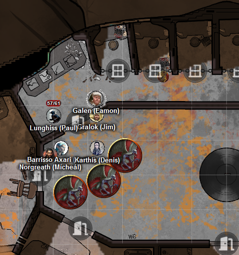
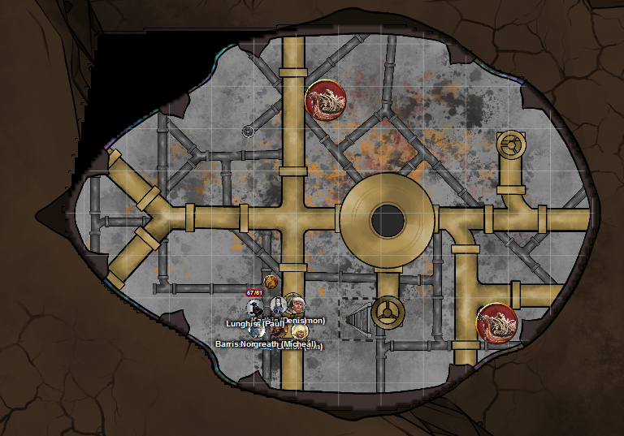
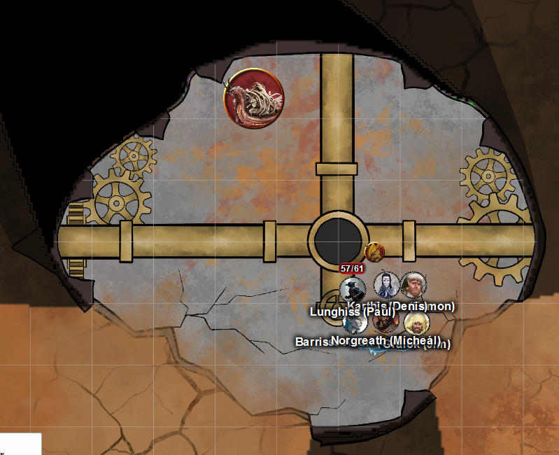
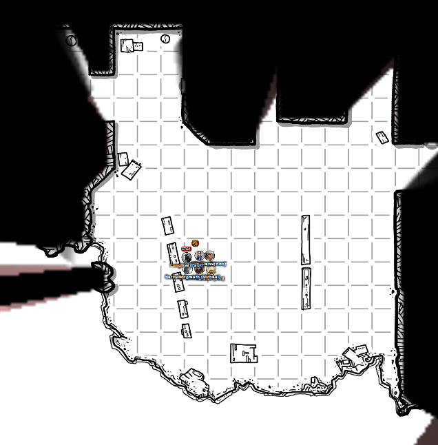

# 15 Jan 2025

**[Previously](2025-01-08.md):** Only one item remains to repair the dream machine: a Nirvanan cogbox. First, we took a long rest in the Crypt of the Hellriders - and go up to level 10. While resting, Norgreath had a strange dream, where a voice tells him to "Bring me the sword". We eventually travelled to a Modron ship crashed by the river Styx, far to the south-east. We explored the remnants of the craft, fighting some easily defeated bone whelks. Lunghiss found how to open a vertical metal tube that seems to be used to travel up and down the length of the ship. Taq, Norgreath's familiar, explored it, but when he reached the lower levels of it, he was killed instantly. We decided to leave the ruin but outside, found ourselves in battle with six vrocks. Galen used Banishment to get rid of three of them; the other three are now back inside the ship with us...

- [ ] Find a Nirvanan cogbox for the dream machine - a Modron ship crashed on the shore of the Styx
- [ ] Investigate Mahadi's Emporium (at the Pit of Shummrath)
- [ ] Investigate the Obelisk of Ubbalux
- [ ] Redeem Zariel's general Olanthius, and in doing so redeem the ghosts in the Crypt of the Hellriders
- [ ] Find out from the tortured blob where Zariel's flying fortress is.
- [ ] Seek Zariel's blade, as revealed in Barrisso's vision (it will "seek Zariel's blade: it's the key to her heart, and will sever Elturel's chains")
- [ ] Investigate Thavius Kreeg, High Overseer of Elturel
- [ ] Investigate the vampire High Rider Klav Ikaia at Shiarra's Market
- [ ] Rescue the Hellriders
- [ ] Find the other half of the Infernal contract between Kreeg and Zariel
- [ ] Free Elturel from Avernus

---

Karthis casts Enervation on the vrock next to him; he fails. Karthis does 18HP of necrotic damage, and also regains 9HP of health.

<figure markdown>
  { width="400" }
  <figcaption>Modron Ship Fight</figcaption>
</figure>

Lunghiss does a Booming Blade sneak attack on the weakest vrock with his Bloodfuel Shortsword +1, with Savage Attacker; he does 33HP of damage, plus 7HP of thunder damage if the enemy moves. He then retreats.

Barrisso attacks the same vrock with his radiant blade and shortsword, doing 5HP of piercing damage. He adds Divine Smite to the damage, doing 17HP of radiant damage.

Norgreath uses Thunder Step to grab Karthis, and move him away from the vrocks, then do damage on them. They all get 10HP of thunder damage.

Galen casts Spiritual Weapon, then attacks the weakest vrock, killing it. The remain (apart from the three who have been banished).

Gralok activates Form of the Beast, then attacks the weakest vrock with his claws, doing 20HP of damage. Gralok then uses Infectious Fury to make the vrock attack its own ally, doing 12HP of slashing damage. Finally, Gralok uses Infection Fury to do 11HP of psychic damage on the original target.

A vrock attacks Gralok, doing 15HP of slashing damage.

The other vrock attacks Barrisso, doing 23HP of damage.

---

Karthis uses Enervation to inflict more damage on his target, doing 17HP more damage, and getting 8HP of health back.

Lunghiss does a Booming Blade sneak attack on the weakest vrock with his Bloodfuel Shortsword +1, with Savage Attacker; he does 35HP of damage, killing the vrock. One remains.

Barrisso attacks the remaining vrock with his radiant blade and shortsword, doing 16HP of damage. He adds 18 radiant damage from Divine Smite.

Norgreath casts Eldritch Blast (with Agonizing Blast), with Genie's Wrath at the vrock twice, doing 18HP of damage.

Galen casts Toll the Dead, but fails. However, his Spiritual Weapon does 12HP of force damage.

Gralok attacks using his claws; before his last attack, the vrock falls.

---

Galen casts Prayer of Healing, giving everyone 16HP of healing back. We wait until the three banished vrocks have been banished permanently.

---

We decide to resume our search for the Nirvanan cogbox. Norgreath resurrects his familiar Taq.

We climb up to find ourselves on a floor, criss-crossed with pipes and with two bone whelks:

<figure markdown>
  { width="400" }
  <figcaption>Modron Ship Upper Floor</figcaption>
</figure>

We continue climbing to find ourselves on a similar floor:

<figure markdown>
  { width="400" }
  <figcaption>Modron Ship Upper Floor 2</figcaption>
</figure>

We continue up to find ourselves on a floor open the elements:

<figure markdown>
  { width="400" }
  <figcaption>Modron Ship Upper Floor 3</figcaption>
</figure>

There are gashes in the ceiling, with sparks raining down from them. The room we are in has been picked cleaning. There are rows of strange metal consoles with strange chains attached.

We explore rooms to the north and to the west, but find nothing of interest.

Through a gap in the hull of the ship, across the wasteland, we see a small group of Avernian war machines coming towards the ruin: one large machine, plus two motorcycle-style smaller machines.

We continue exploring east. Behind a door is a small room with a console and chair bolted to the floor. The console has a pattern of squares, with Infernal symbols. Beside the console is a set of blank papers, and a quill in an ink-pot. Above each console is a slender horn reaching up into the ceiling.

Gralok notices on the topmost sheet, the indentation from previous writing. Lunghiss uses his forgery skills to copy the writing. Norgreath reads the infernal script. The script reads as orders, related to moving the ship, mentioning the words Disward.

As we leave the chamber, we all hear a single hollow sound to the east of us.

We find another room, similar to the previous, except with no blank stacks of paper. A search reveals an abandoned bit of paper under the console. No writing is visible.

Gralok checks a third door to the east; it again has a similar console, and sheets of paper, but no quill and the ink-pot is smashed.

In the last room to the east: he finds nothing.

As we return to the area where the pipes was, he hear the hollow sound again. We think it is coming from our east, and head there.

We open a door to find another room with a console. We continue around and enter another room: it has two rusty iron crates, and a bell-shaped contraption. It is nine feet tall, black, scratched and dinged. As we examine it, it makes a hollow "coo-coo" sound.

Lunghiss *(Arcana check)* thinks the contraption is associated with the orientation of the fortress. It is making the noise because the fortress is not straight and level. We check the two rusty crates: each contains 20 iron flasks of demon ichor, which can be used to fuel our war machine.

In the next room is a gnoll, cackling to itself, and gnawing on a humanoid bone. On the floor are a pair of bell-shaped horns, removed from the machines opposite. Lunghiss *(Nature check)* thinks that normally a gnoll would be alert, intelligent, and aggressive: this one is acting atypically. Norgreath *(Arcana check)* has heard that although many gnolls are in the Prime Material, gnolls were hyena-type beasts transformed by a demon lord, and so are effectively fiends. Maybe fiend-touched?

Gralok offers him cheese. The gnoll eyes him suspiciously. He speaks in Orc instead: there is no change in reaction. He tosses the beast the cheese. Gralok then throws him some meat: he sniffs it, then starts eating it. He does not say anything. We step into the room; in a corner is the gnoll's nest. We walk across the room to the eastern door. Gralok asks where the cogbox is in Common and Orc: the gnoll doesn't respond.

Gralok opens the eastern door. The room beyond is dark. Galen casts Light on his mace. The room contains a metal console, torn free of the wall. Pinned between the console and a wall is a dessicated winged spined devil. In another corner stands a three-foot block of Infernal iron, which seems to be a locked safe. The safe has writing in Infernal: each of the three dials has a set of numbers, like a combination lock.

Lunghiss searches the dead spined devil: he finds nothing. Lunghiss searches the dials for a trap: he finds out that there will be an effect (presumably bad) if he gets the wrong combination.

Lunghiss plays his Pipes of Marvellous Emancipation, to see if they will open the lock. He sees a dial move to a particular number and, as it does, one of the pipes disappears; there are now six left in his set. He uses up two more pipes to set the other two dials to the correct position. Lunghiss opens the now unlocked safe. It contains a number of items:

- Nine large adamantine rods, each with the words in Infernal: "Solar Insidiator lock" followed by a number from 1 to 9
- Two rectangular metal boxes them; inside, a huge number of pistons and cogs

Norgreath uses his special ring to store all the items weightlessly.

We continue to explore; we find another room, with more consoles. Moving south, we enter another room, with sparks falling from the ceiling. Loose wires hang from the machines. A jagged gash in the wall lights up the room. An open hatch leads down to a lower deck. A metal console is plugged in to one wall.

We try the switches on the console. A deep devilish voice says "Abandon ship!" in Infernal. Lunghiss flips the switch back: the voice stops.  Lunghiss tries another switch. A soothing female voice says, in Infernal: "You are important: promotion is your destiny. Asmodeus loves you." The next switch triggers a blaring klaxon: Lunghiss switches it back off. The final switch issues loud discordant music with screaming vocals: again, we switch it back off and ponder [what to do next...](2025-01-22.md)
