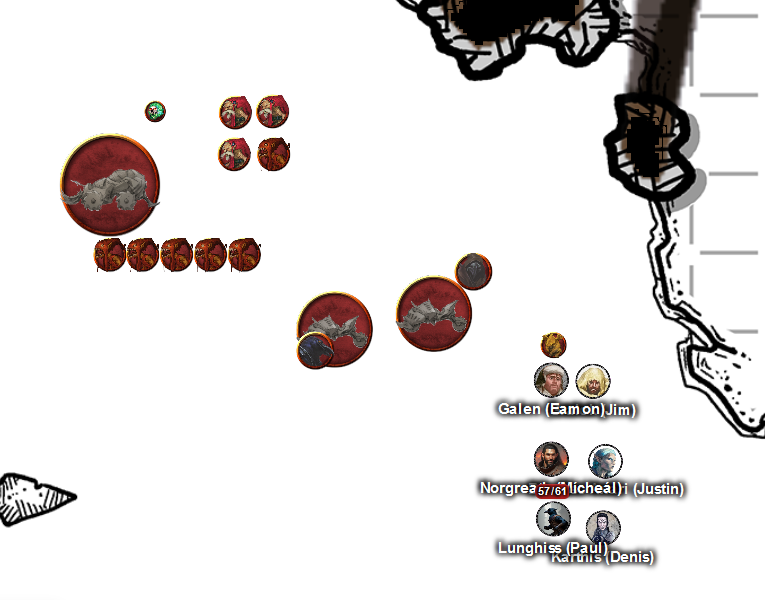

# 22 Jan 2025

**[Previously](2025-01-15.md):** In the Modron ship, we battled vrocks until all were dead or banished. On the upper deck many odd metallic consoles confused the party as to their purpose, but some rooms seemed to be for infernal scribes, for balancing the ship and some for storage. The gap in the side revealed views across the fiery landscape below and an approaching group of infernal machines. A non-communicative gnoll gnawed on a nest of bones next to a closed door which hid a chamber with a safe. This opened to Lunghiss' pipes giving 9 "Solar Insidiator Locks" and 2 Nirvanan cogboxes. We also find a lot of demon ichor fuel. More consoles in another chamber produced announcements throughout the ship, in Infernal, of course. Will the approaching group arrive before the party descends or do you care? You have all that you need for the dream machine!

- [X] Find a Nirvanan cogbox for the dream machine - a Modron ship crashed on the shore of the Styx
- [ ] Investigate Mahadi's Emporium (at the Pit of Shummrath)
- [ ] Investigate the Obelisk of Ubbalux
- [ ] Redeem Zariel's general Olanthius, and in doing so redeem the ghosts in the Crypt of the Hellriders
- [ ] Find out from the tortured blob where Zariel's flying fortress is.
- [ ] Seek Zariel's blade, as revealed in Barrisso's vision (it will "seek Zariel's blade: it's the key to her heart, and will sever Elturel's chains")
- [ ] Investigate Thavius Kreeg, High Overseer of Elturel
- [ ] Investigate the vampire High Rider Klav Ikaia at Shiarra's Market
- [ ] Rescue the Hellriders
- [ ] Find the other half of the Infernal contract between Kreeg and Zariel
- [ ] Free Elturel from Avernus

---

We continue to explore the top floor of the Modron ship, but find nothing. We decide to return to our vehicle with what we have gathered and return to Fort Knucklebone. As we reach the ground, we find a number of armoured vehicles manned by what seems to be Mad Maggie's crew. Barnabas (the flaming skull) is in control of a tormentor. Galen casts Bless on some of the party, just in case.

<figure markdown>
  { width="400" }
  <figcaption>Modron Ship - Mad Maggie's Crew</figcaption>
</figure>

As we arrive on the ground, Galen determines *(Insight)* that they seem a bit surprised to encounter you here. Otherwise they do not seem aggressive. Lunghiss talks to the two kenku, saying we are heading back Fort Knucklebone. "We are here to pick up some demon ichor." We mention we found some (20 flasks, in fact), but didn't search the whole ship so there's probably more. We ask do they need any demon ichor at the moment? Barnabas comes to us: "Maggie sent us to get the supplies". "Too late - we found seven flasks."

*(Deception check)* Barrisso says, look, we only have seven flasks. (The remainder of what we found is in Norgreath's secret ring.) Barnabas tries to take the seven flasks, but we object - we got it first! We decided to leave, and tell them if they need them, meet us at Fort Knucklebone.

As we leave the Modron ship, we enter a plain of fire. *(Survival check)* The party survive the ensuing firestorm that sweeps across the ground, taking only 5HP of fire damage each. But we still have another distance to travel. We fail our survival check. Various members of the party deploy emergency measures: a Wind Wall shielding us, an Ice Storm cast into the conflagration, a Warding Wind, plus Galen casts Bless, which reduce the damage we take. But we still have a distance to travel. Karthis' driving skills ensure we only have one more round in the storm. We escape the firestorm to reach the tower where we met the medusa, and take a long rest.

**Everyone goes up to level 11.**

[We ponder what to do next...](2025-01-29.md)
