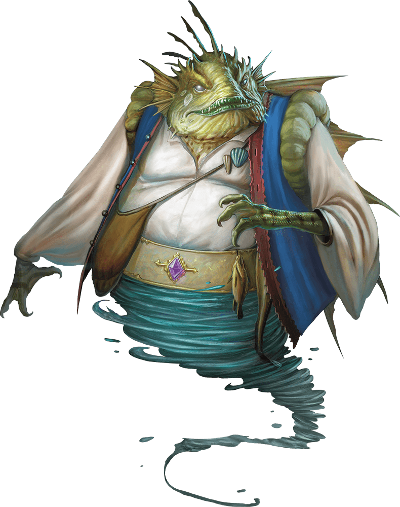
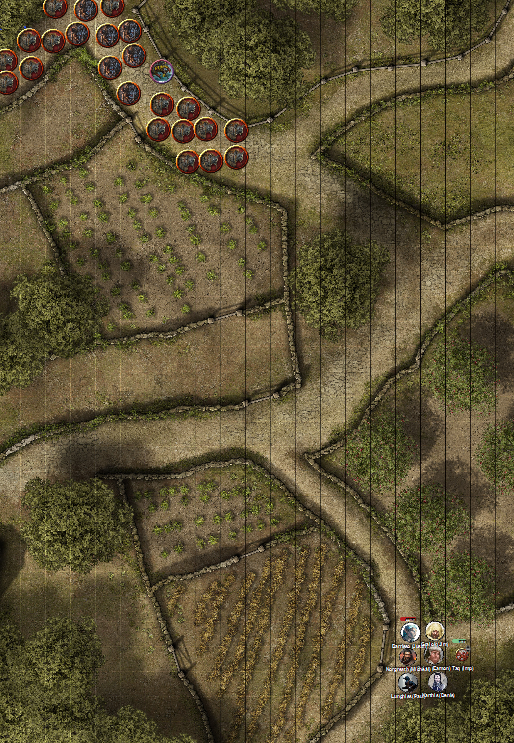
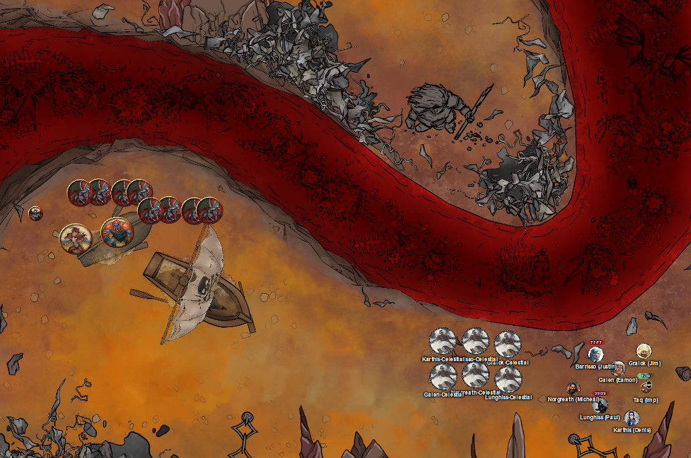

# 5 Feb 2025

**[Previously](2025-01-22.md):** We have found all the items needed to repair the dream machine, and returned to Fort Knucklebone. There, we gave the parts to the kenkus Chukka and Clonk, and then found Mad Maggie to regale her with our exploits. As we await the repair to be finished, we checked out the fort's market and buy needed items. We took a long rest, during which the warlock Norgreath communicated with his patron. Norgreath offers to send him a soul coin, using the mechanism of a mysterious coin we previously found. Doing so seems to send Norgreath, via a path of luminous silver, to a beach perhaps on another plane of existence.

- [ ] Repair and use the dream machine.
- [ ] Investigate Mahadi's Emporium (at the Pit of Shummrath)
- [ ] Investigate the Obelisk of Ubbalux
- [ ] Redeem Zariel's general Olanthius, and in doing so redeem the ghosts in the Crypt of the Hellriders
- [ ] Find out from the tortured blob where Zariel's flying fortress is.
- [ ] Seek Zariel's blade, as revealed in Barrisso's vision (it will "seek Zariel's blade: it's the key to her heart, and will sever Elturel's chains")
- [ ] Investigate Thavius Kreeg, High Overseer of Elturel
- [ ] Investigate the vampire High Rider Klav Ikaia at Shiarra's Market
- [ ] Rescue the Hellriders
- [ ] Find the other half of the Infernal contract between Kreeg and Zariel
- [ ] Free Elturel from Avernus

---

The party wake up: there is no sign of Norgreath. However, Taq is there, and makes himself visible. The party have no idea what has happened to Norgreath. "My master said to wear his ring!" This is the magical ring that can hold the party themselves: Taq wears the ring when we are inside it, as he can be invisible for safety. However, the presence of anyone else in the ring requires the presence of Norgreath. Since he disappeared, the party have been disgorged from the ring.

We ask Taq does he have any idea where his master is. He says, "I can't speak to my master right now."

"Can you normally communicate with him from a distance?" "Yes."

We decided to wait until the dream machine is repaired: maybe Norgreath will reappear.

Karthis realises there is a certain range of communication granted by the Find Familiar ability: that might give us a clue how far away Norgreath is. Norgreath could contact Taq from anywhere on the plane. Therefore, it seems that he is no longer on this plane.

---

Time passes. On our third day back, we check with Chukka and Clonk: they say they are nearly finished. Suddenly, Norgreath steps out of thin air, where Taq was two days ago. He looks fine, the same as normal. Taq flies to him and sits on his shoulder: Norgreath takes the ring back.

"Norgreath, how are you feeling?"

"Something strange. I need a drink."

We bring Norgreath for a beverage, and ask him what on earth happened. He recalls his tale....

---

Norgreath found himself on a beach, and noticed a narrow walkway of white stone, just a few centimetres above sea-level, extending out into the waves, often being overwhelmed by the breakers. In the distance he made out a circular landing at the end of the walkway which had some sort of pedestal in its centre.

Norgreath walked to the causeway and headed out into the bay towards the landing at the end. As he walked, he was buffeted by the wind and waves and soon was soaked to the skin. The water felt cold, but not freezing and he was sure that it was seawater.

As he progressed, Norgreath was confident that the waves were not strong enough to sweep him away, so he proceeded along the causeway. When he reached the end the landing, it turned out to be approximately 30 feet in diameter and the pedestal that he had seen, rose in the precise centre to a height of 4 feet, ending in an exact circle. The pedestal is a cross between a natural structure and coral, with some shaping of the latter to suit this purpose. The upper surface is completely flat.

Norgreath examined it. The flat surface contains a swirling pattern of alternating shades that reminded Norgreath of a whirlpool, but it was  completely flat.

Norgreath opted to stay there, focusing on the water and trying to commune with his patron.

The waters around the landing started to swirl and stir, rising a few feet above the level on which Norgreath was standing, but not covering the landing at all.

Norgreath felt a presence in his mind also, and a question forming... "Yes?" He knelt on one knee.

"I am here, master. Your loyal follower. I have brought you this gift."

He held out the soul coin.

"The pedestal"

Norgreath placed the coin on the pedestal.

"I brought you this gift."

The waters surged higher, surrounding the whole landing and some of the causeway behind him. A creature rose from the sea:

<figure markdown>
  { width="400" }
  <figcaption>Norgreath's Patron</figcaption>
</figure>

It looked similar to this image in form, although it was dressed much more magnificently/opulently.

"Master, you honour me with your presence!"

Gems encircled its belt, and a coral crown embedded with precious stones rested on its brow. Each finger has a ring, all unique, and the cloth it wears was embellished with precious metal embroidery. It hovered over Norgreath on the opposite side of the pedestal, and appeared to peer down at his offering.

"What is special about this soul, Norgreath, that you would bring it to me?"

"Master, you are more magnificent in person than I could have dreamed. You asked me bring you items of interest from my adventures. These coins act as a currency in the plane of Avernus. Each has a soul embedded within. They are considered rare and precious. If I have misjudged, I await clarification. Now I know how to come to you I can be more forthcoming."

"Ah, you have not yet discovered how to read your coin? Let me show you."

Norgreath's patron reached down, pressed a finger firmly onto the centre of the soul coin and closed its eyes for a moment. He lifted his finger.

"Your gift is most welcome, though you knew not its true nature. What of the other items that you have been gathering for me? Avernus is an interesting place: there will be many treasures for my coral palace I imagine."

Norgreath asked his patron for advice on how to return safely, once it was clear the audience was ending.

"Indeed master. Do you have particular preferences? Now I understand how to travel here, I can choose some more interesting items for you that I have collected."

"Bring me those sections of the infernal machine that are superfluous to your needs: a Nirvanan cogbox, a heartstone from a hag, astral pistons and Phlegethosian sand. Various items from the different planes with their wondrous resonances. But most of all, bring me the sword with the divine spark of an angel lost in the wastes of Avernus, both Celestial and Fiendish at once, what a treasure!"

And so ends the tale of Norgreath's sojourn to another plane to meet his patron.

---

We return to the kenkus: they say that the dream machine is ready tomorrow. On that day, Mad Mickey helps the kenku to drag out a contraption similar to the war machines, also on wheels, except more vertical than horizontal. There are ten alcove around the central cylinder. Maggie starts laying out her circle of skulls again, then returns to us and says "Will you all participate?". Maggie turns to Barrisso: "The machine will enable you to relive what Lulu is remembering? Surely you want to understand, and not just listen?".

Maggie gets our whole party arranged in the alcoves. We are each connected to the machine via a skullcap. Straps hold each of us in the alcove.

"Are you all ready?" We tentatively agree.

"I will monitor things, and make sure you are OK in the dreamscape. I will pull you out if things get rough."

We experience a strange rushing sensation, then all open our eyes to find ourselves in a infinite featureless white void with Lulu. We realise we are looking out of each other's eyes. We hear Maggie cackling, "that's odd!". Things revert to how they should be. Maggie, somewhere, adjusts the machine. The landscape undulates, rushing past us in a dizzying display. Blackish sludge assaults us *(Dex or Wis saving)* - we all save. The sludge sloughs away to reveal a chaotic battle in a green landscape. Knights and warriors meet a ravening mass of gnolls in a frantic melee. Gralok is dragging his weapon from a gnoll's corpse. Lulu is the size of a mammoth, with Zariel mounted atop her. Zariel cries out "Lulu, help hold the line here!", and shoots into the air. Zariel circles the battlefield as some gnolls appear.

<figure markdown>
  { width="400" }
  <figcaption>Dream Battlefield</figcaption>
</figure>

At the massed gnolls to our north-west, Karthis casts Fireball. He uses Power Surge on one of the gnolls who seems different; perhaps a leader. He kills more than half the number: eleven remain.

Norgreath casts Synaptic Static; that kills another ten, one very muddled gnoll remains.

Barrisso uses his longbow to finish the last visible gnoll off.

---

In the distance to the north-east, we can see more fighting; we continue in that direction. A large gnoll arrives, over 200 feet away, shouting to its gnoll comrades.

Karthis casts Scorching Ray at him, doing 10HP of fire damage, adding another 5HP from a Power Surge.

Norgreath moves, then hides in cover.

Gralok fires his shortbow, doing 8HP of piercing damage.

Barrisso moves, then fires his longbow: both shots miss.

The gnoll casts Ice Storm, centred on Norgreath, for a max of 24HP of bludgeoning/cold damage.

Lunghiss moves, then fires his shortbow at long range, doing 8HP of damage.

Galen double-moves.

---

Karthis casts Fire Bolt, using Spell Sniper, doing 11HP of damage, plus adding 5HP using a Power Surge.

Norgreath moves.

Gralok moves, then fires his shortbow, but misses twice.

Barrisso uses Misty Step to move, then fires his longbow twice, doing 13HP of piercing damage.

Meanwhile around us, we continue to hear the sounds of war. There is a terrible trumpeting sound that echoes around the area, following by a monstrous voice in Abyssal, "Cast off, cast off: demons of the abyss! At Yael, we strike!". The creature we have been attacking sheds its gnoll-like appearance, revealing a chitinous demonic form, and flies away from us, towards the bullhorn's command. "To Yael we ride!" it says.

The fields of green and warfare around is decay into the thick black sludge we say earlier; we now hear a metallic clanking, and Mad Maggie's voice saying "Worthless junk! Align, goddamn you!".

A void presses on us: we hear a voice saying "You're no ogres, identify yourselves." We see Lulu, with Zariel astride us, and a band of soldiers led by a woman with long black hair. "I am  Yael of Idyllglen: we are sore-pressed, milady." Zariel clasps Yael's hand in greeting. “I am glad to you meet you, Yael of Idyllglen.”

We hear a screech and our vision flies apart: we hear Mad Maggie again, complaining about the dream machine. We hear fragments of conversation: Zariel, and a male voice.

---

We found ourselves surrounded as if by water, and we see a vision of Yael and Lulu onboard a ferry, such as one to cross the Styx, sailing down the middle of a river that seems to be the Styx. Next, we see the ferry, but it has been hulled and is slewed to one side; it is slowly sinking.

Next, they are surrounded by demons. Lulu has just gored two of them with her tusks and, with a shake of her head, hurls them overboard.

Yael is casting a spell. Her chanting voice is literally drawing us towards her. We submit to her call.

Yael has cast a spell, and we are acting as Celestials, as she has cast Summon Celestials. We can choose to be either Avengers or Defenders.

<figure markdown>
  { width="400" }
  <figcaption>Celestial Battle</figcaption>
</figure>

We can see a group of demons coming towards us. Yael calls out to Lulu: "We are losing the ship! We need to kill these demons, or we [cannot get down the river](2025-02-12.md)."

