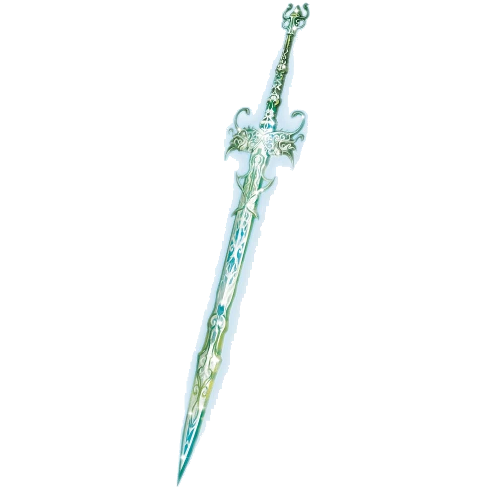

# 12 Feb 2025

**[Previously](2025-02-05.md):** Norgreath returned to this plane of existence, after his strange disappearance when communicating his patron, and told us what had happened while he was away. It seems his patron wants some of the items we are seeking, but it sounds like he will be happy to get them after we no longer have use for them. Finally, the kenkus Chukka and Clonk finished their repair of the dream machine: it takes the form of a vertical war machine with alcoves, in which people stand connected to the machine via skullcaps. We all assembled in the machine while Mad Maggie operated it. We found ourselves in a collective dream: a green battlescape where knights and warriors are fighting a mass of gnolls. We destroyed  one gnoll party, then another. One gnoll revealed its true form, a chitinous demonic form, then followed a incorporeal voice to strike at Yael. The dream switched to another viewpoint, and we heard what sounded to be Zariel and Yael's first meeting. Again, the vision switched: we saw Yael and Lulu onboard a ferry sinking into the Styx, surrounded by demons. Yael cast a spell to summon Celestials, and we realised we are those Celestials. Now, a group of demons is coming towards us...

- [x] Repair and use the dream machine.
- [ ] Investigate Mahadi's Emporium (at the Pit of Shummrath)
- [ ] Investigate the Obelisk of Ubbalux
- [ ] Redeem Zariel's general Olanthius, and in doing so redeem the ghosts in the Crypt of the Hellriders
- [ ] Find out from the tortured blob where Zariel's flying fortress is.
- [ ] Seek Zariel's blade, as revealed in Barrisso's vision (it will "seek Zariel's blade: it's the key to her heart, and will sever Elturel's chains")
- [ ] Investigate Thavius Kreeg, High Overseer of Elturel
- [ ] Investigate the vampire High Rider Klav Ikaia at Shiarra's Market
- [ ] Rescue the Hellriders
- [ ] Find the other half of the Infernal contract between Kreeg and Zariel
- [ ] Free Elturel from Avernus

---

Having been summoned to assist Yael and Lulu, we fight as Celestials (see Summon Celestial) with our own AC and HP. We can cast our spells but each attempt will require a success roll. The Celestial attacks assume a spell level of \+8. The number of attacks is 2\. We’re on a boat on the Styx, and Lulu and Yael are being attacked by barlgura demons and shadow demons.

Galen as Celestial (Defender) attacks a shadow demon and hits once.

Gralok as Celestial (Defender) hits the shadow demon twice.

Barrisso as a Celestial (Avenger) fires his radiant bow, and hits once.

Karthis as Celestial (Avenger) tries one of his own spells, Witch Bolt, and has to make an Arcana check of 20 (it’s very hard to channel his own knowledge via this embodiment).

He succeeds, and the spell takes effect. The demon falls, being vulnerable to radiant damage.

One of the demons flies to attack (big) Lulu, and misses.

Another attacks Yael, in plate armour, and she staggers under the blow.

Lunghiss attacks Yael’s aggressor as a Celestial (Defender) and hits once, as sneak attacks – and he gives temporary hit points to Yael.

Norgreath (Avenger) hits twice, his second being a critical hit, and the demon falls.  Lulu does a trumpeting attack against the nearest Shadow Demon, and a cone of sparking area comes out of her trunk, creatures Con save with disadvantage, taking radiant damage. A barlgura attacks Galen, bite and two fists doing 27HP of damage in total. The one at the back leaps to attack Lunghiss doing damage.

We notice more creatures on the banks of the river, getting ready to leap onto the ship.

---

Galen hits a barlgura twice, doing 34HP of damage, and gives some temporary hit points to Lunghiss.

Gralok hits once doing 16HP of damage, giving himself 10 temp hit points.

Barrisso fires two radiant arrows at the damaged barlgura doing 33HP of damage.

Karthis hits one just damaged, next to Galen, with his radiant bow, felling it. His second attack on one beside Gralok does 15HP of damage.

The Shadow Demon sinks into the ground underneath the ship and reappears attacking Lunghiss, avoiding any attack of opportunity from Lulu. He does 30 points of damage, killing that celestial.

The barlgura next to Gralok attacks him doing 13HP of damage (one of three attacks hit) taking away 10 temp hit points.

Yael attacks twice with her great sword, one hitting.

Norgreath hits that demon with 17HP of damage.

Lulu does some type of cure spell on Yael.

The barlgura next to Yael jumps away, and attacks Gralok, hitting twice out of three doing 13HP of damage.

A number of demons jump from the shore from both sides.  These are eight in total: four glabrezus and four barlguras.

---

Galen attacks the one that was attacking Gralok, hitting twice doing 27HP of damage, and getting 3 temp hit points. The Shadow Demon dies.

Gralok attacks the one beside him who has been damaged most, hitting twice and getting 10 temp hit points, killing one and also hitting the second.

Barrisso moves up 50’ and shoots at thew most damaged barlgura, doing 32HP of damage in two radiant bow attacks.

Karthis attacks the one left beside Gralok, killing it. For his second attack he targets one of the new barlgura demons, doing 18HP of damage.

Yael calls out: "Hold them off while I steer us on the right path" and we feel a compulsion to obey her (WIS saving throw to do otherwise).

Norgreath attacks and misses. Lulu does a trumpet of basting to her north: two save, two don’t. The latter are deafened.

One of the new demons is a big pincer-armed guy, who can cast some spells. It targets Gralok, saying a single word in Abyssal, and he is stunned.

The one behind casts a confusion spell targeting Norgreath who fails his saving throw.

The next attacks Galen, doing 11HP of damage (1 of 3 attacks).

The next jumps to attack Galen, doing 21HP of damage (2 of 3 attacks).

The next attacker seems to fly innately doing two pincer attacks and two fists, doing 49HP of damage (4 of 4 attacks). Karthis attempts to do an arcane deflection, requiring a DC 20 Arcana check and fails despite luck.

The next attacker also levitates and attacks Barrisso, doing 34HP of damage.

The next attacks Norgreath, doing 13+5HP of damage.

The next attacks Norgreath too, doing 40HP of damage (3 of 3 attacks).

Barrisso fires and hit one creature doing 15HP of damage.

Karthis casts Witch Bolt at 4th level, but misses, using inspiration to hit – but fails Arcana check, succeeding after using a luck point. But the target is resistant to lightning damage of 45HP of damage.

Yael succeeds in steering the ship, and calls out just one more round.

Norgreath tries to cast a Thunder Step spell, but fails Arcana check, despite an inspiration point and Barrisso’s inspiration – he then tries to fly upwards to 50’ but the two opportunity attacks succeed, reducing him to below zero HP.

The demon attacks Gralok who is stunned, doing 54HP of damage in total, as the attacks are at advantage. The next three out of four attacks succeed,  and he’s reduced to zero HP.

Next the barlgura attacks Galen, all hit, 40 HP of damage, so Galen falls.

This leaves Barrisso and Karthis (and Lulu and Yael).

The pincer creature attacks Karthis, hitting, and the next creature hits, taking him out.

One of the demons attacks Barrisso, now the last one standing, and is stunned by stun word, and falls 50’ suffering 16 HP damage. Then is attacked while prone for 26HP of damage. And then 34HP of damage. So he is the final celestial killed.

---

This scene disappears for us, and we now feel back to normal. We see Lulu and Yael flying low across the Avernian waste lands. Suddenly it’s not Lulu and Yael, but just Lulu, and then just smaller Lulu we know well, and then Lulu flying next to Yael walking. Finally it changes to Lulu as a cute elephant flying across sands of Avernus that shift to silver, and darkening skies, filled with cascades of diamond like stars above us. We are on a  beach of silver sand with a wine dark sea. On the beach are eight pairs of figures frozen still like statues, in different positions/poses. We realise each is repeated in each of the pairs. Each has Lulu (big) and an Angel (Zariel?).

Barrisso investigates, and touches Lulu in one of the pairs, and they spring to life. We touch each of the pairs in turn, and record what they say:

Zariel: "I look out across the vast gulfs of the multiverse, and I am sick for the need of change."

Lulu: "If change is what you’re looking for, then you’ll need to look somewhere new to find it."

Zariel: "It’s these mortals. Speaking with them – feeling the heat and fleeting speed of their
passion – has aroused in me the truth. We may be eternal, but they are not. And if we fail them,
our eternity makes the failure even greater."

Lulu: "Could mortals truly make such a difference in your heart?"

Lulu: "And when the infinite forces of the Abyss sweep down upon us? • Zariel: Then we will fight!" She laughs. "But, no. Once a beachhead exists, others will flock to our cause. I am not the only disaffected angel! Give them but a chance, and they will seize it!"

Lulu and Zariel are standing side by side, looking up at the stars.

Lulu: "From the Powers of Heaven? You’re certainly following her advice! Your dream is impossibly large!"

Zariel: "Perhaps. But we’ll dream it together?"

Lulu: "Forever."

We touch the pair where Zariel and Lulu are sitting on the beach facing each other.

Lulu: "You already have an army!"

Zariel: [after a moment’s confusion] "You mean Yael?"

Lulu: "And her militia. Yes!"

Zariel: "That’s a force for bandit ogres, not demon wars!"

Lulu: "But it could be!"

We touch the pair where Lulu and Zariel are sitting on a log side by side.

Zariel: "They will not appreciate having their hand forced."

Lulu: "Then we must keep it a secret."

Zariel: "For as long as we are able."

We touch the pair where Zariel pets the top of Lulu’s head.

Lulu: "Then it will be a crusade."

Zariel: "A crusade of the valiant, whose courage shall never be broken!"

Zariel hovers a few feet off the ground, her wings spread wide. Laughing. Lulu looks up at her.

Zariel: "They have! They have made all the difference! … And perhaps that is the key. From eternity nothing can change, but if the mortals are given a chance..."

Lulu: "What sort of chance?"

Zariel: "To fight! To take up swords and say that their destiny is their own! That they’re no longer children! That they will no longer stand idly by while gods and godlings waste eternity!"

Zariel is sketching something in the silver sand with her finger; Lulu is hovering in the air, looking down over her shoulder.

Lulu: "But to what end?"

Zariel: "To disrupt the balance! Demons vs. devils. Heaven vs. Hell. The Great Wheel is a trap. It turns, but never ends. We will break the wheel."

Lulu: "How? Where?"

Zariel: "The Blood War. The Powers of Heaven refuse to intervene – to break an eternal cycle endlessly consuming mortal souls. But if we created a second front – if we broke the balance – that might be all it would take."

Zariel is astride Lulu and General Yael is beside them on her black charger. The battle flags of Yael’s crusaders are nearby. They stand atop a small rise on the Avernian plains surrounded by a vast array of soldiers.

Zariel: "The demon army is buckling under Olanthius’ assault. I think Haruman may be able to catch them in a pincer and end Yeenoghu’s terror
for all time."

Yael: "I agree. As long as my army holds strong, we can keep the devil army engaged until their bloody work is done."

At that moment, a desperate trumpet sounds out across the battlefield. Zariel, Yael, and Lulu jerk their heads around.

Yael: "I gave no order!"

Lulu: "What’s happening?"

Yael grabs hold of Lulu’s fur and shouts, "Fly! We need to see!" Lulu launches into the sky, carrying both Yael and Zariel into a formation of pegasus-riding Crusaders.

Yael: "Report!"

Pegasus Rider: "Sunstar’s platoon has sounded a retreat!"

Yael: "What?"

Pegasus Rider: "The call is spreading!"

Looking down, they can see that a huge section of Yael’s army is peeling away towards the large portal through which the army had chased the demon lord Yeenoghu into Avernus. Small units from other sections of the army – including some from Haruman’s and Olanthius’ armies – are following.

Zariel: "What has he done?"

The party realise at this point that Zariel is in despair. She’s lost. Uncertain. She doesn’t know what to do. Her hope is breaking.

Another Pegasus Rider: "What should we do?"

Yael sees Zariel’s despair and for a moment it washes over her too. She, also, is losing hope.
And then a steely strength seems to enter her eyes; her back straightens.

Yael: "Send a messenger. Order Jander to turn back. Then rally the rest of the reserve! We’re going to charge the devil army! We have to keep them off Haruman’s back!"

The doubt vanishes from Zariel’s eyes.

Zariel: "The rest of you form up on me! We’ll need to intercept those flying devils! Keep them off the riders below!"

Yael lets go of Lulu and plunges back towards the army waiting below.

Mad Maggie can be heard again: "What was that? One moment, the cogbox is rattling up a storm."

Following Zariel’s orders, the pegasi begin gathering into a three-dimensional formation above the battle.

Mad Maggie: "The cogbox is resonating with something in there! A powerful memory! Hang on! I’ve got a shifter around here somewhere!"

There are rattling noises. The sound of metallic items being thrown around.

The pegasi are now in formation. Zariel’s eyes drift to the portal, where Jander Sunstar and the Hellriders are fleeing back to the mortal plane. They aren’t turning back. The portal snaps shut.

Zariel orders the charge.

Mad Maggie: "I’ve got it!" A screeching sound of metal on metal.

The memories glitch again. You’re back a few moments earlier. Yael is still clinging to the side of Lulu.
Yael: "We’re going to charge the devil army!!"

The memory glitches. Repeats. Yael is clinging to Lulu’s fur. "We’re going to—"

Mad Maggie: "Turn you bastard!"

The memory glitches. Repeats. She lets go and begins to fall… and fall… and fall…

Mad Maggie: "There it is!"

The sound of a clutch box screeching, and then gears slamming into place.

The battlefield melts away beneath Yael. The memory reshapes itself.

Yael stands next to Lulu in the Avernian wastelands. They’re alone. Yael slumps against Lulu’s side, clutching her fur to stay on her feet. She’s looking toward the horizon. There’s a huge cloud of dust. Some massive force is approaching. She turns and looks in the opposite direction. A cluster of black spots can be seen in the distance. They’re far away, but Lulu’s sharp eyes can see them: Demons. And they’re getting nearer.

Yael: "It’s done. There’s no place left to run."

Lulu: "There has to be something we can do!"

Yael: "There is… Do you trust me, Lulu?"

Lulu: "To the very end."

Yael draws the a sword from her back:

<figure markdown>
  { width="200" }
  <figcaption>Zariel's Sword</figcaption>
</figure>

It bursts with golden, divine light. A beacon which seems to call out a challenge to the approaching forces of evil. Yael raises the sword high above her head.

"To all the Gods of the Seven Heavens, I plead for your aid! In the name of Zariel, Solar of Celestia. In the name of Yael of Idyllglen. In the name of the mortal souls who have died in this noble cause! I beg a boon to fulfill the final wish of a dying angel! I beg you not to forsake the greatest and most daring of your warriors!"

Lulu rears back on her hind legs, raises her trunk, and *trumpets*. The sound is deafening, yet
simultaneously soothing. You can feel the hollyphant pouring her own celestial essence into Yael’s call, the sympathetic resonance of her trumpet echoing across the Avernian plains as she drives Yael’s plea across the planes.

*And there was an answer*.

Not a voice perhaps. But a presence. Riding Lulu’s trumpet back across the planar boundaries.
"Lathander…" Yael murmurs. "Thank you." And then she plunges the sword down into the rocky
surface of the Avernian wastelands. There’s a huge burst of holy light.

Lulu cries out. "Yael! No!" She can feel Yael pouring her own life force into the gift Lathander had offered.

Yael looks up at Lulu and smiles. "All that’s left now is the dream."

The light intensifies. It’s a blinding blast that never seems to end.

But then it does. Rising from the ground – from the confluence of holy might and mortal sacrifice – is an alabaster fortress. Here the Sword will be protected. Here the Sword will be safe.
But the surface of Avernus itself rebels at this holy touch. The wastelands seethe and boil in a eruption like an scab forming rapidly. A cancerous, bloody cyst surges upwards, engulfing the fortress, Yael, and Lulu herself.

---

Maggie disconnects us from the machine. We all have a level of exhaustion. We see that the people who had died as celestial spirits are now fine, but are dead on our feet and need a rest.

Mad Maggie is very happy with herself. When asked by the party did she recognise any of the places shown by the Dream Machine, Maggie replies, "The place of the portal is not far from here, on the road to Haruman’s Hill. The beach, I did not know, it had the smell of the upper planes and the cyst, yes the cyst, very interesting, [it's just across the river...](2025-02-19.md)"

