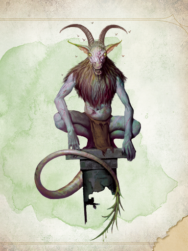
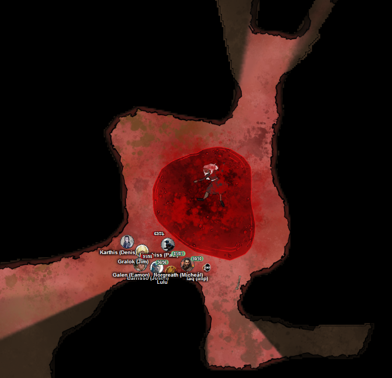
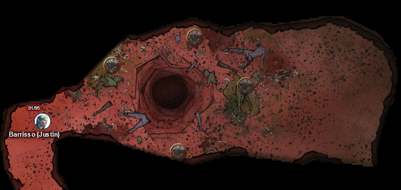

# 19 Feb 2025

**[Previously](2025-02-12.md):** We were in a dreamscape conjured by Mad Maggie operating the now-repaired dream machine. Yael and Lulu, trapped on a sinking ship within the dream, summoned us as Celestials to defend them against the demons surrounding them. A long fight killed the entire party, after which we woke up on a silver beach, where Yael and Lulu appeared eight times, tableaus frozen in time. Examining each statue-like pair in turn yielded up more of their backstory; in the final episode, Yael wields Zariel's blade and, using the last of her lifeforce, plunges it into the ground, creating an alabaster fortress that surrounds and protects it, but which is in turn engulfed by an enraged Avernus in a cyst-like structure, pushing it upwards and away from the ground. Disconnected from the dream machine, we all have a level of exhaustion. Mad Maggie tells us she knows where the cyst that we know holds the alabaster fortress may be... 

- [ ] Seek Zariel's blade in the alabaster fortress, as revealed by the dream machine and in Barrisso's vision ("Seek Zariel's blade: it's the key to her heart, and will sever Elturel's chains")
- [ ] Investigate Mahadi's Emporium (at the Pit of Shummrath)
- [ ] Investigate the Obelisk of Ubbalux
- [ ] Redeem Zariel's general Olanthius, and in doing so redeem the ghosts in the Crypt of the Hellriders
- [ ] Find out from the tortured blob where Zariel's flying fortress is.
- [ ] Investigate Thavius Kreeg, High Overseer of Elturel
- [ ] Investigate the vampire High Rider Klav Ikaia at Shiarra's Market
- [ ] Rescue the Hellriders
- [ ] Find the other half of the Infernal contract between Thavius Kreeg and Zariel
- [ ] Free Elturel from Avernus

---

Exhausted from our adventure, we take a long rest and recover from our exhaustion. We decide to head straight to the cyst where we think Zariel's Sword can be found.

---

We drive our Demon Grinder towards our destination. Avernus's physical evil affects some of the party, (1HP of damage), and then we are hit by acid rain (we escape any damage by sheltering under our vehicle). The vehicle suddenly hits an ashy pit but Karthis avoids it in time (Dex save), and we make our way to the bloody cyst.

A great disgusting scab, the size of a large hill, about 300 feet high, arises from a stinking swamp of blood. Black chains of Avernus converge on this spot and disappear under the grotesque mound. We dismount from our vehicle and walk towards the hill, looking for an entrance of any type. Gralok *(Survival check)* sees gnoll tracks, and tracks of creatures trying to the get to the top of the hill, plus several infernal machine tracks. 

Norgreath sends Taq up to check the upper reaches of the hill. The upper surface seems to be softer, and near one of the chains at the top is a carved tunnel. Used a rope pinned to the top of the hill, we climb the fetid hill *(Acrobatics check)*, some taking damage if they fall on the way. Those who don't make it, the rest of the party pull to the top. 

We enter the tunnel, and find ourselves near a chamber, with five goat-headed demons around a pool, staring at a corpse; there is a heavy stench in the air:

<figure markdown>
  { width="400" }
  <figcaption>Bulezau</figcaption>
</figure>

Lunghiss moves, casts Magic Weapon on his shortbow, then fires it, doing 41HP of damage include sneak attack.

The bulezau in turn jump across the pool, and try to attack Lunghiss but miss.

Gralok moves beside Lunghiss, then attacks using Form of the Beast. His two claw attacks kill the bulezau already damaged by Lunghiss. 

Karthis attacks with a Ray of Frost, but misses.

Barrisso fires his bow twice, doing 5HP of damage.

Norgreath attacks, but misses.

Galen casts Bless on himself, Gralok, Lunghiss, and Norgreath. He then attacks with his marble mace, doing 5HP of damage, adding another 1HP of radiant damage.

---

Lunghiss, from the presence of a bulezau *(Con save fail)* takes 6HP of necrotic damage. He attacks the same bulezau using a Booming Blade sneak attack with his Bloodfuel Shortsword +1 and Savage Attacker, doing 40HP of damage, killing the bulezau. He then retreats.

A bulezau jumps after Lunghiss, who uses Shield to reflect the attack.

Gralok near bulezau, but resists.

Gralok does 36 HP of damage.

Karthis attacks with a Ray of Frost, but misses.

Barrisso attacks the bulezau attacking Lunghiss; his second attack does 12HP of damage.

Norgreath casts Eldritch Blast (with Agonizing Blast and Genie's Wrath for the first attack) at the bulezau attacking Gralok three times, doing 31HP of damage.

Galen attacks with his marble mace, doing 17HP of damage. 

---

Lunghiss does a Booming Blade sneak attack with his Bloodfuel Shortsword +1, with Savage Attacker, doing 40HP of damage and killing the demon.

Gralok attacks with his claws, doing 16HP of damage.

Karthis attacks with a Ray of Frost, doing 13HP of cold damage.

Barrisso finishes off the last of the bulezau.

---

There's a figure in the pool, which Lunghiss uses Mage Hand to tie a rope to it, and the party drag the body to the side of the pool. It looks like a night hag, with a belt pouch attached to its robes. We find inside a diamond, plus a small metal flask. Barrisso tries the flask and *(successful Int save)* feels all his memory and thought about to be sucked away, but fortunately does not happen. He pours out a bit and it reminds him of water from the river Styx.

We move south away from the cyst chamber:

<figure markdown>
  { width="400" }
  <figcaption>Cyst Chamber</figcaption>
</figure>

We travel south, east, north, then east, and find ourselves in another chamber, with three hoards of hellish flies, and and strewn with devil's corpses, gnawed bones, and ichors. In the floor is a hole leading to the floor below:

<figure markdown>
  { width="400" }
  <figcaption>Cyst Flu Chamber</figcaption>
</figure>

We send Taq in, invisible, to look into the hole leading down: it seems to be like a charnel pit, descending 50 feet and fill with a soup of body parts and gore. 

Taq moves south into another chamber, full of weeping sores and bones. Shallow niches in the walls hold a assortment of polished flasks, skulls, and curios. 

Taq leaves and travels down a passageway parallel to the last. It finds a large status of a hulking biped with clawed hands and feet. On the floor of the chamber are gnolls and vrocks, dancing and cackling around the statue. The statue holds a three-headed flail carved into it. Norgreath thinks it's Yeenoghu, god of the gnolls. 

---

Back in the chamber of flies, Barrisso attacks a swarm, doing 22HP of damage.

Norgreath casts Eldritch Blast (with Agonizing Blast and Genie's Wrath for the first attack) three times, killing one swarm and damaging another.

Lunghiss moves, then attacks with his (still magical) shortbow the swarm next Barrisso, doing 22HP of piercing damage.

Gralok moves, then attacks with his shortbow, but misses.

Karthis attacks the swarm beside Barrisso with a Fire Bolt, but misses.

Galen casts Bless on himself, Barrisso, Lunghiss, and Gralok. He then casts Sacred Flame at a swarm, doing 17HP of radiant damage.

A swarm attacks Barrisso, doing 10HP of piercing damage. The other swarm moves.

---

Norgreath attacks a swarm using Eldritch Blast (with Agonizing Blast and Genie's Wrath for the first attack); his first attack destroys it. His second attack destroys the remaining swarm.

---

Barrisso uses Detect Magic in the chamber and in the charnel pit. He finds nothing, then moves south in another chamber. His spell reveals six niches that contain six items of interest, including a bag of stitched flesh, three soul coins, an iron flask, and a lustrous black gem shaped like a baby's fist. 

Lunghiss notices there seem to be a collection of six small stoppered tubes. They're made from human finger-bones. 

Gralok spots three orbs of polished obsidian, weighing 4lbs each. 

Karthis thinks he notices something, but doesn't.

Galen see a small soot-stained coffer made of wood. Lunghiss checks and opens it to find three dragon teeth from wyrmling red dragon.

We examine the bag of stitched flesh: it's a Night Hag bag for catching souls, but there seems to be nothing in it. We open the iron flask; it doesn't seem to be water from the river Styx. Instead, a mist rises from the bottle, swirling into a nine-feet tall form of a flesh golem. 

Barrisso asks it its name, but it can't speak. He asks it to return to the flask, and will call it when he needs it. It shakes its head that it cannot. But it assents that it can help us fight our enemies. 

Karthis thinks the baby fist-sized gem is a hag heartstone. 

Lunghiss *(Nature check)* detects traces of poisons around the knucklebones that close the finger-bone tubes. Using his poisoner's kit, he examine the tubes and is sure they contain a poison called Burnt Othur Fumes. He stashes the other five tubes away, to identify later.

The obsidian orbs do not radiate magic. Karthis *(Arcana check)* thinks they can be used for arcane focus. 

[We move onwards to the gnoll chamber, Barrisso casting Crusader's Mantle...](2025-02-26.md)

