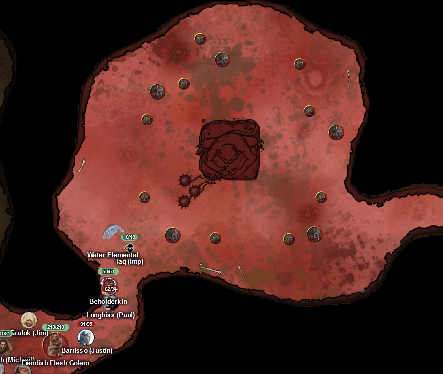
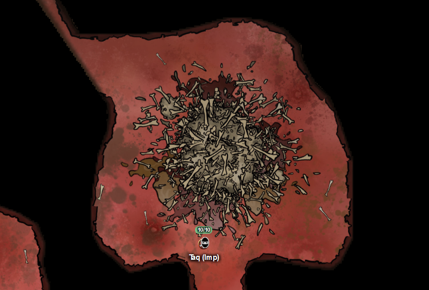
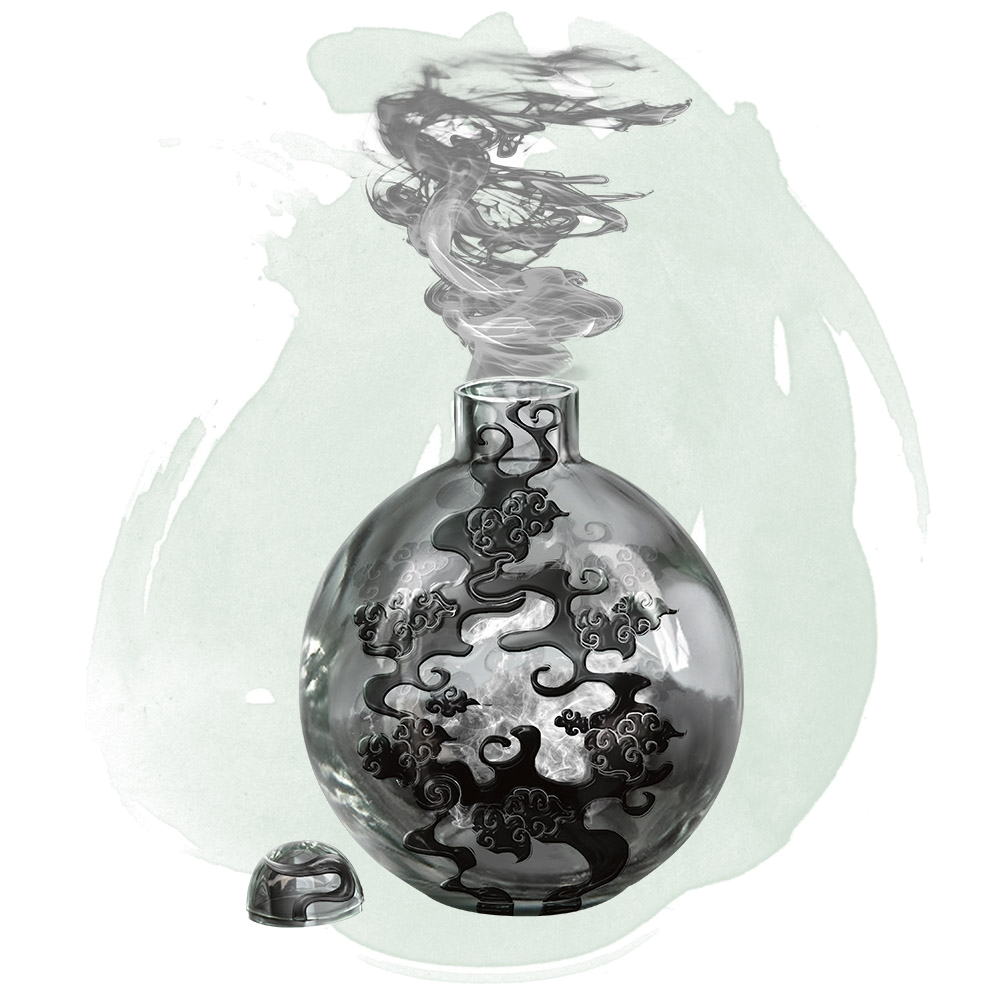
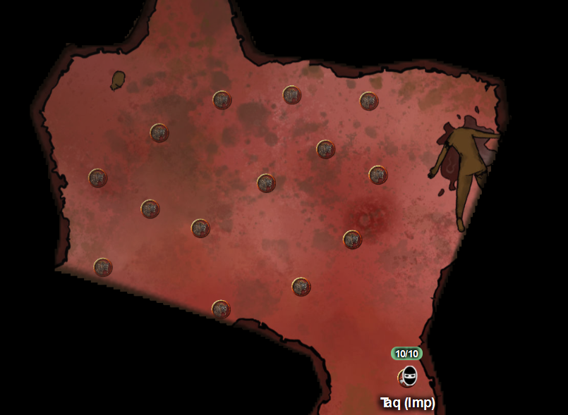

# 26 Feb 2025

**[Previously](2025-02-19.md):** We headed towards the location of the alabaster fortress that, in a collective dream, was revealed to be the location of Zariel's blade. We found there a loathsome scab the size of a small hill, into which a tunnel descended. At the bottom of the tunnel, we found five bulezau demons around a pool containing a corpse. We defeated the demons, then retrieved the body: it was a night hag, with a diamond in their pouch. In another room, we attack a series of fly swarms, and recover many items, including a bag of stitched flesh (a night hag bag for catching souls), three soul coins, an iron flask (which contains a flesh golem), a set of finger-bones containing poisons, a coffer containing three dragon teeth from a wyrmling, and a lustrous black gem shaped like a baby's fist (a hag heartstone). Moving on, we found a room with a large statue of Yeenoghu, god of the gnolls, holding a three-headed flail, surrounding by cackling gnolls and vrocks. Barrisso casts Crusader's Mantle, and we prepare for battle....

- [ ] Seek Zariel's blade in the alabaster fortress, as revealed by the dream machine and in Barrisso's vision ("Seek Zariel's blade: it's the key to her heart, and will sever Elturel's chains")
- [ ] Investigate Mahadi's Emporium (at the Pit of Shummrath)
- [ ] Investigate the Obelisk of Ubbalux
- [ ] Redeem Zariel's general Olanthius, and in doing so redeem the ghosts in the Crypt of the Hellriders
- [ ] Find out from the tortured blob where Zariel's flying fortress is.
- [ ] Investigate Thavius Kreeg, High Overseer of Elturel
- [ ] Investigate the vampire High Rider Klav Ikaia at Shiarra's Market
- [ ] Rescue the Hellriders
- [ ] Find the other half of the Infernal contract between Thavius Kreeg and Zariel
- [ ] Free Elturel from Avernus

---

We head towards the chamber where earlier Taq saw a large statue of Yeenoghu. Norgreath casts Summon Aberration, and chooses to manifest a beholderkin. Galen casts Spirit Guardians. Karthis uses Conjure Elemental to conjure a water elemental. Lunghiss casts Blur. Barrisso releases our flesh golem from his iron flask. The party is hopefully ready for anything.

<figure markdown>
  { width="400" }
  <figcaption>Yeenoghu Chamber</figcaption>
</figure>

The water elemental moves into the chamber.

Lunghiss moves, then fires his magicked bow at a vrock, doing 20HP of piercing damage.

The beholderkin moves into the chamber and casts Eye Ray at the same vrock, doing 10HP of damage.

The gnolls now move and attack en masse.

The first throws his spear at the beholderkin, doing 6HP of piercing damage.

The second throws his spear at the water elemental, doing 3HP of piercing damage, as the water elemental is resistant to piercing damage.

The third runs up to the water elemental, doing 4HP of piercing damage.

The fourth also runs up to the water elemental, but misses.

The fifth throws his spear, doing 6HP damage to the water elemental.

The sixth uses his longbow on the beholderkin, doing 4HP of damage.

The seventh does a longbow attack but misses.

The eighth throws a spear, but misses.

The ninth uses his longbow, and hits the water elemental for 2HP of piercing damage.

The flesh golem moves next to the nearest vrock.

Lulu moves.

Barrisso moves, then attacks the vrock twice with his longbow, doing 14HP of piercing damage.

Gralok uses Form of the Beast, then moves and attacks the gnoll with his glaive twice, doing 25HP of damage, killing it.

Now the five vrocks attack.

The first flies 60 feet then lands.

The second flies then attacks the flesh golem with beak and talon, doing 11HP of damage.

The third (injured) golem does a Stunning Screech, but the only creatures in range are immune.

The fourth vrock attacks the water elemental with talon and beak, doing 12HP of damage.

The fifth and last vrock flies and lands.

Karthis casts Ice Storm, encompassing eight opponents, doing a max of 21HP of damage. The storm kills no one, but they look damaged.

Galen attacks with his +1 marble mace, but misses.

Norgreath attacks using Eldritch Blast (with Agonizing Blast and Genie's Wrath for the first attack), hitting twice, doing 17HP of damage.

---

Our water elemental uses Whelm on a vrock, doing 23HP of damage.

    (Whelm (Recharge 4–6). Each creature in the elemental's space must make a DC 15 Strength saving throw. On a failure, a target takes 13 (2d8 + 4) bludgeoning damage. If it is Large or smaller, it is also grappled (escape DC 14). Until this grapple ends, the target is restrained and unable to breathe unless it can breathe water. If the saving throw is successful, the target is pushed out of the elemental's space. The elemental can grapple one Large creature or up to two Medium or smaller creatures at one time. At the start of each of the elemental's turns, each target grappled by it takes 13 (2d8 + 4) bludgeoning damage. A creature within 5 feet of the elemental can pull a creature or object out of it by taking an action to make a DC 14 Strength check and succeeding.)

Lunghiss casts Shadow Blade then attacks a vrock, doing a Booming Blade sneak attack with Savage Attacker, doing 48HP of damage plus 8HP thunder damage if it moves.

The beholderkin casts Eye Ray at the same vrock and hits it, doing 13HP of damage.

It's now the gnolls' turn again.

A nearby gnoll seems to recover from its wounds. Is it the statue of their god which is healing them?

Galen is hit by a spear and longbow for 13HP of damage.

A gnoll fires a longbow but misses.

Another gnoll also fires his longbow at Galen, doing 9HP of damage.

The flesh golem attacks the nearest injured golem, doing 18HP damage, killing it. He attacks another one, doing 8HP of damage.

Lulu speaks in everyone's head: "Destroy the statue! It's healing them!"

Barrisso moves next to a vrock and does two attacks with his Lathander Radiant Blade, doing 31HP of damage. He uses Divine Smite to add 9HP and kill the vrock.

Gralok moves and attacks a vrock with his claws; his first two attacks do 16HP, and it forces the vrock to attack the nearest gnoll (it misses). Gralok attacks the gnoll: one attack hits, killing it. Gralok gets a reaction attack on the vrock, doing 10HP of damage.

Now the remaining three vrocks attack.

The first vrock flies away and attacks Gralok, doing 13HP of damage.

The second vrock attacks Galen, but misses. It also takes 18HP of damage from his Spirit Guardians.

The third vrock is being damaged from the water elemental's grapple, taking an extra 12HP of damage. He attacks the water elemental, doing 13HP of damage.

Karthis moves, then casts Shatter (raised to Level 5) on the statue, doing 21Hp of thunder damage.

Galen attacks a vrock with his mace, but misses.

Norgreath attacks using Eldritch Blast (with Agonizing Blast and Genie's Wrath for the first attack); he does 18HO of damage to a vrock.

---

The water elemental uses a Slam attack on the vrock, doing 22HP of damage.

Lunghiss attacks with his Shadow Blade, doing a Booming Blade sneak attack with Savage Attacker, on the vrock next to Gralok, doing 45HP of damage plus 3HP thunder damage if it moves.

The beholderkin casts Eye Ray, but misses.

The five gnolls attack.

The first attacks the flesh golem, doing 17HP of damage.

The second fires his longbow at Galen, doing 2HP of piercing damage.

The third fires his longbow at Lunghiss, but misses, and misses again.

The golem does Slam, with 42HP of damage to the nearest vrock.

Barrisso attacks with his Lathander's Radiant Blade; his second attack does 16HP of damage. He uses Divine Smite to add another 15HP of damage.

Gralok runs to the statue and attacks: as he hits with his second attack, he smashes the statue to pieces. It seems to detonate: everyone with 30 feet must make a Dexterity save, or take 28HP of damage (half on save). Luckily the explosion takes out the remaining vrocks, and only three gnolls remain.

Karthis attacks a gnoll with Fire Bolt, doing 14HP of fire damage, killing it.

Galen attacks the gnoll near Lunghiss with Toll the Dead, doing 21HP of damage, killing it. One remains.

Norgreath uses Eldritch Blast (with Agonizing Blast and Genie's Wrath for the first attack): the last gnoll falls.

---

Galen casts Prayer of Healing, giving 21HP of healing to everyone.

We search the room; all the gnolls seem to have been scraping at the walls, and blood is oozing from them.

Taq searches the next room, finding a huge pile of bones and offal:

<figure markdown>
  { width="400" }
  <figcaption>Offal Chamber</figcaption>
</figure>

Barrisso detects magic emanating from the centre of the pile. He retrieves the magical item manually: it's a spherical brass vessel. As soon as he opens it, a cloud of thick smoke pours out, gradually filling the whole room. We retreat from the smog. It fills the chamber and part of the southern passageway. Karthis thinks this is an Eversmoking Bottle; he gives it to Lunghiss, as it may come in handy with someone stealthy:

<figure markdown>
  { width="200" }
  <figcaption>Eversmoking Bottle</figcaption>
</figure>

---

Taq continues north, searching the windy passages. He finds another chamber with 15 gnolls, tossing between them the severed head of another gnoll, headless to their east:

<figure markdown>
  { width="400" }
  <figcaption>Headless Gnoll Chamber</figcaption>
</figure>

We move into the chamber: Karthis casts Fireball at 4th level on 12 of the gnolls, doing 30HP of fire damage. Four in the fireball survive. We hearing the barking of gnoll-speak.

Our beholderkin casts Eye Ray, doing 12HP, killing a gnoll.

Barrisso fires his longbow, doing 9HP, killing it. His second attack misses.

Lunghiss moves, then fires his shortbow, using sneak attack, killing another gnoll.

Galen moves, then casts Toll the Dead on a gnoll: the 26HP of necrotic damage kills it.

Three gnolls remain. They attack.

One attacks the flesh golem with his spear, doing 5HP of piercing damage.

The next one runs away into the passageway to the west, then fires its longbow at the flesh golem, doing 7HP of piercing damage.

The last gnoll runs to join the last gnoll, then fires its longbow at the flesh golem, going 2HP of piercing damage.

Norgreath attacks the gnoll next to the flesh golem using Eldritch Blast (with Agonizing Blast and Genie's Wrath for the first attack); he kills it.

Gralok fires his shortbow, doing 10HP of damage in total, then picks up a longbow.

---

The water elemental moves to the passageway.

Karthis casts Fire Bolt at the injured gnoll, doing 20HP of damage: he's dead.

We hear a command being barked: it's not coming from the last gnoll we see, but from [further west up the passageway...](2025-03-05.md)

